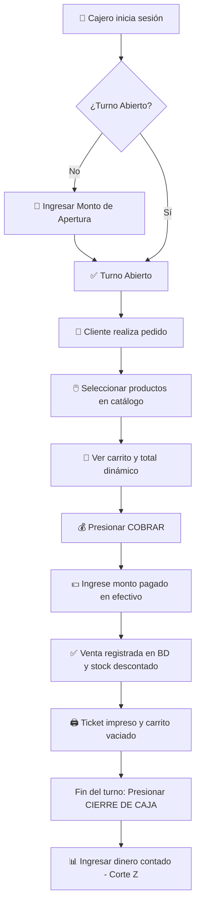

# 📋 PATUJU POS — Flujo Operativo y de Uso

Documentación de los flujos de uso del sistema para el personal de caja, encargados de sucursal y administración general.

---

## 🔄 Flujo Principal: Apertura de Turno y Registro de Venta (Caja)

---

## 👤 Vista del Cajero (`index.php` / Rol `caja`)

### 1. Control de Turno
- Al ingresar por primera vez en la jornada, se exige la **Apertura de Caja** indicando el monto inicial de cambio en efectivo.
- Al finalizar la jornada, se efectúa el **Cierre de Caja (Corte Z)** ingresando el arqueo físico. El sistema calcula la diferencia (sobrante/faltante).

### 2. Catálogo y Carrito
- **Filtros por Categoría:** Selección de categorías (Salteñas, Tucumanas, Bebidas, etc.).
- **Catálogo Filtrado:** Visualiza únicamente productos con precio y disponibilidad de la sucursal del cajero.
- **Carrito Dinámico:** Selector de cantidad con botones `+` / `−` y eliminación `✕`.
- **Cobro:** Modal de cobro en efectivo con cálculo automático de cambio.

---

## 🏢 Vista del Encargado (`encargado.php` / Rol `encargado`)

El flujo de trabajo del encargado opera en **dos vistas consecutivas y ordenadas**:

### 1. Vista Principal: Tarjetas Informativas de Sucursal
- **Resumen Diario:** Visualización en tarjeta con nombre de sucursal, encargado asignado y fecha actual.
- **Métricas de Inventario:** Contador de productos registrados, stock óptimo, productos con stock bajo, productos sin stock y total de unidades disponibles.
- **Estado de Turno:** Indicador de caja (`🟢 Turno Abierto` / `⚪ Turno Cerrado`, cajero activo y ventas del día).
- **Navegación:** Botón `Ver sucursal →` para acceder a la gestión detallada.

### 2. Vista Detalle: Catálogo y Edición por Producto
- **Navegación Intuitiva:** Botón `← Volver a Sucursales` para retornar al resumen general.
- **Modos de Visualización:** Conmutador entre `🎴 Vista Tarjetas` (catálogo visual) y `📋 Vista Tabla`.
- **Modal de Edición en 1-Click (3 Pestañas):**
  - 💰 **Ajustar Precio:** Modificación de precio local por sucursal y umbral de alerta mínima.
  - 🚚 **Ingresar Stock:** Registro de unidades recibidas (horneada, fábrica o reposición).
  - 📜 **Historial:** Auditoría de los últimos movimientos del producto.
- **Acciones Rápidas:** Ingreso masivo de lote de mercadería y auditoría general de inventario.

---

## ⚙️ Vista del Administrador (`admin.php` / Rol `admin`)

### 1. Catálogo Global
- Creación, edición y deshabilitación de productos y categorías base a nivel nacional.

### 2. Monitor Consolidado
- Consulta en tiempo real de inventarios de las 15 sucursales.
- Historial general de ventas con auditoría de usuario y sucursal.
- Auditoría de Cortes Z y arqueos de caja a nivel nacional.

---

## 🔌 Tabla de Endpoints API (AJAX)

| Endpoint | Método | Uso Principal |
|----------|:------:|---------------|
| `ajax/login.php` | `POST` | Autenticación y derivación por rol. |
| `ajax/productos.php` | `GET` | Carga de catálogo con stock por sucursal. |
| `ajax/registrar_venta.php` | `POST` | Procesamiento atómico de ventas. |
| `ajax/turno_caja.php` | `GET/POST` | Apertura, verificación y cierre de turno de caja. |
| `ajax/stock.php` | `GET/POST` | Gestión de inventario local, lotes y precios de encargado. |
| `ajax/crud_productos.php` | `GET/POST/PUT/DELETE` | Administración global del catálogo (solo admin). |
