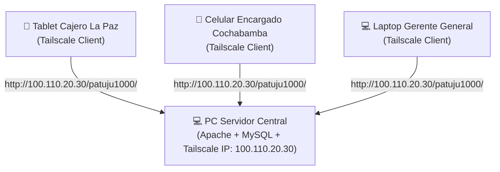

# 🚀 Guía Completa de Puesta en Marcha, Acceso Multi-Dispositivo (Tailscale) y Pruebas — PATUJU POS

Guía técnica integral para desplegar el sistema PATUJU POS en una red local o privada (Tailscale), acceder desde cualquier dispositivo (PCs, tablets, celulares) y ejecutar la suite completa de pruebas operativas.

---

## 1. ⚙️ Puesta en Marcha del Servidor (Localhost)

### Requisitos Técnicos
- **PHP 7.4+** con extensión `pdo_mysql` habilitada.
- **MySQL 5.7+ / MariaDB 10.3+**.
- **Servidor Web Apache** (XAMPP, Laragon o servidor integrado de PHP).

### Pasos de Instalación Rápida

1. **Ubicación del Código:**
   Asegúrate de que la carpeta `patuju1000/` esté dentro del directorio raíz del servidor web (`htdocs/` en XAMPP o `www/` en Laragon).

2. **Base de Datos Unificada:**
   Crea/Importa el esquema inicial con sus 15 sucursales y 17 usuarios de prueba:
   ```bash
   mysql -u root -p < patuju1000/database/schema.sql
   ```

3. **Variables de Entorno (`.env`):**
   Verifica que el archivo `patuju1000/.env` contenga los datos de tu motor MySQL:
   ```ini
   DB_HOST=localhost
   DB_NAME=patuju_pos
   DB_USER=root
   DB_PASS=
   ```

4. **Verificación Local:**
   Abre en el navegador principal: `http://localhost/patuju1000/`

---

## 2. 🌐 Acceso Multi-Dispositivo mediante Tailscale (Red Malla VPN)

Para probar el sistema desde **módulos de caja (tablets/celulares)** o **laptops remotas de encargados** sin necesidad de abrir puertos en el router ni contratar IP pública fija, se utiliza **Tailscale**.



### Configuración Paso a Paso

1. **Instalar Tailscale en el PC Servidor:**
   - Descarga e instala Tailscale ([tailscale.com](https://tailscale.com/)).
   - Inicia sesión con la cuenta de la empresa.
   - Anota la **IP Tailscale** del servidor (ejemplo: `100.110.20.30`) o su nombre **MagicDNS** (ejemplo: `patuju-server`).

2. **Instalar Tailscale en los Dispositivos Clientes:**
   - Instala la app de Tailscale en la tablet, celular (iOS/Android) o laptop.
   - Conéctala a la **misma cuenta** de Tailscale.

3. **Acceso desde Dispositivos Clientes:**
   - En el navegador del dispositivo (Chrome, Safari, Firefox), navega a:
     `http://100.110.20.30/patuju1000/`  *(reemplaza con tu IP de Tailscale)*
     o bien `http://patuju-server/patuju1000/`

### 🔑 Comportamiento de Sesión y Cookies en Tailscale (HTTP)
- **Cookies de Sesión:** El archivo `config/auth.php` configura automáticamente las cookies con `httponly: true` y `samesite: Strict`.
- **Sin HTTPS:** Dado que la red malla de Tailscale es un túnel cifrado de capa 3 (WireGuard), el tráfico viaja 100% seguro. Las cookies se envían correctamente sin requerir el flag `Secure` de HTTPS.

---

## 3. 🔑 Cuentas de Acceso por Rol (Matriz Completa)

> **Contraseña única para todas las cuentas:** `patuju2024`  
> *(Al primer inicio de sesión, el servidor realiza auto-rehash transparente a bcrypt nativo).*

### 1. Administración General (Acceso Total a las 15 Sucursales)
| Usuario | Contraseña | Rol | Redirección Automática |
|---------|------------|-----|------------------------|
| `admin` | `patuju2024` | `admin` | `admin.php` |

### 2. Encargados de Sucursal (Gestión de Inventario y Precios)
| Usuario | Contraseña | Sucursal Asignada | Redirección Automática |
|---------|------------|-------------------|------------------------|
| `encargado_central` | `patuju2024` | Patuju Central (La Paz) | `encargado.php` |
| `encargado_sopocachi` | `patuju2024` | Patuju Sopocachi (La Paz) | `encargado.php` |
| `encargado_cbba` | `patuju2024` | Patuju Cochabamba Centro | `encargado.php` |

### 3. Cajeros Operativos (Punto de Venta)
| Usuario | Contraseña | Sucursal | Ciudad | Redirección Automática |
|---------|------------|----------|--------|------------------------|
| `caja_central` | `patuju2024` | Patuju Central | La Paz | `index.php` |
| `caja_sopocachi` | `patuju2024` | Patuju Sopocachi | La Paz | `index.php` |
| `caja_miraflores` | `patuju2024` | Patuju Miraflores | La Paz | `index.php` |
| `caja_sanmiguel` | `patuju2024` | Patuju San Miguel | La Paz | `index.php` |
| `caja_calacoto` | `patuju2024` | Patuju Calacoto | La Paz | `index.php` |
| `caja_cbba_centro` | `patuju2024` | Patuju Cochabamba Centro | Cochabamba | `index.php` |
| `caja_cbba_norte` | `patuju2024` | Patuju Cochabamba Norte | Cochabamba | `index.php` |
| `caja_scz_centro` | `patuju2024` | Patuju Santa Cruz Centro | Santa Cruz | `index.php` |
| `caja_scz_equip` | `patuju2024` | Patuju Equipetrol | Santa Cruz | `index.php` |
| `caja_sucre` | `patuju2024` | Patuju Sucre | Sucre | `index.php` |
| `caja_oruro` | `patuju2024` | Patuju Oruro | Oruro | `index.php` |
| `caja_potosi` | `patuju2024` | Patuju Potosí | Potosí | `index.php` |
| `caja_tarija` | `patuju2024` | Patuju Tarija | Tarija | `index.php` |
| `caja_trinidad` | `patuju2024` | Patuju Trinidad | Trinidad | `index.php` |
| `caja_elalto` | `patuju2024` | Patuju El Alto | El Alto | `index.php` |

---

## 4. 🧪 Protocolo de Pruebas Operativas por Vista

### 🖥️ Vista 1: Punto de Venta POS (`index.php` - Rol Cajero)
1. **Inicio de Sesión:**
   Ingresa como `caja_central` (`patuju2024`). El sistema guardará el usuario en `localStorage` si marcaste "Recordar usuario".
2. **Apertura de Turno Obligatoria:**
   Si no hay un turno abierto en la sucursal, aparecerá el modal modal de apertura. Ingresa un monto inicial (ej. `100.00 Bs.`) y presiona **Abrir Turno**.
3. **Proceso de Venta:**
   - Selecciona productos del catálogo dinámico (ej. *Salteña de Carne*, *Empanada de Queso*).
   - Ajusta las cantidades en el carrito interactivo.
   - Presiona **COBRAR**.
   - En el modal de pago, ingresa el efectivo recibido (ej. `50.00 Bs.`). El sistema calculará el cambio en tiempo real.
   - Confirma la venta: El servidor descontará el stock de forma atómica (`FOR UPDATE`) y registrará la venta.
   - Se abrirá la vista de impresión de ticket térmico (`window.print()`).
4. **Cierre de Caja (Corte Z):**
   - Presiona el botón de **Gestión de Turno / Cerrar Turno**.
   - Ingresa el arqueo físico de efectivo contado en caja.
   - El sistema mostrará la diferencia (sobrante o faltante) y cerrará el turno.

---

### 🏬 Vista 2: Panel de Encargado (`encargado.php` - Rol Encargado)
1. **Inicio de Sesión:**
   Ingresa como `encargado_central` (`patuju2024`).
2. **Paso 1 — Vista Principal de Sucursales (Resumen):**
   - El sistema muestra las **Tarjetas Informativas** de las sucursales asignadas.
   - Cada tarjeta resume: Encargado, Fecha de hoy, desglose de inventario (productos registrados, óptimos, stock bajo, agotados y total de unidades), estado del turno de caja y ventas acumuladas del día.
   - Presiona **`Ver sucursal →`** en la tarjeta para entrar a la gestión de esa sucursal.
3. **Paso 2 — Catálogo y Edición en 1-Click:**
   - La vista cambia al catálogo interactivo de la sucursal seleccionada (con botón superior **`← Volver a Sucursales`** para regresar en cualquier momento).
   - Alterna entre **`🎴 Tarjetas`** y **`📋 Tabla`** con el conmutador visual.
   - Haz clic en cualquier tarjeta de producto para abrir el **Modal de Edición Integral (3 Pestañas)**:
     - 💰 **Ajustar Precio:** Edita el precio local de esa sucursal o el umbral de alerta mínima.
     - 🚚 **Ingresar Stock:** Suma unidades inmediatas al inventario con su motivo.
     - 📜 **Historial:** Consulta los últimos movimientos auditados de ese producto.
4. **Ingreso Masivo de Lote:**
   - Presiona **`🚚 Ingresar Lote de Mercadería`** para sumar unidades de múltiples productos a la vez (horneada / fábrica).

---

### 📊 Vista 3: Panel de Administración General y Analítica (`admin.php` - Rol Admin)
1. **Inicio de Sesión:**
   Ingresa como `admin` (`patuju2024`).
2. **Gestión Global de Productos (CRUD):**
   - Agrega un nuevo producto al catálogo nacional, edita precios base o desactiva productos.
3. **Monitor de Inventarios Multi-Sucursal:**
   - Visualiza el estado del stock en las 15 sucursales simultáneamente con código de colores según nivel de alerta.
4. **Auditoría de Ventas y Arqueos:**
   - Examina todas las ventas del país y filtra arqueos de caja por sucursal, fecha o estado de turno.
5. **Dashboard de Analítica Gerencial (Chart.js):**
   - Navega a la pestaña **Analítica**.
   - Observa los 5 gráficos interactivos (Ventas Hoy, Distribución Geográfica por Departamento, Curva Horaria Pico, Top 10 Productos y Tendencia Histórica a 30 días).
   - **Prueba de Polling Resiliente:** El dashboard se actualiza automáticamente cada 30s. Si desconectas la red, el sistema **preserva los datos válidos** en pantalla y muestra la alerta `🟠 Datos antiguos` o `🔴 Error de actualización` sin limpiar los gráficos con ceros.
6. **Exportación de Reportes CSV:**
   - Presiona los botones de exportación a CSV (Ventas por Sucursal, Rendimiento de Productos o Histórico).
   - Abre los archivos descargados en Excel: Se abrirán perfectamente formateados con caracteres especiales en español gracias a la cabecera UTF-8 BOM (`\xEF\xBB\xBF`).

---

## 📄 Resumen de Integración

Este documento complementa el repositorio oficial en `patuju1000/docs/`.
- 📌 Roadmap Maestro: [ROADMAP.md](file:///home/vboxuser/Documents/adwn1/adown/patuju1000/docs/ROADMAP.md)
- 📘 Arquitectura Técnica: [ARQUITECTURA.md](file:///home/vboxuser/Documents/adwn1/adown/patuju1000/docs/ARQUITECTURA.md)
- 🗺️ Índice de Documentación: [RELACION_DOCUMENTOS.md](file:///home/vboxuser/Documents/adwn1/adown/patuju1000/docs/RELACION_DOCUMENTOS.md)
