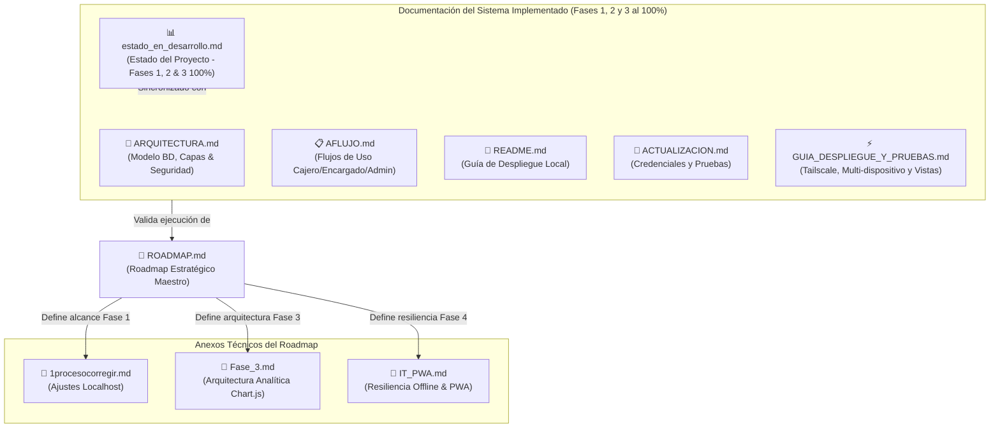

# 🗺️ Mapa Relacional de Documentación — PATUJU POS

Índice estructurado y mapa relacional del repositorio de documentación del sistema PATUJU POS en `patuju1000/docs/`.

---

## 📌 Mapa Jerárquico de Documentación (Diagrama Mermaid)

---

## 📁 Catálogo y Clasificación de Documentos

El repositorio de documentación consta de **documentos organizados en 2 categorías**:

### Categoría 1: Estrategia y Hojas de Ruta (Roadmap & Anexos)

| Documento | Clasificación | Propósito y Contenido |
|-----------|---------------|-----------------------|
| 📌 [ROADMAP.md](file:///home/vboxuser/Documents/adwn1/adown/patuju1000/docs/ROADMAP.md) | **Roadmap Maestro** | **Fuente Única de Verdad** de las 5 Fases del proyecto, integrando seguridad, multi-sucursal, analítica, PWA y Cloud. |
| 📄 [1procesocorregir.md](file:///home/vboxuser/Documents/adwn1/adown/patuju1000/docs/1procesocorregir.md) | **Anexo Técnico 1** | Aclaraciones y adaptaciones para desarrollo local en localhost vs entorno de producción (HTTPS, Mail, Cookies `secure`). |
| 📄 [Fase_3.md](file:///home/vboxuser/Documents/adwn1/adown/patuju1000/docs/Fase_3.md) | **Anexo Técnico 2** | Especificación técnica de analítica e integridad de datos en tiempo real (polling 30s, control de errores, Chart.js). |
| 📄 [IT_PWA.md](file:///home/vboxuser/Documents/adwn1/adown/patuju1000/docs/IT_PWA.md) | **Anexo Técnico 3** | Justificación e infraestructura técnica de Progressive Web App (PWA), Service Workers e IndexedDB para ventas offline. |

---

### Categoría 2: Documentación del Sistema Implementado (Fases 1, 2 y 3 al 100%)

| Documento | Propósito | Audiencia Principal |
|-----------|-----------|---------------------|
| ⚡ [GUIA_DESPLIEGUE_Y_PRUEBAS.md](file:///home/vboxuser/Documents/adwn1/adown/patuju1000/docs/GUIA_DESPLIEGUE_Y_PRUEBAS.md) | **Guía Maestra de Conexión Tailscale (Red Malla), Servidor Local y Suite de Pruebas de Vistas.** | Testers / Operadores / Admins |
| 📘 [ARQUITECTURA.md](file:///home/vboxuser/Documents/adwn1/adown/patuju1000/docs/ARQUITECTURA.md) | Modelo ER completo, arquitectura de 3 niveles, endpoints AJAX protegidos y mecanismos de seguridad. | Desarrolladores / Arquitectos |
| 📋 [AFLUJO.md](file:///home/vboxuser/Documents/adwn1/adown/patuju1000/docs/AFLUJO.md) | Diagramas de proceso y flujo de trabajo operativo para Cajero, Encargado y Administrador. | Operaciones / Capacitadores |
| 📊 [estado_en_desarrollo.md](file:///home/vboxuser/Documents/adwn1/adown/patuju1000/docs/estado_en_desarrollo.md) | Estado actual de desarrollo al 100% de las Fases 1, 2 y 3, y estado de la carpeta `database/`. | Gerencia / Project Managers |
| 🚀 [README.md](file:///home/vboxuser/Documents/adwn1/adown/patuju1000/docs/README.md) | Instrucciones de instalación local (Laragon/XAMPP/PHP CLI) y mapa de la carpeta `patuju1000/`. | Desarrolladores / SysAdmins |
| 🔑 [ACTUALIZACION.md](file:///home/vboxuser/Documents/adwn1/adown/patuju1000/docs/ACTUALIZACION.md) | Resumen de cambios recientes, matriz de accesos y credenciales de prueba (`patuju2024` con auto-rehash). | QA / Testers / Administradores |

---

## 🎯 Guía de Ruta Sugerida según Rol

- **👨‍💻 Nuevo Desarrollador:**
  1. Leer [README.md](file:///home/vboxuser/Documents/adwn1/adown/patuju1000/docs/README.md) para desplegar localmente.
  2. Revisar [ARQUITECTURA.md](file:///home/vboxuser/Documents/adwn1/adown/patuju1000/docs/ARQUITECTURA.md) para comprender la base de datos y endpoints.
  3. Revisar [ROADMAP.md](file:///home/vboxuser/Documents/adwn1/adown/patuju1000/docs/ROADMAP.md) para la hoja de ruta de futuras fases.

- **🕵️ Auditor / Tester / Operador:**
  1. Consultar [GUIA_DESPLIEGUE_Y_PRUEBAS.md](file:///home/vboxuser/Documents/adwn1/adown/patuju1000/docs/GUIA_DESPLIEGUE_Y_PRUEBAS.md) para configurar el acceso por Tailscale desde celulares/tablets y probar las 3 vistas.
  2. Consultar [ACTUALIZACION.md](file:///home/vboxuser/Documents/adwn1/adown/patuju1000/docs/ACTUALIZACION.md) para obtener la matriz completa de usuarios.
  3. Consultar [AFLUJO.md](file:///home/vboxuser/Documents/adwn1/adown/patuju1000/docs/AFLUJO.md) para validar la operativa de las vistas.

- **💼 Gerente / Líder de Proyecto:**
  1. Revisar [estado_en_desarrollo.md](file:///home/vboxuser/Documents/adwn1/adown/patuju1000/docs/estado_en_desarrollo.md) para ver el nivel de avance.
  2. Consultar [ROADMAP.md](file:///home/vboxuser/Documents/adwn1/adown/patuju1000/docs/ROADMAP.md) y sus anexos ([Fase_3.md](file:///home/vboxuser/Documents/adwn1/adown/patuju1000/docs/Fase_3.md), [IT_PWA.md](file:///home/vboxuser/Documents/adwn1/adown/patuju1000/docs/IT_PWA.md)) para planificar las siguientes entregas.
