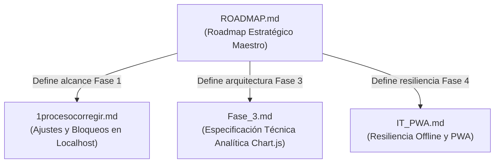

# 🥟 PATUJU POS — Roadmap Estratégico Maestro

Hoja de ruta definitiva de evolución del sistema PATUJU POS, consolidando la arquitectura multi-sucursal, control operativo, analítica en tiempo real y resiliencia offline.

---

## 🗺️ Estructura y Conexiones del Roadmap

El presente documento constituye la **Fuente Única de Verdad (Single Source of Truth)** para el desarrollo y escalamiento del sistema. Para especificaciones técnicas profundas de fases específicas, se conecta con los siguientes 3 anexos técnicos especializados:



- 📄 **Ajustes Localhost vs Producción:** consultar [1procesocorregir.md](file:///home/vboxuser/Documents/adwn1/adown/patuju1000/docs/1procesocorregir.md) (Diferencia requerimientos bloqueantes de los opcionales en desarrollo).
- 📄 **Especificación de Analítica e Integridad (Fase 3):** consultar [Fase_3.md](file:///home/vboxuser/Documents/adwn1/adown/patuju1000/docs/Fase_3.md) (Estrategia de polling, preservación del estado válido y visualización).
- 📄 **Especificación de Resiliencia Offline y PWA (Fase 4):** consultar [IT_PWA.md](file:///home/vboxuser/Documents/adwn1/adown/patuju1000/docs/IT_PWA.md) (Service Worker, IndexedDB e instalación).

---

## 📊 Visión General por Fases

```
   SPRINT 0 / FASE 1          FASE 2                  FASE 3               FASE 4               FASE 5
┌─────────────────────┐  ┌──────────────┐        ┌──────────────┐     ┌──────────────┐     ┌──────────────┐
│ Seguridad y Accesos │->│ Control      │    ->  │ Dashboard de │  -> │ Resiliencia  │  -> │ Nube y Alta  │
│ Base (Localhost)    │  │ Multi-Sucursal│       │ Analítica    │     │ Offline PWA  │     │ Disponibilidad│
└─────────────────────┘  └──────────────┘        └──────────────┘     └──────────────┘     └──────────────┘
       ✅ 100%               ✅ 100%                 ✅ 100%             (Próxima Fase)       (Mes 6+)
```

---

## ✅ SPRINT 0 / FASE 1: Seguridad y Blindaje Operativo (COMPLETADO)

**Objetivo:** Establecer la base de seguridad para operación en entorno local y producción.

### Logros e Implementaciones
1. **Bypass de Seguridad Eliminado:** Eliminado cualquier acceso no autenticado o bypass en `ajax/login.php`.
2. **Protección de Sesiones:** Invocación de `session_regenerate_id(true)` tras el login para prevenir ataques de fijación de sesión.
3. **Control de Hash Dinámico (Auto-rehash):** Actualización automática a bcrypt nativo mediante `password_hash()` al iniciar sesión.
4. **Sanitización XSS:** Aplicación de `escapeHtml()` en `app.js`, `admin.js` y `encargado.js` para todo renderizado dinámico en el DOM.
5. **Autenticación en Endpoints AJAX:** Todos los endpoints (`ajax/productos.php`, `ajax/registrar_venta.php`, `ajax/stock.php`, `ajax/turno_caja.php`, `ajax/crud_productos.php`, `ajax/analytics.php`) están protegidos mediante `config/auth.php`.
6. **Variables de Entorno (`.env`):** Credenciales de base de datos extraídas fuera del código versionado.
7. **Rate Limiting:** Bloqueo temporal en login tras intentos fallidos acumulados (tabla `login_intentos` en `schema.sql`).
8. **Recordar Último Usuario:** Implementado en cliente (`localStorage['ultimo_usuario']`) para agilizar el ingreso sin exponer contraseñas.

> ℹ️ *Para la distinción entre configuraciones necesarias en localhost vs requerimientos de producción (HTTPS, cookies `secure`, correo), véase [1procesocorregir.md](file:///home/vboxuser/Documents/adwn1/adown/patuju1000/docs/1procesocorregir.md).*

---

## ✅ FASE 2: Núcleo Operativo Multi-Sucursal y Control de Inventario (COMPLETADO)

**Objetivo:** Convertir el POS de caja única en un sistema multi-sucursal desacoplado con roles diferenciados, control de inventario y arqueo de caja.

### Componentes Implementados

#### 1. Estructura Multi-Sucursal
- 15 sucursales nativas en la base de datos (`sucursales`).
- Aislamiento de datos por sucursal (`sucursal_id` ligado a la sesión del servidor).

#### 2. Vistas y Roles Integrados
- **Vista Caja (`index.php` / `app.js` - Rol Cajero):**
  - Venta rápida con catálogo de sucursal.
  - Apertura obligatoria de turno con fondo inicial.
  - Pago en efectivo con cálculo de cambio verificado en el servidor.
  - Descuento de stock en tiempo real con bloqueo atómico `FOR UPDATE` si la cantidad llega a 0.
  - Trazabilidad en `stock_movimientos` por cada venta.
  - Arqueo y cierre de caja (Corte X / Z) con cálculo de sobrante y faltante.
  - Impresión de ticket térmico (`window.print()`).
- **Vista Encargado (`encargado.php` / `encargado.js` - Rol Encargado):**
  - Recepción e ingreso de mercadería por lote (horneadas/fábrica).
  - Configuración de precios locales por sucursal.
  - Definición de umbrales de alerta de stock mínimo.
  - Trazabilidad e historial de movimientos (`stock_movimientos`).
- **Vista Admin (`admin.php` / `admin.js` - Rol Administración General):**
  - Gestión global de catálogo de productos (CRUD).
  - Monitor consolidado de inventarios de las 15 sucursales.
  - Auditoría global de ventas con trazabilidad de usuario y sucursal.
  - Auditoría de Cortes Z y arqueos de caja a nivel nacional.

---

## ✅ FASE 3: Dashboard de Analítica Gerencial (COMPLETADO 🚀)

**Objetivo:** Visualización estratégica de KPIs y rendimiento comercial para la alta gerencia con arquitectura de alta fidelidad.

### Implementaciones Realizadas
1. **Visualización Interactiva con Chart.js:**
   - Gráfico 1: Unidades vendidas hoy por sucursal con comportamiento incremental.
   - Gráfico 2: Distribución geográfica de ventas por departamento (Doughnut).
   - Gráfico 3: Curva horaria de ventas para detección de horarios pico (Línea continua).
   - Gráfico 4: Ranking Top 10 de productos más vendidos del mes en unidades e ingresos.
   - Gráfico 5: Tendencia histórica de ventas día por día en los últimos 30 días.
2. **Integridad de Datos y Estado (Fase_3.md):**
   - Polling periódico automático cada 30 segundos (`ajax/analytics.php` -> `assets/js/analytics.js`).
   - Principio inquebrantable de preservación de datos: En caso de error de red o timeout, nunca se borran ni reemplazan datos válidos con ceros; se preserva el estado y se notifica al usuario.
   - Control visual de estados: `🟢 Actualizado`, `🟡 Actualizando`, `🟠 Datos antiguos (>90s)`, `🔴 Error de actualización`.
   - Control de respuestas fuera de orden mediante versión numérica incremental (`data_version`).
3. **Reportes Exportables e Imprimibles:**
   - Exportación a CSV formateado con UTF-8 BOM (`\xEF\xBB\xBF`) para compatibilidad directa con Microsoft Excel en español.
   - Reportes generables: Ventas por Sucursal, Rendimiento de Productos e Histórico Diario.
   - Estilos `@media print` para generación de informes formales en PDF.

> ℹ️ *Para el informe teórico y técnico sobre integridad y fidelidad de datos, véase [Fase_3.md](file:///home/vboxuser/Documents/adwn1/adown/patuju1000/docs/Fase_3.md).*

---

## 📶 FASE 4: Resiliencia Offline y Modo Kiosko (PRÓXIMA FASE)

**Objetivo:** Garantizar la continuidad operativa en sucursales ante caídas de internet.

### Requerimientos Clave
1. **Progressive Web App (PWA):**
   - Incorporación de `manifest.json` para instalación de la app en escritorio y dispositivos.
   - Manejo de Service Worker para caché de assets estáticos (HTML, CSS, JS e imágenes).
2. **Ventas Offline con IndexedDB:**
   - Almacenamiento local de ventas en el navegador cuando no haya conectividad.
   - Sincronización automática con el servidor central al recuperar conexión con control de UUIDs para evitar duplicados.

> ℹ️ *Para la justificación técnica completa y arquitectura de Service Worker e IndexedDB, véase [IT_PWA.md](file:///home/vboxuser/Documents/adwn1/adown/patuju1000/docs/IT_PWA.md).*

---

## ☁️ FASE 5: Infraestructura Cloud y Alta Disponibilidad

**Objetivo:** Escalabilidad a nivel nacional y preparación para integración con plataformas externas.

1. **Base de Datos Gestionada en la Nube:** Migración de MySQL a AWS RDS, DigitalOcean Managed Database o Google Cloud SQL con réplica de solo lectura para reportes.
2. **Sesiones Centralizadas en Redis:** Almacenamiento de sesiones en memoria para permitir balanceo de carga entre múltiples servidores web.
3. **API REST Monolítica Versionada:** Formalización de endpoints AJAX en una API REST (`/api/v1/`) con autenticación stateless (JWT).

---

## 🌐 Nuevas Fronteras Estratégicas

- **Gestión de Producción y Merma:** Registro de horneado diario vs ventas reales para calcular el KPI de desperdicio.
- **Supervisión Remota Gerencial:** PWA móvil ligera para propietarios con métricas de ventas en vivo.
