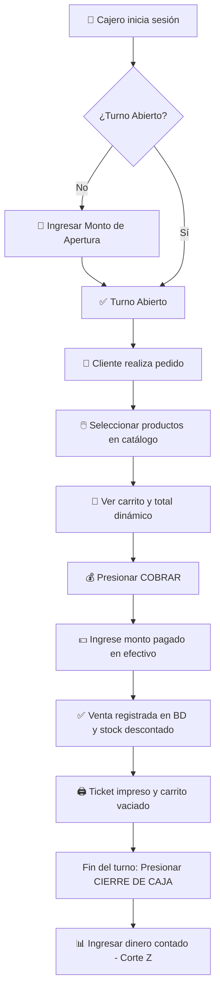
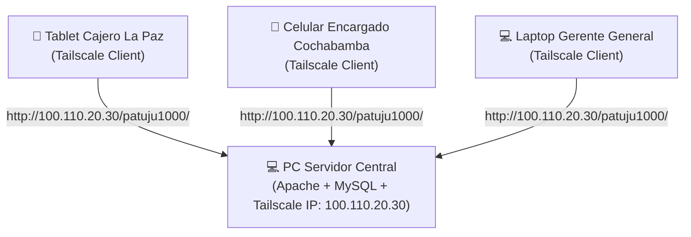
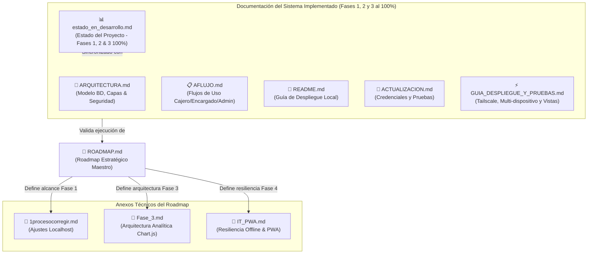
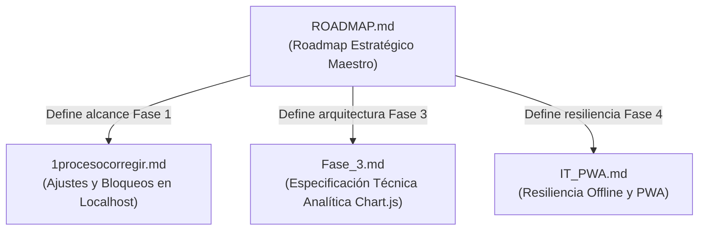

This file is a merged representation of the entire codebase, combined into a single document by Repomix.

# File Summary

## Purpose
This file contains a packed representation of the entire repository's contents.
It is designed to be easily consumable by AI systems for analysis, code review,
or other automated processes.

## File Format
The content is organized as follows:
1. This summary section
2. Repository information
3. Directory structure
4. Repository files (if enabled)
5. Multiple file entries, each consisting of:
  a. A header with the file path (## File: path/to/file)
  b. The full contents of the file in a code block

## Usage Guidelines
- This file should be treated as read-only. Any changes should be made to the
  original repository files, not this packed version.
- When processing this file, use the file path to distinguish
  between different files in the repository.
- Be aware that this file may contain sensitive information. Handle it with
  the same level of security as you would the original repository.

## Notes
- Some files may have been excluded based on .gitignore rules and Repomix's configuration
- Binary files are not included in this packed representation. Please refer to the Repository Structure section for a complete list of file paths, including binary files
- Files matching patterns in .gitignore are excluded
- Files matching default ignore patterns are excluded
- Files are sorted by Git change count (files with more changes are at the bottom)

# Directory Structure
```
CORRECCIONES-PENDIENTES.md
CORRECCIONES-PENDIENTES.md.docx
patuju1000w/.env.example
patuju1000w/.gitignore
patuju1000w/.htaccess
patuju1000w/admin.php
patuju1000w/ajax/admin_sync.php
patuju1000w/ajax/analytics.php
patuju1000w/ajax/crud_productos.php
patuju1000w/ajax/historial.php
patuju1000w/ajax/login.php
patuju1000w/ajax/productos.php
patuju1000w/ajax/registrar_venta.php
patuju1000w/ajax/stock.php
patuju1000w/ajax/turno_caja.php
patuju1000w/assets/css/landing.css
patuju1000w/assets/css/styles.css
patuju1000w/assets/img/empanada_queso.png
patuju1000w/assets/img/jugo_natural.png
patuju1000w/assets/img/landing/hero_saltenas.svg
patuju1000w/assets/img/landing/nosotros_cocina.svg
patuju1000w/assets/img/landing/producto_jugo.svg
patuju1000w/assets/img/landing/producto_saltena.svg
patuju1000w/assets/img/landing/producto_tucumana.svg
patuju1000w/assets/img/saltena_grande.png
patuju1000w/assets/img/saltena_pequena.png
patuju1000w/assets/img/soda_naranja.png
patuju1000w/assets/img/tucumana.png
patuju1000w/assets/js/admin.js
patuju1000w/assets/js/analytics.js
patuju1000w/assets/js/app.js
patuju1000w/assets/js/encargado.js
patuju1000w/config/auth.php
patuju1000w/config/database.php
patuju1000w/database/schema.sql
patuju1000w/docs/1procesocorregir.md
patuju1000w/docs/ACTUALIZACION.md
patuju1000w/docs/AFLUJO.md
patuju1000w/docs/ARQUITECTURA.md
patuju1000w/docs/estado_en_desarrollo.md
patuju1000w/docs/Fase_3.md
patuju1000w/docs/GUIA_DESPLIEGUE_Y_PRUEBAS.md
patuju1000w/docs/IT_PWA.md
patuju1000w/docs/README.md
patuju1000w/docs/RELACION_DOCUMENTOS.md
patuju1000w/docs/ROADMAP.md
patuju1000w/encargado.php
patuju1000w/index.php
patuju1000w/landing.php
patuju1000w/login.php
patuju1000w/logout.php
```

# Files

## File: CORRECCIONES-PENDIENTES.md
````markdown
# 📋 PATUJU POS — Correcciones Pendientes

**Estado:** ✅ Corregido el 2026-09-20 (Fase 4)
**Versión:** Fase 2 (Multi-Sucursal)
**Prioridad:** Por fases

> **Resumen de sesión 2026-09-20:**
> - ✅ BUG-B: CROSS JOIN → INNER JOIN en `ajax/stock.php`
> - ✅ BUG-C: `activarProducto()` ahora envía `activo:1` correctamente en `admin.js`
> - ✅ BUG-D: PUT de editar producto ahora pasa `?id=X` en la URL en `admin.js`
> - ✅ BUG-E: Creado `ajax/admin_sync.php` + auto-polling cada 30s en `admin.js`
> - ✅ BUG-08: Documentado el comportamiento de auto-rehash en `schema.sql`
> - ✅ Confirmados como YA corregidos: BUG-01, BUG-02, BUG-03, BUG-04, BUG-06, BUG-07

---

## 🔴 CRÍTICO — Bloquea Funcionamiento

### 1. Error DB: `SQLSTATE[42S22]` — Columna `usuario_id` no existe

**Ubicación:** `ajax/registrar_venta.php`  
**Síntoma:** Al intentar registrar una venta, falla con `Unknown column 'usuario_id' in 'field list'`

**Causa raíz:**
- La tabla `ventas` en la BD no tiene la columna `usuario_id`.
- El código fue actualizado a Fase 2 (que exige trazabilidad), pero la BD se creó con un `schema.sql` antiguo.

**Solución:**

*Opción A: Si tienes datos de prueba que no importa perder*
```bash
# Resetear BD completamente
mysql -u root -p -e "DROP DATABASE patuju_pos;"
mysql -u root -p < patuju1000/database/schema.sql
```

*Opción B: Si tienes datos reales que conservar*
```sql
-- Agregar columna si no existe
ALTER TABLE ventas 
ADD COLUMN usuario_id INT NULL AFTER sucursal_id;

-- Agregar foreign key
ALTER TABLE ventas 
ADD CONSTRAINT fk_ventas_usuario 
FOREIGN KEY (usuario_id) REFERENCES usuarios(id) 
ON DELETE SET NULL ON UPDATE CASCADE;

-- Agregar índice
CREATE INDEX idx_ventas_usuario ON ventas(usuario_id);
```

**Verificación post-fix:**
```sql
DESC ventas;  -- Debe mostrar usuario_id
```

---

### 2. Autenticación fallida — Credenciales incorrectas aunque sean correctas

**Ubicación:** `ajax/login.php` y `config/auth.php`  
**Síntoma:** Login rechaza credenciales válidas (`usuario_id` = 1, `contraseña` = correcta) sin motivo aparente

**Causa probable:**
- El hash de contraseña en la BD no coincide con lo que se envía desde el formulario.
- `password_verify()` falla silenciosamente, pero el error no se reporta claramente.
- Las credenciales por defecto en `schema.sql` no son las que estás usando.

**Investigación necesaria:**

1. **Verificar credenciales por defecto en BD:**
```sql
SELECT id, usuario, contraseña FROM usuarios LIMIT 1;
```
Nota qué dice el campo `contraseña` (debe ser un hash bcrypt, no plain text).

2. **Probar hash correcto:**
```bash
# En PHP, generar un hash correto
php -r "echo password_hash('patuju_sep2026', PASSWORD_BCRYPT) . PHP_EOL;"
```

3. **Reemplazar en BD:**
```sql
UPDATE usuarios SET contraseña = 'HASH_GENERADO_ARRIBA' WHERE id = 1;
```

**Solución temporal:** 
En `schema.sql`, línea donde se inserta usuario admin, asegúrate que esté así:
```sql
INSERT INTO usuarios (usuario, contraseña, rol, sucursal_id) 
VALUES ('admin', '$2y$10$...HASH_VALIDO...', 'admin', 1);
```

**Verificación post-fix:**
- Loguéate con las credenciales que aparezcan en `schema.sql`.
- Si aún falla, revisa la consola del navegador (DevTools → Console) para mensajes adicionales.

---

## 🟠 ALTO — Impacta UX

### 3. Vista Encargado — Diseño poco intuitivo y sobrecargado

**Ubicación:** `encargado.php` + `assets/js/encargado.js`  
**Problemas:**
- Muestra muchas opciones simultáneamente (cambiar precio, ingresar lote, reposición, etc.).
- El botón **"Refrescar"** (📜 Movimientos de Inventario🔄) no es útil, solo limpia caché.
- No hay separación clara entre "ver" y "editar".
- Monto inicial de turno caja aparece en lugar incorrecto.

**Solución propuesta — Rediseño por flujo:**

**Nuevo flujo (2 pasos):**

1. **Pantalla principal: Listado de cajas (sucursal actual)**
   - Mostrar cada producto como una tarjeta tipo la imagen de sucursales (nombre, precio actual, stock actual).
   - No editar directamente, solo mostrar estado.

2. **Al hacer clic en una tarjeta: Modal de edición**
   - Opción A: **Ajustar Precio** (campo de entrada + guardar).
   - Opción B: **Ingreso de Mercadería** (cantidad + motivo + guardar).
   - Opción C: **Ver Historial** (últimas 5 movimientos).

**Cambios de código:**

*Eliminar:*
- Botón "Refrescar" (no sirve).
- Campo "Monto inicial de turno" (va en `turno_caja.php`, no aquí).
- Tabla de "Movimientos" en la vista principal (mover a modal).

*Agregar:*
- Grid/Cards de productos (una card por producto).
- Modal popup al hacer clic (editar precio o ingresar stock).
- Validación de permisos (solo encargado de la sucursal puede editar su sucursal).

**Ejemplo visual de lo que debe verse:**
```
┌─────────────────────────────────────────┐
│ Encargado: Patuju Central (La Paz)      │
├─────────────────────────────────────────┤
│  ┌──────────────┐  ┌──────────────┐    │
│  │ Salteña      │  │ Empanada     │    │
│  │ Precio: 3Bs  │  │ Precio: 2.5  │    │
│  │ Stock: 45    │  │ Stock: 30    │    │
│  │ [Click]      │  │ [Click]      │    │
│  └──────────────┘  └──────────────┘    │
│  ┌──────────────┐  ┌──────────────┐    │
│  │ Jugo Natural │  │ Soda Naranja │    │
│  │ Precio: 5Bs  │  │ Precio: 4Bs  │    │
│  │ Stock: 120   │  │ Stock: 80    │    │
│  │ [Click]      │  │ [Click]      │    │
│  └──────────────┘  └──────────────┘    │
└─────────────────────────────────────────┘

[Al hacer clic en "Salteña"]
┌──────────────────────────┐
│ Editar: Salteña          │
├──────────────────────────┤
│ Stock actual: 45         │
│                          │
│ ○ Ajustar Precio        │
│   Nuevo precio: [__Bs]   │
│   [Guardar]              │
│                          │
│ ○ Ingreso de Mercadería │
│   Cantidad: [__] unidades│
│   Motivo: [dropdown]     │
│   [Guardar]              │
│                          │
│ ○ Ver Historial         │
│   [Últimos movimientos]  │
│                          │
│              [Cerrar]    │
└──────────────────────────┘
```

---

### 4. Vista Admin — Problemas de sincronización y datos inconsistentes

**Ubicación:** `admin.php` + `assets/js/admin.js`  
**Problemas:**
- Dashboard muestra datos "desincronizados" (aparecen caché stale).
- El historial de ventas no filtra correctamente por sucursal ni por rango de fechas.
- Los gráficos (Fase 3) aún no están, pero cuando se agreguen, necesitarán datos limpios.

**Causa probable:**
- No hay invalidación de caché cuando cambian los datos.
- Las queries de `ajax/historial.php` no validan correctamente los parámetros.

**Solución:**

1. **Agregar endpoint de validación:**
```php
// ajax/admin_sync.php (nuevo)
GET /ajax/admin_sync.php?action=validate
// Responde: { "status": "ok", "timestamp": "..." }
// Se ejecuta cada 30 seg para verificar si hay cambios
```

2. **Refrescar automáticamente si hay cambios:**
```javascript
// En admin.js, agregar:
setInterval(async () => {
    const resp = await fetch('/ajax/admin_sync.php?action=validate');
    const data = await resp.json();
    if (data.last_change > lastLocalTimestamp) {
        // Refrescar dashboard, historial, etc.
    }
}, 30000);
```

3. **Limpiar caché explícitamente:**
   - Agregar botón **"Refrescar Ahora"** (visual, no oculto).
   - Al hacer clic, limpia localStorage + recarga datos desde BD.

**Verificación post-fix:**
- Crea una venta en Caja.
- Ve a Admin → debe reflejarse en <10 segundos.

---

## 🟡 MEDIO — Mejoras de UX

### 5. Flujo de Apertura de Turno — Monto inicial innecesario o confuso

**Ubicación:** `turno_caja.php` + Modal de apertura  
**Problema:** El campo "Monto inicial" (fondo de caja) aparece en múltiples lugares o no está claro si es obligatorio.

**Solución:**
- Mantener solo en **Modal de Apertura de Turno** (cuando inicia el día).
- Validar que sea número positivo.
- Guardar en tabla `turnos_caja.monto_apertura`.
- No debe aparecer en `encargado.php`.

**Código a revisar:**
```php
// En turno_caja.php, línea de INSERT:
INSERT INTO turnos_caja (usuario_id, sucursal_id, monto_apertura, hora_apertura, estado)
VALUES (?, ?, ?, NOW(), 'abierto')
```

---

### 6. Botones sin propósito claro — "Refrescar", "Sincronizar", etc.

**Ubicación:** Múltiples vistas  
**Problema:** Hay botones que repiten funcionalidad o solo limpian caché sin explicación.

**Solución:**
- **Eliminar:** Botón "Refrescar" de la vista Encargado (no hace nada útil).
- **Reemplazar:** Con un único botón **"Actualizar Datos"** en Admin (si es necesario) con spinner visual.
- **Documentar:** Qué hace cada botón en un tooltip (hover).

---

## 📋 Checklist de Auditoría de Código Recomendado

Para evitar errores como estos en el futuro, sigue este checklist antes de hacer un deployment:

### 1. **Consistencia BD ↔ Código**
- [ ] Ejecuta `DESC tabla;` para cada tabla que el código usa.
- [ ] Verifica que **todas** las columnas en `INSERT/UPDATE` existan en la BD.
- [ ] Ejemplo:
```sql
DESC ventas;  -- ¿Existe usuario_id?
DESC turnos_caja;  -- ¿Existe monto_apertura?
DESC stock_sucursal;  -- ¿Existe alerta_minima?
```

### 2. **Autenticación y Sesión**
- [ ] Prueba login con usuarios por defecto de `schema.sql`.
- [ ] Verifica que `password_verify()` devuelva true.
- [ ] Confirma que `$_SESSION['usuario_id']` se propaga a todos los endpoints.
```php
// En cada ajax/*.php, al inicio:
session_start();
if (!isset($_SESSION['usuario_id'])) {
    die(json_encode(['error' => 'No autenticado']));
}
```

### 3. **Flujos de Datos Clave**
- [ ] **Login:** usuario → sesión → caja.
- [ ] **Venta:** caja → INSERT ventas + descuento stock.
- [ ] **Turno:** apertura → venta → cierre.
- [ ] Intenta cada flujo manualmente en todos los roles (cajero, encargado, admin).

### 4. **Parámetros GET/POST**
- [ ] Revisa cada `$_GET` y `$_POST` — ¿llega lo que esperas?
- [ ] Agrega logs temporales:
```php
error_log("POST recibido: " . json_encode($_POST));
```

### 5. **Foreign Keys y Restricciones**
- [ ] Antes de insertar, verifica que los FK existan:
```php
// Antes de INSERT ventas(..., sucursal_id, ...):
$check = $db->prepare("SELECT id FROM sucursales WHERE id = ?");
$check->execute([$sucursal_id]);
if (!$check->fetch()) {
    die(json_encode(['error' => 'Sucursal no existe']));
}
```

### 6. **Transacciones Atómicas**
- [ ] Revisa que cada `INSERT` crítico (venta + stock) está dentro de `BEGIN TRANSACTION ... COMMIT/ROLLBACK`.
- [ ] Verifica que no hay conexión cerrada a mitad de transacción.

---

## 🛠️ Orden Recomendado de Correcciones

**Semana 1:**
1. Arreglar error `usuario_id` (CRÍTICO).
2. Revisar credenciales de login (CRÍTICO).
3. Refactorizar vista Encargado (ALTO impacto).

**Semana 2:**
4. Sincronización de Admin (MEDIO).
5. Limpiar botones sin propósito (BAJO).

**Después:**
6. Implementar checklist de auditoría para futuros cambios.

---

## 📞 Cómo Comunicar Estos Errores a un Asistente IA (Para la Próxima Vez)

**Mal:**
> "Hay muchos errores, ayúdame a arreglarlo."

**Bien:**
```markdown
Tengo estos errores en PATUJU POS:

1. **CRÍTICO - DB:** SQLSTATE[42S22] Unknown column 'usuario_id' in 'field list'
   - Ocurre en: ajax/registrar_venta.php, línea 3200
   - Contexto: Intento registrar venta, tabla ventas no tiene columna usuario_id
   - BD: patuju_pos, creada con schema.sql antiguo

2. **CRÍTICO - Auth:** Login falla aunque credenciales son correctas
   - Usuario: admin / admin
   - Password_verify() devuelve false sin motivo aparente
   - Revisar: password hash en BD vs formulario

3. **ALTO - UX:** Vista Encargado sobrecargada
   - Quiero: Cards de productos (como la imagen de sucursales adjunta)
   - Actual: Tabla con muchas opciones simultáneamente
   - Cambio deseado: Click en card → modal para editar precio/stock

4. **AUDITORÍA:** ¿Cómo debería revisar mi código para prevenir estos errores?
   - Tengo BD, PHP, JS — ¿qué checklist usar?

Con esto, es mucho más fácil ayudarte correctamente.
```

---

## 📚 Archivos Relacionados

- `schema.sql` — Estructura de BD (verificar que tenga `usuario_id` en `ventas`).
- `ajax/registrar_venta.php` — Donde falla el INSERT.
- `ajax/login.php` — Donde falla autenticación.
- `encargado.php` + `encargado.js` — Vista a refactorizar.
- `admin.php` + `admin.js` — Dashboard con sincronización lenta.


1. Bug de pestañas duplicadas (Caja)
Es prevenible — no es "normal" del sistema. Lo que se ve en la imagen (SUC-001 Patuju Central duplicada) apunta a que el panel de sucursales asignadas se está re-renderizando sin limpiar el contenedor anterior, típico de:
Un fetch/render que se dispara en cada focus de pestaña o en un intervalo, y cada vez agrega tarjetas al DOM en vez de reemplazar el contenido.
Dos pestañas compartiendo la misma sesión de servidor y el backend devolviendo la sucursal dos veces por un JOIN duplicado (ej. left join contra tabla de turnos que trae más de una fila abierta).
Guía para la IA coding:
Revisar la consulta SQL que arma "Sucursales Asignadas" — confirmar que agrupa por sucursal (o usa DISTINCT/GROUP BY) y no duplica filas si hay más de un turno/caja abierto para esa sucursal.
Revisar el JS del panel: antes de pintar las tarjetas, limpiar el contenedor (innerHTML = '' o equivalente) en cada refresco, y evitar que el listener de refresco se registre más de una vez (común si el script se importa dos veces o el evento se liga en cada render).
Simular el caso "misma sucursal, dos pestañas abiertas" en pruebas antes de dar por cerrado.
2. Panel admin editable por sucursal (stock y precios)
Hoy "Auditoría de Ventas" solo crea productos a nivel catálogo general (imagen 2), pero no deja tocar stock ni precio por sucursal. Se necesita recuperar la vista de edición que existía al inicio, pero enganchada al flujo actual multi-sucursal.
Guía para la IA coding:
Ubicar en el historial/versión anterior del proyecto la vista de "panel admin" que permitía editar producto (nombre, precio, imagen, stock) — es la base a reutilizar, no a rehacer desde cero.
Definir el punto de entrada: desde "Ver sucursal →" (imagen 1) o desde "Stock por Sucursal" (pestaña ya existente en Dirección General), debe abrirse una vista de edición que muestre, por producto, el stock y precio de esa sucursal específica — no el precio base general del catálogo.
Diferenciar dos niveles de datos: catálogo general (nombre, categoría, imagen — ya cubierto) vs. inventario por sucursal (cantidad en stock, precio local si aplica, umbral de stock bajo). El formulario de edición debe escribir sobre la tabla de inventario por sucursal, no sobre el catálogo global.
Mantener el mismo diseño visual ya aprobado; solo agregar los campos editables (inputs de cantidad/precio + botón guardar) sobre las filas de producto en esa vista.

lo que se realizo, Tengo el contexto completo. Voy a proceder a corregir todos los bugs pendientes en orden de severidad. Déjame revisar los archivos relevantes primero.
Tengo toda la información. Ahora procedo a corregir los bugs en orden:
BUG-02 — Agregar auth a crud_productos.php y productos.php
BUG-03 — Validar stock en cambiarCantidad()
BUG-04 — Eliminar header duplicado en historial.php
BUG-05 — Cambiar CROSS JOIN a subconsultas e INNER JOIN en stock.php
BUG-06 — Usar sucursal_nombre en lugar de sucursal_id en app.js
Perfecto. Ahora aplico todos los fixes:

desde la fila 242

   // ── Modificar cantidad ────────────────────
   // BUG-03 FIX: Valida el límite de stock disponible antes de incrementar
   function cambiarCantidad(index, delta) {
       if (delta > 0) {
           const item = carrito[index];
           // Buscar el producto en el catálogo para obtener su stock actual
           let stockDisponible = Infinity;
           for (const cat of productos) {
               const prod = cat.productos.find(p => p.id == item.id);
               if (prod) {
                   stockDisponible = parseInt(prod.cantidad_disponible, 10) || 0;
                   break;
               }
           }
           if (item.cantidad >= stockDisponible) {
               toast(`⚠️ Stock máximo disponible: ${stockDisponible} u.`, 'error');
               return;
           }
       }

esto habia fila 650 (                            <td>${v.sucursal_id}</td>
)
se cambio por,                            <td>${escapeHtml(v.sucursal_nombre)}</td>

 en  la carpeta crud_pruductos.php, se cambio lo siguiente require_once __DIR__ . '/../config/database.php';


de fila 9 a 21

require_once __DIR__ . '/../config/auth.php';
verificarSesionAjax();


header('Content-Type: application/json; charset=utf-8');


$method = $_SERVER['REQUEST_METHOD'];


// Para crear, editar o eliminar productos se requiere rol admin
// BUG-02 FIX: Se eliminó acceso GET sin autenticación. Ahora toda la ruta requiere sesión válida.
if ($method !== 'GET' && ($_SESSION['usuario_rol'] ?? '') !== 'admin') {
   jsonResponse(['success' => false, 'error' => 'Acceso denegado. Se requieren permisos de administrador.'], 403);
}


productos.php, se cambio por lo siguiente

require_once __DIR__ . '/../config/database.php';
session_start();
if (!isset($_SESSION['usuario_id'])) {
    jsonResponse(['success' => false, 'error' => 'Sesión expirada'], 401);
}

header('Content-Type: application/json; charset=utf-8');

por
 require_once __DIR__ . '/../config/auth.php';
verificarSesionAjax();
// BUG-04 FIX: El header Content-Type ya lo establece jsonResponse() en database.php.
// No se repite aquí para evitar "headers already sent" con output_buffering desactivado.
````

## File: patuju1000w/.env.example
````
# PATUJU POS — Variables de Entorno (Plantilla)
# Copiar este archivo a .env y completar con los valores reales de tu entorno

DB_HOST=localhost
DB_NAME=patuju_pos
DB_USER=root
DB_PASS=TuContrasenaSegura
DB_CHARSET=utf8mb4
````

## File: patuju1000w/.gitignore
````
# PATUJU POS — Git Ignore

# Variables de entorno — nunca versionar credenciales
.env

# Directorios de vendor si se usa Composer en el futuro
vendor/

# Archivos del sistema
.DS_Store
Thumbs.db

# Logs de PHP
*.log
````

## File: patuju1000w/.htaccess
````
# ============================================
# PATUJU POS - Configuración Apache
# ============================================

# Página de inicio por defecto: Landing Page
DirectoryIndex landing.php index.php

# Prevenir listado de directorios
Options -Indexes

# Charset por defecto
AddDefaultCharset UTF-8

# ── Cabeceras de Seguridad HTTP ──────────────
<IfModule mod_headers.c>
    # Prevenir clickjacking (iframes maliciosos)
    Header always set X-Frame-Options "SAMEORIGIN"
    # Prevenir MIME-type sniffing
    Header always set X-Content-Type-Options "nosniff"
    # Activar protección XSS del navegador
    Header always set X-XSS-Protection "1; mode=block"
    # Política de referencia
    Header always set Referrer-Policy "strict-origin-when-cross-origin"
    # Permisos de funcionalidades del navegador
    Header always set Permissions-Policy "camera=(), microphone=(), geolocation=()"
</IfModule>

# ── Proteger directorios sensibles ───────────
# Bloquear acceso directo a archivos de configuración
<FilesMatch "\.(sql|md|env|log|bak|ini)$">
    <IfModule mod_authz_core.c>
        Require all denied
    </IfModule>
    <IfModule !mod_authz_core.c>
        Order deny,allow
        Deny from all
    </IfModule>
</FilesMatch>

# Bloquear acceso al directorio config/
<IfModule mod_rewrite.c>
    RewriteEngine On
    RewriteRule ^config/ - [F,L]
    RewriteRule ^database/ - [F,L]
</IfModule>
````

## File: patuju1000w/admin.php
````php
<?php
require_once __DIR__ . '/config/auth.php';
verificarSesion('admin');

$db = getDB();
$sucursales = $db->query("SELECT id, nombre, ciudad, departamento FROM sucursales WHERE activo = 1 ORDER BY id ASC")->fetchAll();
?>
<!DOCTYPE html>
<html lang="es">
<head>
    <meta charset="UTF-8">
    <meta name="viewport" content="width=device-width, initial-scale=1.0">
    <meta name="description" content="Patuju POS — Panel de Administración General y Auditoría Multi-Sucursal">
    <title>Patuju POS — Panel de Dirección General</title>
    <link rel="stylesheet" href="assets/css/styles.css">
    <link rel="icon" href="data:image/svg+xml,<svg xmlns='http://www.w3.org/2000/svg' viewBox='0 0 100 100'><text y='.9em' font-size='90'>⚙️</text></svg>">
</head>
<body>

<div class="app" style="grid-template-columns: 1fr; min-height: 100vh;">

    <!-- ── Topbar ────────────────────────────── -->
    <header class="topbar">
        <div class="topbar__brand">
            <span class="topbar__logo">👑</span>
            <div>
                <div class="topbar__title">DIRECCIÓN GENERAL</div>
                <div class="topbar__subtitle">Consolidado y Auditoría Multi-Sucursal</div>
            </div>
        </div>
        <div class="topbar__actions">
            <div style="display:flex;align-items:center;gap:0.4rem;padding:0.35rem 0.8rem;background:var(--color-surface-2);border-radius:var(--radius-full);font-size:0.85rem;color:var(--color-primary);">
                <span>🏢</span>
                <span>Todas las Sucursales (15 Sedes)</span>
            </div>
            <a href="index.php" class="btn btn--primary" id="btn-volver-caja">🥟 Ir a Caja</a>
            <a href="encargado.php" class="btn" id="btn-ir-encargado">🏬 Panel Sucursal</a>
            <a href="logout.php" class="btn" style="color:var(--color-danger)">🚪 Salir</a>
        </div>
    </header>

    <!-- ── Barra de Pestañas de Navegación ───── -->
    <div style="background: var(--color-surface); border-bottom: 1px solid var(--color-border); padding: 0.5rem 1.5rem; display: flex; gap: 0.5rem; flex-wrap: wrap;">
        <button class="btn btn-tab active" id="tab-btn-productos" onclick="Admin.cambiarTab('productos')" style="font-weight: 600;">
            📦 Catálogo de Productos
        </button>
        <button class="btn btn-tab" id="tab-btn-stock" onclick="Admin.cambiarTab('stock')" style="font-weight: 600;">
            🏬 Stock por Sucursal
        </button>
        <button class="btn btn-tab" id="tab-btn-auditoria-ventas" onclick="Admin.cambiarTab('auditoria-ventas')" style="font-weight: 600;">
            🧾 Auditoría de Ventas
        </button>
        <button class="btn btn-tab" id="tab-btn-auditoria-turnos" onclick="Admin.cambiarTab('auditoria-turnos')" style="font-weight: 600;">
            📑 Cierres de Turno (Cortes Z)
        </button>
        <button class="btn btn-tab" id="tab-btn-analytics" onclick="Admin.cambiarTab('analytics')" style="font-weight: 600;">
            📊 Dashboard Analítica
        </button>
    </div>

    <!-- ── Contenido Principal ───────────────── -->
    <main style="padding: 1.5rem; max-width: 1400px; margin: 0 auto; width: 100%;">

        <!-- ════════════════════════════════════════
             PESTAÑA 1: CATÁLOGO DE PRODUCTOS (CRUD)
             ════════════════════════════════════════ -->
        <section id="tab-content-productos" class="tab-content">
            <div class="admin-grid">
                <!-- Formulario -->
                <div class="admin-form">
                    <h3 class="admin-form__title" id="admin-form-title">➕ Nuevo Producto</h3>
                    <form id="admin-form">
                        <div class="form-group">
                            <label for="prod-nombre">Nombre *</label>
                            <input type="text" id="prod-nombre" placeholder="Ej: Salteña Grande de Carne" required>
                        </div>
                        <div class="form-group">
                            <label for="prod-precio">Precio Base General (Bs.) *</label>
                            <input type="number" id="prod-precio" step="0.50" min="0.50" placeholder="8.00" required>
                        </div>
                        <div class="form-group">
                            <label for="prod-categoria">Categoría *</label>
                            <select id="prod-categoria" required>
                                <option value="">Cargando...</option>
                            </select>
                        </div>
                        <div class="form-group">
                            <label for="prod-imagen">Imagen (archivo PNG/SVG)</label>
                            <input type="text" id="prod-imagen" placeholder="saltena_grande.png">
                        </div>
                        <div class="form-group">
                            <label for="prod-descripcion">Descripción</label>
                            <textarea id="prod-descripcion" rows="2" placeholder="Descripción breve..."></textarea>
                        </div>
                        <div style="display:flex;gap:0.5rem;">
                            <button type="submit" class="btn btn--primary" id="admin-form-submit" style="flex:1;">💾 Guardar Producto</button>
                            <button type="button" class="btn" id="admin-form-cancel" style="display:none;" onclick="Admin.limpiarFormulario()">Cancelar</button>
                        </div>
                    </form>
                </div>

                <!-- Tabla de productos -->
                <div class="admin-table-wrap">
                    <div class="admin-table-wrap__header" style="display: flex; justify-content: space-between; align-items: center;">
                        <span>📦 Productos Registrados en el Sistema</span>
                    </div>
                    <div class="admin-table-wrap__body">
                        <table class="admin-table">
                            <thead>
                                <tr>
                                    <th>ID</th>
                                    <th>Nombre</th>
                                    <th>Categoría</th>
                                    <th>Precio Base</th>
                                    <th>Estado</th>
                                    <th>Acciones</th>
                                </tr>
                            </thead>
                            <tbody id="admin-tbody">
                                <tr><td colspan="6" style="text-align:center;color:var(--color-text-muted);padding:2rem;">Cargando productos...</td></tr>
                            </tbody>
                        </table>
                    </div>
                </div>
            </div>
        </section>

        <!-- ════════════════════════════════════════
             PESTAÑA 2: STOCK MULTI-SUCURSAL (Editable por Sucursal)
             ════════════════════════════════════════ -->
        <section id="tab-content-stock" class="tab-content" style="display: none;">
            <!-- Selector rápido por Tarjetas de Sucursal con "Ver sucursal →" -->
            <div style="margin-bottom: 1.25rem;">
                <div style="display: flex; justify-content: space-between; align-items: center; margin-bottom: 0.75rem;">
                    <h3 style="font-size: 1.1rem; font-weight: 700; color: var(--color-text); display: flex; align-items: center; gap: 0.5rem;">
                        <span>🏢</span> Sucursales Disponibles
                    </h3>
                    <span style="font-size: 0.85rem; color: var(--color-text-muted);">Haz clic en <strong>"Ver sucursal →"</strong> para editar stock y precios específicos de esa sede</span>
                </div>
                <div class="sucursales-quick-grid" style="display: grid; grid-template-columns: repeat(auto-fill, minmax(260px, 1fr)); gap: 1rem;">
                    <div class="sucursal-admin-card" onclick="Admin.seleccionarSucursalStock('')" style="background: var(--color-surface); border: 2px solid var(--color-primary); border-radius: var(--radius-md); padding: 1rem; cursor: pointer; display: flex; justify-content: space-between; align-items: center; transition: all 0.2s ease;">
                        <div>
                            <div style="font-weight: 700; color: var(--color-primary);">🌐 Todas las Sedes</div>
                            <div style="font-size: 0.8rem; color: var(--color-text-muted);">Consolidado General</div>
                        </div>
                        <span class="btn btn--sm" style="font-size: 0.78rem;">Ver todas →</span>
                    </div>
                    <?php foreach ($sucursales as $s): ?>
                    <div class="sucursal-admin-card" id="card-suc-<?= $s['id'] ?>" onclick="Admin.seleccionarSucursalStock(<?= $s['id'] ?>)" style="background: var(--color-surface); border: 1px solid var(--color-border); border-radius: var(--radius-md); padding: 1rem; cursor: pointer; display: flex; justify-content: space-between; align-items: center; transition: all 0.2s ease;">
                        <div>
                            <div style="font-weight: 700; color: var(--color-text);"><?= htmlspecialchars($s['nombre']) ?></div>
                            <div style="font-size: 0.8rem; color: var(--color-text-muted);">📍 <?= htmlspecialchars($s['ciudad']) ?></div>
                        </div>
                        <button class="btn btn--sm btn--primary" onclick="event.stopPropagation(); Admin.seleccionarSucursalStock(<?= $s['id'] ?>)" style="font-size: 0.78rem; font-weight: 600;">
                            Ver sucursal →
                        </button>
                    </div>
                    <?php endforeach; ?>
                </div>
            </div>

            <!-- Toolbar de Filtros y Acciones -->
            <div style="background: var(--color-surface); border: 1px solid var(--color-border); border-radius: var(--radius-lg); padding: 1.25rem; margin-bottom: 1.5rem; display: flex; flex-wrap: wrap; gap: 1rem; justify-content: space-between; align-items: center;">
                <div style="display: flex; gap: 0.8rem; align-items: center; flex-wrap: wrap;">
                    <label for="filtro-stock-sucursal" style="font-weight: 600; font-size: 0.9rem;">📍 Sucursal Activa:</label>
                    <select id="filtro-stock-sucursal" style="background: var(--color-surface-2); border: 1px solid var(--color-border); border-radius: var(--radius-md); padding: 0.5rem 0.8rem; color: var(--color-text); font-weight: 600;" onchange="Admin.cargarStockSucursal()">
                        <option value="">Todas las Sucursales (Consolidado)</option>
                        <?php foreach ($sucursales as $s): ?>
                        <option value="<?= $s['id'] ?>"><?= htmlspecialchars($s['nombre']) ?> (<?= htmlspecialchars($s['ciudad']) ?>)</option>
                        <?php endforeach; ?>
                    </select>

                    <input type="text" id="filtro-stock-busqueda" placeholder="🔍 Buscar producto..." oninput="Admin.filtrarTablaStockLocal()" style="background: var(--color-surface-2); border: 1px solid var(--color-border); border-radius: var(--radius-md); padding: 0.5rem 0.8rem; color: var(--color-text); font-size: 0.9rem; min-width: 200px;">
                </div>
                <div style="display: flex; gap: 0.6rem; align-items: center;">
                    <button class="btn" onclick="Admin.cargarStockSucursal()">🔄 Actualizar</button>
                    <button class="btn btn--primary" id="btn-guardar-todo-stock" onclick="Admin.guardarTodoStock()" style="font-weight: 700;">💾 Guardar Todo</button>
                </div>
            </div>

            <!-- Tabla Editable de Inventario y Precios por Sucursal -->
            <div class="admin-table-wrap">
                <div class="admin-table-wrap__header" style="display: flex; justify-content: space-between; align-items: center;">
                    <span id="stock-table-titulo">🏬 Edición de Inventario y Precios por Sucursal</span>
                    <span style="font-size: 0.82rem; font-weight: 400; color: var(--color-text-muted);">
                        💡 Los cambios se guardan directamente en el inventario local de la sucursal seleccionada
                    </span>
                </div>
                <div class="admin-table-wrap__body">
                    <table class="admin-table">
                        <thead>
                            <tr>
                                <th>Sucursal</th>
                                <th>Producto</th>
                                <th>Categoría</th>
                                <th style="text-align: center; width: 120px;">Stock Disp.</th>
                                <th style="text-align: center; width: 100px;">Alerta Mín.</th>
                                <th style="text-align: center; width: 170px;">Precio Local (Bs.)</th>
                                <th style="text-align: center;">Estado</th>
                                <th style="text-align: center; width: 110px;">Acción</th>
                            </tr>
                        </thead>
                        <tbody id="stock-admin-tbody">
                            <tr><td colspan="8" style="text-align:center;color:var(--color-text-muted);padding:2rem;">Cargando inventario...</td></tr>
                        </tbody>
                    </table>
                </div>
            </div>
        </section>

        <!-- ════════════════════════════════════════
             PESTAÑA 3: AUDITORÍA DE VENTAS (Trazabilidad)
             ════════════════════════════════════════ -->
        <section id="tab-content-auditoria-ventas" class="tab-content" style="display: none;">
            <!-- Filtros de Auditoría -->
            <div style="background: var(--color-surface); border: 1px solid var(--color-border); border-radius: var(--radius-lg); padding: 1.25rem; margin-bottom: 1.5rem; display: flex; flex-wrap: wrap; gap: 1rem; align-items: flex-end;">
                <div>
                    <label for="filtro-venta-sucursal" style="display: block; font-size: 0.8rem; color: var(--color-text-muted); margin-bottom: 0.3rem;">Sucursal:</label>
                    <select id="filtro-venta-sucursal" style="background: var(--color-surface-2); border: 1px solid var(--color-border); border-radius: var(--radius-md); padding: 0.5rem 0.8rem; color: var(--color-text);">
                        <option value="">Todas las Sucursales</option>
                        <?php foreach ($sucursales as $s): ?>
                        <option value="<?= $s['id'] ?>"><?= htmlspecialchars($s['nombre']) ?></option>
                        <?php endforeach; ?>
                    </select>
                </div>
                <div>
                    <label for="filtro-venta-desde" style="display: block; font-size: 0.8rem; color: var(--color-text-muted); margin-bottom: 0.3rem;">Fecha Desde:</label>
                    <input type="date" id="filtro-venta-desde" style="background: var(--color-surface-2); border: 1px solid var(--color-border); border-radius: var(--radius-md); padding: 0.5rem 0.8rem; color: var(--color-text);">
                </div>
                <div>
                    <label for="filtro-venta-hasta" style="display: block; font-size: 0.8rem; color: var(--color-text-muted); margin-bottom: 0.3rem;">Fecha Hasta:</label>
                    <input type="date" id="filtro-venta-hasta" style="background: var(--color-surface-2); border: 1px solid var(--color-border); border-radius: var(--radius-md); padding: 0.5rem 0.8rem; color: var(--color-text);">
                </div>
                <div>
                    <button class="btn btn--primary" onclick="Admin.cargarAuditoriaVentas()">🔍 Filtrar Auditoría</button>
                </div>
            </div>

            <!-- Tabla de Auditoría de Ventas -->
            <div class="admin-table-wrap">
                <div class="admin-table-wrap__header">🧾 Trazabilidad de Ventas Registradas (Quién vendió qué, cuándo y dónde)</div>
                <div class="admin-table-wrap__body">
                    <table class="admin-table">
                        <thead>
                            <tr>
                                <th># Venta</th>
                                <th>Fecha / Hora</th>
                                <th>Sucursal</th>
                                <th>Cajero</th>
                                <th>Detalle de Productos</th>
                                <th>Método de Pago</th>
                                <th style="text-align: right;">Total (Bs.)</th>
                            </tr>
                        </thead>
                        <tbody id="auditoria-ventas-tbody">
                            <tr><td colspan="7" style="text-align:center;color:var(--color-text-muted);padding:2rem;">Cargando historial de ventas...</td></tr>
                        </tbody>
                    </table>
                </div>
            </div>
        </section>

        <!-- ════════════════════════════════════════
             PESTAÑA 4: AUDITORÍA DE CIERRES DE TURNO (Cortes Z)
             ════════════════════════════════════════ -->
        <section id="tab-content-auditoria-turnos" class="tab-content" style="display: none;">
            <!-- Filtros de Auditoría de Turnos -->
            <div style="background: var(--color-surface); border: 1px solid var(--color-border); border-radius: var(--radius-lg); padding: 1.25rem; margin-bottom: 1.5rem; display: flex; flex-wrap: wrap; gap: 1rem; align-items: flex-end;">
                <div>
                    <label for="filtro-turno-sucursal" style="display: block; font-size: 0.8rem; color: var(--color-text-muted); margin-bottom: 0.3rem;">Sucursal:</label>
                    <select id="filtro-turno-sucursal" style="background: var(--color-surface-2); border: 1px solid var(--color-border); border-radius: var(--radius-md); padding: 0.5rem 0.8rem; color: var(--color-text);">
                        <option value="">Todas las Sucursales</option>
                        <?php foreach ($sucursales as $s): ?>
                        <option value="<?= $s['id'] ?>"><?= htmlspecialchars($s['nombre']) ?></option>
                        <?php endforeach; ?>
                    </select>
                </div>
                <div>
                    <label for="filtro-turno-estado" style="display: block; font-size: 0.8rem; color: var(--color-text-muted); margin-bottom: 0.3rem;">Estado:</label>
                    <select id="filtro-turno-estado" style="background: var(--color-surface-2); border: 1px solid var(--color-border); border-radius: var(--radius-md); padding: 0.5rem 0.8rem; color: var(--color-text);">
                        <option value="">Todos los turnos</option>
                        <option value="cerrado">Solo Cerrados (Corte Z)</option>
                        <option value="abierto">Solo Abiertos Actualmente</option>
                    </select>
                </div>
                <div>
                    <button class="btn btn--primary" onclick="Admin.cargarAuditoriaTurnos()">🔍 Filtrar Cierres</button>
                </div>
            </div>

            <!-- Tabla de Cierres de Turno -->
            <div class="admin-table-wrap">
                <div class="admin-table-wrap__header">📑 Arqueos y Cierres de Caja (Cortes Z a nivel nacional)</div>
                <div class="admin-table-wrap__body">
                    <table class="admin-table">
                        <thead>
                            <tr>
                                <th># Turno</th>
                                <th>Sucursal / Cajero</th>
                                <th>Horarios (Apertura - Cierre)</th>
                                <th style="text-align: right;">Fondo Inicial</th>
                                <th style="text-align: right;">Ventas Sistema</th>
                                <th style="text-align: right;">Egresos</th>
                                <th style="text-align: right;">Monto Físico (Cierre)</th>
                                <th style="text-align: center;">Diferencia / Cuadre</th>
                                <th>Notas</th>
                            </tr>
                        </thead>
                        <tbody id="auditoria-turnos-tbody">
                            <tr><td colspan="9" style="text-align:center;color:var(--color-text-muted);padding:2rem;">Cargando turnos de caja...</td></tr>
                        </tbody>
                    </table>
                </div>
            </div>
        </section>

        <!-- ════════════════════════════════════════
             PESTAÑA 5: DASHBOARD DE ANALÍTICA (Fase 3)
             ════════════════════════════════════════ -->
        <section id="tab-content-analytics" class="tab-content" style="display: none;">
            <!-- Barra Superior de Control y Estado -->
            <div class="analytics-topbar">
                <div style="display: flex; align-items: center; gap: 1rem; flex-wrap: wrap;">
                    <span id="analytics-status-badge" class="badge-status status-ok">
                        🟢 Actualizado
                    </span>
                    <span style="font-size: 0.8rem; color: var(--color-text-muted);">
                        ⏱️ Actualización automática cada 30s
                    </span>
                </div>
                <div style="display: flex; gap: 0.5rem; flex-wrap: wrap;">
                    <button class="btn" onclick="AdminAnalytics.actualizar()" title="Forzar actualización de datos">
                        🔄 Refrescar
                    </button>
                    <button class="btn btn--primary" onclick="AdminAnalytics.abrirModalExportar()" title="Exportar reportes a Excel o CSV">
                        📥 Exportar Reportes
                    </button>
                    <button class="btn" onclick="AdminAnalytics.imprimirReporte()" title="Imprimir informe en formato PDF">
                        🖨️ Imprimir PDF
                    </button>
                </div>
            </div>

            <!-- Fila de Tarjetas KPI -->
            <div class="kpi-grid">
                <div class="kpi-card">
                    <div class="kpi-card__icon" style="color: var(--color-primary);">💰</div>
                    <div class="kpi-card__info">
                        <div class="kpi-card__title">Ventas de Hoy</div>
                        <div class="kpi-card__value" id="kpi-ventas-hoy">Bs. 0.00</div>
                    </div>
                </div>
                <div class="kpi-card">
                    <div class="kpi-card__icon" style="color: var(--color-info);">🧾</div>
                    <div class="kpi-card__info">
                        <div class="kpi-card__title">Transacciones Hoy</div>
                        <div class="kpi-card__value" id="kpi-transacciones-hoy">0</div>
                    </div>
                </div>
                <div class="kpi-card">
                    <div class="kpi-card__icon" style="color: var(--color-success);">🎯</div>
                    <div class="kpi-card__info">
                        <div class="kpi-card__title">Ticket Promedio</div>
                        <div class="kpi-card__value" id="kpi-ticket-promedio">Bs. 0.00</div>
                    </div>
                </div>
                <div class="kpi-card">
                    <div class="kpi-card__icon" style="color: var(--color-warning);">🗓️</div>
                    <div class="kpi-card__info">
                        <div class="kpi-card__title">Ventas del Mes</div>
                        <div class="kpi-card__value" id="kpi-ventas-mes">Bs. 0.00</div>
                    </div>
                </div>
            </div>

            <!-- Gráficos de Analítica (Chart.js) -->
            <div class="analytics-charts-grid">
                <!-- Gráfico 1: Unidades vendidas hoy por sucursal -->
                <div class="chart-card col-7">
                    <div class="chart-card__header">
                        <div class="chart-card__title">
                            <span>🥟</span> Unidades Vendidas Hoy por Sucursal
                        </div>
                        <span style="font-size: 0.75rem; color: var(--color-text-muted);">Comportamiento incremental</span>
                    </div>
                    <div class="chart-card__body">
                        <canvas id="chart-sucursales"></canvas>
                    </div>
                </div>

                <!-- Gráfico 2: Ventas por Departamento -->
                <div class="chart-card col-5">
                    <div class="chart-card__header">
                        <div class="chart-card__title">
                            <span>🗺️</span> Distribución por Departamento
                        </div>
                        <span style="font-size: 0.75rem; color: var(--color-text-muted);">Mes en curso</span>
                    </div>
                    <div class="chart-card__body">
                        <canvas id="chart-deptos"></canvas>
                    </div>
                </div>

                <!-- Gráfico 3: Horarios Pico de Venta -->
                <div class="chart-card col-6">
                    <div class="chart-card__header">
                        <div class="chart-card__title">
                            <span>⏰</span> Horarios Pico de Venta (Hoy)
                        </div>
                        <span style="font-size: 0.75rem; color: var(--color-text-muted);">Evolución horaria</span>
                    </div>
                    <div class="chart-card__body">
                        <canvas id="chart-horas"></canvas>
                    </div>
                </div>

                <!-- Gráfico 4: Top 10 Productos Más Vendidos -->
                <div class="chart-card col-6">
                    <div class="chart-card__header">
                        <div class="chart-card__title">
                            <span>🥇</span> Top 10 Productos del Mes
                        </div>
                        <span style="font-size: 0.75rem; color: var(--color-text-muted);">Por unidades vendidas</span>
                    </div>
                    <div class="chart-card__body">
                        <canvas id="chart-productos"></canvas>
                    </div>
                </div>

                <!-- Gráfico 5: Tendencia de Ventas (Últimos 30 Días) -->
                <div class="chart-card col-12">
                    <div class="chart-card__header">
                        <div class="chart-card__title">
                            <span>📈</span> Tendencia de Ventas Diarias (Últimos 30 Días)
                        </div>
                        <span style="font-size: 0.75rem; color: var(--color-text-muted);">Total facturado en Bs.</span>
                    </div>
                    <div class="chart-card__body" style="min-height: 320px;">
                        <canvas id="chart-tendencia"></canvas>
                    </div>
                </div>
            </div>
        </section>

    </main>
</div>

<!-- ── Modal de Exportación de Reportes ──────── -->
<div class="modal-overlay" id="modal-exportar-reporte">
    <div class="modal" style="max-width: 480px;">
        <div class="modal__header">
            <h3 class="modal__title">📥 Exportar Reportes de Negocio</h3>
            <button class="modal__close" onclick="AdminAnalytics.cerrarModalExportar()">✕</button>
        </div>
        <div class="modal__body" style="padding: 1.5rem;">
            <p style="color: var(--color-text-dim); font-size: 0.85rem; margin-bottom: 1.25rem;">
                Genera archivos CSV codificados en UTF-8 con formato monetario boliviano (Bs.), listos para abrirse en Microsoft Excel o importar en software contable.
            </p>

            <div class="form-group">
                <label for="rep-tipo">Tipo de Reporte *</label>
                <select id="rep-tipo" style="width: 100%; padding: 0.75rem; background: var(--color-surface-2); border: 1px solid var(--color-border); border-radius: var(--radius-md); color: var(--color-text);">
                    <option value="ventas_sucursal">Consolidado de Ventas por Sucursal</option>
                    <option value="productos">Ranking y Rendimiento de Productos</option>
                    <option value="diario">Histórico de Ventas Día a Día</option>
                </select>
            </div>

            <div style="display: grid; grid-template-columns: 1fr 1fr; gap: 1rem; margin-bottom: 1.25rem;">
                <div class="form-group">
                    <label for="rep-desde">Fecha Desde</label>
                    <input type="date" id="rep-desde" value="<?= date('Y-m-01') ?>" style="width: 100%; padding: 0.65rem; background: var(--color-surface-2); border: 1px solid var(--color-border); border-radius: var(--radius-md); color: var(--color-text);">
                </div>
                <div class="form-group">
                    <label for="rep-hasta">Fecha Hasta</label>
                    <input type="date" id="rep-hasta" value="<?= date('Y-m-d') ?>" style="width: 100%; padding: 0.65rem; background: var(--color-surface-2); border: 1px solid var(--color-border); border-radius: var(--radius-md); color: var(--color-text);">
                </div>
            </div>

            <button onclick="AdminAnalytics.descargarReporte()" class="btn btn--primary" style="width: 100%; padding: 0.9rem; font-size: 1rem; justify-content: center;">
                ⬇️ Descargar Reporte (.CSV / Excel)
            </button>
        </div>
    </div>
</div>

<!-- Scripts -->
<script src="https://cdn.jsdelivr.net/npm/chart.js@4.4.4/dist/chart.umd.min.js"></script>
<script src="assets/js/analytics.js"></script>
<script src="assets/js/admin.js"></script>
</body>
</html>
````

## File: patuju1000w/ajax/admin_sync.php
````php
<?php
/**
 * PATUJU POS — Endpoint: Sincronización de Dashboard Admin (Fase 2)
 *
 * GET ?action=validate → Devuelve el timestamp de la última venta registrada.
 *                        El frontend lo compara con su último valor local para
 *                        saber si debe refrescar los datos del dashboard.
 *
 * Respuesta: { status: 'ok', last_change: 'YYYY-MM-DD HH:MM:SS', timestamp: 1234567890 }
 */
require_once __DIR__ . '/../config/auth.php';
verificarSesionAjax();

if ($_SERVER['REQUEST_METHOD'] !== 'GET') {
    jsonResponse(['success' => false, 'error' => 'Método no permitido'], 405);
}

$rol       = $_SESSION['usuario_rol'];
$sucSesion = (int) ($_SESSION['sucursal_id'] ?? 0);

$db = getDB();

try {
    $params = [];

    // Admin ve todos, roles con sucursal solo la suya
    if ($rol !== 'admin' && $sucSesion) {
        $stmtLastVenta = $db->prepare("
            SELECT MAX(fecha) AS last_venta
            FROM ventas
            WHERE sucursal_id = ?
        ");
        $stmtLastVenta->execute([$sucSesion]);
    } else {
        $stmtLastVenta = $db->prepare("SELECT MAX(fecha) AS last_venta FROM ventas");
        $stmtLastVenta->execute();
    }

    $row = $stmtLastVenta->fetch();
    $lastChange = $row['last_venta'] ?? null;

    // Timestamp Unix para comparación rápida en el frontend
    $tsUnix = $lastChange ? strtotime($lastChange) : 0;

    jsonResponse([
        'status'      => 'ok',
        'last_change' => $lastChange,
        'timestamp'   => $tsUnix,
    ]);

} catch (Exception $e) {
    jsonResponse(['success' => false, 'error' => 'Error al sincronizar'], 500);
}
````

## File: patuju1000w/ajax/analytics.php
````php
<?php
/**
 * PATUJU POS — Endpoint: Analítica Gerencial (Fase 3)
 * Provee datos agregados para el Dashboard de Chart.js y exportación de reportes CSV.
 *
 * GET                           → JSON completo de métricas y series para el dashboard
 * GET ?export=csv&tipo=X        → Descarga de reporte en formato CSV (compatible con Excel)
 */
require_once __DIR__ . '/../config/auth.php';
verificarSesionAjax('admin');

$db = getDB();

// ── MODO EXPORTACIÓN DE REPORTES (CSV) ────────────────────────────────────
if (isset($_GET['export']) && $_GET['export'] === 'csv') {
    $tipo = $_GET['tipo'] ?? 'ventas_sucursal';
    $fechaDesde = !empty($_GET['desde']) ? $_GET['desde'] : date('Y-m-01');
    $fechaHasta = !empty($_GET['hasta']) ? $_GET['hasta'] : date('Y-m-d');

    $filename = "reporte_patuju_{$tipo}_" . date('Ymd_His') . ".csv";
    header('Content-Type: text/csv; charset=UTF-8');
    header('Content-Disposition: attachment; filename="' . $filename . '"');
    header('Pragma: no-cache');
    header('Expires: 0');

    // UTF-8 BOM para que Microsoft Excel en español reconozca caracteres y acentos sin error
    echo "\xEF\xBB\xBF";
    $output = fopen('php://output', 'w');

    if ($tipo === 'ventas_sucursal') {
        fputcsv($output, ['Sucursal', 'Ciudad', 'Departamento', 'Cantidad Ventas', 'Unidades Vendidas', 'Total Facturado (Bs.)'], ';');
        $stmt = $db->prepare("
            SELECT s.nombre, s.ciudad, s.departamento,
                   COUNT(v.id) AS total_transacciones,
                   COALESCE(SUM(v.items_count), 0) AS total_unidades,
                   COALESCE(SUM(v.total), 0) AS total_monto
            FROM sucursales s
            LEFT JOIN ventas v ON v.sucursal_id = s.id 
                 AND DATE(v.fecha) BETWEEN ? AND ?
            WHERE s.activo = 1
            GROUP BY s.id, s.nombre, s.ciudad, s.departamento
            ORDER BY total_monto DESC
        ");
        $stmt->execute([$fechaDesde, $fechaHasta]);
        while ($row = $stmt->fetch(PDO::FETCH_ASSOC)) {
            fputcsv($output, [
                $row['nombre'],
                $row['ciudad'],
                $row['departamento'],
                $row['total_transacciones'],
                $row['total_unidades'],
                number_format((float)$row['total_monto'], 2, ',', '.')
            ], ';');
        }
    } elseif ($tipo === 'productos') {
        fputcsv($output, ['Producto', 'Categoría', 'Precio Base (Bs.)', 'Unidades Vendidas', 'Total Recaudado (Bs.)'], ';');
        $stmt = $db->prepare("
            SELECT p.nombre, c.nombre AS categoria, p.precio AS precio_base,
                   COALESCE(SUM(dv.cantidad), 0) AS unidades_vendidas,
                   COALESCE(SUM(dv.subtotal), 0) AS total_recaudado
            FROM productos p
            JOIN categorias c ON c.id = p.categoria_id
            LEFT JOIN detalle_ventas dv ON dv.producto_id = p.id
            LEFT JOIN ventas v ON v.id = dv.venta_id AND DATE(v.fecha) BETWEEN ? AND ?
            WHERE p.activo = 1
            GROUP BY p.id, p.nombre, c.nombre, p.precio
            ORDER BY unidades_vendidas DESC
        ");
        $stmt->execute([$fechaDesde, $fechaHasta]);
        while ($row = $stmt->fetch(PDO::FETCH_ASSOC)) {
            fputcsv($output, [
                $row['nombre'],
                $row['categoria'],
                number_format((float)$row['precio_base'], 2, ',', '.'),
                $row['unidades_vendidas'],
                number_format((float)$row['total_recaudado'], 2, ',', '.')
            ], ';');
        }
    } elseif ($tipo === 'diario') {
        fputcsv($output, ['Fecha', 'Sucursal', 'Transacciones', 'Unidades', 'Total (Bs.)'], ';');
        $stmt = $db->prepare("
            SELECT DATE(v.fecha) as fecha, s.nombre as sucursal,
                   COUNT(v.id) as transacciones,
                   SUM(v.items_count) as unidades,
                   SUM(v.total) as total
            FROM ventas v
            JOIN sucursales s ON s.id = v.sucursal_id
            WHERE DATE(v.fecha) BETWEEN ? AND ?
            GROUP BY DATE(v.fecha), s.id, s.nombre
            ORDER BY DATE(v.fecha) DESC, total DESC
        ");
        $stmt->execute([$fechaDesde, $fechaHasta]);
        while ($row = $stmt->fetch(PDO::FETCH_ASSOC)) {
            fputcsv($output, [
                $row['fecha'],
                $row['sucursal'],
                $row['transacciones'],
                $row['unidades'],
                number_format((float)$row['total'], 2, ',', '.')
            ], ';');
        }
    }
    fclose($output);
    exit;
}

// ── MODO JSON (DASHBOARD ANALÍTICA CHART.JS) ──────────────────────────────
header('Content-Type: application/json; charset=utf-8');

try {
    // 1. KPIs Generales de Hoy y del Mes
    $stmtKpisHoy = $db->query("
        SELECT 
            COALESCE(SUM(total), 0) AS ventas_hoy,
            COUNT(id) AS transacciones_hoy,
            COALESCE(SUM(items_count), 0) AS unidades_hoy
        FROM ventas
        WHERE DATE(fecha) = CURDATE()
    ");
    $kpisHoy = $stmtKpisHoy->fetch(PDO::FETCH_ASSOC);

    $ventasHoyTotal = (float) $kpisHoy['ventas_hoy'];
    $transaccionesHoy = (int) $kpisHoy['transacciones_hoy'];
    $unidadesHoy = (int) $kpisHoy['unidades_hoy'];
    $ticketPromedioHoy = $transaccionesHoy > 0 ? round($ventasHoyTotal / $transaccionesHoy, 2) : 0.0;

    $stmtKpisMes = $db->query("
        SELECT 
            COALESCE(SUM(total), 0) AS ventas_mes,
            COUNT(id) AS transacciones_mes,
            COALESCE(SUM(items_count), 0) AS unidades_mes
        FROM ventas
        WHERE YEAR(fecha) = YEAR(CURDATE()) AND MONTH(fecha) = MONTH(CURDATE())
    ");
    $kpisMes = $stmtKpisMes->fetch(PDO::FETCH_ASSOC);

    // 2. Ventas del Día por Sucursal (Incremental y Comparativo)
    $stmtSucursales = $db->query("
        SELECT 
            s.id, s.nombre, s.ciudad, s.departamento,
            COALESCE(v_hoy.unidades, 0) AS unidades_hoy,
            COALESCE(v_hoy.total_bs, 0) AS total_hoy,
            COALESCE(v_hoy.transacciones, 0) AS transacciones_hoy,
            CASE WHEN v_hoy.transacciones > 0 THEN 1 ELSE 0 END AS activo_hoy
        FROM sucursales s
        LEFT JOIN (
            SELECT sucursal_id, 
                   COUNT(id) AS transacciones,
                   SUM(items_count) AS unidades,
                   SUM(total) AS total_bs
            FROM ventas
            WHERE DATE(fecha) = CURDATE()
            GROUP BY sucursal_id
        ) v_hoy ON v_hoy.sucursal_id = s.id
        WHERE s.activo = 1
        ORDER BY unidades_hoy DESC, s.id ASC
    ");
    $ventasPorSucursal = $stmtSucursales->fetchAll(PDO::FETCH_ASSOC);

    // 3. Ventas por Hora del Día (Horarios Pico Hoy)
    $stmtHoras = $db->query("
        SELECT 
            HOUR(fecha) AS hora,
            COUNT(id) AS transacciones,
            COALESCE(SUM(items_count), 0) AS unidades,
            COALESCE(SUM(total), 0) AS total_bs
        FROM ventas
        WHERE DATE(fecha) = CURDATE()
        GROUP BY HOUR(fecha)
        ORDER BY hora ASC
    ");
    $ventasHorasRaw = $stmtHoras->fetchAll(PDO::FETCH_ASSOC);

    // Normalizar de 06:00 a 20:00 para gráfico continuo
    $horasTimeline = [];
    $horasIndex = [];
    foreach ($ventasHorasRaw as $h) {
        $horasIndex[(int)$h['hora']] = $h;
    }

    for ($hr = 6; $hr <= 19; $hr++) {
        $label = sprintf("%02d:00", $hr);
        $found = $horasIndex[$hr] ?? null;
        $horasTimeline[] = [
            'hora_label'    => $label,
            'hora'          => $hr,
            'unidades'      => $found ? (int)$found['unidades'] : 0,
            'total_bs'      => $found ? (float)$found['total_bs'] : 0.0,
            'transacciones' => $found ? (int)$found['transacciones'] : 0
        ];
    }

    // 4. Top 10 Productos Más Vendidos del Mes
    $stmtTopProd = $db->query("
        SELECT 
            p.id, p.nombre, p.imagen, c.nombre AS categoria,
            COALESCE(SUM(dv.cantidad), 0) AS unidades_vendidas,
            COALESCE(SUM(dv.subtotal), 0) AS total_recaudado
        FROM productos p
        JOIN categorias c ON c.id = p.categoria_id
        JOIN detalle_ventas dv ON dv.producto_id = p.id
        JOIN ventas v ON v.id = dv.venta_id AND MONTH(v.fecha) = MONTH(CURDATE()) AND YEAR(v.fecha) = YEAR(CURDATE())
        WHERE p.activo = 1
        GROUP BY p.id, p.nombre, p.imagen, c.nombre
        ORDER BY unidades_vendidas DESC
        LIMIT 10
    ");
    $topProductos = $stmtTopProd->fetchAll(PDO::FETCH_ASSOC);

    // 5. Tendencia de Ventas de los Últimos 30 Días
    $stmtTendencia = $db->query("
        SELECT 
            DATE(fecha) AS dia,
            COUNT(id) AS transacciones,
            COALESCE(SUM(items_count), 0) AS unidades,
            COALESCE(SUM(total), 0) AS total_bs
        FROM ventas
        WHERE fecha >= DATE_SUB(CURDATE(), INTERVAL 29 DAY)
        GROUP BY DATE(fecha)
        ORDER BY dia ASC
    ");
    $tendenciaRaw = $stmtTendencia->fetchAll(PDO::FETCH_ASSOC);

    // Mapear los 30 días continuos
    $tendencia30Dias = [];
    $tendenciaIndex = [];
    foreach ($tendenciaRaw as $t) {
        $tendenciaIndex[$t['dia']] = $t;
    }

    for ($i = 29; $i >= 0; $i--) {
        $d = date('Y-m-d', strtotime("-{$i} days"));
        $found = $tendenciaIndex[$d] ?? null;
        $tendencia30Dias[] = [
            'fecha'         => $d,
            'dia_label'     => date('d/m', strtotime($d)),
            'total_bs'      => $found ? round((float)$found['total_bs'], 2) : 0.0,
            'unidades'      => $found ? (int)$found['unidades'] : 0,
            'transacciones' => $found ? (int)$found['transacciones'] : 0
        ];
    }

    // 6. Ventas por Departamento (Distribución Geográfica)
    $stmtDepto = $db->query("
        SELECT 
            s.departamento,
            COUNT(v.id) AS transacciones,
            COALESCE(SUM(v.items_count), 0) AS unidades,
            COALESCE(SUM(v.total), 0) AS total_bs
        FROM sucursales s
        LEFT JOIN ventas v ON v.sucursal_id = s.id AND MONTH(v.fecha) = MONTH(CURDATE()) AND YEAR(v.fecha) = YEAR(CURDATE())
        WHERE s.activo = 1
        GROUP BY s.departamento
        ORDER BY total_bs DESC
    ");
    $ventasPorDepartamento = $stmtDepto->fetchAll(PDO::FETCH_ASSOC);

    // 7. Distribución por Métodos de Pago
    $stmtMetodos = $db->query("
        SELECT 
            metodo_pago,
            COUNT(id) AS transacciones,
            COALESCE(SUM(total), 0) AS total_bs
        FROM ventas
        WHERE MONTH(fecha) = MONTH(CURDATE()) AND YEAR(fecha) = YEAR(CURDATE())
        GROUP BY metodo_pago
    ");
    $metodosPago = $stmtMetodos->fetchAll(PDO::FETCH_ASSOC);

    // Estructura conforme al estándar estricto de Fase_3.md
    jsonResponse([
        'ok'           => true,
        'generated_at' => date('c'),
        'data_version' => time(),
        'data'         => [
            'kpis' => [
                'ventas_hoy'          => $ventasHoyTotal,
                'transacciones_hoy'   => $transaccionesHoy,
                'unidades_hoy'        => $unidadesHoy,
                'ticket_promedio_hoy' => $ticketPromedioHoy,
                'ventas_mes'          => (float)$kpisMes['ventas_mes'],
                'transacciones_mes'   => (int)$kpisMes['transacciones_mes'],
                'unidades_mes'        => (int)$kpisMes['unidades_mes'],
            ],
            'ventas_por_sucursal'     => $ventasPorSucursal,
            'ventas_por_hora'         => $horasTimeline,
            'top_productos'           => $topProductos,
            'tendencia_30_dias'       => $tendencia30Dias,
            'ventas_por_departamento' => $ventasPorDepartamento,
            'metodos_pago'            => $metodosPago
        ]
    ]);

} catch (Exception $e) {
    jsonResponse([
        'ok'    => false,
        'error' => 'Error al calcular analítica: ' . $e->getMessage()
    ], 500);
}
````

## File: patuju1000w/ajax/crud_productos.php
````php
<?php
/**
 * PATUJU POS - Endpoint: CRUD de Productos
 * GET              → Lista todos los productos (incluidos inactivos)
 * POST             → Crear producto
 * PUT  ?id=X       → Actualizar producto
 * DELETE ?id=X     → Desactivar producto (soft delete)
 */
require_once __DIR__ . '/../config/auth.php';
verificarSesionAjax();

$method = $_SERVER['REQUEST_METHOD'];

// Para crear, editar o eliminar productos se requiere rol admin
// BUG-02 FIX: Se eliminó acceso sin autenticación. Ahora toda la ruta requiere sesión válida.
if ($method !== 'GET' && ($_SESSION['usuario_rol'] ?? '') !== 'admin') {
    jsonResponse(['success' => false, 'error' => 'Acceso denegado. Se requieren permisos de administrador.'], 403);
}

$db = getDB();

try {
    switch ($method) {

        // ── LISTAR ───────────────────────────────
        case 'GET':
            $productos = $db->query("
                SELECT p.*, c.nombre as categoria_nombre
                FROM productos p
                JOIN categorias c ON p.categoria_id = c.id
                ORDER BY p.categoria_id ASC, p.nombre ASC
            ")->fetchAll();

            $categorias = $db->query("
                SELECT id, nombre FROM categorias WHERE activo = 1 ORDER BY orden
            ")->fetchAll();

            jsonResponse(['success' => true, 'productos' => $productos, 'categorias' => $categorias]);
            break;

        // ── CREAR ────────────────────────────────
        case 'POST':
            $input = json_decode(file_get_contents('php://input'), true);

            if (empty($input['nombre']) || !isset($input['precio']) || empty($input['categoria_id'])) {
                jsonResponse(['success' => false, 'error' => 'Faltan campos obligatorios'], 400);
            }

            $db->beginTransaction();

            $stmt = $db->prepare("
                INSERT INTO productos (nombre, precio, categoria_id, imagen, descripcion)
                VALUES (?, ?, ?, ?, ?)
            ");
            $stmt->execute([
                trim($input['nombre']),
                floatval($input['precio']),
                intval($input['categoria_id']),
                $input['imagen'] ?? 'default.png',
                $input['descripcion'] ?? ''
            ]);
            $nuevoId = (int) $db->lastInsertId();

            // BUG-STOCK FIX: Sembrar stock_sucursal en todas las sucursales activas
            $stockInicial = isset($input['stock_inicial']) && $input['stock_inicial'] !== '' ? max(0, (int)$input['stock_inicial']) : 0;
            $alertaMinima = isset($input['alerta_minima']) && $input['alerta_minima'] !== '' ? max(0, (int)$input['alerta_minima']) : 10;
            $usuarioId    = (int) ($_SESSION['usuario_id'] ?? 1);

            $sucursales = $db->query("SELECT id FROM sucursales WHERE activo = 1")->fetchAll(PDO::FETCH_COLUMN);
            if (!empty($sucursales)) {
                $stmtStock = $db->prepare("
                    INSERT INTO stock_sucursal (sucursal_id, producto_id, cantidad_disponible, alerta_minima)
                    VALUES (?, ?, ?, ?)
                    ON DUPLICATE KEY UPDATE
                        cantidad_disponible = VALUES(cantidad_disponible),
                        alerta_minima       = VALUES(alerta_minima)
                ");
                $stmtMov = $db->prepare("
                    INSERT INTO stock_movimientos (sucursal_id, producto_id, usuario_id, tipo_movimiento, cantidad, stock_anterior, stock_posterior, motivo)
                    VALUES (?, ?, ?, 'ingreso_lote', ?, 0, ?, 'Stock inicial al crear producto')
                ");

                foreach ($sucursales as $sucId) {
                    $stmtStock->execute([$sucId, $nuevoId, $stockInicial, $alertaMinima]);
                    if ($stockInicial > 0) {
                        $stmtMov->execute([$sucId, $nuevoId, $usuarioId, $stockInicial, $stockInicial]);
                    }
                }
            }

            $db->commit();

            jsonResponse(['success' => true, 'id' => $nuevoId, 'mensaje' => 'Producto creado con stock inicial']);
            break;

        // ── ACTUALIZAR ───────────────────────────
        case 'PUT':
            $id = $_GET['id'] ?? null;
            if (!$id) jsonResponse(['success' => false, 'error' => 'ID requerido'], 400);

            $input = json_decode(file_get_contents('php://input'), true);

            $stmt = $db->prepare("
                UPDATE productos 
                SET nombre = ?, precio = ?, categoria_id = ?, imagen = ?, descripcion = ?, activo = ?
                WHERE id = ?
            ");
            $stmt->execute([
                trim($input['nombre']),
                floatval($input['precio']),
                intval($input['categoria_id']),
                $input['imagen'] ?? 'default.png',
                $input['descripcion'] ?? '',
                intval($input['activo'] ?? 1),
                intval($id)
            ]);

            jsonResponse(['success' => true, 'mensaje' => 'Producto actualizado']);
            break;

        // ── ELIMINAR (soft delete) ───────────────
        case 'DELETE':
            $id = $_GET['id'] ?? null;
            if (!$id) jsonResponse(['success' => false, 'error' => 'ID requerido'], 400);

            $stmt = $db->prepare("UPDATE productos SET activo = 0 WHERE id = ?");
            $stmt->execute([intval($id)]);

            jsonResponse(['success' => true, 'mensaje' => 'Producto desactivado']);
            break;

        default:
            jsonResponse(['success' => false, 'error' => 'Método no soportado'], 405);
    }

} catch (Exception $e) {
    if (isset($db) && $db->inTransaction()) {
        $db->rollBack();
    }
    jsonResponse(['success' => false, 'error' => 'Error en operación CRUD: ' . $e->getMessage()], 500);
}
````

## File: patuju1000w/ajax/historial.php
````php
<?php
/**
 * PATUJU POS - Endpoint: Historial y Auditoría de Ventas (Fase 2)
 *
 * GET        → Lista de ventas con auditoría y trazabilidad
 * GET ?hoy=1 → Total acumulado del día
 * Parámetros opcionales (admin): ?sucursal_id=X & ?fecha_desde=Y & ?fecha_hasta=Z & ?usuario_id=W & ?limit=50
 */
require_once __DIR__ . '/../config/auth.php';
verificarSesionAjax();

$db         = getDB();
$rol        = $_SESSION['usuario_rol'];
$sucSesion  = (int) ($_SESSION['sucursal_id'] ?? 0);
$usuarioId  = (int) $_SESSION['usuario_id'];
// BUG-04 FIX: Content-Type lo emite jsonResponse() en database.php
try {
    // ── Si piden el total del día ──────────────────────────────────────────
    if (isset($_GET['hoy'])) {
        $sql = "
            SELECT 
                COALESCE(SUM(total), 0) as total_dia,
                COUNT(*) as ventas_dia
            FROM ventas 
            WHERE DATE(fecha) = CURDATE()
        ";
        $params = [];
        if ($rol !== 'admin' && $sucSesion) {
            $sql .= " AND sucursal_id = ?";
            $params[] = $sucSesion;
        } elseif ($rol === 'admin' && !empty($_GET['sucursal_id'])) {
            $sql .= " AND sucursal_id = ?";
            $params[] = (int) $_GET['sucursal_id'];
        }

        $stmt = $db->prepare($sql);
        $stmt->execute($params);
        $resumen = $stmt->fetch();
        jsonResponse([
            'success'   => true,
            'total_dia' => number_format(floatval($resumen['total_dia']), 2),
            'ventas_dia'=> intval($resumen['ventas_dia'])
        ]);
    }

    // ── Historial y Auditoría con Trazabilidad ──────────────────────────────
    $where = ["1=1"];
    $params = [];

    // Filtro por sucursal
    if ($rol !== 'admin') {
        $where[] = "v.sucursal_id = ?";
        $params[] = $sucSesion;
    } elseif (!empty($_GET['sucursal_id'])) {
        $where[] = "v.sucursal_id = ?";
        $params[] = (int) $_GET['sucursal_id'];
    }

    // Filtro por usuario/cajero
    if (!empty($_GET['usuario_id'])) {
        $where[] = "v.usuario_id = ?";
        $params[] = (int) $_GET['usuario_id'];
    }

    // Filtros por fecha
    if (!empty($_GET['fecha_desde'])) {
        $where[] = "DATE(v.fecha) >= ?";
        $params[] = $_GET['fecha_desde'];
    }
    if (!empty($_GET['fecha_hasta'])) {
        $where[] = "DATE(v.fecha) <= ?";
        $params[] = $_GET['fecha_hasta'];
    }

    $limit = isset($_GET['limit']) ? min((int) $_GET['limit'], 200) : 50;
    $whereSql = implode(" AND ", $where);

    $sql = "
        SELECT 
            v.id, v.sucursal_id, s.nombre AS sucursal_nombre,
            v.usuario_id, COALESCE(u.nombre_display, 'Cajero') AS cajero_nombre,
            v.total, v.items_count, v.metodo_pago, v.monto_recibido, v.cambio,
            v.turno_id, v.nota, v.fecha
        FROM ventas v
        JOIN sucursales s ON s.id = v.sucursal_id
        LEFT JOIN usuarios u ON u.id = v.usuario_id
        WHERE {$whereSql}
        ORDER BY v.fecha DESC
        LIMIT {$limit}
    ";

    $stmt = $db->prepare($sql);
    $stmt->execute($params);
    $ventas = $stmt->fetchAll();

    // Obtener detalles de productos vendidos para cada venta
    $stmtDetalle = $db->prepare("
        SELECT producto_nombre, cantidad, precio_unitario, subtotal
        FROM detalle_ventas
        WHERE venta_id = ?
    ");

    foreach ($ventas as &$venta) {
        $stmtDetalle->execute([$venta['id']]);
        $venta['detalle'] = $stmtDetalle->fetchAll();
        $venta['total_raw'] = floatval($venta['total']);
        $venta['total'] = number_format(floatval($venta['total']), 2);
    }

    jsonResponse(['success' => true, 'data' => $ventas]);

} catch (Exception $e) {
    jsonResponse(['success' => false, 'error' => 'Error al cargar historial: ' . $e->getMessage()], 500);
}
````

## File: patuju1000w/ajax/login.php
````php
<?php
/**
 * PATUJU POS — Autenticación AJAX (Fase 1: incluye Rate-Limiting)
 *
 * Rate-limiting: 5 intentos fallidos por IP+username → bloqueo de 15 min.
 * Ventana de conteo: 10 minutos desde el primer fallo.
 */

// ── Cookies seguras ── (auth.php lo maneja, aquí iniciamos la sesión igual)
require_once __DIR__ . '/../config/auth.php';

if ($_SERVER['REQUEST_METHOD'] !== 'POST') {
    jsonResponse(['success' => false, 'error' => 'Método no permitido'], 405);
}

$input = json_decode(file_get_contents('php://input'), true);

if (empty($input['username']) || empty($input['password'])) {
    jsonResponse(['success' => false, 'error' => 'Credenciales requeridas'], 400);
}

$username = trim($input['username']);
$password = $input['password'];
$ip       = $_SERVER['REMOTE_ADDR'] ?? '0.0.0.0';

// ── Constantes de Rate-Limiting ───────────────────────────────────────────
define('RL_MAX_INTENTOS',    5);   // fallos antes del bloqueo
define('RL_VENTANA_MIN',    10);   // minutos en que se acumulan los fallos
define('RL_BLOQUEO_MIN',    15);   // minutos de bloqueo

$db = getDB();

// ── Verificar si la IP+usuario está actualmente bloqueada ─────────────────
$stmtBloq = $db->prepare("
    SELECT bloqueado_hasta, intentos
    FROM login_intentos
    WHERE ip = ? AND username = ?
    LIMIT 1
");
$stmtBloq->execute([$ip, $username]);
$intento = $stmtBloq->fetch();

if ($intento && $intento['bloqueado_hasta'] !== null) {
    $bloqueadoHasta = new DateTime($intento['bloqueado_hasta']);
    $ahora          = new DateTime();
    if ($ahora < $bloqueadoHasta) {
        $segundosRestantes = $ahora->diff($bloqueadoHasta);
        $minutos = (int) $segundosRestantes->format('%i');
        $seg     = (int) $segundosRestantes->format('%s');
        jsonResponse([
            'success' => false,
            'error'   => "Demasiados intentos fallidos. Inténtalo de nuevo en {$minutos}m {$seg}s."
        ], 429);
    } else {
        // Bloqueo expirado — limpiar registro
        $db->prepare("DELETE FROM login_intentos WHERE ip = ? AND username = ?")
           ->execute([$ip, $username]);
        $intento = null;
    }
}

// ── Buscar usuario en BD ──────────────────────────────────────────────────
$stmt = $db->prepare("
    SELECT u.*, s.nombre AS sucursal_nombre
    FROM usuarios u
    LEFT JOIN sucursales s ON u.sucursal_id = s.id
    WHERE u.username = ? AND u.activo = 1
");
$stmt->execute([$username]);
$user = $stmt->fetch();

$loginOk = false;
if ($user) {
    if (password_verify($password, $user['password_hash'])) {
        $loginOk = true;
    } elseif ($user['password_hash'] === $password) {
        // Fallback: si en la BD estaba en texto plano, aceptarlo y auto-hashear a bcrypt
        $loginOk = true;
        $newHash = password_hash($password, PASSWORD_BCRYPT);
        $db->prepare("UPDATE usuarios SET password_hash = ? WHERE id = ?")->execute([$newHash, $user['id']]);
        $user['password_hash'] = $newHash;
    }
}

// ── Login fallido ─────────────────────────────────────────────────────────
if (!$loginOk) {
    // Ventana: sólo contar fallos dentro de los últimos RL_VENTANA_MIN minutos
    $ventana = (new DateTime())->modify('-' . RL_VENTANA_MIN . ' minutes')->format('Y-m-d H:i:s');

    if ($intento) {
        // Actualizar contador
        $nuevosIntentos = $intento['intentos'] + 1;
        $bloqueadoHasta = null;

        if ($nuevosIntentos >= RL_MAX_INTENTOS) {
            $bloqueadoHasta = (new DateTime())
                ->modify('+' . RL_BLOQUEO_MIN . ' minutes')
                ->format('Y-m-d H:i:s');
        }

        $db->prepare("
            UPDATE login_intentos
            SET intentos = ?, bloqueado_hasta = ?
            WHERE ip = ? AND username = ?
        ")->execute([$nuevosIntentos, $bloqueadoHasta, $ip, $username]);
    } else {
        // Primer fallo
        $db->prepare("
            INSERT INTO login_intentos (ip, username, intentos, bloqueado_hasta)
            VALUES (?, ?, 1, NULL)
        ")->execute([$ip, $username]);
    }

    // Respuesta genérica: no revelar si el usuario existe o no
    jsonResponse(['success' => false, 'error' => 'Credenciales incorrectas'], 401);
}

// ── Login exitoso ─────────────────────────────────────────────────────────

// Limpiar intentos fallidos acumulados para este usuario+IP
$db->prepare("DELETE FROM login_intentos WHERE ip = ? AND username = ?")
   ->execute([$ip, $username]);

// Protección contra Session Fixation
session_regenerate_id(true);

$_SESSION['usuario_id']      = $user['id'];
$_SESSION['usuario_nombre']  = $user['nombre_display'];
$_SESSION['usuario_rol']     = $user['rol'];
$_SESSION['sucursal_id']     = $user['sucursal_id'];
$_SESSION['sucursal_nombre'] = $user['sucursal_nombre'] ?? 'Administración Central';

// Auto-rehash si el coste/algoritmo cambió
if (password_needs_rehash($user['password_hash'], PASSWORD_BCRYPT)) {
    $newHash = password_hash($password, PASSWORD_BCRYPT);
    $db->prepare("UPDATE usuarios SET password_hash = ?, ultimo_login = NOW() WHERE id = ?")
       ->execute([$newHash, $user['id']]);
} else {
    $db->prepare("UPDATE usuarios SET ultimo_login = NOW() WHERE id = ?")
       ->execute([$user['id']]);
}

$redirect = 'index.php';
if ($user['rol'] === 'admin') {
    $redirect = 'admin.php';
} elseif ($user['rol'] === 'encargado') {
    $redirect = 'encargado.php';
}

jsonResponse([
    'success'  => true,
    'rol'      => $user['rol'],
    'redirect' => $redirect,
    'nombre'   => $user['nombre_display'],
    'sucursal' => $user['sucursal_nombre'] ?? null,
]);
````

## File: patuju1000w/ajax/productos.php
````php
<?php
/**
 * PATUJU POS - Endpoint: Obtener productos
 * GET  → Lista todos los productos activos agrupados por categoría
 */
require_once __DIR__ . '/../config/auth.php';
verificarSesionAjax();
// BUG-04 FIX: El header Content-Type ya lo establece jsonResponse() en database.php.
// No se repite aquí para evitar "headers already sent" con output_buffering desactivado.

try {
    $db = getDB();

    // Obtener categorías activas
    $categorias = $db->query("
        SELECT id, nombre, icono 
        FROM categorias 
        WHERE activo = 1 
        ORDER BY orden ASC
    ")->fetchAll();

    $sucursal_id = (int) ($_SESSION['sucursal_id'] ?? 1);

    // Obtener productos activos Y habilitados en la sucursal con su stock y precio específico
    $stmtProductos = $db->prepare("
        SELECT p.id, p.nombre, 
               COALESCE(ss.precio_sucursal, p.precio) AS precio,
               p.precio AS precio_base,
               ss.precio_sucursal,
               p.categoria_id, p.imagen, p.descripcion,
               COALESCE(ss.cantidad_disponible, 0) AS cantidad_disponible,
               COALESCE(ss.alerta_minima, 10) AS alerta_minima
        FROM productos p
        JOIN stock_sucursal ss ON ss.producto_id = p.id
        WHERE p.activo = 1 AND ss.sucursal_id = ?
        ORDER BY p.categoria_id ASC, p.nombre ASC
    ");
    $stmtProductos->execute([$sucursal_id]);
    $productos = $stmtProductos->fetchAll();

    // Agrupar productos por categoría
    $resultado = [];
    foreach ($categorias as $cat) {
        $cat['productos'] = array_values(array_filter($productos, function($p) use ($cat) {
            return $p['categoria_id'] == $cat['id'];
        }));
        if (count($cat['productos']) > 0) {
            $resultado[] = $cat;
        }
    }

    jsonResponse(['success' => true, 'data' => $resultado]);

} catch (Exception $e) {
    jsonResponse(['success' => false, 'error' => 'Error al cargar productos'], 500);
}
````

## File: patuju1000w/ajax/registrar_venta.php
````php
<?php
/**
 * PATUJU POS - Endpoint: Registrar Venta (Fase 2 + Trazabilidad)
 * POST → Recibe JSON con items del carrito, valida turno, descuenta stock atómicamente,
 *        calcula el vuelto en el servidor y registra el movimiento de inventario.
 */
require_once __DIR__ . '/../config/auth.php';
verificarSesionAjax('caja');

if ($_SERVER['REQUEST_METHOD'] !== 'POST') {
    jsonResponse(['success' => false, 'error' => 'Método no permitido'], 405);
}

// Leer JSON del body
$input = json_decode(file_get_contents('php://input'), true);

if (!$input || empty($input['items']) || !is_array($input['items'])) {
    jsonResponse(['success' => false, 'error' => 'No hay productos en la venta'], 400);
}

$items = $input['items'];
$nota  = isset($input['nota']) ? trim($input['nota']) : '';

// Método de pago y validaciones
$metodo_pago = $input['metodo_pago'] ?? 'efectivo';
if (!in_array($metodo_pago, ['efectivo', 'qr', 'tarjeta'], true)) {
    $metodo_pago = 'efectivo';
}

$sucursal_id = (int) ($_SESSION['sucursal_id'] ?? 1);
$usuario_id  = (int) ($_SESSION['usuario_id'] ?? 0);

try {
    $db = getDB();
    $db->beginTransaction();

    // 1. Verificar turno abierto para este cajero en su sucursal
    $stmtTurno = $db->prepare("
        SELECT id FROM turnos_caja 
        WHERE usuario_id = ? AND sucursal_id = ? AND estado = 'abierto' 
        LIMIT 1 FOR UPDATE
    ");
    $stmtTurno->execute([$usuario_id, $sucursal_id]);
    $turno = $stmtTurno->fetch();
    
    if (!$turno) {
        throw new Exception("No tienes un turno de caja abierto. Abre caja antes de registrar ventas.");
    }
    $turno_id = (int) $turno['id'];

    // 2. Calcular total general y verificar disponibilidad de stock con bloqueo FOR UPDATE
    $total = 0.0;
    $itemsCount = 0;
    $itemsProcesados = [];

    $stmtCheckStock = $db->prepare("
        SELECT ss.cantidad_disponible, 
               COALESCE(ss.precio_sucursal, p.precio) AS precio_real,
               p.nombre
        FROM stock_sucursal ss
        JOIN productos p ON p.id = ss.producto_id
        WHERE ss.sucursal_id = ? AND ss.producto_id = ? AND p.activo = 1
        FOR UPDATE
    ");

    foreach ($items as $item) {
        $prod_id  = (int) ($item['id'] ?? 0);
        $cantidad = (int) ($item['cantidad'] ?? 0);

        if ($prod_id <= 0 || $cantidad <= 0) {
            continue;
        }

        $stmtCheckStock->execute([$sucursal_id, $prod_id]);
        $stock = $stmtCheckStock->fetch();

        if (!$stock) {
            throw new Exception("El producto ID #{$prod_id} no está habilitado para esta sucursal.");
        }

        $stockDisponible = (int) $stock['cantidad_disponible'];
        $nombreProducto  = $stock['nombre'];
        $precioUnitario  = (float) $stock['precio_real'];

        if ($stockDisponible < $cantidad) {
            throw new Exception("Stock insuficiente para '{$nombreProducto}'. Disponible: {$stockDisponible}, Solicitado: {$cantidad}");
        }

        $subtotal = round($precioUnitario * $cantidad, 2);
        $total += $subtotal;
        $itemsCount += $cantidad;

        $itemsProcesados[] = [
            'id'              => $prod_id,
            'nombre'          => $nombreProducto,
            'cantidad'        => $cantidad,
            'precio_unitario' => $precioUnitario,
            'subtotal'        => $subtotal,
            'stock_anterior'  => $stockDisponible,
            'stock_posterior' => $stockDisponible - $cantidad
        ];
    }

    if (empty($itemsProcesados)) {
        throw new Exception("No se encontraron productos válidos para procesar.");
    }

    $total = round($total, 2);

    // 3. Validar montos y calcular vuelto en el servidor (no confiar en el cliente)
    if ($metodo_pago === 'efectivo') {
        $monto_recibido = isset($input['monto_recibido']) ? round(floatval($input['monto_recibido']), 2) : 0.0;
        if ($monto_recibido < $total) {
            throw new Exception("Monto recibido (Bs. " . number_format($monto_recibido, 2) . ") insuficiente para cubrir el total (Bs. " . number_format($total, 2) . ").");
        }
        $cambio = round($monto_recibido - $total, 2);
    } else {
        // QR o Tarjeta
        $monto_recibido = $total;
        $cambio = 0.00;
    }

    // 4. Descontar stock e insertar movimiento de trazabilidad
    $stmtUpdateStock = $db->prepare("
        UPDATE stock_sucursal 
        SET cantidad_disponible = cantidad_disponible - ? 
        WHERE sucursal_id = ? AND producto_id = ?
    ");

    $stmtMov = $db->prepare("
        INSERT INTO stock_movimientos (sucursal_id, producto_id, usuario_id, tipo_movimiento, cantidad, stock_anterior, stock_posterior, motivo)
        VALUES (?, ?, ?, 'venta', ?, ?, ?, ?)
    ");

    foreach ($itemsProcesados as $ip) {
        $stmtUpdateStock->execute([$ip['cantidad'], $sucursal_id, $ip['id']]);
    }

    // 5. Insertar cabecera de venta
    $stmtVenta = $db->prepare("
        INSERT INTO ventas (total, items_count, sucursal_id, usuario_id, metodo_pago, monto_recibido, cambio, turno_id, nota) 
        VALUES (?, ?, ?, ?, ?, ?, ?, ?, ?)
    ");
    $stmtVenta->execute([
        $total, 
        $itemsCount, 
        $sucursal_id, 
        $usuario_id, 
        $metodo_pago, 
        $monto_recibido, 
        $cambio, 
        $turno_id, 
        $nota
    ]);
    $ventaId = (int) $db->lastInsertId();

    // 6. Insertar detalle de venta y registrar movimientos enlazados a la venta
    $stmtDetalle = $db->prepare("
        INSERT INTO detalle_ventas (venta_id, producto_id, producto_nombre, cantidad, precio_unitario, subtotal)
        VALUES (?, ?, ?, ?, ?, ?)
    ");

    foreach ($itemsProcesados as $ip) {
        $stmtDetalle->execute([
            $ventaId,
            $ip['id'],
            $ip['nombre'],
            $ip['cantidad'],
            $ip['precio_unitario'],
            $ip['subtotal']
        ]);

        // Registro de auditoría de stock
        $stmtMov->execute([
            $sucursal_id,
            $ip['id'],
            $usuario_id,
            -$ip['cantidad'],
            $ip['stock_anterior'],
            $ip['stock_posterior'],
            "Venta #{$ventaId}"
        ]);
    }

    $db->commit();

    jsonResponse([
        'success'        => true,
        'venta_id'       => $ventaId,
        'total'          => number_format($total, 2),
        'items'          => $itemsCount,
        'metodo_pago'    => $metodo_pago,
        'monto_recibido' => number_format($monto_recibido, 2),
        'cambio'         => number_format($cambio, 2),
        'mensaje'        => "Venta #$ventaId registrada — Bs. " . number_format($total, 2)
    ]);

} catch (Exception $e) {
    if (isset($db) && $db->inTransaction()) {
        $db->rollBack();
    }
    jsonResponse(['success' => false, 'error' => $e->getMessage()], 400);
}
````

## File: patuju1000w/ajax/stock.php
````php
<?php
/**
 * PATUJU POS — Gestión de Stock y Precios por Sucursal (Fase 2)
 *
 * GET                           → Lista stock y precios de la sucursal
 * GET  ?sucursal_id=X           → Lista stock de esa sucursal (admin ve cualquiera)
 * GET  ?movimientos=1           → Lista el historial de movimientos de inventario
 * POST {accion:'ingreso_lote', items:[...], motivo} → Ingreso masivo de mercadería
 * POST {accion:'ajuste', producto_id, cantidad, precio_sucursal, alerta_minima, motivo} → Ajuste individual
 */
require_once __DIR__ . '/../config/auth.php';
verificarSesionAjax();

$db         = getDB();
$rol        = $_SESSION['usuario_rol'];
$sucSesion  = (int) ($_SESSION['sucursal_id'] ?? 0);
$usuarioId  = (int) $_SESSION['usuario_id'];

// ── GET: consultar stock o movimientos ─────────────────────────────────────
if ($_SERVER['REQUEST_METHOD'] === 'GET') {
    // Determinar sucursal a consultar
    if ($rol === 'admin' || $rol === 'encargado') {
        $sucId = isset($_GET['sucursal_id']) && $_GET['sucursal_id'] !== '' ? (int) $_GET['sucursal_id'] : ($sucSesion ?: null);
    } else {
        $sucId = $sucSesion;
    }

    // ── Resumen de Sucursales (Vista Principal de Encargado) ───────────────
    if (isset($_GET['resumen_sucursales'])) {
        $whereSuc = "";
        $paramsSuc = [];
        if ($rol !== 'admin' && $sucSesion > 0 && empty($_GET['todas'])) {
            $whereSuc = "AND s.id = ?";
            $paramsSuc[] = $sucSesion;
        }

        $sqlResumen = "
            SELECT 
                s.id,
                s.codigo,
                s.nombre,
                s.direccion,
                s.ciudad,
                s.departamento,
                COALESCE(u_enc.encargado_nombre, 'Sin asignar') AS encargado_nombre,
                COALESCE(stk.total_productos, 0) AS total_productos,
                COALESCE(stk.stock_total_unidades, 0) AS stock_total_unidades,
                COALESCE(stk.stock_optimo_count, 0) AS stock_optimo_count,
                COALESCE(stk.stock_bajo_count, 0) AS stock_bajo_count,
                COALESCE(stk.stock_agotado_count, 0) AS stock_agotado_count,
                COALESCE(t.turno_estado, 'cerrado') AS turno_estado,
                t.turno_cajero,
                COALESCE(v_hoy.total_ventas, 0.00) AS ventas_hoy,
                COALESCE(v_hoy.count_ventas, 0) AS num_ventas_hoy
            FROM sucursales s
            LEFT JOIN (
                SELECT sucursal_id, GROUP_CONCAT(DISTINCT nombre_display SEPARATOR ', ') AS encargado_nombre
                FROM usuarios
                WHERE rol = 'encargado' AND activo = 1
                GROUP BY sucursal_id
            ) u_enc ON u_enc.sucursal_id = s.id
            LEFT JOIN (
                SELECT 
                    ss.sucursal_id,
                    COUNT(DISTINCT ss.producto_id) AS total_productos,
                    COALESCE(SUM(ss.cantidad_disponible), 0) AS stock_total_unidades,
                    COALESCE(SUM(CASE WHEN ss.cantidad_disponible > ss.alerta_minima THEN 1 ELSE 0 END), 0) AS stock_optimo_count,
                    COALESCE(SUM(CASE WHEN ss.cantidad_disponible > 0 AND ss.cantidad_disponible <= ss.alerta_minima THEN 1 ELSE 0 END), 0) AS stock_bajo_count,
                    COALESCE(SUM(CASE WHEN ss.cantidad_disponible = 0 THEN 1 ELSE 0 END), 0) AS stock_agotado_count
                FROM stock_sucursal ss
                INNER JOIN productos p ON p.id = ss.producto_id AND p.activo = 1
                GROUP BY ss.sucursal_id
            ) stk ON stk.sucursal_id = s.id
            LEFT JOIN (
                SELECT 
                    tc.sucursal_id,
                    'abierto' AS turno_estado,
                    GROUP_CONCAT(DISTINCT u.nombre_display SEPARATOR ', ') AS turno_cajero
                FROM turnos_caja tc
                JOIN usuarios u ON u.id = tc.usuario_id
                WHERE tc.estado = 'abierto'
                GROUP BY tc.sucursal_id
            ) t ON t.sucursal_id = s.id
            LEFT JOIN (
                SELECT sucursal_id, SUM(total) AS total_ventas, COUNT(*) AS count_ventas 
                FROM ventas 
                WHERE DATE(fecha) = CURDATE() 
                GROUP BY sucursal_id
            ) v_hoy ON v_hoy.sucursal_id = s.id
            WHERE s.activo = 1 {$whereSuc}
            GROUP BY s.id
            ORDER BY s.id ASC
        ";

        $stmtResumen = $db->prepare($sqlResumen);
        $stmtResumen->execute($paramsSuc);
        jsonResponse([
            'success' => true,
            'sucursal_sesion_id' => $sucSesion,
            'fecha_actual' => date('d/m/Y'),
            'sucursales' => $stmtResumen->fetchAll()
        ]);
    }

    // Historial de movimientos
    if (isset($_GET['movimientos'])) {
        if ($sucId) {
            $stmtMov = $db->prepare("
                SELECT sm.*, p.nombre AS producto_nombre, u.nombre_display AS usuario_nombre, s.nombre AS sucursal_nombre
                FROM stock_movimientos sm
                JOIN productos p ON p.id = sm.producto_id
                JOIN usuarios u ON u.id = sm.usuario_id
                JOIN sucursales s ON s.id = sm.sucursal_id
                WHERE sm.sucursal_id = ?
                ORDER BY sm.created_at DESC
                LIMIT 50
            ");
            $stmtMov->execute([$sucId]);
        } else {
            $stmtMov = $db->prepare("
                SELECT sm.*, p.nombre AS producto_nombre, u.nombre_display AS usuario_nombre, s.nombre AS sucursal_nombre
                FROM stock_movimientos sm
                JOIN productos p ON p.id = sm.producto_id
                JOIN usuarios u ON u.id = sm.usuario_id
                JOIN sucursales s ON s.id = sm.sucursal_id
                ORDER BY sm.created_at DESC
                LIMIT 50
            ");
            $stmtMov->execute();
        }
        jsonResponse(['success' => true, 'movimientos' => $stmtMov->fetchAll()]);
    }

    // Listado de stock de productos (Fase 2: Catálogo completo visible por sucursal)
    if (!$sucId) {
        // Admin sin filtro → todas las sucursales
        $stmt = $db->prepare("
            SELECT su.id AS sucursal_id, su.nombre AS sucursal_nombre,
                   p.id AS producto_id,  p.nombre  AS producto_nombre, p.imagen,
                   p.precio AS precio_base,
                   ss.precio_sucursal,
                   COALESCE(ss.precio_sucursal, p.precio) AS precio_efectivo,
                   COALESCE(ss.cantidad_disponible, 0) AS cantidad_disponible,
                   COALESCE(ss.alerta_minima, 10) AS alerta_minima,
                   ss.updated_at,
                   c.nombre AS categoria_nombre
            FROM   sucursales su
            INNER JOIN productos p ON p.activo = 1
            LEFT JOIN stock_sucursal ss ON ss.sucursal_id = su.id AND ss.producto_id = p.id
            LEFT JOIN categorias c ON c.id = p.categoria_id
            WHERE  su.activo = 1
            ORDER  BY su.nombre, c.orden, p.nombre
        ");
        $stmt->execute();
    } else {
        $stmt = $db->prepare("
            SELECT su.id AS sucursal_id, su.nombre AS sucursal_nombre,
                   p.id AS producto_id,  p.nombre  AS producto_nombre, p.imagen,
                   p.precio AS precio_base,
                   ss.precio_sucursal,
                   COALESCE(ss.precio_sucursal, p.precio) AS precio_efectivo,
                   COALESCE(ss.cantidad_disponible, 0) AS cantidad_disponible,
                   COALESCE(ss.alerta_minima, 10) AS alerta_minima,
                   ss.updated_at,
                   c.nombre AS categoria_nombre
            FROM   sucursales su
            INNER JOIN productos p ON p.activo = 1
            LEFT JOIN stock_sucursal ss ON ss.sucursal_id = su.id AND ss.producto_id = p.id
            LEFT JOIN categorias c ON c.id = p.categoria_id
            WHERE  su.id = ?
            ORDER  BY c.orden, p.nombre
        ");
        $stmt->execute([$sucId]);
    }

    jsonResponse(['success' => true, 'data' => $stmt->fetchAll()]);
}

// ── POST: actualizar o ingresar stock ─────────────────────────────────────
if ($_SERVER['REQUEST_METHOD'] === 'POST') {
    // Solo encargado o admin pueden modificar stock o precios
    if ($rol !== 'admin' && $rol !== 'encargado') {
        jsonResponse(['success' => false, 'error' => 'No tienes permisos de encargado ni administrador'], 403);
    }

    $input  = json_decode(file_get_contents('php://input'), true);
    $accion = $input['accion'] ?? 'ajuste';

    // Determinar sucursal destino
    if ($rol === 'admin' && !empty($input['sucursal_id'])) {
        $sucId = (int) $input['sucursal_id'];
    } elseif ($sucSesion) {
        $sucId = $sucSesion;
    } else {
        jsonResponse(['success' => false, 'error' => 'Sin sucursal asociada'], 403);
    }

    // ── ACCIÓN: INGRESO DE LOTE (Sumar stock por recepción / horneada) ─────
    if ($accion === 'ingreso_lote') {
        $items  = $input['items'] ?? [];
        $motivo = trim($input['motivo'] ?? 'Ingreso de mercadería / Horneada');

        if (empty($items) || !is_array($items)) {
            jsonResponse(['success' => false, 'error' => 'Lista de items vacía'], 400);
        }

        try {
            $db->beginTransaction();

            $stmtSelect = $db->prepare("SELECT cantidad_disponible FROM stock_sucursal WHERE sucursal_id = ? AND producto_id = ? FOR UPDATE");
            $stmtUpsert = $db->prepare("
                INSERT INTO stock_sucursal (sucursal_id, producto_id, cantidad_disponible, alerta_minima)
                VALUES (?, ?, ?, 10)
                ON DUPLICATE KEY UPDATE
                    cantidad_disponible = cantidad_disponible + VALUES(cantidad_disponible)
            ");
            $stmtMov = $db->prepare("
                INSERT INTO stock_movimientos (sucursal_id, producto_id, usuario_id, tipo_movimiento, cantidad, stock_anterior, stock_posterior, motivo)
                VALUES (?, ?, ?, 'ingreso_lote', ?, ?, ?, ?)
            ");

            $totalIngresado = 0;
            foreach ($items as $item) {
                $prodId   = (int) ($item['producto_id'] ?? 0);
                $cantidad = (int) ($item['cantidad'] ?? 0);

                if ($prodId <= 0 || $cantidad <= 0) {
                    continue;
                }

                // Obtener stock actual
                $stmtSelect->execute([$sucId, $prodId]);
                $rowStock = $stmtSelect->fetch();
                $stockAnterior = $rowStock ? (int) $rowStock['cantidad_disponible'] : 0;
                $stockPosterior = $stockAnterior + $cantidad;

                // Actualizar o insertar
                $stmtUpsert->execute([$sucId, $prodId, $cantidad]);

                // Registrar movimiento
                $stmtMov->execute([$sucId, $prodId, $usuarioId, $cantidad, $stockAnterior, $stockPosterior, $motivo]);
                $totalIngresado += $cantidad;
            }

            $db->commit();
            jsonResponse([
                'success' => true,
                'message' => "Se registraron {$totalIngresado} unidades en el inventario exitosamente."
            ]);
        } catch (Exception $e) {
            if ($db->inTransaction()) {
                $db->rollBack();
            }
            jsonResponse(['success' => false, 'error' => 'Error al registrar lote: ' . $e->getMessage()], 500);
        }
    }

    // ── ACCIÓN: AJUSTE INDIVIDUAL (Stock exacto, Precio local, Alerta mínima) ──
    if ($accion === 'ajuste') {
        $productoId     = isset($input['producto_id']) ? (int) $input['producto_id'] : 0;
        $cantidad       = isset($input['cantidad']) && $input['cantidad'] !== '' ? (int) $input['cantidad'] : null;
        $precioSucursal = isset($input['precio_sucursal']) && $input['precio_sucursal'] !== '' ? round(floatval($input['precio_sucursal']), 2) : null;
        $alertaMinima   = isset($input['alerta_minima']) && $input['alerta_minima'] !== '' ? (int) $input['alerta_minima'] : null;
        $motivo         = trim($input['motivo'] ?? 'Ajuste manual de inventario / precios');

        if (!$productoId) {
            jsonResponse(['success' => false, 'error' => 'producto_id es requerido'], 400);
        }

        if ($cantidad !== null && $cantidad < 0) {
            jsonResponse(['success' => false, 'error' => 'La cantidad no puede ser negativa'], 400);
        }
        if ($precioSucursal !== null && $precioSucursal <= 0) {
            jsonResponse(['success' => false, 'error' => 'El precio debe ser mayor a 0'], 400);
        }

        try {
            $db->beginTransaction();

            $stmtSelect = $db->prepare("SELECT cantidad_disponible, precio_sucursal, alerta_minima FROM stock_sucursal WHERE sucursal_id = ? AND producto_id = ? FOR UPDATE");
            $stmtSelect->execute([$sucId, $productoId]);
            $current = $stmtSelect->fetch();

            $stockAnterior = $current ? (int) $current['cantidad_disponible'] : 0;
            $stockNuevo    = ($cantidad !== null) ? $cantidad : $stockAnterior;
            $alertaFinal   = ($alertaMinima !== null) ? $alertaMinima : ($current ? (int)$current['alerta_minima'] : 10);
            $precioFinal   = array_key_exists('precio_sucursal', $input) ? $precioSucursal : ($current ? $current['precio_sucursal'] : null);

            $stmtUpsert = $db->prepare("
                INSERT INTO stock_sucursal (sucursal_id, producto_id, cantidad_disponible, alerta_minima, precio_sucursal)
                VALUES (?, ?, ?, ?, ?)
                ON DUPLICATE KEY UPDATE
                    cantidad_disponible = VALUES(cantidad_disponible),
                    alerta_minima       = VALUES(alerta_minima),
                    precio_sucursal     = VALUES(precio_sucursal)
            ");
            $stmtUpsert->execute([$sucId, $productoId, $stockNuevo, $alertaFinal, $precioFinal]);

            // Registrar movimiento de stock si la cantidad cambió
            if ($stockNuevo !== $stockAnterior) {
                $diferencia = $stockNuevo - $stockAnterior;
                $stmtMov = $db->prepare("
                    INSERT INTO stock_movimientos (sucursal_id, producto_id, usuario_id, tipo_movimiento, cantidad, stock_anterior, stock_posterior, motivo)
                    VALUES (?, ?, ?, 'ajuste_manual', ?, ?, ?, ?)
                ");
                $stmtMov->execute([$sucId, $productoId, $usuarioId, $diferencia, $stockAnterior, $stockNuevo, $motivo]);
            }

            $db->commit();
            jsonResponse(['success' => true, 'message' => 'Parámetros del producto actualizados correctamente']);
        } catch (Exception $e) {
            if ($db->inTransaction()) {
                $db->rollBack();
            }
            jsonResponse(['success' => false, 'error' => 'Error al actualizar: ' . $e->getMessage()], 500);
        }
    }

    jsonResponse(['success' => false, 'error' => "Acción '{$accion}' no reconocida"], 400);
}

jsonResponse(['success' => false, 'error' => 'Método no permitido'], 405);
````

## File: patuju1000w/ajax/turno_caja.php
````php
<?php
/**
 * PATUJU POS — Turno de Caja / Arqueo (Fase 2)
 *
 * GET                        → Turno activo actual del usuario+sucursal
 * POST {accion:'abrir', monto_apertura}         → Abrir turno
 * POST {accion:'egreso', monto, motivo}          → Registrar egreso menor
 * POST {accion:'corte_x'}                        → Corte X (lectura sin cerrar)
 * POST {accion:'cerrar', monto_cierre, notas}    → Corte Z (cierre definitivo)
 */
require_once __DIR__ . '/../config/auth.php';
verificarSesionAjax();

$db         = getDB();
$usuarioId  = (int) $_SESSION['usuario_id'];
$sucursalId = (int) ($_SESSION['sucursal_id'] ?? 0);
$rol        = $_SESSION['usuario_rol'];

// ── GET: consultar turno activo o auditoría de turnos ─────────────────────
if ($_SERVER['REQUEST_METHOD'] === 'GET') {

    // ── Auditoría de turnos cerrados (Cortes Z) ───────────────────────────
    if (isset($_GET['auditoria'])) {
        if ($rol !== 'admin' && $rol !== 'encargado') {
            jsonResponse(['success' => false, 'error' => 'Sin permisos para ver auditoría de turnos'], 403);
        }

        $where = ["1=1"];
        $params = [];

        if ($rol === 'admin') {
            if (!empty($_GET['sucursal_id'])) {
                $where[] = "t.sucursal_id = ?";
                $params[] = (int) $_GET['sucursal_id'];
            }
        } else {
            // Encargado solo ve su sucursal
            $where[] = "t.sucursal_id = ?";
            $params[] = $sucursalId;
        }

        if (!empty($_GET['estado'])) {
            $where[] = "t.estado = ?";
            $params[] = $_GET['estado'];
        }

        if (!empty($_GET['fecha_desde'])) {
            $where[] = "DATE(t.hora_apertura) >= ?";
            $params[] = $_GET['fecha_desde'];
        }
        if (!empty($_GET['fecha_hasta'])) {
            $where[] = "DATE(t.hora_apertura) <= ?";
            $params[] = $_GET['fecha_hasta'];
        }

        $whereSql = implode(" AND ", $where);
        $stmtAud = $db->prepare("
            SELECT t.*, u.nombre_display AS cajero_nombre, s.nombre AS sucursal_nombre
            FROM   turnos_caja t
            JOIN   usuarios    u ON u.id = t.usuario_id
            JOIN   sucursales  s ON s.id = t.sucursal_id
            WHERE  {$whereSql}
            ORDER  BY t.hora_apertura DESC
            LIMIT  100
        ");
        $stmtAud->execute($params);
        $turnos = $stmtAud->fetchAll();

        // Cargar egresos resumidos
        $stmtEg = $db->prepare("SELECT monto, motivo, creado_at FROM egresos_caja WHERE turno_id = ? ORDER BY creado_at");
        foreach ($turnos as &$tur) {
            $stmtEg->execute([$tur['id']]);
            $tur['egresos_detalle'] = $stmtEg->fetchAll();
            $tur['monto_apertura']  = floatval($tur['monto_apertura']);
            $tur['monto_cierre']    = $tur['monto_cierre'] !== null ? floatval($tur['monto_cierre']) : null;
            $tur['ventas_sistema']  = $tur['ventas_sistema'] !== null ? floatval($tur['ventas_sistema']) : null;
            $tur['diferencia']      = $tur['diferencia'] !== null ? floatval($tur['diferencia']) : null;
            $tur['egresos_menores'] = floatval($tur['egresos_menores']);
        }

        jsonResponse(['success' => true, 'turnos' => $turnos]);
    }

    // ── Turno activo actual ───────────────────────────────────────────────
    // Admin puede consultar cualquier turno con ?sucursal_id=X&usuario_id=Y
    if ($rol === 'admin') {
        $sucQ  = isset($_GET['sucursal_id']) ? (int) $_GET['sucursal_id'] : $sucursalId;
        $userQ = isset($_GET['usuario_id'])  ? (int) $_GET['usuario_id']  : $usuarioId;
    } else {
        $sucQ  = $sucursalId;
        $userQ = $usuarioId;
    }

    $stmt = $db->prepare("
        SELECT t.*, u.nombre_display AS cajero_nombre, s.nombre AS sucursal_nombre
        FROM   turnos_caja t
        JOIN   usuarios    u ON u.id = t.usuario_id
        JOIN   sucursales  s ON s.id = t.sucursal_id
        WHERE  t.usuario_id  = ?
          AND  t.sucursal_id = ?
          AND  t.estado      = 'abierto'
        LIMIT 1
    ");
    $stmt->execute([$userQ, $sucQ]);
    $turno = $stmt->fetch();

    if (!$turno) {
        jsonResponse(['success' => true, 'turno' => null]);
    }

    // Egresos del turno
    $stmtEg = $db->prepare("SELECT monto, motivo, creado_at FROM egresos_caja WHERE turno_id = ? ORDER BY creado_at");
    $stmtEg->execute([$turno['id']]);
    $turno['egresos'] = $stmtEg->fetchAll();

    jsonResponse(['success' => true, 'turno' => $turno]);
}

// ── POST: acciones de turno ───────────────────────────────────────────────
if ($_SERVER['REQUEST_METHOD'] === 'POST') {
    $input  = json_decode(file_get_contents('php://input'), true);
    $accion = $input['accion'] ?? '';

    // ── ABRIR TURNO ───────────────────────────────────────────────────────
    if ($accion === 'abrir') {
        if (!$sucursalId) {
            jsonResponse(['success' => false, 'error' => 'Sin sucursal asociada'], 403);
        }

        $montoApertura = isset($input['monto_apertura']) ? round(floatval($input['monto_apertura']), 2) : 0.00;
        if ($montoApertura < 0) {
            jsonResponse(['success' => false, 'error' => 'El monto de apertura no puede ser negativo'], 400);
        }

        // Verificar que no haya turno abierto para este usuario+sucursal
        $stmtCheck = $db->prepare("
            SELECT id FROM turnos_caja
            WHERE usuario_id = ? AND sucursal_id = ? AND estado = 'abierto'
            LIMIT 1
        ");
        $stmtCheck->execute([$usuarioId, $sucursalId]);
        if ($stmtCheck->fetch()) {
            jsonResponse(['success' => false, 'error' => 'Ya tienes un turno abierto. Debes cerrar el anterior primero'], 409);
        }

        $stmt = $db->prepare("
            INSERT INTO turnos_caja (usuario_id, sucursal_id, monto_apertura, estado)
            VALUES (?, ?, ?, 'abierto')
        ");
        $stmt->execute([$usuarioId, $sucursalId, $montoApertura]);

        jsonResponse([
            'success'  => true,
            'turno_id' => (int) $db->lastInsertId(),
            'message'  => 'Turno abierto correctamente',
        ]);
    }

    // ── REGISTRAR EGRESO ──────────────────────────────────────────────────
    if ($accion === 'egreso') {
        $monto  = isset($input['monto'])  ? round(floatval($input['monto']), 2) : 0;
        $motivo = trim($input['motivo'] ?? '');

        if ($monto <= 0) {
            jsonResponse(['success' => false, 'error' => 'El monto del egreso debe ser mayor a cero'], 400);
        }
        if (empty($motivo)) {
            jsonResponse(['success' => false, 'error' => 'Debes indicar el motivo del egreso'], 400);
        }

        // Obtener turno abierto
        $turno = obtenerTurnoAbierto($db, $usuarioId, $sucursalId);
        if (!$turno) {
            jsonResponse(['success' => false, 'error' => 'No tienes un turno abierto'], 404);
        }

        $db->beginTransaction();
        $db->prepare("INSERT INTO egresos_caja (turno_id, monto, motivo) VALUES (?, ?, ?)")
           ->execute([$turno['id'], $monto, $motivo]);
        $db->prepare("UPDATE turnos_caja SET egresos_menores = egresos_menores + ? WHERE id = ?")
           ->execute([$monto, $turno['id']]);
        $db->commit();

        jsonResponse(['success' => true, 'message' => "Egreso de Bs. {$monto} registrado"]);
    }

    // ── CORTE X (lectura parcial sin cerrar) ──────────────────────────────
    if ($accion === 'corte_x') {
        $turno = obtenerTurnoAbierto($db, $usuarioId, $sucursalId);
        if (!$turno) {
            jsonResponse(['success' => false, 'error' => 'No tienes un turno abierto'], 404);
        }
        $resumen = calcularVentasTurno($db, $turno['id'], $turno['hora_apertura'], $sucursalId, $usuarioId);
        jsonResponse([
            'success'         => true,
            'tipo'            => 'corte_x',
            'turno_id'        => $turno['id'],
            'hora_apertura'   => $turno['hora_apertura'],
            'monto_apertura'  => floatval($turno['monto_apertura']),
            'ventas_sistema'  => $resumen['total'],
            'num_ventas'      => $resumen['count'],
            'egresos'         => floatval($turno['egresos_menores']),
            'efectivo_esperado' => floatval($turno['monto_apertura']) + $resumen['total'] - floatval($turno['egresos_menores']),
        ]);
    }

    // ── CORTE Z / CIERRE DEFINITIVO ───────────────────────────────────────
    if ($accion === 'cerrar') {
        $montoCierre = isset($input['monto_cierre']) ? round(floatval($input['monto_cierre']), 2) : null;
        $notas       = trim($input['notas'] ?? '');

        if ($montoCierre === null || $montoCierre < 0) {
            jsonResponse(['success' => false, 'error' => 'Debes ingresar el monto físico contado'], 400);
        }

        $turno = obtenerTurnoAbierto($db, $usuarioId, $sucursalId);
        if (!$turno) {
            jsonResponse(['success' => false, 'error' => 'No tienes un turno abierto'], 404);
        }

        $resumen        = calcularVentasTurno($db, $turno['id'], $turno['hora_apertura'], $sucursalId, $usuarioId);
        $ventasSistema  = $resumen['total'];
        $egresos        = floatval($turno['egresos_menores']);
        $efectivoEsperado = floatval($turno['monto_apertura']) + $ventasSistema - $egresos;
        $diferencia     = round($montoCierre - $efectivoEsperado, 2);

        $db->prepare("
            UPDATE turnos_caja
            SET monto_cierre   = ?,
                ventas_sistema = ?,
                diferencia     = ?,
                notas          = ?,
                hora_cierre    = NOW(),
                estado         = 'cerrado'
            WHERE id = ?
        ")->execute([$montoCierre, $ventasSistema, $diferencia, $notas, $turno['id']]);

        jsonResponse([
            'success'           => true,
            'tipo'              => 'corte_z',
            'turno_id'          => $turno['id'],
            'hora_apertura'     => $turno['hora_apertura'],
            'monto_apertura'    => floatval($turno['monto_apertura']),
            'ventas_sistema'    => $ventasSistema,
            'num_ventas'        => $resumen['count'],
            'egresos'           => $egresos,
            'efectivo_esperado' => $efectivoEsperado,
            'monto_cierre'      => $montoCierre,
            'diferencia'        => $diferencia,
            'estado'            => $diferencia == 0 ? 'cuadrado' : ($diferencia > 0 ? 'sobrante' : 'faltante'),
        ]);
    }

    jsonResponse(['success' => false, 'error' => "Acción '{$accion}' no reconocida"], 400);
}

jsonResponse(['success' => false, 'error' => 'Método no permitido'], 405);

// ── Helpers ───────────────────────────────────────────────────────────────

function obtenerTurnoAbierto(PDO $db, int $usuarioId, int $sucursalId): ?array {
    $stmt = $db->prepare("
        SELECT * FROM turnos_caja
        WHERE usuario_id = ? AND sucursal_id = ? AND estado = 'abierto'
        LIMIT 1
    ");
    $stmt->execute([$usuarioId, $sucursalId]);
    return $stmt->fetch() ?: null;
}

function calcularVentasTurno(PDO $db, int $turnoId, string $horaApertura, int $sucursalId, int $usuarioId): array {
    $stmt = $db->prepare("
        SELECT COALESCE(SUM(total), 0) AS total, COUNT(*) AS count
        FROM   ventas
        WHERE  turno_id = ? OR (turno_id IS NULL AND sucursal_id = ? AND usuario_id = ? AND fecha >= ?)
    ");
    $stmt->execute([$turnoId, $sucursalId, $usuarioId, $horaApertura]);
    $row = $stmt->fetch();
    return [
        'total' => round(floatval($row['total']), 2),
        'count' => (int) $row['count'],
    ];
}
````

## File: patuju1000w/assets/css/landing.css
````css
@import url('https://fonts.googleapis.com/css2?family=Inter:wght@300;400;500;600;700;800&display=swap');

:root {
  --color-bg: #0f0f12;
  --color-surface: #1a1a24;
  --color-surface-2: #22223a;
  --color-primary: #f0a030;
  --color-primary-hover: #f5b550;
  --color-text: #e8e8f0;
  --color-text-muted: #8888a8;
  --color-success: #34d399;
  --color-danger: #f87171;
  --font: 'Inter', sans-serif;
}

* {
  margin: 0;
  padding: 0;
  box-sizing: border-box;
}

html {
  scroll-behavior: smooth;
}

body {
  font-family: var(--font);
  background-color: var(--color-bg);
  color: var(--color-text);
  line-height: 1.6;
  overflow-x: hidden;
}

a {
  text-decoration: none;
  color: inherit;
}

img {
  max-width: 100%;
  height: auto;
  display: block;
}

.container {
  width: 100%;
  max-width: 1200px;
  margin: 0 auto;
  padding: 0 2rem;
}

/* Typography */
h1, h2, h3, h4, h5, h6 {
  font-weight: 700;
  line-height: 1.2;
}

h2 {
  font-size: 2.5rem;
  margin-bottom: 2rem;
  text-align: center;
  color: var(--color-text);
}

h2 span {
  color: var(--color-primary);
}

/* Buttons */
.btn {
  display: inline-block;
  padding: 0.8rem 1.5rem;
  border-radius: 8px;
  font-weight: 600;
  cursor: pointer;
  transition: all 0.3s ease;
  border: none;
  text-align: center;
}

.btn-primary {
  background-color: var(--color-primary);
  color: var(--color-bg);
}

.btn-primary:hover {
  background-color: var(--color-primary-hover);
  transform: translateY(-2px);
  box-shadow: 0 4px 12px rgba(240, 160, 48, 0.3);
}

.btn-outline {
  background-color: transparent;
  border: 2px solid var(--color-primary);
  color: var(--color-primary);
}

.btn-outline:hover {
  background-color: var(--color-primary);
  color: var(--color-bg);
}

/* Navbar */
.navbar {
  position: fixed;
  top: 0;
  left: 0;
  width: 100%;
  padding: 1.2rem 0;
  z-index: 1000;
  transition: all 0.3s ease;
  background: rgba(15, 15, 18, 0.8);
  backdrop-filter: blur(10px);
  border-bottom: 1px solid rgba(255, 255, 255, 0.05);
}

.navbar .container {
  display: flex;
  justify-content: space-between;
  align-items: center;
}

.logo {
  font-size: 1.5rem;
  font-weight: 800;
  color: var(--color-text);
  display: flex;
  align-items: center;
  gap: 0.5rem;
}

.logo span {
  color: var(--color-primary);
}

.nav-links {
  display: flex;
  gap: 2rem;
  align-items: center;
}

.nav-links a {
  font-weight: 500;
  transition: color 0.3s ease;
}

.nav-links a:hover {
  color: var(--color-primary);
}

.mobile-menu-btn {
  display: none;
  background: none;
  border: none;
  color: var(--color-text);
  font-size: 1.5rem;
  cursor: pointer;
}

/* Hero Section */
.hero {
  height: 100vh;
  display: flex;
  align-items: center;
  position: relative;
  background-image: url('https://images.unsplash.com/photo-1601050690597-df0568f70950?w=1920&q=80');
  background-size: cover;
  background-position: center;
  background-attachment: fixed;
}

.hero::before {
  content: '';
  position: absolute;
  top: 0;
  left: 0;
  width: 100%;
  height: 100%;
  background: linear-gradient(to right, rgba(15, 15, 18, 0.9) 0%, rgba(15, 15, 18, 0.5) 100%);
}

.hero-content {
  position: relative;
  z-index: 1;
  max-width: 600px;
}

.hero h1 {
  font-size: 4rem;
  margin-bottom: 1rem;
}

.hero h1 span {
  color: var(--color-primary);
}

.hero p {
  font-size: 1.2rem;
  color: var(--color-text-muted);
  margin-bottom: 2rem;
}

/* Sections */
section {
  padding: 6rem 0;
}

/* Nosotros Section */
.nosotros-grid {
  display: grid;
  grid-template-columns: 1fr 1fr;
  gap: 4rem;
  align-items: center;
}

.nosotros-img {
  border-radius: 12px;
  overflow: hidden;
  box-shadow: 0 20px 40px rgba(0, 0, 0, 0.4);
}

.nosotros-text p {
  color: var(--color-text-muted);
  margin-bottom: 1.5rem;
  font-size: 1.1rem;
}

.stats {
  display: grid;
  grid-template-columns: repeat(2, 1fr);
  gap: 2rem;
  margin-top: 3rem;
}

.stat-item h4 {
  font-size: 2.5rem;
  color: var(--color-primary);
  margin-bottom: 0.5rem;
}

.stat-item p {
  color: var(--color-text-muted);
  font-weight: 500;
}

/* Productos Section */
.productos-grid {
  display: grid;
  grid-template-columns: repeat(4, 1fr);
  gap: 2rem;
}

.producto-card {
  background-color: var(--color-surface);
  border-radius: 12px;
  overflow: hidden;
  transition: transform 0.3s ease, box-shadow 0.3s ease;
  border: 1px solid rgba(255, 255, 255, 0.05);
}

.producto-card:hover {
  transform: translateY(-10px);
  box-shadow: 0 10px 30px rgba(0, 0, 0, 0.3);
  border-color: var(--color-primary);
}

.producto-img {
  height: 200px;
  width: 100%;
  object-fit: cover;
}

.producto-info {
  padding: 1.5rem;
}

.producto-info h3 {
  font-size: 1.25rem;
  margin-bottom: 0.5rem;
  display: flex;
  align-items: center;
  gap: 0.5rem;
}

.producto-info p {
  color: var(--color-text-muted);
  font-size: 0.9rem;
}

/* Sucursales Section */
.sucursales-grid {
  display: grid;
  grid-template-columns: repeat(3, 1fr);
  gap: 2rem;
}

.sucursal-card {
  background-color: var(--color-surface);
  padding: 2rem;
  border-radius: 12px;
  border: 1px solid rgba(255, 255, 255, 0.05);
  transition: transform 0.3s ease, box-shadow 0.3s ease;
}

.sucursal-card:hover {
  transform: translateY(-5px);
  box-shadow: 0 10px 30px rgba(0, 0, 0, 0.3);
  border-color: var(--color-surface-2);
}

.sucursal-header {
  display: flex;
  align-items: center;
  gap: 1rem;
  margin-bottom: 1.5rem;
  padding-bottom: 1rem;
  border-bottom: 1px solid rgba(255, 255, 255, 0.05);
}

.sucursal-icon {
  width: 40px;
  height: 40px;
  background-color: rgba(240, 160, 48, 0.1);
  color: var(--color-primary);
  border-radius: 50%;
  display: flex;
  align-items: center;
  justify-content: center;
  font-size: 1.2rem;
}

.sucursal-info p {
  display: flex;
  align-items: flex-start;
  gap: 0.75rem;
  margin-bottom: 0.75rem;
  color: var(--color-text-muted);
  font-size: 0.9rem;
}

.sucursal-info p i {
  color: var(--color-primary);
  margin-top: 0.2rem;
}

/* Footer */
footer {
  background-color: #08080a;
  padding: 4rem 0 2rem;
  border-top: 1px solid rgba(255, 255, 255, 0.05);
}

.footer-grid {
  display: grid;
  grid-template-columns: repeat(3, 1fr);
  gap: 4rem;
  margin-bottom: 3rem;
}

.footer-col h4 {
  font-size: 1.2rem;
  margin-bottom: 1.5rem;
  color: var(--color-text);
}

.footer-col p {
  color: var(--color-text-muted);
  margin-bottom: 1rem;
}

.footer-links {
  list-style: none;
}

.footer-links li {
  margin-bottom: 0.8rem;
}

.footer-links a {
  color: var(--color-text-muted);
  transition: color 0.3s ease;
}

.footer-links a:hover {
  color: var(--color-primary);
}

.footer-bottom {
  text-align: center;
  padding-top: 2rem;
  border-top: 1px solid rgba(255, 255, 255, 0.05);
  color: var(--color-text-muted);
  font-size: 0.9rem;
}

/* Animations - Intersection Observer */
.fade-in {
  opacity: 0;
  transform: translateY(30px);
  transition: opacity 0.8s ease, transform 0.8s ease;
}

.fade-in.appear {
  opacity: 1;
  transform: translateY(0);
}

/* Responsive */
@media (max-width: 1024px) {
  .hero h1 {
    font-size: 3rem;
  }
  .productos-grid {
    grid-template-columns: repeat(2, 1fr);
  }
  .sucursales-grid {
    grid-template-columns: repeat(2, 1fr);
  }
}

@media (max-width: 768px) {
  .nav-links {
    position: fixed;
    top: 70px;
    left: -100%;
    width: 100%;
    height: calc(100vh - 70px);
    background-color: var(--color-surface);
    flex-direction: column;
    align-items: center;
    justify-content: center;
    transition: left 0.3s ease;
  }
  
  .nav-links.active {
    left: 0;
  }
  
  .mobile-menu-btn {
    display: block;
  }

  .hero h1 {
    font-size: 2.5rem;
  }

  .nosotros-grid {
    grid-template-columns: 1fr;
  }

  .nosotros-img {
    order: -1;
  }

  .footer-grid {
    grid-template-columns: 1fr;
    gap: 2rem;
  }
}

@media (max-width: 480px) {
  .productos-grid, .sucursales-grid {
    grid-template-columns: 1fr;
  }
  
  .stats {
    grid-template-columns: 1fr;
  }
}
````

## File: patuju1000w/assets/css/styles.css
````css
/* ============================================
   PATUJU POS — Sistema de Caja para Salteñería
   Design System & Styles
   ============================================ */

@import url('https://fonts.googleapis.com/css2?family=Inter:wght@300;400;500;600;700;800;900&display=swap');

/* ── Design Tokens ─────────────────────────── */
:root {
    --color-bg: #0f0f12;
    --color-surface: #1a1a24;
    --color-surface-2: #22223a;
    --color-surface-3: #2a2a45;
    --color-border: #2e2e4a;
    --color-text: #e8e8f0;
    --color-text-muted: #8888a8;
    --color-text-dim: #5a5a7a;

    /* Accent: Warm amber/gold — evoca la salteña dorada */
    --color-primary: #f0a030;
    --color-primary-hover: #f5b550;
    --color-primary-glow: rgba(240, 160, 48, 0.25);
    --color-primary-dim: rgba(240, 160, 48, 0.08);

    --color-success: #34d399;
    --color-success-bg: rgba(52, 211, 153, 0.12);
    --color-danger: #f87171;
    --color-danger-bg: rgba(248, 113, 113, 0.12);
    --color-info: #60a5fa;

    --radius-sm: 6px;
    --radius-md: 10px;
    --radius-lg: 16px;
    --radius-xl: 24px;
    --radius-full: 9999px;

    --shadow-sm: 0 1px 3px rgba(0, 0, 0, .3);
    --shadow-md: 0 4px 12px rgba(0, 0, 0, .4);
    --shadow-lg: 0 8px 30px rgba(0, 0, 0, .5);
    --shadow-glow: 0 0 20px var(--color-primary-glow);

    --font: 'Inter', -apple-system, BlinkMacSystemFont, sans-serif;

    --transition: 180ms ease;
}

/* ── Reset ─────────────────────────────────── */
*,
*::before,
*::after {
    margin: 0;
    padding: 0;
    box-sizing: border-box;
}

html {
    font-size: 15px;
    scroll-behavior: smooth;
}

body {
    font-family: var(--font);
    background: var(--color-bg);
    color: var(--color-text);
    min-height: 100vh;
    overflow-x: hidden;
    -webkit-font-smoothing: antialiased;
}

/* ── Layout Principal ──────────────────────── */
.app {
    display: grid;
    grid-template-columns: 1fr 380px;
    grid-template-rows: auto 1fr;
    height: 100vh;
    gap: 0;
}

/* ── Header / Topbar ───────────────────────── */
.topbar {
    grid-column: 1 / -1;
    display: flex;
    align-items: center;
    justify-content: space-between;
    padding: 0.6rem 1.5rem;
    background: var(--color-surface);
    border-bottom: 1px solid var(--color-border);
    z-index: 100;
}

.topbar__brand {
    display: flex;
    align-items: center;
    gap: 0.6rem;
}

.topbar__logo {
    font-size: 1.6rem;
    line-height: 1;
}

.topbar__title {
    font-size: 1.15rem;
    font-weight: 800;
    letter-spacing: -0.02em;
    background: linear-gradient(135deg, var(--color-primary), #f5d090);
    -webkit-background-clip: text;
    -webkit-text-fill-color: transparent;
    background-clip: text;
}

.topbar__subtitle {
    font-size: 0.7rem;
    color: var(--color-text-muted);
    font-weight: 400;
    letter-spacing: 0.05em;
    text-transform: uppercase;
}

.topbar__actions {
    display: flex;
    align-items: center;
    gap: 0.6rem;
}

.topbar__clock {
    font-size: 0.85rem;
    color: var(--color-text-muted);
    font-variant-numeric: tabular-nums;
    padding: 0.35rem 0.8rem;
    background: var(--color-surface-2);
    border-radius: var(--radius-full);
}

.topbar__total-dia {
    display: flex;
    align-items: center;
    gap: 0.4rem;
    font-size: 0.85rem;
    font-weight: 600;
    color: var(--color-success);
    padding: 0.35rem 0.8rem;
    background: var(--color-success-bg);
    border-radius: var(--radius-full);
    border: 1px solid rgba(52, 211, 153, 0.2);
}

/* ── Catálogo (Izquierda) ──────────────────── */
.catalogo {
    overflow-y: auto;
    padding: 1.2rem;
    scrollbar-width: thin;
    scrollbar-color: var(--color-surface-3) transparent;
}

.catalogo::-webkit-scrollbar {
    width: 6px;
}

.catalogo::-webkit-scrollbar-thumb {
    background: var(--color-surface-3);
    border-radius: 3px;
}

/* ── Filtro de Categorías ──────────────────── */
.cat-filter {
    display: flex;
    gap: 0.5rem;
    margin-bottom: 1.2rem;
    flex-wrap: wrap;
}

.cat-filter__btn {
    display: flex;
    align-items: center;
    gap: 0.35rem;
    padding: 0.4rem 0.9rem;
    border: 1px solid var(--color-border);
    border-radius: var(--radius-full);
    background: transparent;
    color: var(--color-text-muted);
    font-family: var(--font);
    font-size: 0.8rem;
    font-weight: 500;
    cursor: pointer;
    transition: all var(--transition);
}

.cat-filter__btn:hover {
    border-color: var(--color-primary);
    color: var(--color-primary);
    background: var(--color-primary-dim);
}

.cat-filter__btn.active {
    background: var(--color-primary);
    color: var(--color-bg);
    border-color: var(--color-primary);
    font-weight: 600;
}

/* ── Sección de Categoría ──────────────────── */
.categoria-section {
    margin-bottom: 1.5rem;
    animation: fadeSlideIn 0.3s ease forwards;
}

.categoria-section__title {
    font-size: 0.85rem;
    font-weight: 700;
    color: var(--color-text-muted);
    text-transform: uppercase;
    letter-spacing: 0.08em;
    margin-bottom: 0.7rem;
    display: flex;
    align-items: center;
    gap: 0.4rem;
}

/* ── Grid de Productos ─────────────────────── */
.productos-grid {
    display: grid;
    grid-template-columns: repeat(auto-fill, minmax(150px, 1fr));
    gap: 0.7rem;
}

/* ── Tarjeta de Producto ───────────────────── */
.producto-card {
    position: relative;
    background: var(--color-surface);
    border: 1px solid var(--color-border);
    border-radius: var(--radius-lg);
    overflow: hidden;
    transition: all var(--transition);
    user-select: none;
}

.producto-card:hover {
    border-color: var(--color-primary);
    transform: translateY(-2px);
    box-shadow: var(--shadow-glow);
}

.producto-card__img {
    width: 100%;
    height: 100px;
    object-fit: cover;
    display: block;
    background: var(--color-surface-2);
}

.producto-card__body {
    padding: 0.6rem 0.7rem;
}

.producto-card__nombre {
    font-size: 0.78rem;
    font-weight: 600;
    color: var(--color-text);
    line-height: 1.25;
    margin-bottom: 0.3rem;
    display: -webkit-box;
    -webkit-line-clamp: 2;
    -webkit-box-orient: vertical;
    overflow: hidden;
}

.producto-card__precio {
    font-size: 0.95rem;
    font-weight: 800;
    color: var(--color-primary);
    margin-bottom: 0.5rem;
}

.producto-card__precio::before {
    content: 'Bs. ';
    font-size: 0.7rem;
    font-weight: 500;
    opacity: 0.7;
}

/* Action: Input & Button */
.producto-card__action {
    display: flex;
    gap: 0.4rem;
    margin-top: 0.4rem;
}

.producto-card__qty {
    flex: 1;
    min-width: 0;
    padding: 0.4rem;
    text-align: center;
    border: 1px solid var(--color-border);
    border-radius: var(--radius-sm);
    background: var(--color-surface-2);
    color: var(--color-text);
    font-family: var(--font);
    font-size: 0.9rem;
    font-weight: 600;
}

.producto-card__qty:focus {
    outline: none;
    border-color: var(--color-primary);
}

.producto-card__btn-add {
    padding: 0.4rem 0.8rem;
    border: none;
    border-radius: var(--radius-sm);
    background: var(--color-primary);
    color: var(--color-bg);
    font-size: 0.9rem;
    cursor: pointer;
    transition: background var(--transition);
    display: flex;
    align-items: center;
    justify-content: center;
}

.producto-card__btn-add:active {
    transform: scale(0.95);
}

/* Efecto de añadido al carrito */
.producto-card.added {
    animation: pulseAdd 0.35s ease;
}

@keyframes pulseAdd {
    0% {
        box-shadow: 0 0 0 0 var(--color-primary-glow);
    }

    50% {
        box-shadow: 0 0 0 8px var(--color-primary-glow);
    }

    100% {
        box-shadow: 0 0 0 0 transparent;
    }
}

/* ── Panel de Caja (Derecha) ───────────────── */
.caja {
    display: flex;
    flex-direction: column;
    background: var(--color-surface);
    border-left: 1px solid var(--color-border);
    overflow: hidden;
}

.caja__header {
    padding: 1rem 1.2rem 0.8rem;
    border-bottom: 1px solid var(--color-border);
}

.caja__title {
    font-size: 1rem;
    font-weight: 700;
    display: flex;
    align-items: center;
    gap: 0.5rem;
}

.caja__badge {
    background: var(--color-primary);
    color: var(--color-bg);
    font-size: 0.7rem;
    font-weight: 700;
    padding: 0.15rem 0.5rem;
    border-radius: var(--radius-full);
    min-width: 20px;
    text-align: center;
}

/* ── Items del Carrito ─────────────────────── */
.caja__items {
    flex: 1;
    overflow-y: auto;
    padding: 0.6rem;
    scrollbar-width: thin;
    scrollbar-color: var(--color-surface-3) transparent;
}

.caja__empty {
    display: flex;
    flex-direction: column;
    align-items: center;
    justify-content: center;
    height: 100%;
    color: var(--color-text-dim);
    font-size: 0.85rem;
    gap: 0.5rem;
}

.caja__empty-icon {
    font-size: 2.5rem;
    opacity: 0.4;
}

.cart-item {
    display: grid;
    grid-template-columns: 1fr auto;
    align-items: center;
    gap: 0.5rem;
    padding: 0.6rem 0.7rem;
    background: var(--color-surface-2);
    border-radius: var(--radius-md);
    margin-bottom: 0.4rem;
    animation: fadeSlideIn 0.2s ease;
    border: 1px solid transparent;
    transition: border-color var(--transition);
}

.cart-item:hover {
    border-color: var(--color-border);
}

.cart-item__info {
    min-width: 0;
}

.cart-item__nombre {
    font-size: 0.8rem;
    font-weight: 600;
    white-space: nowrap;
    overflow: hidden;
    text-overflow: ellipsis;
}

.cart-item__precio {
    font-size: 0.7rem;
    color: var(--color-text-muted);
}

.cart-item__controls {
    display: flex;
    align-items: center;
    gap: 0.3rem;
}

.cart-item__btn {
    width: 28px;
    height: 28px;
    display: flex;
    align-items: center;
    justify-content: center;
    border: 1px solid var(--color-border);
    border-radius: var(--radius-sm);
    background: transparent;
    color: var(--color-text);
    font-size: 0.85rem;
    cursor: pointer;
    transition: all var(--transition);
    font-family: var(--font);
}

.cart-item__btn:hover {
    background: var(--color-primary);
    color: var(--color-bg);
    border-color: var(--color-primary);
}

.cart-item__btn--remove {
    color: var(--color-danger);
    border-color: transparent;
}

.cart-item__btn--remove:hover {
    background: var(--color-danger-bg);
    color: var(--color-danger);
    border-color: var(--color-danger);
}

.cart-item__qty {
    font-size: 0.85rem;
    font-weight: 700;
    min-width: 22px;
    text-align: center;
    font-variant-numeric: tabular-nums;
}

.cart-item__subtotal {
    font-size: 0.8rem;
    font-weight: 700;
    color: var(--color-primary);
    margin-left: 0.4rem;
    min-width: 55px;
    text-align: right;
}

/* ── Footer de Caja ────────────────────────── */
.caja__footer {
    padding: 1rem 1.2rem;
    border-top: 1px solid var(--color-border);
    background: var(--color-surface-2);
}

.caja__total-row {
    display: flex;
    justify-content: space-between;
    align-items: baseline;
    margin-bottom: 0.8rem;
}

.caja__total-label {
    font-size: 0.85rem;
    font-weight: 500;
    color: var(--color-text-muted);
    text-transform: uppercase;
    letter-spacing: 0.05em;
}

.caja__total-amount {
    font-size: 1.8rem;
    font-weight: 900;
    color: var(--color-text);
    font-variant-numeric: tabular-nums;
}

.caja__total-amount::before {
    content: 'Bs. ';
    font-size: 0.9rem;
    font-weight: 500;
    opacity: 0.6;
}

.btn-cobrar {
    width: 100%;
    padding: 0.9rem;
    border: none;
    border-radius: var(--radius-md);
    background: linear-gradient(135deg, var(--color-primary), #e08a20);
    color: var(--color-bg);
    font-family: var(--font);
    font-size: 1rem;
    font-weight: 800;
    letter-spacing: 0.03em;
    cursor: pointer;
    transition: all var(--transition);
    text-transform: uppercase;
    position: relative;
    overflow: hidden;
}

.btn-cobrar:hover {
    transform: translateY(-1px);
    box-shadow: var(--shadow-glow);
}

.btn-cobrar:active {
    transform: scale(0.98);
}

.btn-cobrar:disabled {
    opacity: 0.3;
    cursor: not-allowed;
    transform: none;
    box-shadow: none;
}

.btn-cobrar__icon {
    margin-right: 0.4rem;
}

/* ── Botones de acción topbar ──────────────── */
.btn {
    display: inline-flex;
    align-items: center;
    gap: 0.35rem;
    padding: 0.4rem 0.85rem;
    border: 1px solid var(--color-border);
    border-radius: var(--radius-md);
    background: var(--color-surface-2);
    color: var(--color-text);
    font-family: var(--font);
    font-size: 0.8rem;
    font-weight: 500;
    cursor: pointer;
    transition: all var(--transition);
    text-decoration: none;
}

.btn:hover {
    border-color: var(--color-primary);
    color: var(--color-primary);
    background: var(--color-primary-dim);
}

.btn--primary {
    background: var(--color-primary);
    color: var(--color-bg);
    border-color: var(--color-primary);
}

.btn--primary:hover {
    background: var(--color-primary-hover);
    color: var(--color-bg);
}

/* ── Modal / Overlay ───────────────────────── */
.modal-overlay {
    position: fixed;
    inset: 0;
    background: rgba(0, 0, 0, 0.6);
    backdrop-filter: blur(4px);
    display: flex;
    align-items: center;
    justify-content: center;
    z-index: 1000;
    opacity: 0;
    visibility: hidden;
    transition: all 0.2s ease;
}

.modal-overlay.active {
    opacity: 1;
    visibility: visible;
}

.modal {
    background: var(--color-surface);
    border: 1px solid var(--color-border);
    border-radius: var(--radius-xl);
    width: 90%;
    max-width: 700px;
    max-height: 85vh;
    overflow: hidden;
    display: flex;
    flex-direction: column;
    box-shadow: var(--shadow-lg);
    transform: translateY(20px);
    transition: transform 0.2s ease;
}

.modal-overlay.active .modal {
    transform: translateY(0);
}

.modal__header {
    display: flex;
    align-items: center;
    justify-content: space-between;
    padding: 1rem 1.5rem;
    border-bottom: 1px solid var(--color-border);
}

.modal__title {
    font-size: 1.05rem;
    font-weight: 700;
}

.modal__close {
    width: 32px;
    height: 32px;
    display: flex;
    align-items: center;
    justify-content: center;
    border: none;
    background: transparent;
    color: var(--color-text-muted);
    font-size: 1.2rem;
    cursor: pointer;
    border-radius: var(--radius-sm);
    transition: all var(--transition);
}

.modal__close:hover {
    background: var(--color-danger-bg);
    color: var(--color-danger);
}

.modal__body {
    flex: 1;
    overflow-y: auto;
    padding: 1.2rem 1.5rem;
}

/* ── Tabla de Historial ────────────────────── */
.history-table {
    width: 100%;
    border-collapse: collapse;
    font-size: 0.82rem;
}

.history-table th {
    text-align: left;
    padding: 0.5rem 0.7rem;
    color: var(--color-text-muted);
    font-weight: 600;
    font-size: 0.72rem;
    text-transform: uppercase;
    letter-spacing: 0.05em;
    border-bottom: 1px solid var(--color-border);
}

.history-table td {
    padding: 0.6rem 0.7rem;
    border-bottom: 1px solid var(--color-border);
    vertical-align: top;
}

.history-table tr:hover td {
    background: var(--color-primary-dim);
}

.history-table__total {
    font-weight: 700;
    color: var(--color-primary);
}

.history-table__detalle {
    font-size: 0.72rem;
    color: var(--color-text-muted);
    line-height: 1.5;
}

/* ── Toast / Notificación ──────────────────── */
.toast-container {
    position: fixed;
    top: 1rem;
    right: 1rem;
    z-index: 2000;
    display: flex;
    flex-direction: column;
    gap: 0.5rem;
}

.toast {
    display: flex;
    align-items: center;
    gap: 0.6rem;
    padding: 0.8rem 1.2rem;
    background: var(--color-surface);
    border: 1px solid var(--color-border);
    border-radius: var(--radius-md);
    box-shadow: var(--shadow-lg);
    font-size: 0.85rem;
    animation: toastIn 0.3s ease, toastOut 0.3s ease 2.7s forwards;
    min-width: 280px;
}

.toast--success {
    border-color: var(--color-success);
    background: linear-gradient(135deg, var(--color-surface), rgba(52, 211, 153, 0.08));
}

.toast--error {
    border-color: var(--color-danger);
    background: linear-gradient(135deg, var(--color-surface), rgba(248, 113, 113, 0.08));
}

.toast__icon {
    font-size: 1.2rem;
}

.toast__message {
    flex: 1;
    font-weight: 500;
}

/* ── Admin Panel ───────────────────────────── */
.admin-grid {
    display: grid;
    grid-template-columns: 350px 1fr;
    gap: 1.5rem;
    padding: 1.5rem;
    height: calc(100vh - 52px);
}

.admin-form {
    background: var(--color-surface);
    border: 1px solid var(--color-border);
    border-radius: var(--radius-lg);
    padding: 1.2rem;
    height: fit-content;
}

.admin-form__title {
    font-size: 0.95rem;
    font-weight: 700;
    margin-bottom: 1rem;
    display: flex;
    align-items: center;
    gap: 0.4rem;
}

.form-group {
    margin-bottom: 0.8rem;
}

.form-group label {
    display: block;
    font-size: 0.75rem;
    font-weight: 600;
    color: var(--color-text-muted);
    margin-bottom: 0.3rem;
    text-transform: uppercase;
    letter-spacing: 0.04em;
}

.form-group input,
.form-group select,
.form-group textarea {
    width: 100%;
    padding: 0.55rem 0.75rem;
    background: var(--color-surface-2);
    border: 1px solid var(--color-border);
    border-radius: var(--radius-sm);
    color: var(--color-text);
    font-family: var(--font);
    font-size: 0.85rem;
    transition: border-color var(--transition);
}

.form-group input:focus,
.form-group select:focus,
.form-group textarea:focus {
    outline: none;
    border-color: var(--color-primary);
    box-shadow: 0 0 0 3px var(--color-primary-glow);
}

.admin-table-wrap {
    background: var(--color-surface);
    border: 1px solid var(--color-border);
    border-radius: var(--radius-lg);
    overflow: hidden;
}

.admin-table-wrap__header {
    padding: 1rem 1.2rem;
    border-bottom: 1px solid var(--color-border);
    font-weight: 700;
    font-size: 0.95rem;
}

.admin-table-wrap__body {
    overflow-y: auto;
    max-height: calc(100vh - 160px);
}

.admin-table {
    width: 100%;
    border-collapse: collapse;
    font-size: 0.82rem;
}

.admin-table th {
    position: sticky;
    top: 0;
    text-align: left;
    padding: 0.6rem 0.8rem;
    background: var(--color-surface-2);
    color: var(--color-text-muted);
    font-weight: 600;
    font-size: 0.72rem;
    text-transform: uppercase;
    letter-spacing: 0.04em;
}

.admin-table td {
    padding: 0.55rem 0.8rem;
    border-bottom: 1px solid var(--color-border);
}

.admin-table tr:hover td {
    background: var(--color-primary-dim);
}

.admin-table__actions {
    display: flex;
    gap: 0.3rem;
}

.badge {
    display: inline-flex;
    padding: 0.15rem 0.5rem;
    border-radius: var(--radius-full);
    font-size: 0.68rem;
    font-weight: 600;
}

.badge--active {
    background: var(--color-success-bg);
    color: var(--color-success);
}

.badge--inactive {
    background: var(--color-danger-bg);
    color: var(--color-danger);
}

/* ── Animations ────────────────────────────── */
@keyframes fadeSlideIn {
    from {
        opacity: 0;
        transform: translateY(8px);
    }

    to {
        opacity: 1;
        transform: translateY(0);
    }
}

@keyframes toastIn {
    from {
        opacity: 0;
        transform: translateX(100px);
    }

    to {
        opacity: 1;
        transform: translateX(0);
    }
}

@keyframes toastOut {
    from {
        opacity: 1;
        transform: translateX(0);
    }

    to {
        opacity: 0;
        transform: translateX(100px);
    }
}

/* ── Responsive ────────────────────────────── */
@media (max-width: 900px) {
    .app {
        grid-template-columns: 1fr;
        grid-template-rows: auto 1fr auto;
    }

    .caja {
        border-left: none;
        border-top: 1px solid var(--color-border);
        max-height: 45vh;
    }

    .productos-grid {
        grid-template-columns: repeat(auto-fill, minmax(120px, 1fr));
    }

/* ── Acciones de Caja (Botonera) ────────────── */
.caja__actions {
    display: grid;
    grid-template-columns: 1fr 1fr;
    gap: 0.5rem;
}

.btn-cobrar--print {
    background: linear-gradient(135deg, #2563eb, #3b82f6);
    box-shadow: 0 4px 14px rgba(37, 99, 235, 0.3);
}

.btn-cobrar--print:hover:not(:disabled) {
    background: linear-gradient(135deg, #1d4ed8, #2563eb);
    box-shadow: 0 6px 20px rgba(37, 99, 235, 0.5);
}

/* ── Estilos de Ticket (Impresora Térmica) ─── */
.ticket-print {
    display: none;
}

@media print {
    body * {
        visibility: hidden !important;
    }
    
    .ticket-print, .ticket-print * {
        visibility: visible !important;
    }

    .ticket-print {
        display: block !important;
        position: absolute;
        left: 0;
        top: 0;
        width: 58mm; /* O 80mm dependiendo de la miniprinter */
        margin: 0;
        padding: 4mm;
        background: #fff !important;
        color: #000 !important;
        font-family: 'Courier New', Courier, monospace;
        font-size: 11px;
        line-height: 1.3;
    }

    .ticket__header {
        text-align: center;
        margin-bottom: 5px;
    }

    .ticket__title {
        font-size: 16px;
        font-weight: bold;
        margin: 0;
    }

    .ticket__sub {
        font-size: 10px;
        margin: 0 0 4px 0;
    }

    .ticket__info {
        font-size: 10px;
        margin: 2px 0;
    }

    .ticket__divider {
        text-align: center;
        overflow: hidden;
        white-space: nowrap;
        margin: 4px 0;
    }

    .ticket__table {
        width: 100%;
        border-collapse: collapse;
        font-size: 10px;
    }

    .ticket__table th, .ticket__table td {
        padding: 2px 0;
    }

    .ticket__total {
        display: flex;
        justify-content: space-between;
        font-size: 13px;
        font-weight: bold;
        margin: 6px 0;
    }

    .ticket__footer {
        text-align: center;
        font-size: 9px;
        margin-top: 8px;
    }
}

/* ── Pestañas y Auditoría Multi-Sucursal (Fase 2) ── */
.btn-tab {
    background: transparent;
    border: 1px solid transparent;
    color: var(--color-text-muted);
    padding: 0.6rem 1.1rem;
    border-radius: var(--radius-md);
    cursor: pointer;
    transition: var(--transition);
    font-size: 0.9rem;
}

.btn-tab:hover {
    background: var(--color-surface-2);
    color: var(--color-text);
}

.btn-tab.active {
    background: var(--color-primary-dim);
    color: var(--color-primary);
    border-color: var(--color-primary);
    font-weight: 700;
}

.badge--active {
    background: var(--color-success-bg);
    color: var(--color-success);
}

.badge--inactive {
    background: var(--color-danger-bg);
    color: var(--color-danger);
}

.admin-row--inactive {
    opacity: 0.6;
}

.admin-prod-cell {
    display: flex;
    align-items: center;
    gap: 0.6rem;
}

.admin-prod-name {
    font-weight: 600;
    color: var(--color-text);
}

.admin-prod-desc {
    font-size: 0.75rem;
    color: var(--color-text-dim);
}

.admin-actions {
    display: flex;
    gap: 0.35rem;
}

.btn--sm {
    padding: 0.3rem 0.6rem;
    font-size: 0.8rem;
}

.btn--danger {
    background: var(--color-danger-bg);
    color: var(--color-danger);
    border-color: var(--color-danger);
}

.btn--danger:hover {
    background: var(--color-danger);
    color: #fff;
}

/* ── Dashboard de Analítica Gerencial (Fase 3) ──── */
.analytics-topbar {
    background: var(--color-surface);
    border: 1px solid var(--color-border);
    border-radius: var(--radius-lg);
    padding: 1rem 1.5rem;
    margin-bottom: 1.5rem;
    display: flex;
    justify-content: space-between;
    align-items: center;
    flex-wrap: wrap;
    gap: 1rem;
}

.badge-status {
    display: inline-flex;
    align-items: center;
    gap: 0.4rem;
    padding: 0.35rem 0.85rem;
    border-radius: var(--radius-full);
    font-size: 0.82rem;
    font-weight: 600;
    transition: all var(--transition);
}

.status-ok {
    background: rgba(16, 185, 129, 0.15);
    color: var(--color-success);
    border: 1px solid rgba(16, 185, 129, 0.3);
}

.status-updating {
    background: rgba(245, 158, 11, 0.15);
    color: var(--color-warning);
    border: 1px solid rgba(245, 158, 11, 0.3);
    animation: pulse 1.5s infinite;
}

.status-warning {
    background: rgba(249, 115, 22, 0.15);
    color: #f97316;
    border: 1px solid rgba(249, 115, 22, 0.3);
}

.status-error {
    background: rgba(239, 68, 68, 0.15);
    color: var(--color-danger);
    border: 1px solid rgba(239, 68, 68, 0.3);
}

@keyframes pulse {
    0%, 100% { opacity: 1; }
    50% { opacity: 0.5; }
}

.kpi-grid {
    display: grid;
    grid-template-columns: repeat(auto-fit, minmax(240px, 1fr));
    gap: 1.25rem;
    margin-bottom: 1.5rem;
}

.kpi-card {
    background: var(--color-surface);
    border: 1px solid var(--color-border);
    border-radius: var(--radius-lg);
    padding: 1.25rem;
    display: flex;
    align-items: center;
    gap: 1rem;
    transition: transform var(--transition), border-color var(--transition);
}

.kpi-card:hover {
    transform: translateY(-2px);
    border-color: var(--color-primary);
}

.kpi-card__icon {
    font-size: 2rem;
    width: 52px;
    height: 52px;
    display: flex;
    align-items: center;
    justify-content: center;
    background: var(--color-surface-2);
    border-radius: var(--radius-md);
}

.kpi-card__info {
    flex: 1;
}

.kpi-card__title {
    font-size: 0.75rem;
    color: var(--color-text-muted);
    text-transform: uppercase;
    letter-spacing: 0.05em;
    margin-bottom: 0.25rem;
    font-weight: 600;
}

.kpi-card__value {
    font-size: 1.6rem;
    font-weight: 800;
    color: var(--color-text);
    line-height: 1.2;
}

.analytics-charts-grid {
    display: grid;
    grid-template-columns: repeat(12, 1fr);
    gap: 1.5rem;
}

.chart-card {
    background: var(--color-surface);
    border: 1px solid var(--color-border);
    border-radius: var(--radius-lg);
    padding: 1.25rem;
    display: flex;
    flex-direction: column;
}

.chart-card__header {
    display: flex;
    justify-content: space-between;
    align-items: center;
    margin-bottom: 1rem;
    padding-bottom: 0.75rem;
    border-bottom: 1px solid var(--color-border);
}

.chart-card__title {
    font-size: 0.95rem;
    font-weight: 700;
    display: flex;
    align-items: center;
    gap: 0.5rem;
}

.chart-card__body {
    position: relative;
    flex: 1;
    min-height: 280px;
    width: 100%;
}

.col-12 { grid-column: span 12; }
.col-8  { grid-column: span 8; }
.col-7  { grid-column: span 7; }
.col-6  { grid-column: span 6; }
.col-5  { grid-column: span 5; }
.col-4  { grid-column: span 4; }

@media (max-width: 1024px) {
    .col-8, .col-7, .col-6, .col-5, .col-4 {
        grid-column: span 12;
    }
}

@media print {
    .topbar, .btn-tab, .analytics-topbar, .btn {
        display: none !important;
    }
    .tab-content {
        display: block !important;
    }
    .chart-card {
        border: 1px solid #ccc !important;
        break-inside: avoid;
    }
}

/* ── Tarjetas de Sucursales y Productos (Panel Encargado) ─ */
.sucursal-card {
    transition: transform 0.2s ease, box-shadow 0.2s ease, border-color 0.2s ease;
}

.sucursal-card:hover {
    transform: translateY(-4px);
    box-shadow: 0 12px 24px -6px rgba(0, 0, 0, 0.35);
    border-color: var(--color-primary) !important;
}

.sucursal-card:hover .arrow-icon {
    transform: translateX(4px);
}

.product-card-encargado {
    transition: transform 0.2s ease, box-shadow 0.2s ease, border-color 0.2s ease;
}

.product-card-encargado:hover {
    transform: translateY(-3px);
    box-shadow: 0 8px 20px -4px rgba(0, 0, 0, 0.3);
    border-color: var(--color-primary) !important;
}

.tab-modal-btn {
    cursor: pointer;
    transition: all 0.2s ease;
}

.tab-modal-btn:hover {
    background: rgba(255, 255, 255, 0.04) !important;
}
````

## File: patuju1000w/assets/img/landing/hero_saltenas.svg
````xml
<svg xmlns="http://www.w3.org/2000/svg" viewBox="0 0 800 600" width="800" height="600">
  <defs>
    <linearGradient id="bg" x1="0%" y1="0%" x2="100%" y2="100%">
      <stop offset="0%" style="stop-color:#1a0a00"/>
      <stop offset="100%" style="stop-color:#3d1a00"/>
    </linearGradient>
    <radialGradient id="glow" cx="50%" cy="50%" r="50%">
      <stop offset="0%" style="stop-color:#f59e0b;stop-opacity:0.3"/>
      <stop offset="100%" style="stop-color:#f59e0b;stop-opacity:0"/>
    </radialGradient>
  </defs>
  <!-- Fondo -->
  <rect width="800" height="600" fill="url(#bg)"/>
  <ellipse cx="400" cy="300" rx="350" ry="250" fill="url(#glow)"/>

  <!-- Mesa de madera -->
  <rect x="0" y="400" width="800" height="200" rx="0" fill="#3d1f00"/>
  <rect x="0" y="395" width="800" height="20" rx="5" fill="#5c2d00"/>

  <!-- Salteña grande central -->
  <ellipse cx="400" cy="370" rx="130" ry="55" fill="#c97a25"/>
  <ellipse cx="400" cy="345" rx="120" ry="60" fill="#e8962e"/>
  <path d="M 285 345 Q 400 260 515 345" fill="#d4821e" stroke="#c07018" stroke-width="2"/>
  <!-- Trenzado de la salteña -->
  <path d="M 290 345 Q 310 330 330 345 Q 350 330 370 345 Q 390 330 410 345 Q 430 330 450 345 Q 470 330 490 345 Q 510 330 510 345" fill="none" stroke="#a06010" stroke-width="3"/>
  <!-- Brillo -->
  <ellipse cx="360" cy="315" rx="40" ry="15" fill="rgba(255,220,100,0.25)" transform="rotate(-10,360,315)"/>

  <!-- Salteña izquierda -->
  <ellipse cx="220" cy="395" rx="90" ry="38" fill="#c07018"/>
  <ellipse cx="220" cy="375" rx="85" ry="42" fill="#d4821e"/>
  <path d="M 138 375 Q 220 310 302 375" fill="#c07018" stroke="#a06010" stroke-width="1.5"/>

  <!-- Salteña derecha -->
  <ellipse cx="580" cy="395" rx="90" ry="38" fill="#c07018"/>
  <ellipse cx="580" cy="375" rx="85" ry="42" fill="#d4821e"/>
  <path d="M 498 375 Q 580 310 662 375" fill="#c07018" stroke="#a06010" stroke-width="1.5"/>

  <!-- Vapor -->
  <path d="M 360 255 Q 350 230 360 210 Q 370 190 360 170" fill="none" stroke="rgba(255,255,255,0.3)" stroke-width="3" stroke-linecap="round"/>
  <path d="M 400 248 Q 390 223 400 203 Q 410 183 400 163" fill="none" stroke="rgba(255,255,255,0.3)" stroke-width="3" stroke-linecap="round"/>
  <path d="M 440 255 Q 430 230 440 210 Q 450 190 440 170" fill="none" stroke="rgba(255,255,255,0.3)" stroke-width="3" stroke-linecap="round"/>

  <!-- Texto PATUJU -->
  <text x="400" y="120" text-anchor="middle" font-family="Georgia, serif" font-size="52" font-weight="bold" fill="#f59e0b" opacity="0.9">🥟 PATUJU</text>
  <text x="400" y="160" text-anchor="middle" font-family="Georgia, serif" font-size="22" fill="#e8962e" opacity="0.85">La Mejor Salteña de Bolivia</text>
  <text x="400" y="190" text-anchor="middle" font-family="Georgia, serif" font-size="15" fill="rgba(255,200,100,0.7)">Tradición desde 1995</text>
</svg>
````

## File: patuju1000w/assets/img/landing/nosotros_cocina.svg
````xml
<svg xmlns="http://www.w3.org/2000/svg" viewBox="0 0 800 600" width="800" height="600">
  <defs>
    <linearGradient id="bg2" x1="0%" y1="0%" x2="100%" y2="100%">
      <stop offset="0%" style="stop-color:#0f1a0a"/>
      <stop offset="100%" style="stop-color:#1e3010"/>
    </linearGradient>
  </defs>
  <rect width="800" height="600" fill="url(#bg2)"/>

  <!-- Decoración fondo -->
  <circle cx="150" cy="150" r="200" fill="rgba(245,158,11,0.06)"/>
  <circle cx="650" cy="450" r="180" fill="rgba(245,158,11,0.06)"/>

  <!-- Marco de foto estilo polaroid -->
  <rect x="80" y="60" width="640" height="480" rx="12" fill="rgba(255,255,255,0.04)" stroke="rgba(245,158,11,0.3)" stroke-width="2"/>

  <!-- Cocina tradicional: horno/fogón estilizado -->
  <rect x="180" y="320" width="440" height="160" rx="10" fill="#2a1500"/>
  <rect x="200" y="300" width="400" height="30" rx="5" fill="#3d1f00"/>
  <!-- Puertas del horno -->
  <rect x="220" y="330" width="160" height="120" rx="6" fill="#1a0a00" stroke="#5c2d00" stroke-width="2"/>
  <rect x="420" y="330" width="160" height="120" rx="6" fill="#1a0a00" stroke="#5c2d00" stroke-width="2"/>
  <!-- Llamas del horno -->
  <path d="M 280 390 Q 300 350 320 390 Q 340 360 360 390" fill="none" stroke="#f59e0b" stroke-width="3" opacity="0.8"/>
  <path d="M 480 390 Q 500 350 520 390 Q 540 360 560 390" fill="none" stroke="#f59e0b" stroke-width="3" opacity="0.8"/>

  <!-- Bandeja de salteñas -->
  <ellipse cx="400" cy="285" rx="200" ry="30" fill="#4a2000"/>
  <!-- Filas de salteñas en la bandeja -->
  <ellipse cx="280" cy="265" rx="55" ry="30" fill="#e8962e"/>
  <path d="M 228 265 Q 280 218 332 265" fill="#d4821e" stroke="#a06010" stroke-width="1.5"/>
  <ellipse cx="400" cy="258" rx="55" ry="30" fill="#e8962e"/>
  <path d="M 348 258 Q 400 211 452 258" fill="#d4821e" stroke="#a06010" stroke-width="1.5"/>
  <ellipse cx="520" cy="265" rx="55" ry="30" fill="#e8962e"/>
  <path d="M 468 265 Q 520 218 572 265" fill="#d4821e" stroke="#a06010" stroke-width="1.5"/>

  <!-- Texto -->
  <text x="400" y="130" text-anchor="middle" font-family="Georgia, serif" font-size="38" font-weight="bold" fill="#f59e0b">Nuestra Historia</text>
  <text x="400" y="170" text-anchor="middle" font-family="Georgia, serif" font-size="18" fill="rgba(232,150,46,0.85)">Más de 25 años de tradición boliviana</text>
  <text x="400" y="200" text-anchor="middle" font-family="Georgia, serif" font-size="14" fill="rgba(255,200,100,0.6)">Receta original, ingredientes seleccionados, horneado artesanal</text>

  <!-- Estrellas de rating -->
  <text x="400" y="240" text-anchor="middle" font-size="28">⭐⭐⭐⭐⭐</text>
</svg>
````

## File: patuju1000w/assets/img/landing/producto_jugo.svg
````xml
<svg xmlns="http://www.w3.org/2000/svg" viewBox="0 0 400 400" width="400" height="400">
  <defs>
    <radialGradient id="jugoBg" cx="50%" cy="40%" r="60%">
      <stop offset="0%" style="stop-color:#1a3010"/>
      <stop offset="100%" style="stop-color:#0a1a08"/>
    </radialGradient>
  </defs>
  <rect width="400" height="400" fill="url(#jugoBg)"/>

  <!-- Vaso de jugo -->
  <!-- Sombra -->
  <ellipse cx="200" cy="350" rx="80" ry="18" fill="rgba(0,0,0,0.4)"/>
  <!-- Cuerpo del vaso -->
  <path d="M 140 160 L 125 320 Q 125 340 145 340 L 255 340 Q 275 340 275 320 L 260 160 Z" fill="rgba(255,180,0,0.85)"/>
  <!-- Líquido (jugo naranja) -->
  <path d="M 143 180 L 130 320 Q 130 338 148 338 L 252 338 Q 270 338 270 320 L 257 180 Z" fill="#f59e0b"/>
  <!-- Hielo / brillo -->
  <rect x="155" y="200" width="30" height="25" rx="4" fill="rgba(255,255,255,0.35)" transform="rotate(-10,155,200)"/>
  <rect x="215" y="220" width="25" height="20" rx="4" fill="rgba(255,255,255,0.3)" transform="rotate(8,215,220)"/>
  <!-- Borde superior del vaso -->
  <ellipse cx="200" cy="160" rx="60" ry="12" fill="rgba(255,255,255,0.15)" stroke="rgba(255,255,255,0.4)" stroke-width="1.5"/>
  <!-- Pitillo -->
  <rect x="230" y="80" width="8" height="180" rx="4" fill="rgba(255,100,100,0.8)" transform="rotate(8,230,80)"/>
  <!-- Rodaja naranja -->
  <circle cx="268" cy="175" r="32" fill="#ff8c00" stroke="#e07000" stroke-width="2"/>
  <circle cx="268" cy="175" r="22" fill="#ffa500"/>
  <circle cx="268" cy="175" r="10" fill="#ff8c00"/>
  <!-- Segmentos naranja -->
  <line x1="268" y1="153" x2="268" y2="197" stroke="#e07000" stroke-width="1"/>
  <line x1="246" y1="162" x2="290" y2="188" stroke="#e07000" stroke-width="1"/>
  <line x1="246" y1="188" x2="290" y2="162" stroke="#e07000" stroke-width="1"/>

  <text x="200" y="60" text-anchor="middle" font-size="36">🍊</text>
  <text x="200" y="380" text-anchor="middle" font-family="Georgia, serif" font-size="22" font-weight="bold" fill="#f59e0b">Jugo Natural</text>
  <text x="200" y="400" text-anchor="middle" font-family="Georgia, serif" font-size="13" fill="rgba(232,150,46,0.8)">Frutas Tropicales Bolivianas</text>
</svg>
````

## File: patuju1000w/assets/img/landing/producto_saltena.svg
````xml
<svg xmlns="http://www.w3.org/2000/svg" viewBox="0 0 400 400" width="400" height="400">
  <defs>
    <radialGradient id="platoBg" cx="50%" cy="50%" r="50%">
      <stop offset="0%" style="stop-color:#2a1200"/>
      <stop offset="100%" style="stop-color:#0f0800"/>
    </radialGradient>
  </defs>
  <rect width="400" height="400" fill="url(#platoBg)"/>
  <!-- Plato -->
  <ellipse cx="200" cy="220" rx="160" ry="30" fill="#1a0a00" opacity="0.5"/>
  <ellipse cx="200" cy="195" rx="155" ry="155" fill="#2a1400"/>
  <ellipse cx="200" cy="195" rx="145" ry="145" fill="#3d1f00" stroke="#5c2d00" stroke-width="2"/>
  <!-- Salteña principal -->
  <ellipse cx="200" cy="180" rx="100" ry="46" fill="#c97a25"/>
  <ellipse cx="200" cy="155" rx="92" ry="55" fill="#e8962e"/>
  <path d="M 108 155 Q 200 75 292 155" fill="#d4821e" stroke="#c07018" stroke-width="2"/>
  <path d="M 112 155 Q 132 140 152 155 Q 172 140 192 155 Q 212 140 232 155 Q 252 140 272 155 Q 288 140 288 155" fill="none" stroke="#a06010" stroke-width="2.5"/>
  <ellipse cx="168" cy="125" rx="28" ry="10" fill="rgba(255,220,100,0.22)" transform="rotate(-10,168,125)"/>

  <!-- Texto del producto -->
  <text x="200" y="330" text-anchor="middle" font-family="Georgia, serif" font-size="24" font-weight="bold" fill="#f59e0b">Salteña</text>
  <text x="200" y="358" text-anchor="middle" font-family="Georgia, serif" font-size="14" fill="rgba(232,150,46,0.8)">Carne · Pollo</text>
  <text x="200" y="50" text-anchor="middle" font-size="42">🥟</text>
  <text x="200" y="85" text-anchor="middle" font-family="Georgia, serif" font-size="14" fill="rgba(245,158,11,0.7)">Receta Tradicional</text>
</svg>
````

## File: patuju1000w/assets/img/landing/producto_tucumana.svg
````xml
<svg xmlns="http://www.w3.org/2000/svg" viewBox="0 0 400 400" width="400" height="400">
  <rect width="400" height="400" fill="#0f1a10"/>
  <ellipse cx="200" cy="210" rx="165" ry="30" fill="rgba(0,0,0,0.4)"/>
  <!-- Plato / bandeja con tucumanas -->
  <ellipse cx="200" cy="195" rx="155" ry="155" fill="#2a1400"/>
  <ellipse cx="200" cy="195" rx="145" ry="145" fill="#3d1f00" stroke="#5c2d00" stroke-width="2"/>

  <!-- Tucumana: forma triangular redondeada frita -->
  <!-- Central -->
  <path d="M 200 90 Q 270 190 130 190 Z" fill="#c8860a" stroke="#a06008" stroke-width="2"/>
  <path d="M 200 90 Q 270 190 130 190 Z" fill="url(#tucFill)"/>
  <path d="M 200 90 Q 235 140 235 185" fill="none" stroke="#e8a020" stroke-width="1.5" opacity="0.6"/>
  <path d="M 200 90 Q 165 140 165 185" fill="none" stroke="#e8a020" stroke-width="1.5" opacity="0.6"/>
  <!-- Brillo frito -->
  <ellipse cx="190" cy="135" rx="18" ry="9" fill="rgba(255,220,80,0.28)" transform="rotate(-25,190,135)"/>

  <!-- Izquierda -->
  <path d="M 120 110 Q 175 195 65 200 Z" fill="#b8760a" stroke="#906000" stroke-width="1.5"/>

  <!-- Derecha -->
  <path d="M 280 110 Q 225 195 335 200 Z" fill="#b8760a" stroke="#906000" stroke-width="1.5"/>

  <text x="200" y="55" text-anchor="middle" font-size="36">🥟</text>
  <text x="200" y="340" text-anchor="middle" font-family="Georgia, serif" font-size="24" font-weight="bold" fill="#f59e0b">Tucumana</text>
  <text x="200" y="368" text-anchor="middle" font-family="Georgia, serif" font-size="14" fill="rgba(232,150,46,0.8)">Crujiente · Frita</text>
</svg>
````

## File: patuju1000w/assets/js/admin.js
````javascript
/**
 * PATUJU POS — Módulo de Administración y Auditoría Multi-Sucursal (Fase 2)
 */

const Admin = (() => {
    let editandoId = null;
    let tabActual = 'productos';
    let lastSyncTimestamp = 0; // BUG-E: usado para detectar cambios y auto-refrescar

    const $ = (sel) => document.querySelector(sel);

    // ── Seguridad: Escapar HTML para prevenir XSS ──
    function escapeHtml(str) {
        if (str == null) return '';
        return String(str)
            .replace(/&/g, '&amp;')
            .replace(/</g, '&lt;')
            .replace(/>/g, '&gt;')
            .replace(/"/g, '&quot;')
            .replace(/'/g, '&#039;');
    }

    function init() {
        cargarProductos();
        const form = $('#admin-form');
        if (form) {
            form.addEventListener('submit', guardarProducto);
        }
        startAutoSync(); // BUG-E FIX: inicia el polling de sincronización
    }

    // ── Cambio de Pestañas ─────────────────────
    function cambiarTab(tab) {
        tabActual = tab;

        // Actualizar botones
        document.querySelectorAll('.btn-tab').forEach(btn => btn.classList.remove('active'));
        const btnActivo = $(`#tab-btn-${tab}`);
        if (btnActivo) btnActivo.classList.add('active');

        // Actualizar vistas
        document.querySelectorAll('.tab-content').forEach(sec => sec.style.display = 'none');
        const secActiva = $(`#tab-content-${tab}`);
        if (secActiva) secActiva.style.display = 'block';

        // Carga diferida según tab
        if (tab === 'productos') {
            cargarProductos();
        } else if (tab === 'stock') {
            cargarStockSucursal();
        } else if (tab === 'auditoria-ventas') {
            cargarAuditoriaVentas();
        } else if (tab === 'auditoria-turnos') {
            cargarAuditoriaTurnos();
        } else if (tab === 'analytics') {
            if (typeof AdminAnalytics !== 'undefined') {
                AdminAnalytics.init();
            }
        }
    }

    // ══════════════════════════════════════════
    // PESTAÑA 1: CRUD PRODUCTOS
    // ══════════════════════════════════════════

    async function cargarProductos() {
        try {
            const res = await fetch('ajax/crud_productos.php');
            const data = await res.json();

            if (data.success) {
                renderTablaProductos(data.productos);
                renderCategorias(data.categorias);
            }
        } catch (err) {
            console.error('Error cargando productos:', err);
        }
    }

    function renderCategorias(categorias) {
        const sel = $('#prod-categoria');
        if (!sel) return;
        sel.innerHTML = '<option value="">Seleccionar categoría...</option>';
        categorias.forEach(c => {
            sel.innerHTML += `<option value="${c.id}">${c.nombre}</option>`;
        });
    }

    function renderTablaProductos(productos) {
        const tbody = $('#admin-tbody');
        if (!tbody) return;

        if (productos.length === 0) {
            tbody.innerHTML = '<tr><td colspan="6" style="text-align:center;color:var(--color-text-muted);padding:2rem;">No hay productos registrados</td></tr>';
            return;
        }

        let html = '';
        productos.forEach(p => {
            const activo = p.activo == 1;
            const badgeClass = activo ? 'badge--active' : 'badge--inactive';
            const badgeText  = activo ? 'Activo' : 'Inactivo';
            const precio     = parseFloat(p.precio).toFixed(2);

            html += `
                <tr class="${activo ? '' : 'admin-row--inactive'}">
                    <td><strong>#${p.id}</strong></td>
                    <td>
                        <div class="admin-prod-cell">
                            <span class="admin-prod-icon">🥟</span>
                            <div>
                                <div class="admin-prod-name">${escapeHtml(p.nombre)}</div>
                                <div class="admin-prod-desc">${escapeHtml(p.descripcion || '')}</div>
                            </div>
                        </div>
                    </td>
                    <td><span class="badge">${escapeHtml(p.categoria_nombre || 'Sin cat.')}</span></td>
                    <td><strong>Bs. ${precio}</strong></td>
                    <td><span class="badge ${badgeClass}">${badgeText}</span></td>
                    <td>
                        <div class="admin-actions">
                            <button class="btn btn--sm" onclick="Admin.editarProducto(${p.id}, '${escapeHtml(p.nombre)}', ${p.precio}, ${p.categoria_id}, '${escapeHtml(p.imagen || '')}', '${escapeHtml(p.descripcion || '')}')" title="Editar">✏️</button>
                            ${activo 
                                ? `<button class="btn btn--sm btn--danger" onclick="Admin.desactivarProducto(${p.id}, '${escapeHtml(p.nombre)}')" title="Desactivar">🗑️</button>`
                                : `<button class="btn btn--sm" onclick="Admin.activarProducto(${p.id}, '${escapeHtml(p.nombre)}')" title="Reactivar">♻️</button>`
                            }
                        </div>
                    </td>
                </tr>
            `;
        });

        tbody.innerHTML = html;
    }

    async function guardarProducto(e) {
        e.preventDefault();

        const nombre      = $('#prod-nombre').value.trim();
        const precio      = parseFloat($('#prod-precio').value);
        const categoriaId = parseInt($('#prod-categoria').value);
        const imagen      = $('#prod-imagen').value.trim() || 'default.png';
        const descripcion = $('#prod-descripcion').value.trim();

        if (!nombre || isNaN(precio) || !categoriaId) {
            alert('Por favor completa todos los campos requeridos (*)');
            return;
        }

        const payload = {
            nombre,
            precio,
            categoria_id: categoriaId,
            imagen,
            descripcion
        };

        const btnSubmit = $('#admin-form-submit');
        btnSubmit.disabled = true;
        btnSubmit.textContent = 'Guardando...';

        try {
            let res;
            if (editandoId) {
                // BUG-D FIX: El id siempre va en la URL (?id=X) porque crud_productos.php
                // lo lee de $_GET['id']. Antes se ponía en el body y se ignoraba.
                res = await fetch(`ajax/crud_productos.php?id=${editandoId}`, {
                    method: 'PUT',
                    headers: { 'Content-Type': 'application/json' },
                    body: JSON.stringify(payload)
                });
            } else {
                res = await fetch('ajax/crud_productos.php', {
                    method: 'POST',
                    headers: { 'Content-Type': 'application/json' },
                    body: JSON.stringify(payload)
                });
            }

            const data = await res.json();
            if (data.success) {
                limpiarFormulario();
                cargarProductos();
            } else {
                alert(data.error || 'Error al guardar');
            }
        } catch (err) {
            console.error('Error:', err);
            alert('Error de conexión');
        } finally {
            btnSubmit.disabled = false;
            btnSubmit.textContent = editandoId ? '💾 Actualizar' : '💾 Guardar';
        }
    }

    function editarProducto(id, nombre, precio, categoriaId, imagen, descripcion) {
        editandoId = id;
        $('#admin-form-title').textContent = `✏️ Editar Producto #${id}`;
        $('#prod-nombre').value = nombre;
        $('#prod-precio').value = precio;
        $('#prod-categoria').value = categoriaId;
        $('#prod-imagen').value = imagen;
        $('#prod-descripcion').value = descripcion;
        $('#admin-form-submit').textContent = '💾 Actualizar';
        $('#admin-form-cancel').style.display = 'inline-flex';
        window.scrollTo({ top: 0, behavior: 'smooth' });
    }

    function limpiarFormulario() {
        editandoId = null;
        $('#admin-form').reset();
        $('#admin-form-title').textContent = '➕ Nuevo Producto';
        $('#admin-form-submit').textContent = '💾 Guardar';
        $('#admin-form-cancel').style.display = 'none';
    }

    async function desactivarProducto(id, nombre) {
        if (!confirm(`¿Desactivar "${nombre}"? No aparecerá en la caja.`)) return;

        try {
            const res = await fetch(`ajax/crud_productos.php?id=${id}`, { method: 'DELETE' });
            const data = await res.json();
            if (data.success) {
                cargarProductos();
            } else {
                alert(data.error || 'Error al desactivar');
            }
        } catch (err) {
            console.error('Error:', err);
        }
    }

    async function activarProducto(id, nombre) {
        if (!confirm(`¿Reactivar "${nombre}"? Volverá a estar disponible.`)) return;

        try {
            // BUG-C FIX: Antes se enviaba { reactivar: true } que el backend ignoraba.
            // El endpoint PUT espera los campos del producto incluyendo activo=1.
            // Se recuperan los datos actuales del producto antes de enviar.
            const resGet = await fetch('ajax/crud_productos.php');
            const dataGet = await resGet.json();
            const prod = dataGet.success ? (dataGet.productos || []).find(p => p.id == id) : null;

            const payload = prod
                ? { nombre: prod.nombre, precio: prod.precio, categoria_id: prod.categoria_id, imagen: prod.imagen || 'default.png', descripcion: prod.descripcion || '', activo: 1 }
                : { nombre, precio: 0, categoria_id: 1, imagen: 'default.png', descripcion: '', activo: 1 };

            const res = await fetch(`ajax/crud_productos.php?id=${id}`, {
                method: 'PUT',
                headers: { 'Content-Type': 'application/json' },
                body: JSON.stringify(payload)
            });
            const data = await res.json();
            if (data.success) {
                cargarProductos();
            } else {
                alert(data.error || 'Error al reactivar');
            }
        } catch (err) {
            console.error('Error:', err);
        }
    }

    // ══════════════════════════════════════════
    // PESTAÑA 2: STOCK MULTI-SUCURSAL (Editable por Sucursal)
    // ══════════════════════════════════════════
    let stockListaCache = [];

    function seleccionarSucursalStock(sucId) {
        const sel = $('#filtro-stock-sucursal');
        if (sel) sel.value = (sucId !== undefined && sucId !== null) ? String(sucId) : '';

        // Actualizar bordes de tarjetas de sucursales
        document.querySelectorAll('.sucursal-admin-card').forEach(card => {
            card.style.borderColor = 'var(--color-border)';
            card.style.boxShadow = 'none';
        });
        if (sucId) {
            const activeCard = $(`#card-suc-${sucId}`);
            if (activeCard) {
                activeCard.style.borderColor = 'var(--color-primary)';
                activeCard.style.boxShadow = '0 0 0 2px var(--color-primary)';
            }
        }

        const titulo = $('#stock-table-titulo');
        if (titulo && sel) {
            const textoSuc = sel.options[sel.selectedIndex]?.text || 'Todas las Sedes';
            titulo.textContent = `🏬 Control de Inventario: ${textoSuc}`;
        }

        cargarStockSucursal();

        const tableWrap = document.querySelector('.admin-table-wrap');
        if (tableWrap) {
            tableWrap.scrollIntoView({ behavior: 'smooth', block: 'start' });
        }
    }

    async function cargarStockSucursal() {
        const tbody = $('#stock-admin-tbody');
        if (!tbody) return;
        tbody.innerHTML = '<tr><td colspan="8" style="text-align:center;color:var(--color-text-muted);padding:2rem;">Cargando inventario...</td></tr>';

        const sucId = $('#filtro-stock-sucursal')?.value || '';
        const url = sucId ? `ajax/stock.php?sucursal_id=${sucId}` : 'ajax/stock.php';

        try {
            const res = await fetch(url);
            const data = await res.json();

            if (data.success) {
                stockListaCache = data.data || [];
                filtrarTablaStockLocal();
            } else {
                tbody.innerHTML = `<tr><td colspan="8" style="text-align:center;color:var(--color-danger);padding:2rem;">${escapeHtml(data.error)}</td></tr>`;
            }
        } catch (err) {
            console.error('Error cargando stock:', err);
            tbody.innerHTML = '<tr><td colspan="8" style="text-align:center;color:var(--color-danger);padding:2rem;">Error de conexión al cargar stock</td></tr>';
        }
    }

    function filtrarTablaStockLocal() {
        const query = ($('#filtro-stock-busqueda')?.value || '').toLowerCase().trim();
        if (!query) {
            renderTablaStock(stockListaCache);
            return;
        }
        const filtrados = stockListaCache.filter(item => {
            const nomProd = (item.producto_nombre || '').toLowerCase();
            const nomSuc  = (item.sucursal_nombre || '').toLowerCase();
            const nomCat  = (item.categoria_nombre || '').toLowerCase();
            return nomProd.includes(query) || nomSuc.includes(query) || nomCat.includes(query);
        });
        renderTablaStock(filtrados);
    }

    function renderTablaStock(lista) {
        const tbody = $('#stock-admin-tbody');
        if (!tbody) return;

        if (lista.length === 0) {
            tbody.innerHTML = '<tr><td colspan="8" style="text-align:center;color:var(--color-text-muted);padding:2rem;">No se encontraron registros de stock</td></tr>';
            return;
        }

        let html = '';
        lista.forEach(s => {
            const cant = parseInt(s.cantidad_disponible, 10) || 0;
            const alerta = parseInt(s.alerta_minima, 10) || 10;
            const precioBase = parseFloat(s.precio_base || 0).toFixed(2);
            const precioEf = parseFloat(s.precio_efectivo || s.precio_base || 0).toFixed(2);
            const precioLocalVal = (s.precio_sucursal !== null && s.precio_sucursal !== undefined && s.precio_sucursal !== '') 
                ? parseFloat(s.precio_sucursal).toFixed(2) 
                : '';
            const rowKey = `${s.sucursal_id}_${s.producto_id}`;

            let estado = '';
            if (cant === 0) {
                estado = '<span class="badge" style="background:var(--color-danger-bg);color:var(--color-danger);font-weight:700;">⛔ AGOTADO</span>';
            } else if (cant <= alerta) {
                estado = '<span class="badge" style="background:rgba(240,160,48,0.15);color:var(--color-primary);font-weight:700;">⚠️ BAJO</span>';
            } else {
                estado = '<span class="badge" style="background:var(--color-success-bg);color:var(--color-success);font-weight:700;">✅ NORMAL</span>';
            }

            html += `
                <tr id="row-stock-${rowKey}" data-sucursal-id="${s.sucursal_id}" data-producto-id="${s.producto_id}">
                    <td><strong>📍 ${escapeHtml(s.sucursal_nombre)}</strong></td>
                    <td>
                        <div style="font-weight: 700; color: var(--color-text);">${escapeHtml(s.producto_nombre)}</div>
                        <small style="color:var(--color-text-muted);">Precio Catálogo: Bs. ${precioBase}</small>
                    </td>
                    <td><span class="badge">${escapeHtml(s.categoria_nombre || 'General')}</span></td>
                    <td style="text-align:center;">
                        <input type="number" min="0" value="${cant}" 
                               class="admin-input-stock"
                               data-row-key="${rowKey}"
                               data-sucursal-id="${s.sucursal_id}"
                               data-producto-id="${s.producto_id}"
                               oninput="Admin.marcarFilaModificada('${rowKey}')"
                               style="width: 80px; padding: 0.4rem; text-align: center; font-size: 1rem; font-weight: 700; background: var(--color-surface-2); border: 1px solid var(--color-border); border-radius: var(--radius-sm); color: var(--color-text);">
                    </td>
                    <td style="text-align:center;">
                        <input type="number" min="0" value="${alerta}" 
                               class="admin-input-alerta"
                               data-row-key="${rowKey}"
                               data-sucursal-id="${s.sucursal_id}"
                               data-producto-id="${s.producto_id}"
                               oninput="Admin.marcarFilaModificada('${rowKey}')"
                               style="width: 70px; padding: 0.4rem; text-align: center; font-size: 0.9rem; background: var(--color-surface-2); border: 1px solid var(--color-border); border-radius: var(--radius-sm); color: var(--color-text-muted);">
                    </td>
                    <td style="text-align:center;">
                        <div style="display:flex;align-items:center;justify-content:center;gap:0.3rem;">
                            <span style="color:var(--color-text-muted);font-size:0.8rem;">Bs.</span>
                            <input type="number" step="0.50" min="0" 
                                   value="${precioLocalVal}" 
                                   placeholder="${precioBase}"
                                   title="Precio específico para esta sede. Déjalo en blanco para usar el precio base (Bs. ${precioBase})"
                                   class="admin-input-precio"
                                   data-row-key="${rowKey}"
                                   data-sucursal-id="${s.sucursal_id}"
                                   data-producto-id="${s.producto_id}"
                                   data-precio-base="${precioBase}"
                                   oninput="Admin.marcarFilaModificada('${rowKey}')"
                                   style="width: 85px; padding: 0.4rem; font-size: 0.95rem; font-weight: 600; text-align: right; background: var(--color-surface-2); border: 1px solid var(--color-border); border-radius: var(--radius-sm); color: var(--color-text);">
                            <button type="button" class="btn btn--sm" onclick="Admin.restablecerPrecioBase('${rowKey}')" title="Usar precio base general (${precioBase})" style="padding: 0.25rem 0.45rem; font-size: 0.75rem; color: var(--color-text-muted);">↺</button>
                        </div>
                    </td>
                    <td style="text-align:center;">${estado}</td>
                    <td style="text-align:center;">
                        <button class="btn btn--sm btn--primary" id="btn-save-${rowKey}" onclick="Admin.guardarStockFila('${rowKey}', this)" style="padding: 0.35rem 0.75rem; font-size: 0.8rem; font-weight: 600; width: 100%;">
                            💾 Guardar
                        </button>
                    </td>
                </tr>
            `;
        });

        tbody.innerHTML = html;
    }

    function marcarFilaModificada(rowKey) {
        const row = $(`#row-stock-${rowKey}`);
        if (row) {
            row.style.background = 'rgba(240, 160, 48, 0.08)';
            row.classList.add('fila-modificada');
        }
        const btnSave = $(`#btn-save-${rowKey}`);
        if (btnSave) {
            btnSave.textContent = '💾 Guardar *';
            btnSave.classList.add('btn--warning');
        }
    }

    function restablecerPrecioBase(rowKey) {
        const precioInput = document.querySelector(`.admin-input-precio[data-row-key="${rowKey}"]`);
        if (precioInput) {
            precioInput.value = '';
            marcarFilaModificada(rowKey);
        }
    }

    async function guardarStockFila(rowKey, btn) {
        const row = $(`#row-stock-${rowKey}`);
        if (!row) return;

        const sucursalId = parseInt(row.dataset.sucursalId, 10);
        const productoId = parseInt(row.dataset.productoId, 10);
        const cantInput = document.querySelector(`.admin-input-stock[data-row-key="${rowKey}"]`);
        const alertaInput = document.querySelector(`.admin-input-alerta[data-row-key="${rowKey}"]`);
        const precioInput = document.querySelector(`.admin-input-precio[data-row-key="${rowKey}"]`);

        if (!cantInput || !alertaInput || !precioInput) return;

        const cantidad = cantInput.value.trim() !== '' ? parseInt(cantInput.value, 10) : 0;
        const alerta = alertaInput.value.trim() !== '' ? parseInt(alertaInput.value, 10) : 10;
        const precioVal = precioInput.value.trim();
        const precioSucursal = precioVal !== '' ? parseFloat(precioVal) : null;

        if (cantidad < 0) {
            alert('El stock no puede ser negativo');
            return;
        }
        if (precioSucursal !== null && precioSucursal <= 0) {
            alert('El precio local debe ser mayor a 0');
            return;
        }

        const originalText = btn ? btn.textContent : '💾 Guardar';
        if (btn) {
            btn.disabled = true;
            btn.textContent = '⏳ Guardando...';
        }

        try {
            const res = await fetch('ajax/stock.php', {
                method: 'POST',
                headers: { 'Content-Type': 'application/json' },
                body: JSON.stringify({
                    accion: 'ajuste',
                    sucursal_id: sucursalId,
                    producto_id: productoId,
                    cantidad: cantidad,
                    alerta_minima: alerta,
                    precio_sucursal: precioSucursal,
                    motivo: 'Ajuste manual desde Panel Dirección General por sucursal'
                })
            });

            const data = await res.json();
            if (data.success) {
                if (btn) {
                    btn.textContent = '✅ Guardado';
                    btn.style.background = 'var(--color-success)';
                }
                row.style.background = 'transparent';
                row.classList.remove('fila-modificada');

                // Actualizar cache local
                const item = stockListaCache.find(x => x.sucursal_id == sucursalId && x.producto_id == productoId);
                if (item) {
                    item.cantidad_disponible = cantidad;
                    item.alerta_minima = alerta;
                    item.precio_sucursal = precioSucursal;
                    item.precio_efectivo = precioSucursal !== null ? precioSucursal : item.precio_base;
                }

                setTimeout(() => {
                    if (btn) {
                        btn.disabled = false;
                        btn.textContent = '💾 Guardar';
                        btn.style.background = '';
                        btn.classList.remove('btn--warning');
                    }
                }, 2000);
            } else {
                alert(data.error || 'Error al guardar stock');
                if (btn) {
                    btn.disabled = false;
                    btn.textContent = originalText;
                }
            }
        } catch (err) {
            console.error('Error guardando stock:', err);
            alert('Error de conexión con el servidor');
            if (btn) {
                btn.disabled = false;
                btn.textContent = originalText;
            }
        }
    }

    async function guardarTodoStock() {
        const filasModificadas = document.querySelectorAll('.fila-modificada');
        if (filasModificadas.length === 0) {
            alert('No hay cambios pendientes de guardar.');
            return;
        }

        const btnGuardarTodo = $('#btn-guardar-todo-stock');
        if (btnGuardarTodo) {
            btnGuardarTodo.disabled = true;
            btnGuardarTodo.textContent = `⏳ Guardando (${filasModificadas.length})...`;
        }

        let exito = 0;
        let errores = 0;

        for (const fila of filasModificadas) {
            const sucursalId = parseInt(fila.dataset.sucursalId, 10);
            const productoId = parseInt(fila.dataset.productoId, 10);
            const rowKey = `${sucursalId}_${productoId}`;
            const cantInput = document.querySelector(`.admin-input-stock[data-row-key="${rowKey}"]`);
            const alertaInput = document.querySelector(`.admin-input-alerta[data-row-key="${rowKey}"]`);
            const precioInput = document.querySelector(`.admin-input-precio[data-row-key="${rowKey}"]`);

            if (!cantInput || !alertaInput || !precioInput) continue;

            const cantidad = cantInput.value.trim() !== '' ? parseInt(cantInput.value, 10) : 0;
            const alerta = alertaInput.value.trim() !== '' ? parseInt(alertaInput.value, 10) : 10;
            const precioVal = precioInput.value.trim();
            const precioSucursal = precioVal !== '' ? parseFloat(precioVal) : null;

            try {
                const res = await fetch('ajax/stock.php', {
                    method: 'POST',
                    headers: { 'Content-Type': 'application/json' },
                    body: JSON.stringify({
                        accion: 'ajuste',
                        sucursal_id: sucursalId,
                        producto_id: productoId,
                        cantidad: cantidad,
                        alerta_minima: alerta,
                        precio_sucursal: precioSucursal,
                        motivo: 'Ajuste masivo desde Panel Dirección General'
                    })
                });
                const data = await res.json();
                if (data.success) {
                    exito++;
                    fila.style.background = 'transparent';
                    fila.classList.remove('fila-modificada');
                    const btnSave = $(`#btn-save-${rowKey}`);
                    if (btnSave) {
                        btnSave.textContent = '💾 Guardar';
                        btnSave.classList.remove('btn--warning');
                    }
                } else {
                    errores++;
                }
            } catch (err) {
                errores++;
            }
        }

        if (btnGuardarTodo) {
            btnGuardarTodo.disabled = false;
            btnGuardarTodo.textContent = '💾 Guardar Todo';
        }

        if (errores === 0) {
            alert(`✅ ${exito} producto(s) actualizados exitosamente.`);
            cargarStockSucursal();
        } else {
            alert(`⚠️ Se guardaron ${exito} producto(s). Hubo ${errores} error(es).`);
        }
    }

    // ══════════════════════════════════════════
    // PESTAÑA 3: AUDITORÍA DE VENTAS (Trazabilidad)
    // ══════════════════════════════════════════

    async function cargarAuditoriaVentas() {
        const tbody = $('#auditoria-ventas-tbody');
        if (!tbody) return;
        tbody.innerHTML = '<tr><td colspan="7" style="text-align:center;color:var(--color-text-muted);padding:2rem;">Cargando historial con trazabilidad...</td></tr>';

        const sucId = $('#filtro-venta-sucursal')?.value || '';
        const desde = $('#filtro-venta-desde')?.value || '';
        const hasta = $('#filtro-venta-hasta')?.value || '';

        const params = new URLSearchParams();
        if (sucId) params.append('sucursal_id', sucId);
        if (desde) params.append('fecha_desde', desde);
        if (hasta) params.append('fecha_hasta', hasta);

        try {
            const res = await fetch(`ajax/historial.php?${params.toString()}`);
            const data = await res.json();

            if (data.success) {
                renderTablaAuditoriaVentas(data.data || []);
            } else {
                tbody.innerHTML = `<tr><td colspan="7" style="text-align:center;color:var(--color-danger);padding:2rem;">${escapeHtml(data.error)}</td></tr>`;
            }
        } catch (err) {
            console.error('Error cargando auditoría de ventas:', err);
            tbody.innerHTML = '<tr><td colspan="7" style="text-align:center;color:var(--color-danger);padding:2rem;">Error de conexión</td></tr>';
        }
    }

    function renderTablaAuditoriaVentas(ventas) {
        const tbody = $('#auditoria-ventas-tbody');
        if (!tbody) return;

        if (ventas.length === 0) {
            tbody.innerHTML = '<tr><td colspan="7" style="text-align:center;color:var(--color-text-muted);padding:2rem;">No se encontraron ventas con los filtros seleccionados</td></tr>';
            return;
        }

        let html = '';
        ventas.forEach(v => {
            let detalleStr = (v.detalle || []).map(d => `${d.cantidad}x ${escapeHtml(d.producto_nombre)} (Bs. ${parseFloat(d.subtotal).toFixed(2)})`).join(', ');
            if (!detalleStr) detalleStr = `${v.items_count} items`;

            let metodoBadge = '';
            if (v.metodo_pago === 'efectivo') {
                metodoBadge = '<span class="badge" style="background:var(--color-success-bg);color:var(--color-success);">💵 Efectivo</span>';
            } else if (v.metodo_pago === 'qr') {
                metodoBadge = '<span class="badge" style="background:rgba(96,165,250,0.15);color:var(--color-info);">📱 QR</span>';
            } else {
                metodoBadge = '<span class="badge" style="background:rgba(240,160,48,0.15);color:var(--color-primary);">💳 Tarjeta</span>';
            }

            html += `
                <tr>
                    <td><strong>#${v.id}</strong></td>
                    <td style="font-size:0.85rem;color:var(--color-text-muted);">${escapeHtml(v.fecha)}</td>
                    <td><strong>📍 ${escapeHtml(v.sucursal_nombre)}</strong></td>
                    <td>👤 ${escapeHtml(v.cajero_nombre)}</td>
                    <td style="font-size:0.85rem;max-width:320px;">${detalleStr}</td>
                    <td>${metodoBadge}</td>
                    <td style="text-align:right;font-size:1.05rem;font-weight:700;color:var(--color-primary);">
                        Bs. ${v.total}
                    </td>
                </tr>
            `;
        });

        tbody.innerHTML = html;
    }

    // ══════════════════════════════════════════
    // PESTAÑA 4: AUDITORÍA DE TURNOS (CORTES Z)
    // ══════════════════════════════════════════

    async function cargarAuditoriaTurnos() {
        const tbody = $('#auditoria-turnos-tbody');
        if (!tbody) return;
        tbody.innerHTML = '<tr><td colspan="9" style="text-align:center;color:var(--color-text-muted);padding:2rem;">Cargando turnos y Cortes Z...</td></tr>';

        const sucId = $('#filtro-turno-sucursal')?.value || '';
        const estado = $('#filtro-turno-estado')?.value || '';

        const params = new URLSearchParams({ auditoria: '1' });
        if (sucId) params.append('sucursal_id', sucId);
        if (estado) params.append('estado', estado);

        try {
            const res = await fetch(`ajax/turno_caja.php?${params.toString()}`);
            const data = await res.json();

            if (data.success) {
                renderTablaAuditoriaTurnos(data.turnos || []);
            } else {
                tbody.innerHTML = `<tr><td colspan="9" style="text-align:center;color:var(--color-danger);padding:2rem;">${escapeHtml(data.error)}</td></tr>`;
            }
        } catch (err) {
            console.error('Error cargando turnos:', err);
            tbody.innerHTML = '<tr><td colspan="9" style="text-align:center;color:var(--color-danger);padding:2rem;">Error de conexión</td></tr>';
        }
    }

    function renderTablaAuditoriaTurnos(turnos) {
        const tbody = $('#auditoria-turnos-tbody');
        if (!tbody) return;

        if (turnos.length === 0) {
            tbody.innerHTML = '<tr><td colspan="9" style="text-align:center;color:var(--color-text-muted);padding:2rem;">No hay turnos registrados</td></tr>';
            return;
        }

        let html = '';
        turnos.forEach(t => {
            const esCerrado = t.estado === 'cerrado';
            const dif = t.diferencia !== null ? parseFloat(t.diferencia) : null;

            let cuadreBadge = '';
            if (!esCerrado) {
                cuadreBadge = '<span class="badge" style="background:rgba(96,165,250,0.15);color:var(--color-info);">🔵 Turno Abierto</span>';
            } else if (dif === 0) {
                cuadreBadge = '<span class="badge" style="background:var(--color-success-bg);color:var(--color-success);">✅ Cuadrado (0.00)</span>';
            } else if (dif > 0) {
                cuadreBadge = `<span class="badge" style="background:rgba(52,211,153,0.15);color:var(--color-success);">➕ Sobrante (+${dif.toFixed(2)})</span>`;
            } else {
                cuadreBadge = `<span class="badge" style="background:var(--color-danger-bg);color:var(--color-danger);">⚠️ Faltante (${dif.toFixed(2)})</span>`;
            }

            html += `
                <tr>
                    <td><strong>#${t.id}</strong></td>
                    <td>
                        <strong>📍 ${escapeHtml(t.sucursal_nombre)}</strong><br>
                        <small style="color:var(--color-text-muted);">👤 ${escapeHtml(t.cajero_nombre)}</small>
                    </td>
                    <td style="font-size:0.8rem;color:var(--color-text-muted);">
                        Apertura: ${escapeHtml(t.hora_apertura)}<br>
                        Cierre: ${t.hora_cierre ? escapeHtml(t.hora_cierre) : '<em style="color:var(--color-info);">En curso</em>'}
                    </td>
                    <td style="text-align:right;">Bs. ${parseFloat(t.monto_apertura).toFixed(2)}</td>
                    <td style="text-align:right;color:var(--color-primary);font-weight:600;">
                        ${t.ventas_sistema !== null ? 'Bs. ' + parseFloat(t.ventas_sistema).toFixed(2) : '—'}
                    </td>
                    <td style="text-align:right;color:var(--color-danger);">
                        ${t.egresos_menores > 0 ? '- Bs. ' + parseFloat(t.egresos_menores).toFixed(2) : 'Bs. 0.00'}
                    </td>
                    <td style="text-align:right;font-weight:700;">
                        ${t.monto_cierre !== null ? 'Bs. ' + parseFloat(t.monto_cierre).toFixed(2) : '—'}
                    </td>
                    <td style="text-align:center;">${cuadreBadge}</td>
                    <td style="font-size:0.8rem;color:var(--color-text-muted);max-width:180px;">
                        ${escapeHtml(t.notas || '—')}
                    </td>
                </tr>
            `;
        });

        tbody.innerHTML = html;
    }

    // ══════════════════════════════════════════
    // AUTO-SYNC (BUG-E): Polling cada 30s para detectar cambios
    // ══════════════════════════════════════════

    /**
     * Llama a admin_sync.php cada 30 segundos.
     * Si detecta un timestamp más nuevo que el último conocido,
     * refresca automáticamente la pestaña activa.
     */
    function startAutoSync() {
        setInterval(async () => {
            try {
                const res = await fetch('ajax/admin_sync.php?action=validate');
                if (!res.ok) return;
                const data = await res.json();
                if (data.status !== 'ok') return;

                const serverTs = data.timestamp || 0;
                if (serverTs > lastSyncTimestamp) {
                    lastSyncTimestamp = serverTs;

                    // Refrescar solo la pestaña visible para no sobrecargar
                    if (tabActual === 'auditoria-ventas') {
                        cargarAuditoriaVentas();
                    } else if (tabActual === 'stock') {
                        cargarStockSucursal();
                    }
                    // Actualizar también el indicador de tiempo si existe
                    const badge = $('#sync-badge');
                    if (badge) {
                        const hora = new Date().toLocaleTimeString('es-BO', { hour: '2-digit', minute: '2-digit' });
                        badge.textContent = `🟢 Actualizado ${hora}`;
                    }
                }
            } catch (err) {
                // Sin conexión — fallo silencioso
            }
        }, 30000);
    }


    document.addEventListener('DOMContentLoaded', init);

    return {
        cambiarTab,
        cargarProductos,
        guardarProducto,
        editarProducto,
        limpiarFormulario,
        desactivarProducto,
        activarProducto,
        cargarStockSucursal,
        seleccionarSucursalStock,
        filtrarTablaStockLocal,
        marcarFilaModificada,
        restablecerPrecioBase,
        guardarStockFila,
        guardarTodoStock,
        cargarAuditoriaVentas,
        cargarAuditoriaTurnos,
        startAutoSync
    };
})();
````

## File: patuju1000w/assets/js/analytics.js
````javascript
/**
 * PATUJU POS — Controlador de Analítica Gerencial (Fase 3)
 *
 * Implementa estrictamente el informe de integridad de datos (Fase_3.md):
 * 1. Actualización periódica cada 30 segundos sin WebSockets innecesarios.
 * 2. Regla Fundamental: Nunca reemplazar datos válidos por un error de red.
 * 3. Control de estados visuales: 🟢 Actualizado | 🟡 Actualizando | 🟠 Antiguo | 🔴 Error.
 * 4. Control de respuestas fuera de orden mediante versiones de datos.
 * 5. Visualización mediante Chart.js (actualización mediante chart.update()).
 */

const AdminAnalytics = (() => {
    // ── Constantes y Configuración ──────────────────────────────────────────
    const INTERVALO_ACTUALIZACION_MS = 30000; // 30 segundos
    const LIMITE_DATO_ANTIGUO_SEG     = 90;    // 90 segundos

    // ── Estado Interno del Dashboard ────────────────────────────────────────
    let ultimoEstadoValido = null;
    let ultimaHoraValida   = null;
    let versionActual      = 0;
    let timerPolling       = null;
    let timerAntiguedad    = null;
    let peticionEnCurso    = false;

    // ── Instancias de Gráficos Chart.js ─────────────────────────────────────
    let chartSucursales = null;
    let chartHoras      = null;
    let chartProductos  = null;
    let chartTendencia  = null;
    let chartDeptos     = null;

    // ── Paleta de Colores Corporativa ───────────────────────────────────────
    const COLORES = {
        primary:       '#f59e0b',
        primaryAlpha:  'rgba(245, 158, 11, 0.75)',
        primaryBg:     'rgba(245, 158, 11, 0.15)',
        danger:        '#ef4444',
        dangerAlpha:   'rgba(239, 68, 68, 0.75)',
        success:       '#10b981',
        successAlpha:  'rgba(16, 185, 129, 0.75)',
        info:          '#3b82f6',
        infoAlpha:     'rgba(59, 130, 246, 0.75)',
        purple:        '#8b5cf6',
        purpleAlpha:   'rgba(139, 92, 246, 0.75)',
        gridBorder:    'rgba(255, 255, 255, 0.08)',
        textColor:     '#94a3b8'
    };

    // ── Inicialización del Módulo ───────────────────────────────────────────
    function init() {
        const container = document.getElementById('tab-content-analytics');
        if (!container) return;

        // Comprobar disponibilidad de Chart.js
        if (typeof Chart === 'undefined') {
            console.error('Chart.js no está cargado.');
            return;
        }

        // Configuración global de Chart.js para Dark Mode
        Chart.defaults.color = COLORES.textColor;
        Chart.defaults.font.family = 'system-ui, -apple-system, sans-serif';

        crearGraficosVacios();
        actualizarDatos();

        // Configurar actualización periódica
        if (timerPolling) clearInterval(timerPolling);
        timerPolling = setInterval(actualizarDatos, INTERVALO_ACTUALIZACION_MS);

        // Timer para evaluar antigüedad de datos cada 10 segundos
        if (timerAntiguedad) clearInterval(timerAntiguedad);
        timerAntiguedad = setInterval(evaluarAntiguedad, 10000);
    }

    // ── Inicialización de Canvases ──────────────────────────────────────────
    function crearGraficosVacios() {
        // 1. Unidades vendidas hoy por sucursal
        const ctxSuc = document.getElementById('chart-sucursales');
        if (ctxSuc && !chartSucursales) {
            chartSucursales = new Chart(ctxSuc, {
                type: 'bar',
                data: { labels: [], datasets: [{ label: 'Unidades Vendidas', data: [], backgroundColor: COLORES.primaryAlpha, borderRadius: 6 }] },
                options: {
                    responsive: true,
                    maintainAspectRatio: false,
                    plugins: { legend: { display: false } },
                    scales: {
                        y: { beginAtZero: true, grid: { color: COLORES.gridBorder } },
                        x: { grid: { display: false } }
                    }
                }
            });
        }

        // 2. Horarios pico de venta (Ventas por Hora)
        const ctxHoras = document.getElementById('chart-horas');
        if (ctxHoras && !chartHoras) {
            chartHoras = new Chart(ctxHoras, {
                type: 'line',
                data: { labels: [], datasets: [{ label: 'Ventas (Bs.)', data: [], borderColor: COLORES.info, backgroundColor: 'rgba(59, 130, 246, 0.1)', fill: true, tension: 0.35 }] },
                options: {
                    responsive: true,
                    maintainAspectRatio: false,
                    plugins: { legend: { display: false } },
                    scales: {
                        y: { beginAtZero: true, grid: { color: COLORES.gridBorder } },
                        x: { grid: { color: COLORES.gridBorder } }
                    }
                }
            });
        }

        // 3. Top 10 Productos Más Vendidos
        const ctxProd = document.getElementById('chart-productos');
        if (ctxProd && !chartProductos) {
            chartProductos = new Chart(ctxProd, {
                type: 'bar',
                data: { labels: [], datasets: [{ label: 'Unidades', data: [], backgroundColor: COLORES.successAlpha, borderRadius: 6 }] },
                options: {
                    indexAxis: 'y',
                    responsive: true,
                    maintainAspectRatio: false,
                    plugins: { legend: { display: false } },
                    scales: {
                        x: { beginAtZero: true, grid: { color: COLORES.gridBorder } },
                        y: { grid: { display: false } }
                    }
                }
            });
        }

        // 4. Tendencia de Ventas (Últimos 30 Días)
        const ctxTend = document.getElementById('chart-tendencia');
        if (ctxTend && !chartTendencia) {
            chartTendencia = new Chart(ctxTend, {
                type: 'line',
                data: { labels: [], datasets: [{ label: 'Total Diario (Bs.)', data: [], borderColor: COLORES.primary, backgroundColor: COLORES.primaryBg, fill: true, tension: 0.3 }] },
                options: {
                    responsive: true,
                    maintainAspectRatio: false,
                    plugins: { legend: { display: false } },
                    scales: {
                        y: { beginAtZero: true, grid: { color: COLORES.gridBorder } },
                        x: { grid: { display: false } }
                    }
                }
            });
        }

        // 5. Ventas por Departamento
        const ctxDeptos = document.getElementById('chart-deptos');
        if (ctxDeptos && !chartDeptos) {
            chartDeptos = new Chart(ctxDeptos, {
                type: 'doughnut',
                data: { labels: [], datasets: [{ data: [], backgroundColor: [COLORES.primary, COLORES.info, COLORES.success, COLORES.danger, COLORES.purple, '#ec4899'], borderWidth: 0 }] },
                options: {
                    responsive: true,
                    maintainAspectRatio: false,
                    plugins: { legend: { position: 'bottom' } }
                }
            });
        }
    }

    // ── Actualización de Datos (Polling y Validación) ───────────────────────
    async function actualizarDatos() {
        if (peticionEnCurso) return;
        peticionEnCurso = true;

        mostrarEstado('actualizando');

        try {
            const res = await fetch('ajax/analytics.php');
            if (!res.ok) {
                throw new Error(`Error HTTP: ${res.status}`);
            }

            const respuesta = await res.json();
            if (!respuesta || !respuesta.ok || !respuesta.data) {
                throw new Error(respuesta?.error || 'Formato de respuesta inválido');
            }

            // Validación de respuesta fuera de orden
            const versionRespuesta = respuesta.data_version || 0;
            if (versionRespuesta < versionActual) {
                console.warn('Respuesta desfasada ignorada');
                peticionEnCurso = false;
                return;
            }

            // ÉXITO: Aceptar nuevo estado válido
            versionActual      = versionRespuesta;
            ultimoEstadoValido = respuesta.data;
            ultimaHoraValida   = new Date();

            // Actualizar interfaz y gráficos
            renderKPIs(ultimoEstadoValido.kpis);
            renderGraficos(ultimoEstadoValido);
            mostrarEstado('actualizado', ultimaHoraValida);

        } catch (error) {
            console.error('Error al actualizar analítica:', error);

            // REGLA FUNDAMENTAL DE FASE_3.MD:
            // NUNCA reemplazar estado ni poner gráficos en cero por un error.
            mostrarEstado('error', ultimaHoraValida);

        } finally {
            peticionEnCurso = false;
        }
    }

    // ── Renderizado de KPIs ─────────────────────────────────────────────────
    function renderKPIs(kpis) {
        if (!kpis) return;
        const setVal = (id, val) => {
            const el = document.getElementById(id);
            if (el) el.textContent = val;
        };

        setVal('kpi-ventas-hoy',       'Bs. ' + Number(kpis.ventas_hoy || 0).toLocaleString('es-BO', { minimumFractionDigits: 2, maximumFractionDigits: 2 }));
        setVal('kpi-transacciones-hoy', Number(kpis.transacciones_hoy || 0).toLocaleString('es-BO'));
        setVal('kpi-ticket-promedio',  'Bs. ' + Number(kpis.ticket_promedio_hoy || 0).toLocaleString('es-BO', { minimumFractionDigits: 2, maximumFractionDigits: 2 }));
        setVal('kpi-ventas-mes',       'Bs. ' + Number(kpis.ventas_mes || 0).toLocaleString('es-BO', { minimumFractionDigits: 2, maximumFractionDigits: 2 }));
    }

    // ── Renderizado de Gráficos Chart.js ────────────────────────────────────
    function renderGraficos(data) {
        // 1. Sucursales (Solo sucursales con ventas o top relevantes)
        if (chartSucursales && data.ventas_por_sucursal) {
            // Comportamiento incremental: filtrar sucursales con ventas hoy o mostrar todas ordenadas
            const activas = data.ventas_por_sucursal.filter(s => parseInt(s.unidades_hoy) > 0);
            const lista = activas.length > 0 ? activas : data.ventas_por_sucursal.slice(0, 8);

            chartSucursales.data.labels = lista.map(s => s.nombre.replace('Patuju ', ''));
            chartSucursales.data.datasets[0].data = lista.map(s => parseInt(s.unidades_hoy));
            chartSucursales.update();
        }

        // 2. Horarios Pico
        if (chartHoras && data.ventas_por_hora) {
            chartHoras.data.labels = data.ventas_por_hora.map(h => h.hora_label);
            chartHoras.data.datasets[0].data = data.ventas_por_hora.map(h => parseFloat(h.total_bs));
            chartHoras.update();
        }

        // 3. Top Productos
        if (chartProductos && data.top_productos) {
            chartProductos.data.labels = data.top_productos.map(p => p.nombre);
            chartProductos.data.datasets[0].data = data.top_productos.map(p => parseInt(p.unidades_vendidas));
            chartProductos.update();
        }

        // 4. Tendencia 30 Días
        if (chartTendencia && data.tendencia_30_dias) {
            chartTendencia.data.labels = data.tendencia_30_dias.map(t => t.dia_label);
            chartTendencia.data.datasets[0].data = data.tendencia_30_dias.map(t => parseFloat(t.total_bs));
            chartTendencia.update();
        }

        // 5. Departamentos
        if (chartDeptos && data.ventas_por_departamento) {
            chartDeptos.data.labels = data.ventas_por_departamento.map(d => d.departamento);
            chartDeptos.data.datasets[0].data = data.ventas_por_departamento.map(d => parseFloat(d.total_bs));
            chartDeptos.update();
        }
    }

    // ── Indicador de Estado Visual (Fase_3.md) ──────────────────────────────
    function mostrarEstado(estado, fechaHora = null) {
        const badge = document.getElementById('analytics-status-badge');
        if (!badge) return;

        const horaStr = fechaHora ? fechaHora.toLocaleTimeString('es-BO') : '';

        if (estado === 'actualizando') {
            badge.className = 'badge-status status-updating';
            badge.innerHTML = '🟡 Actualizando datos...';
        } else if (estado === 'actualizado') {
            badge.className = 'badge-status status-ok';
            badge.innerHTML = `🟢 Actualizado (${horaStr})`;
        } else if (estado === 'antiguo') {
            badge.className = 'badge-status status-warning';
            badge.innerHTML = `🟠 Datos antiguos (${horaStr})`;
        } else if (estado === 'error') {
            badge.className = 'badge-status status-error';
            badge.innerHTML = horaStr
                ? `🔴 Error de actualización (Último dato válido: ${horaStr})`
                : `🔴 No se pudo conectar con el servidor`;
        }
    }

    function evaluarAntiguedad() {
        if (!ultimaHoraValida || peticionEnCurso) return;
        const segundos = Math.floor((new Date() - ultimaHoraValida) / 1000);
        if (segundos > LIMITE_DATO_ANTIGUO_SEG) {
            mostrarEstado('antiguo', ultimaHoraValida);
        }
    }

    // ── Modal de Exportación y Descarga ─────────────────────────────────────
    function abrirModalExportar() {
        const modal = document.getElementById('modal-exportar-reporte');
        if (modal) modal.classList.add('active');
    }

    function cerrarModalExportar() {
        const modal = document.getElementById('modal-exportar-reporte');
        if (modal) modal.classList.remove('active');
    }

    function descargarReporte() {
        const tipo  = document.getElementById('rep-tipo')?.value  || 'ventas_sucursal';
        const desde = document.getElementById('rep-desde')?.value || '';
        const hasta = document.getElementById('rep-hasta')?.value || '';

        const url = `ajax/analytics.php?export=csv&tipo=${encodeURIComponent(tipo)}&desde=${encodeURIComponent(desde)}&hasta=${encodeURIComponent(hasta)}`;
        window.location.href = url;
        cerrarModalExportar();
    }

    function imprimirReporte() {
        window.print();
    }

    // ── API Pública ─────────────────────────────────────────────────────────
    return {
        init,
        actualizar: actualizarDatos,
        abrirModalExportar,
        cerrarModalExportar,
        descargarReporte,
        imprimirReporte
    };
})();
````

## File: patuju1000w/assets/js/app.js
````javascript
/**
 * PATUJU POS — Motor Principal de Caja
 * Maneja: catálogo, carrito, ventas, historial
 */

const App = (() => {
    // ── Estado ────────────────────────────────
    let carrito = [];
    let productos = [];
    let categoriaActiva = 'todas';

    // ── DOM refs ──────────────────────────────
    const $ = (sel) => document.querySelector(sel);
    const $$ = (sel) => document.querySelectorAll(sel);

    // ── Seguridad: Escapar HTML para prevenir XSS ──
    function escapeHtml(str) {
        if (str == null) return '';
        return String(str)
            .replace(/&/g, '&amp;')
            .replace(/</g, '&lt;')
            .replace(/>/g, '&gt;')
            .replace(/"/g, '&quot;')
            .replace(/'/g, '&#039;');
    }

    // ── Init ──────────────────────────────────
    // Se ha movido más abajo en el archivo para consolidar lógicas de turno.

    // ── Reloj en tiempo real ──────────────────
    function actualizarReloj() {
        const el = $('#clock');
        if (el) {
            const now = new Date();
            el.textContent = now.toLocaleTimeString('es-BO', {
                hour: '2-digit', minute: '2-digit', second: '2-digit'
            });
        }
    }

    // ── Cargar productos desde API ────────────
    async function cargarProductos() {
        try {
            const res = await fetch('ajax/productos.php');
            const data = await res.json();
            if (data.success) {
                productos = data.data;
                renderCatalogo();
                renderFiltros();
            }
        } catch (err) {
            toast('Error al cargar productos', 'error');
        }
    }

    // ── Render: Filtros de categoría ──────────
    function renderFiltros() {
        const container = $('#cat-filters');
        if (!container) return;

        let html = `<button class="cat-filter__btn active" data-cat="todas">🏪 Todas</button>`;
        productos.forEach(cat => {
            html += `<button class="cat-filter__btn" data-cat="${cat.id}">${cat.icono} ${cat.nombre}</button>`;
        });
        container.innerHTML = html;

        container.addEventListener('click', (e) => {
            const btn = e.target.closest('.cat-filter__btn');
            if (!btn) return;
            $$('.cat-filter__btn').forEach(b => b.classList.remove('active'));
            btn.classList.add('active');
            categoriaActiva = btn.dataset.cat;
            renderCatalogo();
        });
    }

    // ── Render: Catálogo de productos ─────────
    function renderCatalogo() {
        const container = $('#catalogo-productos');
        if (!container) return;

        const filtered = categoriaActiva === 'todas'
            ? productos
            : productos.filter(c => c.id == categoriaActiva);

        let html = '';
        filtered.forEach(cat => {
            html += `
                <div class="categoria-section">
                    <h3 class="categoria-section__title">${escapeHtml(cat.icono)} ${escapeHtml(cat.nombre)}</h3>
                    <div class="productos-grid">
                        ${cat.productos.map(p => {
                            const stock = parseInt(p.cantidad_disponible);
                            const alerta = parseInt(p.alerta_minima);
                            const stockAgotado = stock <= 0;
                            const stockBajo = !stockAgotado && stock <= alerta;
                            
                            let stockHtml = '';
                            if (stockAgotado) {
                                stockHtml = `<div style="position:absolute;top:5px;right:5px;background:var(--color-danger);color:#fff;padding:0.2rem 0.5rem;border-radius:4px;font-size:0.75rem;font-weight:bold;">Agotado</div>`;
                            } else if (stockBajo) {
                                stockHtml = `<div style="position:absolute;top:5px;right:5px;background:var(--color-warning);color:#000;padding:0.2rem 0.5rem;border-radius:4px;font-size:0.75rem;font-weight:bold;">Stock: ${stock}</div>`;
                            } else {
                                stockHtml = `<div style="position:absolute;top:5px;right:5px;background:rgba(0,0,0,0.6);color:#fff;padding:0.2rem 0.5rem;border-radius:4px;font-size:0.75rem;">Stock: ${stock}</div>`;
                            }

                            return `
                            <div class="producto-card ${stockAgotado ? 'agotado' : ''}" data-id="${p.id}" data-nombre="${escapeHtml(p.nombre)}" data-precio="${p.precio}" data-stock="${stock}">
                                ${stockHtml}
                                
                                <div class="producto-card__body">
                                    <div class="producto-card__nombre">${escapeHtml(p.nombre)}</div>
                                    <div class="producto-card__precio">${parseFloat(p.precio).toFixed(2)}</div>
                                    <div class="producto-card__action">
                                        <input type="number" class="producto-card__qty" id="qty-${p.id}" value="1" min="1" max="${stock}" inputmode="numeric" ${stockAgotado ? 'disabled' : ''}>
                                        <button class="producto-card__btn-add" onclick="App.agregarMultiplesAlCarrito(${p.id})" ${stockAgotado ? 'disabled' : ''}>➕</button>
                                    </div>
                                </div>
                            </div>
                            `;
                        }).join('')}
                    </div>
                </div>
            `;
        });
        container.innerHTML = html;
    }

    // ── Agregar al carrito ────────────────────
    function agregarAlCarrito(el) {
        const id = parseInt(el.dataset.id);
        const nombre = el.dataset.nombre;
        const precio = parseFloat(el.dataset.precio);

        // Animación visual
        el.classList.remove('added');
        void el.offsetWidth; // reflow
        el.classList.add('added');

        const existente = carrito.find(item => item.id === id);
        if (existente) {
            existente.cantidad++;
        } else {
            carrito.push({ id, nombre, precio, cantidad: 1 });
        }

        renderCarrito();
    }

    // ── Agregar múltiples al carrito ──────────
    function agregarMultiplesAlCarrito(id) {
        const qtyInput = $('#qty-' + id);
        const qty = parseInt(qtyInput.value) || 1;
        if (qty <= 0) return;
        
        let p = null;
        for (let cat of productos) {
            let found = cat.productos.find(prod => prod.id == id);
            if (found) { p = found; break; }
        }
        if (!p) return;

        qtyInput.value = 1; // reset visual

        const el = qtyInput.closest('.producto-card');
        el.classList.remove('added');
        void el.offsetWidth;
        el.classList.add('added');

        const existente = carrito.find(item => item.id === id);
        if (existente) {
            existente.cantidad += qty;
        } else {
            carrito.push({ id, nombre: p.nombre, precio: parseFloat(p.precio), cantidad: qty });
        }

        renderCarrito();
    }

    // ── Render: Carrito / Caja ────────────────
    function renderCarrito() {
        const container = $('#caja-items');
        const totalEl = $('#caja-total');
        const badgeEl = $('#caja-badge');
        const btnCobrar = $('#btn-cobrar');
        const btnCobrarPrint = $('#btn-cobrar-imprimir');

        if (!container) return;

        if (carrito.length === 0) {
            container.innerHTML = `
                <div class="caja__empty">
                    <span class="caja__empty-icon">🛒</span>
                    <span>Toca un producto para agregarlo</span>
                </div>
            `;
            totalEl.textContent = '0.00';
            badgeEl.textContent = '0';
            if (btnCobrar) btnCobrar.disabled = true;
            if (btnCobrarPrint) btnCobrarPrint.disabled = true;
            return;
        }

        let total = 0;
        let totalItems = 0;

        let html = '';
        carrito.forEach((item, index) => {
            const subtotal = item.precio * item.cantidad;
            total += subtotal;
            totalItems += item.cantidad;

            html += `
                <div class="cart-item">
                    <div class="cart-item__info">
                        <div class="cart-item__nombre">${escapeHtml(item.nombre)}</div>
                        <div class="cart-item__precio">Bs. ${item.precio.toFixed(2)} c/u</div>
                    </div>
                    <div class="cart-item__controls">
                        <button class="cart-item__btn" onclick="App.cambiarCantidad(${index}, -1)">−</button>
                        <span class="cart-item__qty">${item.cantidad}</span>
                        <button class="cart-item__btn" onclick="App.cambiarCantidad(${index}, 1)">+</button>
                        <span class="cart-item__subtotal">Bs. ${subtotal.toFixed(2)}</span>
                        <button class="cart-item__btn cart-item__btn--remove" onclick="App.eliminarItem(${index})">✕</button>
                    </div>
                </div>
            `;
        });

        container.innerHTML = html;
        totalEl.textContent = total.toFixed(2);
        badgeEl.textContent = totalItems;
        if (btnCobrar) btnCobrar.disabled = false;
        if (btnCobrarPrint) btnCobrarPrint.disabled = false;
    }

    // ── Modificar cantidad ────────────────────
    // BUG-03 FIX: Valida el límite de stock disponible antes de incrementar
    function cambiarCantidad(index, delta) {
        if (delta > 0) {
            const item = carrito[index];
            let stockDisponible = Infinity;
            for (const cat of productos) {
                const prod = cat.productos.find(p => p.id == item.id);
                if (prod) {
                    stockDisponible = parseInt(prod.cantidad_disponible, 10) || 0;
                    break;
                }
            }
            if (item.cantidad >= stockDisponible) {
                toast(`⚠️ Stock máximo disponible: ${stockDisponible} u.`, 'error');
                return;
            }
        }
        carrito[index].cantidad += delta;
        if (carrito[index].cantidad <= 0) {
            carrito.splice(index, 1);
        }
        renderCarrito();
    }

    // ── Eliminar item ─────────────────────────
    function eliminarItem(index) {
        carrito.splice(index, 1);
        renderCarrito();
    }

    // ── Turnos de Caja (Fase 2) ───────────────────────────────
    let turnoActual = null;

    async function checkTurnoAbierto() {
        try {
            const res = await fetch('ajax/turno_caja.php');
            const data = await res.json();
            if (data.success && data.turno) {
                turnoActual = data.turno;
                const btn = $('#btn-turno');
                if(btn) btn.textContent = '💼 Turno (Abierto)';
            } else {
                turnoActual = null;
                const modal = $('#modal-abrir-turno');
                if(modal) modal.classList.add('active');
            }
        } catch (e) {
            console.error(e);
        }
    }

    async function abrirTurno() {
        const input = $('#turno-monto-apertura');
        const res = await fetch('ajax/turno_caja.php', {
            method: 'POST', headers: { 'Content-Type': 'application/json' },
            body: JSON.stringify({ accion: 'abrir', monto_apertura: input.value || 0 })
        });
        const data = await res.json();
        if (data.success) {
            toast('✅ Turno abierto correctamente');
            $('#modal-abrir-turno').classList.remove('active');
            checkTurnoAbierto();
        } else {
            toast('❌ ' + data.error, 'error');
        }
    }

    async function abrirModalGestionTurno() {
        if (!turnoActual) return toast('Debes abrir un turno primero', 'error');
        
        // Obtenemos el Corte X para hacérselo fácil al cajero
        const res = await fetch('ajax/turno_caja.php', {
            method: 'POST', headers: { 'Content-Type': 'application/json' },
            body: JSON.stringify({ accion: 'corte_x' })
        });
        const data = await res.json();
        if (data.success) {
            $('#turno-info').innerHTML = `
                <div style="background:rgba(0,0,0,0.2);padding:1rem;border-radius:6px;">
                    <strong>Resumen Rápido:</strong><br>
                    Fondo inicial: Bs. ${data.monto_apertura.toFixed(2)}<br>
                    Ventas del turno: Bs. ${data.ventas_sistema.toFixed(2)} (${data.num_ventas} ventas)<br>
                    Egresos: Bs. ${data.egresos.toFixed(2)}<br>
                    <strong style="color:var(--color-success);font-size:1.15rem;display:block;margin-top:0.5rem;">
                        Efectivo esperado: Bs. ${data.efectivo_esperado.toFixed(2)}
                    </strong>
                    <span style="color:var(--color-text-dim);font-size:0.8rem;">*Sugerencia: Usa este monto si tu caja cuadra perfecto.</span>
                </div>
            `;
            // PRE-LLENAR para que cerrar la caja sea solo darle a "Aceptar"
            $('#cierre-monto').value = data.efectivo_esperado.toFixed(2);
            $('#egreso-monto').value = '';
            $('#egreso-motivo').value = '';
            $('#modal-gestion-turno').classList.add('active');
        }
    }

    async function registrarEgreso() {
        const monto = $('#egreso-monto').value;
        const motivo = $('#egreso-motivo').value;
        if (!monto || !motivo) return toast('Ingresa monto y motivo', 'error');

        const res = await fetch('ajax/turno_caja.php', {
            method: 'POST', headers: { 'Content-Type': 'application/json' },
            body: JSON.stringify({ accion: 'egreso', monto, motivo })
        });
        const data = await res.json();
        if (data.success) {
            toast('✅ ' + data.message);
            abrirModalGestionTurno(); // Recargar para actualizar el Corte X
        } else {
            toast('❌ ' + data.error, 'error');
        }
    }

    async function cerrarTurno() {
        const monto = $('#cierre-monto').value;
        if (monto === '') return toast('Ingresa el monto contado', 'error');

        if (!confirm('¿Estás seguro de cerrar el turno de caja definitivamente?')) return;

        const res = await fetch('ajax/turno_caja.php', {
            method: 'POST', headers: { 'Content-Type': 'application/json' },
            body: JSON.stringify({ accion: 'cerrar', monto_cierre: monto })
        });
        const data = await res.json();
        if (data.success) {
            let msg = `Turno Cerrado. Diferencia: Bs. ${data.diferencia.toFixed(2)}`;
            if (data.diferencia === 0) msg = '✅ Turno Cuadrado Perfecto!';
            alert(msg);
            window.location.reload(); // Recargar para forzar apertura de nuevo turno
        } else {
            toast('❌ ' + data.error, 'error');
        }
    }

    function cerrarModalGestionTurno() {
        $('#modal-gestion-turno').classList.remove('active');
    }

    // ── Proceso de Cobro (Fase 2) ─────────────────────────────
    let imprimirPendiente = false;

    function registrarVenta(imprimir = false) {
        if (carrito.length === 0) return;
        if (!turnoActual) return toast('❌ Debes abrir un turno primero', 'error');

        imprimirPendiente = imprimir;
        const total = parseFloat($('#caja-total').textContent);
        $('#cobro-total-label').textContent = total.toFixed(2);
        
        // Reset modal a efectivo por defecto
        const radioEf = document.querySelector('input[name="metodo_pago"][value="efectivo"]');
        if (radioEf) radioEf.checked = true;
        togglePagoEfectivo(true);
        
        // Pre-llenar exacto para cobro rápido
        const recibidoInput = $('#cobro-recibido');
        if (recibidoInput) {
            recibidoInput.value = total.toFixed(2);
        }
        calcularVuelto();
        
        $('#modal-cobro').classList.add('active');
        if (recibidoInput) {
            setTimeout(() => recibidoInput.focus(), 100);
        }
    }

    function togglePagoEfectivo(show) {
        const details = $('#cobro-efectivo-details');
        if (details) {
            details.style.display = show ? 'block' : 'none';
        }
    }

    function calcularVuelto() {
        const total = parseFloat($('#caja-total').textContent) || 0;
        const recibido = parseFloat($('#cobro-recibido').value) || 0;
        const cambioEl = $('#cobro-cambio');
        if (cambioEl) {
            const cambio = recibido - total;
            cambioEl.textContent = 'Bs. ' + (cambio >= 0 ? cambio.toFixed(2) : '0.00');
            cambioEl.style.color = cambio >= 0 ? 'var(--color-success)' : 'var(--color-danger)';
        }
    }

    function cerrarModalCobro() {
        $('#modal-cobro').classList.remove('active');
    }

    async function procesarVentaConfirmada() {
        const btn = $('#btn-confirmar-cobro');
        btn.disabled = true;
        btn.textContent = 'Procesando...';

        const total = parseFloat($('#caja-total').textContent) || 0;
        const metodo = document.querySelector('input[name="metodo_pago"]:checked').value;
        let recibido = null;
        let cambio = null;

        if (metodo === 'efectivo') {
            recibido = parseFloat($('#cobro-recibido').value) || 0;
            if (recibido < total) {
                toast('❌ El monto recibido es menor al total', 'error');
                btn.disabled = false;
                btn.textContent = 'Confirmar y Registrar Venta';
                return;
            }
            cambio = recibido - total;
        }

        const sucursalId = parseInt(document.body.dataset.sucursalId) || 1;
        const sucursalNombre = document.body.dataset.sucursalNombre || 'Principal';

        try {
            const res = await fetch('ajax/registrar_venta.php', {
                method: 'POST',
                headers: { 'Content-Type': 'application/json' },
                body: JSON.stringify({ 
                    items: carrito, 
                    sucursal_id: sucursalId,
                    metodo_pago: metodo,
                    monto_recibido: recibido,
                    cambio: cambio
                })
            });
            const data = await res.json();

            if (data.success) {
                toast(`✅ ${data.mensaje}`, 'success');

                if (imprimirPendiente) {
                    imprimirTicket(data.venta_id || '001', carrito, total, sucursalNombre, metodo, recibido, cambio);
                }

                carrito = [];
                renderCarrito();
                cargarTotalDia();
                cerrarModalCobro();
                cargarProductos(); // Recargar para actualizar stock en UI
            } else {
                toast('❌ ' + (data.error || 'Error al registrar'), 'error');
            }
        } catch (err) {
            toast('❌ Error de conexión', 'error');
        } finally {
            btn.disabled = false;
            btn.textContent = 'Confirmar y Registrar Venta';
        }
    }

    // ── Init ──────────────────────────────────
    function init() {
        checkTurnoAbierto();
        cargarProductos();
        actualizarReloj();
        setInterval(actualizarReloj, 1000);
        setInterval(cargarTotalDia, 60000);
        cargarTotalDia();

        // Event: cerrar modal
        document.addEventListener('click', (e) => {
            if (e.target.classList.contains('modal-overlay')) {
                // No permitir cerrar el modal de abrir turno haciendo clic fuera
                if (e.target.id === 'modal-abrir-turno') return;
                cerrarModal();
                cerrarModalCobro();
                cerrarModalGestionTurno();
            }
        });

        // Tecla ESC
        document.addEventListener('keydown', (e) => {
            if (e.key === 'Escape') {
                if ($('#modal-abrir-turno').classList.contains('active')) return;
                cerrarModal();
                cerrarModalCobro();
                cerrarModalGestionTurno();
            }
        });
    }

    // ── Generar e Imprimir Ticket ─────────────
    function imprimirTicket(ventaId, items, total, sucursalNombre, metodo = 'efectivo', recibido = 0, cambio = 0) {
        const ticketEl = $('#ticket-print');
        if (!ticketEl) return;

        const fecha = new Date().toLocaleString('es-BO', {
            day: '2-digit', month: '2-digit', year: 'numeric',
            hour: '2-digit', minute: '2-digit'
        });

        let filasHtml = items.map(item => `
            <tr>
                <td style="text-align:center;">${item.cantidad}</td>
                <td>${escapeHtml(item.nombre)}</td>
                <td style="text-align:right;">${(item.precio * item.cantidad).toFixed(2)}</td>
            </tr>
        `).join('');

        let pagoHtml = `<span>PAGO (${metodo.toUpperCase()}):</span><span>Bs. ${total.toFixed(2)}</span>`;
        if (metodo === 'efectivo') {
            pagoHtml = `
                <span>RECIBIDO:</span><span>Bs. ${recibido.toFixed(2)}</span><br>
                <span>CAMBIO:</span><span>Bs. ${cambio.toFixed(2)}</span>
            `;
        }

        ticketEl.innerHTML = `
            <div class="ticket">
                <div class="ticket__header">
                    <h2 class="ticket__title">PATUJU POS</h2>
                    <p class="ticket__sub">Salteñería & Tradición</p>
                    <p class="ticket__info">Sucursal: <strong>${escapeHtml(sucursalNombre)}</strong></p>
                    <p class="ticket__info">Ticket #: <strong>${ventaId}</strong> | ${fecha}</p>
                </div>
                <div class="ticket__divider">--------------------------------</div>
                <table class="ticket__table">
                    <thead>
                        <tr>
                            <th style="width:15%;text-align:center;">CNT</th>
                            <th style="text-align:left;">CONCEPTO</th>
                            <th style="width:25%;text-align:right;">SUBT</th>
                        </tr>
                    </thead>
                    <tbody>
                        ${filasHtml}
                    </tbody>
                </table>
                <div class="ticket__divider">--------------------------------</div>
                <div class="ticket__total">
                    <span>TOTAL:</span>
                    <span>Bs. ${total.toFixed(2)}</span>
                </div>
                <div class="ticket__divider">--------------------------------</div>
                <div class="ticket__total" style="font-size:0.9rem; margin-top:5px;">
                    ${pagoHtml}
                </div>
                <div class="ticket__divider">--------------------------------</div>
                <div class="ticket__footer">
                    <p>¡Gracias por su preferencia!</p>
                    <p>*** Recibo sin valor fiscal ***</p>
                </div>
            </div>
        `;

        window.print();
    }

    // ── Cargar total del día ──────────────────
    async function cargarTotalDia() {
        try {
            const res = await fetch('ajax/historial.php?hoy=1');
            const data = await res.json();
            if (data.success) {
                const el = $('#total-dia');
                if (el) el.textContent = `Bs. ${data.total_dia} (${data.ventas_dia} ventas)`;
            }
        } catch (err) {
            // silencioso
        }
    }

    // ── Ver Historial ─────────────────────────
    async function verHistorial() {
        const overlay = $('#modal-overlay');
        const body = $('#modal-body');
        const title = $('#modal-title');

        title.textContent = '📋 Historial de Ventas';
        body.innerHTML = '<p style="color:var(--color-text-muted)">Cargando...</p>';
        overlay.classList.add('active');

        try {
            const res = await fetch('ajax/historial.php');
            const data = await res.json();

            if (data.success && data.data.length > 0) {
                let html = `
                    <table class="history-table">
                        <thead>
                            <tr>
                                <th>#</th>
                                <th>Fecha / Hora</th>
                                <th>Sucursal</th>
                                <th>Detalle</th>
                                <th>Total</th>
                            </tr>
                        </thead>
                        <tbody>
                `;
                data.data.forEach(v => {
                    const detalle = v.detalle.map(d =>
                        `${d.cantidad}x ${escapeHtml(d.producto_nombre)}`
                    ).join(', ');

                    const fecha = new Date(v.fecha).toLocaleString('es-BO', {
                        day: '2-digit', month: '2-digit',
                        hour: '2-digit', minute: '2-digit'
                    });

                    html += `
                        <tr>
                            <td>${v.id}</td>
                            <td>${fecha}</td>
                            <td>${escapeHtml(v.sucursal_nombre || v.sucursal_id)}</td>
                            <td class="history-table__detalle">${detalle}</td>
                            <td class="history-table__total">Bs. ${v.total}</td>
                        </tr>
                    `;
                });
                html += '</tbody></table>';
                body.innerHTML = html;
            } else {
                body.innerHTML = '<p style="color:var(--color-text-muted);text-align:center;padding:2rem;">No hay ventas registradas aún.</p>';
            }
        } catch (err) {
            body.innerHTML = '<p style="color:var(--color-danger)">Error al cargar historial</p>';
        }
    }

    // ── Cerrar modal ──────────────────────────
    function cerrarModal() {
        const overlay = $('#modal-overlay');
        if (overlay) overlay.classList.remove('active');
    }

    // ── Toast / Notificaciones ────────────────
    function toast(message, type = 'success') {
        const container = document.getElementById('toast-container');
        if (!container) return;

        const icon = type === 'success' ? '✅' : '❌';
        const el = document.createElement('div');
        el.className = `toast toast--${type}`;
        el.innerHTML = `
            <span class="toast__icon">${icon}</span>
            <span class="toast__message">${message}</span>
        `;
        container.appendChild(el);
        setTimeout(() => el.remove(), 3200);
    }

    // ── API Pública ───────────────────────────
    return {
        init,
        agregarAlCarrito,
        agregarMultiplesAlCarrito,
        cambiarCantidad,
        eliminarItem,
        registrarVenta,
        procesarVentaConfirmada,
        togglePagoEfectivo,
        calcularVuelto,
        cerrarModalCobro,
        abrirTurno,
        abrirModalGestionTurno,
        cerrarModalGestionTurno,
        registrarEgreso,
        cerrarTurno,
        verHistorial,
        cerrarModal,
        toast
    };
})();

// Iniciar cuando el DOM esté listo
document.addEventListener('DOMContentLoaded', App.init);
````

## File: patuju1000w/assets/js/encargado.js
````javascript
/**
 * PATUJU POS — Controlador del Panel de Encargado de Sucursales (Fase 2 Rediseñada)
 * Flujo en 2 vistas: Sucursal (Resumen) → Catálogo → Edición Modal por Pestañas
 */

const Encargado = (() => {
    let sucursalesLista = [];
    let sucursalSeleccionadaId = null;
    let sucursalSeleccionadaNombre = '';
    let productosStock = [];
    let productoActivoModal = null;
    let modoVistaActual = 'cards'; // 'cards' o 'tabla'
    let tabModalActivo = 'precio';  // 'precio', 'ingreso', 'historial'

    // Helper selector
    const $ = (sel) => document.querySelector(sel);

    // Seguridad: Sanitizar strings para prevenir XSS
    function escapeHtml(str) {
        if (str == null) return '';
        return String(str)
            .replace(/&/g, '&amp;')
            .replace(/</g, '&lt;')
            .replace(/>/g, '&gt;')
            .replace(/"/g, '&quot;')
            .replace(/'/g, '&#039;');
    }

    function init() {
        iniciarReloj();
        cargarResumenSucursales();
    }

    // ── Reloj en tiempo real ───────────────────
    function iniciarReloj() {
        const el = $('#clock');
        if (!el) return;
        const actualizar = () => {
            const ahora = new Date();
            el.textContent = ahora.toLocaleTimeString('es-BO', {
                hour: '2-digit', minute: '2-digit', second: '2-digit', hour12: false
            });
        };
        actualizar();
        setInterval(actualizar, 1000);
    }

    // ══════════════════════════════════════════════════════════════════
    // VISTA 1: RESUMEN DE SUCURSALES (TARJETAS VISUALES)
    // ══════════════════════════════════════════════════════════════════

    async function cargarResumenSucursales() {
        const container = $('#grid-sucursales-container');
        if (container) {
            container.innerHTML = `
                <div style="grid-column: 1/-1; text-align: center; color: var(--color-text-muted); padding: 4rem 1rem; background: var(--color-surface); border-radius: var(--radius-lg); border: 1px solid var(--color-border);">
                    <div style="font-size: 2.2rem; margin-bottom: 0.6rem;">⏳</div>
                    <div style="font-weight: 600;">Cargando estado de sucursales...</div>
                </div>
            `;
        }

        try {
            const res = await fetch('ajax/stock.php?resumen_sucursales=1');
            const data = await res.json();

            if (data.success) {
                sucursalesLista = data.sucursales || [];
                if (data.fecha_actual && $('#fecha-hoy-badge')) {
                    $('#fecha-hoy-badge').textContent = data.fecha_actual;
                }
                renderTarjetasSucursales(sucursalesLista, data.fecha_actual || new Date().toLocaleDateString('es-BO'));
            } else {
                if (container) {
                    container.innerHTML = `<div style="grid-column: 1/-1; text-align: center; color: var(--color-danger); padding: 3rem;">${escapeHtml(data.error || 'Error al cargar sucursales')}</div>`;
                }
            }
        } catch (err) {
            console.error('Error cargando resumen de sucursales:', err);
            if (container) {
                container.innerHTML = '<div style="grid-column: 1/-1; text-align: center; color: var(--color-danger); padding: 3rem;">Error de conexión con el servidor</div>';
            }
        }
    }

    function renderTarjetasSucursales(sucursales, fechaStr) {
        const container = $('#grid-sucursales-container');
        if (!container) return;
        container.innerHTML = '';

        // Prevenir cualquier duplicación por ID de sucursal (Bug 1 Fix)
        const seenIds = new Set();
        const sucursalesUnicas = (sucursales || []).filter(s => {
            if (!s || !s.id || seenIds.has(s.id)) return false;
            seenIds.add(s.id);
            return true;
        });

        if (sucursalesUnicas.length === 0) {
            container.innerHTML = `
                <div style="grid-column: 1/-1; text-align: center; color: var(--color-text-muted); padding: 4rem 1rem; background: var(--color-surface); border-radius: var(--radius-lg); border: 1px solid var(--color-border);">
                    <div style="font-size: 2rem; margin-bottom: 0.5rem;">🏬</div>
                    <div>No hay sucursales asignadas a este usuario.</div>
                </div>
            `;
            return;
        }

        let html = '';
        sucursalesUnicas.forEach(s => {
            const totalProds = parseInt(s.total_productos, 10) || 0;
            const unidadesTotal = parseInt(s.stock_total_unidades, 10) || 0;
            const optimo = parseInt(s.stock_optimo_count, 10) || 0;
            const bajo = parseInt(s.stock_bajo_count, 10) || 0;
            const agotado = parseInt(s.stock_agotado_count, 10) || 0;
            const turnoAbierto = s.turno_estado === 'abierto';
            const ventasHoy = parseFloat(s.ventas_hoy || 0).toFixed(2);
            const numVentas = parseInt(s.num_ventas_hoy, 10) || 0;

            // Alerta visual en la tarjeta si hay productos agotados o críticos
            let cardBorder = 'border: 1px solid var(--color-border);';
            let alertBadge = '';
            if (agotado > 0) {
                cardBorder = 'border: 1px solid rgba(239, 68, 68, 0.4);';
                alertBadge = '<span style="background: var(--color-danger-bg); color: var(--color-danger); font-size: 0.72rem; font-weight: 700; padding: 0.2rem 0.6rem; border-radius: var(--radius-full);">⛔ ' + agotado + ' agotados</span>';
            } else if (bajo > 0) {
                cardBorder = 'border: 1px solid rgba(240, 160, 48, 0.4);';
                alertBadge = '<span style="background: rgba(240, 160, 48, 0.15); color: var(--color-primary); font-size: 0.72rem; font-weight: 700; padding: 0.2rem 0.6rem; border-radius: var(--radius-full);">⚠️ ' + bajo + ' con stock bajo</span>';
            }

            html += `
                <div class="sucursal-card" onclick="Encargado.seleccionarSucursal(${s.id}, '${escapeHtml(s.nombre)}', '${s.turno_estado}')" style="background: var(--color-surface); ${cardBorder} border-radius: var(--radius-lg); padding: 1.5rem; cursor: pointer; transition: transform 0.2s ease, box-shadow 0.2s ease, border-color 0.2s ease; display: flex; flex-direction: column; justify-content: space-between; box-shadow: var(--shadow-sm);">
                    <div>
                        <!-- Encabezado de la Tarjeta con Código y Flecha -->
                        <div style="display: flex; justify-content: space-between; align-items: flex-start; margin-bottom: 0.75rem;">
                            <div>
                                <span style="font-size: 0.75rem; font-weight: 700; color: var(--color-primary); text-transform: uppercase; letter-spacing: 0.05em;">${escapeHtml(s.codigo || 'SUC')} • ${escapeHtml(s.ciudad)}</span>
                                <h3 style="font-size: 1.25rem; font-weight: 800; color: var(--color-text); margin-top: 0.2rem;">${escapeHtml(s.nombre)}</h3>
                            </div>
                            <span style="font-size: 1.4rem; color: var(--color-primary); line-height: 1; transition: transform 0.2s ease;" class="arrow-icon">→</span>
                        </div>

                        <!-- Info Encargado y Fecha -->
                        <div style="display: flex; flex-wrap: wrap; gap: 0.5rem 1.2rem; margin-bottom: 1.1rem; font-size: 0.85rem; color: var(--color-text-muted); border-bottom: 1px solid var(--color-border); padding-bottom: 0.8rem;">
                            <div>👤 <strong>Encargado:</strong> ${escapeHtml(s.encargado_nombre)}</div>
                            <div>📅 <strong>Fecha:</strong> ${fechaStr}</div>
                        </div>

                        <!-- Resumen de Inventario (Estructura Solicitada) -->
                        <div style="background: var(--color-surface-2); border-radius: var(--radius-md); padding: 1rem; margin-bottom: 1.1rem;">
                            <div style="display: flex; justify-content: space-between; align-items: center; margin-bottom: 0.6rem;">
                                <strong style="font-size: 0.9rem; color: var(--color-text); display: flex; align-items: center; gap: 0.35rem;">
                                    <span>📦</span> Inventario
                                </strong>
                                ${alertBadge}
                            </div>
                            <ul style="list-style: none; padding: 0; margin: 0; font-size: 0.85rem; line-height: 1.6;">
                                <li style="color: var(--color-text-dim);">• <strong>${totalProds}</strong> productos registrados</li>
                                <li style="color: var(--color-success);">• <strong>${optimo}</strong> con stock óptimo</li>
                                <li style="color: ${bajo > 0 ? 'var(--color-primary)' : 'var(--color-text-muted)'};">• <strong>${bajo}</strong> con stock bajo</li>
                                <li style="color: ${agotado > 0 ? 'var(--color-danger)' : 'var(--color-text-muted)'};">• <strong>${agotado}</strong> sin stock</li>
                            </ul>
                            <div style="margin-top: 0.75rem; padding-top: 0.6rem; border-top: 1px solid rgba(255,255,255,0.06); font-size: 0.85rem; color: var(--color-text); font-weight: 600;">
                                Total unidades en stock: <span style="color: var(--color-primary); font-size: 1.05rem;">${unidadesTotal} u.</span>
                            </div>
                        </div>

                        <!-- Estado del Turno y Ventas -->
                        <div style="display: flex; justify-content: space-between; align-items: center; font-size: 0.82rem; margin-bottom: 0.5rem;">
                            <div>
                                ${turnoAbierto 
                                    ? '<span style="color: var(--color-success); font-weight: 700;">🟢 Turno Abierto</span>' + (s.turno_cajero ? `<small style="display:block;color:var(--color-text-muted);">Cajero: ${escapeHtml(s.turno_cajero)}</small>` : '')
                                    : '<span style="color: var(--color-text-muted); font-weight: 600;">⚪ Turno Cerrado</span>'}
                            </div>
                            <div style="text-align: right;">
                                <span style="color: var(--color-text-muted);">Ventas hoy:</span>
                                <div style="font-weight: 700; color: var(--color-text);">Bs. ${ventasHoy} (${numVentas})</div>
                            </div>
                        </div>
                    </div>

                    <!-- Botón de Navegación Inferior -->
                    <div style="display: flex; justify-content: flex-end; align-items: center; margin-top: 1.25rem; padding-top: 0.8rem; border-top: 1px solid var(--color-border);">
                        <button class="btn btn--primary" style="font-size: 0.88rem; font-weight: 700; padding: 0.45rem 1.1rem; border-radius: var(--radius-md);" onclick="event.stopPropagation(); Encargado.seleccionarSucursal(${s.id}, '${escapeHtml(s.nombre)}', '${s.turno_estado}')">
                            Ver sucursal →
                        </button>
                    </div>
                </div>
            `;
        });

        container.innerHTML = html;
    }

    // ══════════════════════════════════════════════════════════════════
    // VISTA 2: GESTIÓN DETALLADA DE LA SUCURSAL SELECCIONADA
    // ══════════════════════════════════════════════════════════════════

    function seleccionarSucursal(id, nombre, turnoEstado) {
        sucursalSeleccionadaId = id;
        sucursalSeleccionadaNombre = nombre;

        // Ocultar vista 1 y mostrar vista 2
        const vSucursales = $('#vista-sucursales');
        const vDetalle = $('#vista-detalle-sucursal');
        if (vSucursales) vSucursales.style.display = 'none';
        if (vDetalle) vDetalle.style.display = 'block';

        // Actualizar datos de cabecera
        if ($('#detalle-sucursal-titulo')) $('#detalle-sucursal-titulo').textContent = nombre;
        if ($('#topbar-subtitulo')) $('#topbar-subtitulo').textContent = nombre;
        if ($('#topbar-sucursal-nombre')) $('#topbar-sucursal-nombre').textContent = nombre;

        // Badge de turno
        const turnoBadge = $('#detalle-turno-badge');
        if (turnoBadge) {
            if (turnoEstado === 'abierto') {
                turnoBadge.textContent = '🟢 Turno Abierto';
                turnoBadge.style.background = 'var(--color-success-bg)';
                turnoBadge.style.color = 'var(--color-success)';
            } else {
                turnoBadge.textContent = '⚪ Turno Cerrado';
                turnoBadge.style.background = 'var(--color-surface-2)';
                turnoBadge.style.color = 'var(--color-text-muted)';
            }
        }

        // Cargar inventario de esta sucursal
        cargarStockSucursal(id);
        cargarVentasDiaSucursal(id);
        window.scrollTo({ top: 0, behavior: 'smooth' });
    }

    function volverASucursales() {
        const vSucursales = $('#vista-sucursales');
        const vDetalle = $('#vista-detalle-sucursal');
        if (vDetalle) vDetalle.style.display = 'none';
        if (vSucursales) vSucursales.style.display = 'block';

        cargarResumenSucursales();
        window.scrollTo({ top: 0, behavior: 'smooth' });
    }

    function recargarSucursalActual() {
        if (sucursalSeleccionadaId) {
            cargarStockSucursal(sucursalSeleccionadaId);
            cargarVentasDiaSucursal(sucursalSeleccionadaId);
        }
    }

    // ── Cargar Stock e Inventario de Sucursal ──────────────
    async function cargarStockSucursal(sucursalId) {
        const tbody = $('#tabla-stock-body');
        const containerCards = $('#cards-stock-container');
        if (tbody) tbody.innerHTML = '<tr><td colspan="7" style="text-align: center; color: var(--color-text-muted); padding: 3rem;">Cargando inventario...</td></tr>';
        if (containerCards) containerCards.innerHTML = '<div style="grid-column: 1/-1; text-align: center; color: var(--color-text-muted); padding: 3rem;">Cargando catálogo de productos...</div>';

        try {
            const url = `ajax/stock.php?sucursal_id=${sucursalId}`;
            const res = await fetch(url);
            const data = await res.json();

            if (data.success) {
                productosStock = data.data || [];
                actualizarKPIs();
                renderCards(productosStock);
                renderTabla(productosStock);
            } else {
                mostrarNotificacion(data.error || 'Error al cargar stock', 'error');
            }
        } catch (err) {
            console.error('Error cargando stock:', err);
            mostrarNotificacion('Error de conexión al cargar inventario', 'error');
        }
    }

    // ── Actualizar Métricas KPI ────────────────
    function actualizarKPIs() {
        let totalUnidades = 0;
        let stockBajo = 0;
        let agotados = 0;

        productosStock.forEach(p => {
            const cant = parseInt(p.cantidad_disponible, 10) || 0;
            const alerta = parseInt(p.alerta_minima, 10) || 10;

            totalUnidades += cant;
            if (cant === 0) {
                agotados++;
            } else if (cant <= alerta) {
                stockBajo++;
            }
        });

        if ($('#kpi-stock-total')) $('#kpi-stock-total').textContent = totalUnidades;
        if ($('#kpi-stock-bajo')) $('#kpi-stock-bajo').textContent = stockBajo;
        if ($('#kpi-stock-agotado')) $('#kpi-stock-agotado').textContent = agotados;
        if ($('#contador-productos')) $('#contador-productos').textContent = `${productosStock.length} productos`;
        if ($('#contador-productos-cards')) $('#contador-productos-cards').textContent = `${productosStock.length} productos`;
    }

    // ── Cargar Total de Ventas del Día de la Sucursal ─────────
    async function cargarVentasDiaSucursal(sucursalId) {
        try {
            const res = await fetch(`ajax/historial.php?hoy=1&sucursal_id=${sucursalId}`);
            const data = await res.json();
            if (data.success && $('#kpi-ventas-dia')) {
                $('#kpi-ventas-dia').textContent = `Bs. ${data.total_dia} (${data.ventas_dia} ventas)`;
            }
        } catch (err) {
            console.error('Error cargando ventas del día:', err);
        }
    }

    // ── Conmutador de Modo de Vista ───────────
    function cambiarModoVista(modo) {
        modoVistaActual = modo;
        const wrapCards = $('#cards-stock-wrap');
        const wrapTabla = $('#tabla-stock-wrap');
        const btnCards = $('#btn-vista-cards');
        const btnTabla = $('#btn-vista-tabla');

        if (modo === 'cards') {
            if (wrapCards) wrapCards.style.display = 'block';
            if (wrapTabla) wrapTabla.style.display = 'none';
            if (btnCards) { btnCards.style.background = 'var(--color-primary)'; btnCards.style.color = '#fff'; }
            if (btnTabla) { btnTabla.style.background = 'transparent'; btnTabla.style.color = 'var(--color-text-muted)'; }
        } else {
            if (wrapCards) wrapCards.style.display = 'none';
            if (wrapTabla) wrapTabla.style.display = 'block';
            if (btnTabla) { btnTabla.style.background = 'var(--color-primary)'; btnTabla.style.color = '#fff'; }
            if (btnCards) { btnCards.style.background = 'transparent'; btnCards.style.color = 'var(--color-text-muted)'; }
        }
    }

    // ── Renderizar Vista de Tarjetas (Cards Grid) ──
    function renderCards(lista) {
        const container = $('#cards-stock-container');
        if (!container) return;

        if (lista.length === 0) {
            container.innerHTML = '<div style="grid-column: 1/-1; text-align: center; color: var(--color-text-muted); padding: 3rem; background: var(--color-surface); border-radius: var(--radius-lg);">No se encontraron productos en esta sucursal</div>';
            if ($('#contador-productos-cards')) $('#contador-productos-cards').textContent = '0 productos';
            return;
        }

        if ($('#contador-productos-cards')) $('#contador-productos-cards').textContent = `${lista.length} productos`;

        let html = '';
        lista.forEach(p => {
            const cant = parseInt(p.cantidad_disponible, 10) || 0;
            const alerta = parseInt(p.alerta_minima, 10) || 10;
            const precioBase = parseFloat(p.precio_base || 0).toFixed(2);
            const precioEfectivo = parseFloat(p.precio_efectivo || p.precio_base || 0).toFixed(2);
            const tienePrecioPersonalizado = p.precio_sucursal !== null && p.precio_sucursal !== undefined && p.precio_sucursal !== '';

            let estadoBadge = '';
            let borderStyle = 'border: 1px solid var(--color-border);';
            if (cant === 0) {
                estadoBadge = '<span style="background: var(--color-danger-bg); color: var(--color-danger); padding: 0.25rem 0.6rem; border-radius: var(--radius-full); font-size: 0.75rem; font-weight: 700;">⛔ AGOTADO</span>';
                borderStyle = 'border: 1px solid var(--color-danger);';
            } else if (cant <= alerta) {
                estadoBadge = '<span style="background: rgba(240, 160, 48, 0.15); color: var(--color-primary); padding: 0.25rem 0.6rem; border-radius: var(--radius-full); font-size: 0.75rem; font-weight: 700;">⚠️ STOCK BAJO</span>';
                borderStyle = 'border: 1px solid var(--color-primary);';
            } else {
                estadoBadge = '<span style="background: var(--color-success-bg); color: var(--color-success); padding: 0.25rem 0.6rem; border-radius: var(--radius-full); font-size: 0.75rem; font-weight: 700;">✅ ÓPTIMO</span>';
            }

            html += `
                <div class="product-card-encargado" onclick="Encargado.abrirModalAjuste(${p.producto_id})" style="background: var(--color-surface); ${borderStyle} border-radius: var(--radius-lg); padding: 1.25rem; cursor: pointer; transition: transform 0.2s, box-shadow 0.2s; display: flex; flex-direction: column; justify-content: space-between;">
                    <div>
                        <div style="display: flex; justify-content: space-between; align-items: flex-start; margin-bottom: 0.75rem;">
                            <span style="font-size: 2rem;">🥟</span>
                            ${estadoBadge}
                        </div>
                        <h4 style="font-size: 1.05rem; font-weight: 700; color: var(--color-text); margin-bottom: 0.25rem;">${escapeHtml(p.producto_nombre)}</h4>
                        <div style="font-size: 0.8rem; color: var(--color-text-muted); margin-bottom: 1rem;">${escapeHtml(p.categoria_nombre || 'General')}</div>
                    </div>

                    <div style="background: var(--color-surface-2); border-radius: var(--radius-md); padding: 0.8rem; margin-bottom: 0.8rem; display: flex; justify-content: space-between; align-items: center;">
                        <div>
                            <div style="font-size: 0.75rem; color: var(--color-text-muted);">Stock Disponible</div>
                            <div style="font-size: 1.4rem; font-weight: 800; color: ${cant === 0 ? 'var(--color-danger)' : (cant <= alerta ? 'var(--color-primary)' : 'var(--color-success)')};">${cant} u.</div>
                        </div>
                        <div style="text-align: right;">
                            <div style="font-size: 0.75rem; color: var(--color-text-muted);">Precio Sucursal</div>
                            <div style="font-size: 1.1rem; font-weight: 700; color: var(--color-text);">Bs. ${precioEfectivo}</div>
                            ${tienePrecioPersonalizado ? `<div style="font-size:0.68rem;color:var(--color-primary);">⚡ Local (Base: ${precioBase})</div>` : ''}
                        </div>
                    </div>

                    <div style="display: flex; gap: 0.5rem; align-items: center; justify-content: space-between; border-top: 1px solid var(--color-border); padding-top: 0.75rem; font-size: 0.8rem; color: var(--color-text-muted);">
                        <span>Alerta Mín: <strong>${alerta}</strong></span>
                        <span style="color: var(--color-primary); font-weight: 600;">✏️ Click para editar</span>
                    </div>
                </div>
            `;
        });

        container.innerHTML = html;
    }

    // ── Renderizar Tabla de Inventario ────────
    function renderTabla(lista) {
        const tbody = $('#tabla-stock-body');
        if (!tbody) return;

        if (lista.length === 0) {
            tbody.innerHTML = '<tr><td colspan="7" style="text-align: center; color: var(--color-text-muted); padding: 3rem;">No se encontraron productos en esta sucursal</td></tr>';
            return;
        }

        let html = '';
        lista.forEach(p => {
            const cant = parseInt(p.cantidad_disponible, 10) || 0;
            const alerta = parseInt(p.alerta_minima, 10) || 10;
            const precioBase = parseFloat(p.precio_base || 0).toFixed(2);
            const precioEfectivo = parseFloat(p.precio_efectivo || p.precio_base || 0).toFixed(2);
            const tienePrecioPersonalizado = p.precio_sucursal !== null && p.precio_sucursal !== undefined && p.precio_sucursal !== '';

            let estadoBadge = '';
            let stockStyle = '';
            if (cant === 0) {
                estadoBadge = '<span style="background: var(--color-danger-bg); color: var(--color-danger); padding: 0.2rem 0.6rem; border-radius: var(--radius-full); font-size: 0.75rem; font-weight: 700;">⛔ AGOTADO</span>';
                stockStyle = 'color: var(--color-danger); font-weight: 800;';
            } else if (cant <= alerta) {
                estadoBadge = '<span style="background: rgba(240, 160, 48, 0.15); color: var(--color-primary); padding: 0.2rem 0.6rem; border-radius: var(--radius-full); font-size: 0.75rem; font-weight: 700;">⚠️ STOCK BAJO</span>';
                stockStyle = 'color: var(--color-primary); font-weight: 700;';
            } else {
                estadoBadge = '<span style="background: var(--color-success-bg); color: var(--color-success); padding: 0.2rem 0.6rem; border-radius: var(--radius-full); font-size: 0.75rem; font-weight: 700;">✅ ÓPTIMO</span>';
                stockStyle = 'color: var(--color-success); font-weight: 600;';
            }

            let precioHtml = `<strong>Bs. ${precioEfectivo}</strong>`;
            if (tienePrecioPersonalizado) {
                precioHtml += `<br><span style="font-size:0.75rem;color:var(--color-primary);">⚡ Local (Base: ${precioBase})</span>`;
            } else {
                precioHtml += `<br><span style="font-size:0.75rem;color:var(--color-text-muted);">General</span>`;
            }

            html += `
                <tr style="border-bottom: 1px solid var(--color-border);">
                    <td style="padding: 0.8rem 1rem;">
                        <div style="display: flex; align-items: center; gap: 0.6rem;">
                            <span style="font-size: 1.2rem;">🥟</span>
                            <div>
                                <div style="font-weight: 600; color: var(--color-text);">${escapeHtml(p.producto_nombre)}</div>
                                <div style="font-size: 0.75rem; color: var(--color-text-dim);">ID #${p.producto_id}</div>
                            </div>
                        </div>
                    </td>
                    <td style="padding: 0.8rem 1rem; color: var(--color-text-muted); font-size: 0.85rem;">
                        ${escapeHtml(p.categoria_nombre || 'General')}
                    </td>
                    <td style="padding: 0.8rem 1rem; text-align: center; font-size: 1.15rem; ${stockStyle}">
                        ${cant}
                    </td>
                    <td style="padding: 0.8rem 1rem; text-align: center; color: var(--color-text-muted);">
                        ${alerta}
                    </td>
                    <td style="padding: 0.8rem 1rem; text-align: right;">
                        ${precioHtml}
                    </td>
                    <td style="padding: 0.8rem 1rem; text-align: center;">
                        ${estadoBadge}
                    </td>
                    <td style="padding: 0.8rem 1rem; text-align: center;">
                        <button class="btn" style="padding: 0.35rem 0.75rem; font-size: 0.8rem;" onclick="Encargado.abrirModalAjuste(${p.producto_id})">
                            ✏️ Editar
                        </button>
                    </td>
                </tr>
            `;
        });

        tbody.innerHTML = html;
    }

    // ── Filtrado en tiempo real ────────────────
    function filtrarTabla() {
        const query = ($('#buscador-stock')?.value || '').toLowerCase().trim();
        if (!query) {
            renderCards(productosStock);
            renderTabla(productosStock);
            return;
        }

        const filtrados = productosStock.filter(p => {
            const nom = (p.producto_nombre || '').toLowerCase();
            const cat = (p.categoria_nombre || '').toLowerCase();
            return nom.includes(query) || cat.includes(query);
        });

        renderCards(filtrados);
        renderTabla(filtrados);
    }

    // ══════════════════════════════════════════════════════════════════
    // MODAL DE AJUSTE / EDICIÓN INTEGRAL DE PRODUCTO (3 PESTAÑAS)
    // ══════════════════════════════════════════════════════════════════

    function cambiarTabModal(tab) {
        tabModalActivo = tab;

        // Botones
        ['precio', 'ingreso', 'historial'].forEach(t => {
            const btn = $(`#tab-modal-${t}`);
            const panel = $(`#panel-modal-${t}`);
            if (t === tab) {
                if (btn) {
                    btn.style.borderBottom = '2px solid var(--color-primary)';
                    btn.style.color = 'var(--color-primary)';
                }
                if (panel) panel.style.display = 'block';
            } else {
                if (btn) {
                    btn.style.borderBottom = '2px solid transparent';
                    btn.style.color = 'var(--color-text-muted)';
                }
                if (panel) panel.style.display = 'none';
            }
        });

        if (tab === 'historial' && productoActivoModal) {
            cargarHistorialProducto(productoActivoModal.producto_id);
        }
    }

    function abrirModalAjuste(productoId) {
        const prod = productosStock.find(p => p.producto_id == productoId);
        if (!prod) return;

        productoActivoModal = prod;
        $('#ajuste-prod-id').value = prod.producto_id;
        $('#modal-ajuste-titulo').textContent = `✏️ ${prod.producto_nombre}`;
        $('#modal-ajuste-subtitulo').textContent = `Sucursal: ${sucursalSeleccionadaNombre} • Stock actual: ${prod.cantidad_disponible} unidades`;

        // Tab 1: Precio
        $('#ajuste-precio-base-label').textContent = `Bs. ${parseFloat(prod.precio_base || 0).toFixed(2)}`;
        $('#ajuste-precio').value = prod.precio_sucursal !== null && prod.precio_sucursal !== undefined ? prod.precio_sucursal : '';
        $('#ajuste-precio').placeholder = `Base: Bs. ${parseFloat(prod.precio_base || 0).toFixed(2)}`;
        $('#ajuste-alerta').value = prod.alerta_minima || 10;

        // Tab 2: Ingreso
        $('#ingreso-stock-actual-label').textContent = `${prod.cantidad_disponible} unidades`;
        $('#ingreso-cantidad-unidades').value = '';
        if ($('#ingreso-motivo-custom')) $('#ingreso-motivo-custom').style.display = 'none';
        if ($('#ingreso-motivo-select')) $('#ingreso-motivo-select').value = 'Horneada mañana (07:00 AM)';

        // Iniciar en tab precio
        cambiarTabModal('precio');
        $('#modal-ajuste').style.display = 'flex';
    }

    function cerrarModalAjuste() {
        $('#modal-ajuste').style.display = 'none';
        productoActivoModal = null;
    }

    function actualizarMotivoIngreso() {
        const sel = $('#ingreso-motivo-select');
        const custom = $('#ingreso-motivo-custom');
        if (sel && custom) {
            custom.style.display = sel.value === 'otro' ? 'block' : 'none';
            if (sel.value === 'otro') custom.focus();
        }
    }

    // Guardar Precio y Alerta (Tab 1)
    async function guardarPrecioYAlerta() {
        if (!productoActivoModal) return;

        const productoId = parseInt($('#ajuste-prod-id').value, 10);
        const precio = $('#ajuste-precio').value.trim();
        const alerta = $('#ajuste-alerta').value.trim();

        try {
            const body = {
                accion: 'ajuste',
                producto_id: productoId,
                sucursal_id: sucursalSeleccionadaId,
                alerta_minima: alerta !== '' ? parseInt(alerta, 10) : 10,
                motivo: 'Ajuste de precio/alerta por encargado'
            };

            if (precio !== '') {
                body.precio_sucursal = parseFloat(precio);
            } else {
                body.precio_sucursal = null; // Hereda base general
            }

            const res = await fetch('ajax/stock.php', {
                method: 'POST',
                headers: { 'Content-Type': 'application/json' },
                body: JSON.stringify(body)
            });

            const data = await res.json();
            if (data.success) {
                mostrarNotificacion('Precio y alerta actualizados con éxito', 'success');
                cerrarModalAjuste();
                cargarStockSucursal(sucursalSeleccionadaId);
            } else {
                mostrarNotificacion(data.error || 'Error al guardar precio', 'error');
            }
        } catch (err) {
            console.error('Error guardando precio:', err);
            mostrarNotificacion('Error de conexión', 'error');
        }
    }

    // Guardar Ingreso de Mercadería (Tab 2)
    async function guardarIngresoMercaderia() {
        if (!productoActivoModal) return;

        const productoId = parseInt($('#ajuste-prod-id').value, 10);
        const cantidad = parseInt($('#ingreso-cantidad-unidades').value, 10);

        if (!cantidad || cantidad <= 0) {
            mostrarNotificacion('Ingresa una cantidad mayor a 0', 'error');
            return;
        }

        let motivo = $('#ingreso-motivo-select')?.value || 'Ingreso de mercadería';
        if (motivo === 'otro') {
            motivo = $('#ingreso-motivo-custom')?.value.trim() || 'Ingreso personalizado';
        }

        try {
            const res = await fetch('ajax/stock.php', {
                method: 'POST',
                headers: { 'Content-Type': 'application/json' },
                body: JSON.stringify({
                    accion: 'ingreso_lote',
                    sucursal_id: sucursalSeleccionadaId,
                    items: [{ producto_id: productoId, cantidad: cantidad }],
                    motivo: motivo
                })
            });

            const data = await res.json();
            if (data.success) {
                mostrarNotificacion(`+${cantidad} unidades agregadas a ${productoActivoModal.producto_nombre}`, 'success');
                cerrarModalAjuste();
                cargarStockSucursal(sucursalSeleccionadaId);
            } else {
                mostrarNotificacion(data.error || 'Error al ingresar stock', 'error');
            }
        } catch (err) {
            console.error('Error ingresando stock:', err);
            mostrarNotificacion('Error de conexión', 'error');
        }
    }

    // Cargar Historial del Producto (Tab 3)
    async function cargarHistorialProducto(productoId) {
        const tbody = $('#historial-producto-body');
        if (!tbody) return;
        tbody.innerHTML = '<tr><td colspan="4" style="text-align:center;color:var(--color-text-muted);padding:1.5rem;">Cargando movimientos...</td></tr>';

        try {
            const res = await fetch(`ajax/stock.php?movimientos=1&sucursal_id=${sucursalSeleccionadaId}`);
            const data = await res.json();

            if (data.success) {
                const movs = (data.movimientos || []).filter(m => m.producto_id == productoId).slice(0, 8);

                if (movs.length === 0) {
                    tbody.innerHTML = '<tr><td colspan="4" style="text-align:center;color:var(--color-text-muted);padding:1.5rem;">Sin movimientos recientes para este producto</td></tr>';
                    return;
                }

                let html = '';
                movs.forEach(m => {
                    const cant = parseInt(m.cantidad, 10);
                    const esPositivo = m.tipo_movimiento === 'ingreso_lote' || m.tipo_movimiento === 'ajuste_positivo';
                    const signo = esPositivo ? `+${cant}` : `-${cant}`;
                    const badgeColor = esPositivo ? 'var(--color-success)' : (m.tipo_movimiento === 'venta' ? 'var(--color-text)' : 'var(--color-danger)');

                    html += `
                        <tr style="border-bottom: 1px solid var(--color-border);">
                            <td style="padding: 0.5rem 0.7rem; color: var(--color-text-muted); font-size: 0.78rem;">${m.created_at.substring(5, 16)}</td>
                            <td style="padding: 0.5rem 0.7rem; text-align: center;">
                                <span style="font-size: 0.72rem; padding: 0.15rem 0.5rem; border-radius: var(--radius-full); background: var(--color-surface-2); font-weight: 600;">${escapeHtml(m.tipo_movimiento)}</span>
                            </td>
                            <td style="padding: 0.5rem 0.7rem; text-align: center; font-weight: 700; color: ${badgeColor};">
                                ${signo}
                            </td>
                            <td style="padding: 0.5rem 0.7rem; font-size: 0.8rem;">
                                ${escapeHtml(m.motivo || '-')}
                            </td>
                        </tr>
                    `;
                });
                tbody.innerHTML = html;
            }
        } catch (err) {
            tbody.innerHTML = '<tr><td colspan="4" style="text-align:center;color:var(--color-danger);padding:1.5rem;">Error al cargar historial</td></tr>';
        }
    }

    // ══════════════════════════════════════════════════════════════════
    // MODAL: INGRESO MASIVO DE LOTE
    // ══════════════════════════════════════════════════════════════════

    function abrirModalLote() {
        const tbody = $('#lote-items-body');
        if (!tbody) return;

        let html = '';
        productosStock.forEach(p => {
            html += `
                <tr style="border-bottom: 1px solid var(--color-border);">
                    <td style="padding: 0.6rem 0.8rem; font-weight: 500;">
                        ${escapeHtml(p.producto_nombre)}
                    </td>
                    <td style="padding: 0.6rem 0.8rem; text-align: center; color: var(--color-text-muted);">
                        ${p.cantidad_disponible}
                    </td>
                    <td style="padding: 0.6rem 0.8rem; text-align: center;">
                        <input type="number" min="0" step="1" placeholder="0" class="input-lote-cant" data-prod-id="${p.producto_id}" style="width: 100px; text-align: center; background: var(--color-surface); border: 1px solid var(--color-border); border-radius: var(--radius-sm); padding: 0.4rem; color: var(--color-text);">
                    </td>
                </tr>
            `;
        });

        tbody.innerHTML = html;
        if ($('#lote-motivo')) $('#lote-motivo').value = '';
        $('#modal-lote').style.display = 'flex';
    }

    function cerrarModalLote() {
        $('#modal-lote').style.display = 'none';
    }

    async function guardarLote() {
        const inputs = document.querySelectorAll('.input-lote-cant');
        const items = [];

        inputs.forEach(inp => {
            const cant = parseInt(inp.value, 10);
            const prodId = parseInt(inp.dataset.prodId, 10);
            if (cant > 0 && prodId > 0) {
                items.push({ producto_id: prodId, cantidad: cant });
            }
        });

        if (items.length === 0) {
            mostrarNotificacion('Ingresa al menos una cantidad mayor a 0', 'error');
            return;
        }

        const motivo = $('#lote-motivo')?.value.trim() || 'Ingreso de mercadería / Horneada';
        const btn = $('#btn-guardar-lote');
        if (btn) btn.disabled = true;

        try {
            const res = await fetch('ajax/stock.php', {
                method: 'POST',
                headers: { 'Content-Type': 'application/json' },
                body: JSON.stringify({
                    accion: 'ingreso_lote',
                    sucursal_id: sucursalSeleccionadaId,
                    items: items,
                    motivo: motivo
                })
            });

            const data = await res.json();
            if (data.success) {
                mostrarNotificacion(data.message || 'Lote ingresado con éxito', 'success');
                cerrarModalLote();
                cargarStockSucursal(sucursalSeleccionadaId);
            } else {
                mostrarNotificacion(data.error || 'Error al guardar lote', 'error');
            }
        } catch (err) {
            console.error('Error guardando lote:', err);
            mostrarNotificacion('Error de conexión al guardar lote', 'error');
        } finally {
            if (btn) btn.disabled = false;
        }
    }

    // ══════════════════════════════════════════════════════════════════
    // MODAL: MOVIMIENTOS GENERALES DE INVENTARIO
    // ══════════════════════════════════════════════════════════════════

    async function abrirModalMovimientos() {
        $('#modal-movimientos').style.display = 'flex';
        const tbody = $('#movimientos-body');
        if (!tbody) return;

        tbody.innerHTML = '<tr><td colspan="6" style="text-align: center; color: var(--color-text-muted); padding: 3rem;">Cargando historial de movimientos...</td></tr>';

        try {
            const res = await fetch(`ajax/stock.php?movimientos=1&sucursal_id=${sucursalSeleccionadaId}`);
            const data = await res.json();

            if (data.success) {
                renderMovimientos(data.movimientos || []);
            } else {
                tbody.innerHTML = `<tr><td colspan="6" style="text-align: center; color: var(--color-danger); padding: 2rem;">${escapeHtml(data.error || 'Error')}</td></tr>`;
            }
        } catch (err) {
            tbody.innerHTML = '<tr><td colspan="6" style="text-align: center; color: var(--color-danger); padding: 2rem;">Error de conexión</td></tr>';
        }
    }

    function cerrarModalMovimientos() {
        $('#modal-movimientos').style.display = 'none';
    }

    function renderMovimientos(movs) {
        const tbody = $('#movimientos-body');
        if (!tbody) return;

        if (movs.length === 0) {
            tbody.innerHTML = '<tr><td colspan="6" style="text-align: center; color: var(--color-text-muted); padding: 3rem;">Sin movimientos registrados en esta sucursal</td></tr>';
            return;
        }

        let html = '';
        movs.forEach(m => {
            const cant = parseInt(m.cantidad, 10);
            const esIngreso = m.tipo_movimiento === 'ingreso_lote' || m.tipo_movimiento === 'ajuste_positivo';
            const colorCambio = esIngreso ? 'var(--color-success)' : (m.tipo_movimiento === 'venta' ? 'var(--color-text)' : 'var(--color-danger)');
            const signo = esIngreso ? `+${cant}` : `-${cant}`;

            html += `
                <tr style="border-bottom: 1px solid var(--color-border);">
                    <td style="padding: 0.6rem 0.8rem; font-size: 0.8rem; color: var(--color-text-muted);">${m.created_at}</td>
                    <td style="padding: 0.6rem 0.8rem; font-weight: 600;">${escapeHtml(m.producto_nombre)}</td>
                    <td style="padding: 0.6rem 0.8rem; text-align: center;">
                        <span style="font-size: 0.75rem; padding: 0.2rem 0.6rem; border-radius: var(--radius-full); background: var(--color-surface-2); font-weight: 600;">${escapeHtml(m.tipo_movimiento)}</span>
                    </td>
                    <td style="padding: 0.6rem 0.8rem; text-align: center; font-weight: 700; color: ${colorCambio}; font-size: 0.95rem;">${signo}</td>
                    <td style="padding: 0.6rem 0.8rem; text-align: center; color: var(--color-text-muted); font-weight: 600;">${m.stock_posterior}</td>
                    <td style="padding: 0.6rem 0.8rem; font-size: 0.82rem;">
                        <div>${escapeHtml(m.motivo || '-')}</div>
                        <small style="color: var(--color-text-dim);">Por: ${escapeHtml(m.usuario_nombre || 'Sistema')}</small>
                    </td>
                </tr>
            `;
        });
        tbody.innerHTML = html;
    }

    // ── Toast Helper ───────────────────────────
    function mostrarNotificacion(mensaje, tipo = 'info') {
        const toast = document.createElement('div');
        toast.style.position = 'fixed';
        toast.style.bottom = '20px';
        toast.style.right = '20px';
        toast.style.padding = '0.8rem 1.2rem';
        toast.style.borderRadius = 'var(--radius-md)';
        toast.style.fontSize = '0.9rem';
        toast.style.fontWeight = '600';
        toast.style.zIndex = '9999';
        toast.style.boxShadow = 'var(--shadow-lg)';
        toast.style.transition = 'all 0.3s ease';

        if (tipo === 'success') {
            toast.style.background = 'var(--color-success)';
            toast.style.color = '#000';
        } else if (tipo === 'error') {
            toast.style.background = 'var(--color-danger)';
            toast.style.color = '#fff';
        } else {
            toast.style.background = 'var(--color-primary)';
            toast.style.color = '#000';
        }

        toast.textContent = mensaje;
        document.body.appendChild(toast);

        setTimeout(() => {
            toast.style.opacity = '0';
            setTimeout(() => toast.remove(), 300);
        }, 3500);
    }

    // Inicializar al cargar DOM
    document.addEventListener('DOMContentLoaded', init);

    return {
        cargarResumenSucursales,
        seleccionarSucursal,
        volverASucursales,
        recargarSucursalActual,
        cambiarModoVista,
        filtrarTabla,
        abrirModalAjuste,
        cerrarModalAjuste,
        cambiarTabModal,
        actualizarMotivoIngreso,
        guardarPrecioYAlerta,
        guardarIngresoMercaderia,
        abrirModalLote,
        cerrarModalLote,
        guardarLote,
        abrirModalMovimientos,
        cerrarModalMovimientos
    };
})();
````

## File: patuju1000w/config/auth.php
````php
<?php
// ── Cookies de sesión seguras (Fase 1) ─────────────────────────────────────
// httponly  : la cookie no es accesible via JavaScript (mitiga XSS)
// samesite  : Strict evita que la cookie se envíe en peticiones cross-site (mitiga CSRF)
// secure    : se activa automáticamente si la conexión es HTTPS
$secureFlag = (!empty($_SERVER['HTTPS']) && $_SERVER['HTTPS'] !== 'off');
session_set_cookie_params([
    'lifetime' => 0,          // cookie de sesión (expira al cerrar navegador)
    'path'     => '/',
    'domain'   => '',
    'secure'   => $secureFlag,
    'httponly' => true,
    'samesite' => 'Strict',
]);
session_start();
require_once __DIR__ . '/database.php';

/**
 * Verify active session and required role
 * Redirects to login.php if not authenticated
 * @param string|null $rolRequerido - 'caja', 'encargado', 'admin', or null for any
 */
function verificarSesion(?string $rolRequerido = null): void {
    if (!isset($_SESSION['usuario_id'])) {
        header('Location: login.php');
        exit;
    }
    if ($rolRequerido && $_SESSION['usuario_rol'] !== $rolRequerido) {
        // Admin tiene acceso total
        if ($_SESSION['usuario_rol'] === 'admin') {
            return;
        }
        // Encargado puede acceder a las vistas de caja de su sucursal
        if ($rolRequerido === 'caja' && $_SESSION['usuario_rol'] === 'encargado') {
            return;
        }
        header('Location: login.php?error=sin_permisos');
        exit;
    }
}

/**
 * Verify session for AJAX endpoints (returns JSON instead of redirect)
 */
function verificarSesionAjax(?string $rolRequerido = null): void {
    if (!isset($_SESSION['usuario_id'])) {
        jsonResponse(['success' => false, 'error' => 'Sesión expirada'], 401);
    }
    if ($rolRequerido && $_SESSION['usuario_rol'] !== $rolRequerido) {
        // Admin tiene acceso total
        if ($_SESSION['usuario_rol'] === 'admin') {
            return;
        }
        // Encargado puede acceder a endpoints de caja
        if ($rolRequerido === 'caja' && $_SESSION['usuario_rol'] === 'encargado') {
            return;
        }
        jsonResponse(['success' => false, 'error' => 'Sin permisos'], 403);
    }
}

/**
 * Get current user's sucursal data
 */
function obtenerSucursalActual(): ?array {
    if (!isset($_SESSION['sucursal_id']) || !$_SESSION['sucursal_id']) {
        return null;
    }
    $db = getDB();
    $stmt = $db->prepare('SELECT * FROM sucursales WHERE id = ?');
    $stmt->execute([$_SESSION['sucursal_id']]);
    return $stmt->fetch() ?: null;
}
````

## File: patuju1000w/config/database.php
````php
<?php
/**
 * PATUJU POS - Configuración de Base de Datos
 * Las credenciales se cargan desde el archivo .env (NO versionado).
 * Copiar .env.example → .env y ajustar los valores.
 */

// Cargar variables de entorno desde .env (un nivel arriba de config/)
$envFile = __DIR__ . '/../.env';
if (file_exists($envFile)) {
    $env = parse_ini_file($envFile);
    define('DB_HOST',    $env['DB_HOST']    ?? 'localhost');
    define('DB_NAME',    $env['DB_NAME']    ?? 'patuju_pos');
    define('DB_USER',    $env['DB_USER']    ?? 'root');
    define('DB_PASS',    $env['DB_PASS']    ?? '');
    define('DB_CHARSET', $env['DB_CHARSET'] ?? 'utf8mb4');
} else {
    // Fallback para entornos de desarrollo sin .env
    define('DB_HOST',    'localhost');
    define('DB_NAME',    'patuju_pos');
    define('DB_USER',    'root');
    define('DB_PASS',    '');
    define('DB_CHARSET', 'utf8mb4');
}

/**
 * Obtener conexión PDO
 * @return PDO
 */
function getDB(): PDO {
    static $pdo = null;
    if ($pdo === null) {
        try {
            $dsn = "mysql:host=" . DB_HOST . ";dbname=" . DB_NAME . ";charset=" . DB_CHARSET;
            $pdo = new PDO($dsn, DB_USER, DB_PASS, [
                PDO::ATTR_ERRMODE            => PDO::ERRMODE_EXCEPTION,
                PDO::ATTR_DEFAULT_FETCH_MODE => PDO::FETCH_ASSOC,
                PDO::ATTR_EMULATE_PREPARES   => false,
            ]);
        } catch (PDOException $e) {
            http_response_code(500);
            echo json_encode(['error' => 'Error de conexión a la base de datos']);
            exit;
        }
    }
    return $pdo;
}

/**
 * Responder con JSON
 */
function jsonResponse(array $data, int $status = 200): void {
    http_response_code($status);
    header('Content-Type: application/json; charset=utf-8');
    echo json_encode($data, JSON_UNESCAPED_UNICODE);
    exit;
}
````

## File: patuju1000w/database/schema.sql
````sql
-- ======================================================================
-- PATUJU POS — Sistema de Punto de Venta Multi-Sucursal
-- Base de Datos MySQL: Esquema Unificado y Seeders Oficiales (Fases 1, 2 y 3)
-- Única Fuente de Verdad para Creación e Inicialización en Laragon / XAMPP
-- ======================================================================

CREATE DATABASE IF NOT EXISTS patuju_pos
  CHARACTER SET utf8mb4
  COLLATE utf8mb4_unicode_ci;

USE patuju_pos;

-- Desactivar temporalmente verificación de claves foráneas para reseteo limpio
SET FOREIGN_KEY_CHECKS = 0;

DROP TABLE IF EXISTS detalle_ventas;
DROP TABLE IF EXISTS ventas;
DROP TABLE IF EXISTS egresos_caja;
DROP TABLE IF EXISTS turnos_caja;
DROP TABLE IF EXISTS stock_movimientos;
DROP TABLE IF EXISTS stock_sucursal;
DROP TABLE IF EXISTS productos;
DROP TABLE IF EXISTS usuarios;
DROP TABLE IF EXISTS sucursales;
DROP TABLE IF EXISTS categorias;
DROP TABLE IF EXISTS login_intentos;

SET FOREIGN_KEY_CHECKS = 1;

-- ------------------------------------------------------------
-- 1. Tabla: categorias
-- ------------------------------------------------------------
CREATE TABLE categorias (
    id INT AUTO_INCREMENT PRIMARY KEY,
    nombre VARCHAR(100) NOT NULL,
    icono VARCHAR(50) DEFAULT '🍽️',
    orden INT DEFAULT 0,
    activo TINYINT(1) DEFAULT 1,
    created_at TIMESTAMP DEFAULT CURRENT_TIMESTAMP
) ENGINE=InnoDB DEFAULT CHARSET=utf8mb4 COLLATE=utf8mb4_unicode_ci;

-- ------------------------------------------------------------
-- 2. Tabla: sucursales (15 sedes a nivel nacional)
-- ------------------------------------------------------------
CREATE TABLE sucursales (
    id INT AUTO_INCREMENT PRIMARY KEY,
    codigo VARCHAR(10) UNIQUE NOT NULL,
    nombre VARCHAR(150) NOT NULL,
    direccion VARCHAR(255) NOT NULL,
    ciudad VARCHAR(100) NOT NULL,
    departamento VARCHAR(100) NOT NULL,
    telefono VARCHAR(20),
    responsable VARCHAR(150),
    horario VARCHAR(100) DEFAULT '07:00 - 14:00',
    latitud DECIMAL(10,7),
    longitud DECIMAL(10,7),
    activo TINYINT(1) DEFAULT 1,
    created_at TIMESTAMP DEFAULT CURRENT_TIMESTAMP
) ENGINE=InnoDB DEFAULT CHARSET=utf8mb4 COLLATE=utf8mb4_unicode_ci;

-- ------------------------------------------------------------
-- 3. Tabla: productos
-- ------------------------------------------------------------
CREATE TABLE productos (
    id INT AUTO_INCREMENT PRIMARY KEY,
    nombre VARCHAR(150) NOT NULL,
    precio DECIMAL(10,2) NOT NULL,
    categoria_id INT NOT NULL,
    imagen VARCHAR(255) DEFAULT 'default.png',
    descripcion TEXT,
    activo TINYINT(1) DEFAULT 1,
    created_at TIMESTAMP DEFAULT CURRENT_TIMESTAMP,
    updated_at TIMESTAMP DEFAULT CURRENT_TIMESTAMP ON UPDATE CURRENT_TIMESTAMP,
    FOREIGN KEY (categoria_id) REFERENCES categorias(id) ON DELETE RESTRICT
) ENGINE=InnoDB DEFAULT CHARSET=utf8mb4 COLLATE=utf8mb4_unicode_ci;

-- ------------------------------------------------------------
-- 4. Tabla: usuarios (Admin, Encargados y Cajeros)
-- ------------------------------------------------------------
CREATE TABLE usuarios (
    id INT AUTO_INCREMENT PRIMARY KEY,
    username VARCHAR(50) UNIQUE NOT NULL,
    password_hash VARCHAR(255) NOT NULL,
    nombre_display VARCHAR(150) NOT NULL,
    rol ENUM('caja','admin','encargado') DEFAULT 'caja',
    sucursal_id INT NULL,
    activo TINYINT(1) DEFAULT 1,
    ultimo_login TIMESTAMP NULL,
    created_at TIMESTAMP DEFAULT CURRENT_TIMESTAMP,
    FOREIGN KEY (sucursal_id) REFERENCES sucursales(id) ON DELETE SET NULL ON UPDATE CASCADE
) ENGINE=InnoDB DEFAULT CHARSET=utf8mb4 COLLATE=utf8mb4_unicode_ci;

-- ------------------------------------------------------------
-- 5. Tabla: stock_sucursal (Inventario y precios por sucursal)
-- ------------------------------------------------------------
CREATE TABLE stock_sucursal (
    id                  INT AUTO_INCREMENT PRIMARY KEY,
    sucursal_id         INT  NOT NULL,
    producto_id         INT  NOT NULL,
    cantidad_disponible INT  NOT NULL DEFAULT 0,
    alerta_minima       INT  NOT NULL DEFAULT 10,
    precio_sucursal     DECIMAL(10,2) NULL DEFAULT NULL COMMENT 'Precio local de la sucursal (NULL = usa precio base)',
    updated_at          TIMESTAMP NOT NULL DEFAULT CURRENT_TIMESTAMP ON UPDATE CURRENT_TIMESTAMP,
    UNIQUE KEY uq_suc_prod (sucursal_id, producto_id),
    FOREIGN KEY (sucursal_id) REFERENCES sucursales(id) ON DELETE RESTRICT ON UPDATE CASCADE,
    FOREIGN KEY (producto_id) REFERENCES productos(id)  ON DELETE RESTRICT ON UPDATE CASCADE,
    INDEX idx_stock_suc  (sucursal_id),
    INDEX idx_stock_prod (producto_id)
) ENGINE=InnoDB DEFAULT CHARSET=utf8mb4 COLLATE=utf8mb4_unicode_ci;

-- ------------------------------------------------------------
-- 6. Tabla: turnos_caja (Control de turnos y Cortes Z)
-- ------------------------------------------------------------
CREATE TABLE turnos_caja (
    id              INT AUTO_INCREMENT PRIMARY KEY,
    usuario_id      INT             NOT NULL,
    sucursal_id     INT             NOT NULL,
    monto_apertura  DECIMAL(10,2)   NOT NULL DEFAULT 0.00  COMMENT 'Fondo inicial de caja',
    monto_cierre    DECIMAL(10,2)   NULL                   COMMENT 'Conteo físico al cerrar',
    ventas_sistema  DECIMAL(10,2)   NULL                   COMMENT 'Ventas totales calculadas por el sistema',
    diferencia      DECIMAL(10,2)   NULL                   COMMENT 'Diferencia sobrante/faltante',
    egresos_menores DECIMAL(10,2)   NOT NULL DEFAULT 0.00  COMMENT 'Total de gastos menores',
    notas           TEXT            NULL,
    hora_apertura   TIMESTAMP       NOT NULL DEFAULT CURRENT_TIMESTAMP,
    hora_cierre     TIMESTAMP       NULL,
    estado          ENUM('abierto','cerrado') NOT NULL DEFAULT 'abierto',
    FOREIGN KEY (usuario_id)  REFERENCES usuarios(id)  ON DELETE RESTRICT ON UPDATE CASCADE,
    FOREIGN KEY (sucursal_id) REFERENCES sucursales(id) ON DELETE RESTRICT ON UPDATE CASCADE,
    INDEX idx_turno_suc   (sucursal_id, estado),
    INDEX idx_turno_user  (usuario_id,  estado)
) ENGINE=InnoDB DEFAULT CHARSET=utf8mb4 COLLATE=utf8mb4_unicode_ci;

-- ------------------------------------------------------------
-- 7. Tabla: egresos_caja (Detalle de gastos menores durante el turno)
-- ------------------------------------------------------------
CREATE TABLE egresos_caja (
    id          INT AUTO_INCREMENT PRIMARY KEY,
    turno_id    INT           NOT NULL,
    monto       DECIMAL(10,2) NOT NULL,
    motivo      VARCHAR(255)  NOT NULL,
    creado_at   TIMESTAMP     NOT NULL DEFAULT CURRENT_TIMESTAMP,
    FOREIGN KEY (turno_id) REFERENCES turnos_caja(id) ON DELETE CASCADE ON UPDATE CASCADE,
    INDEX idx_egreso_turno (turno_id)
) ENGINE=InnoDB DEFAULT CHARSET=utf8mb4 COLLATE=utf8mb4_unicode_ci;

-- ------------------------------------------------------------
-- 8. Tabla: ventas (Cabecera de ventas)
-- ------------------------------------------------------------
CREATE TABLE ventas (
    id              INT AUTO_INCREMENT PRIMARY KEY,
    total           DECIMAL(10,2) NOT NULL,
    items_count     INT DEFAULT 0,
    sucursal_id     INT NOT NULL DEFAULT 1,
    usuario_id      INT NULL COMMENT 'Cajero que realizó la venta',
    metodo_pago     ENUM('efectivo','qr','tarjeta') NOT NULL DEFAULT 'efectivo',
    monto_recibido  DECIMAL(10,2) NULL COMMENT 'Efectivo recibido',
    cambio          DECIMAL(10,2) NULL COMMENT 'Vuelto entregado',
    turno_id        INT NULL COMMENT 'Turno de caja activo',
    nota            TEXT,
    fecha           TIMESTAMP DEFAULT CURRENT_TIMESTAMP,
    FOREIGN KEY (sucursal_id) REFERENCES sucursales(id) ON DELETE RESTRICT ON UPDATE CASCADE,
    FOREIGN KEY (usuario_id)  REFERENCES usuarios(id)   ON DELETE SET NULL ON UPDATE CASCADE,
    FOREIGN KEY (turno_id)    REFERENCES turnos_caja(id) ON DELETE SET NULL ON UPDATE CASCADE,
    INDEX idx_ventas_fecha (fecha),
    INDEX idx_ventas_suc_fecha (sucursal_id, fecha),
    INDEX idx_ventas_metodo (metodo_pago),
    INDEX idx_ventas_usuario (usuario_id)
) ENGINE=InnoDB DEFAULT CHARSET=utf8mb4 COLLATE=utf8mb4_unicode_ci;

-- ------------------------------------------------------------
-- 9. Tabla: detalle_ventas (Líneas de venta)
-- ------------------------------------------------------------
CREATE TABLE detalle_ventas (
    id              INT AUTO_INCREMENT PRIMARY KEY,
    venta_id        INT NOT NULL,
    producto_id     INT NOT NULL,
    producto_nombre VARCHAR(150) NOT NULL,
    cantidad        INT NOT NULL DEFAULT 1,
    precio_unitario DECIMAL(10,2) NOT NULL,
    subtotal        DECIMAL(10,2) NOT NULL,
    FOREIGN KEY (venta_id) REFERENCES ventas(id) ON DELETE CASCADE,
    FOREIGN KEY (producto_id) REFERENCES productos(id) ON DELETE RESTRICT,
    INDEX idx_det_prod (producto_id),
    INDEX idx_det_venta (venta_id)
) ENGINE=InnoDB DEFAULT CHARSET=utf8mb4 COLLATE=utf8mb4_unicode_ci;

-- ------------------------------------------------------------
-- 10. Tabla: stock_movimientos (Trazabilidad y auditoría de inventario)
-- ------------------------------------------------------------
CREATE TABLE stock_movimientos (
    id                  INT AUTO_INCREMENT PRIMARY KEY,
    sucursal_id         INT NOT NULL,
    producto_id         INT NOT NULL,
    usuario_id          INT NOT NULL,
    tipo_movimiento     ENUM('ingreso_lote', 'ajuste_manual', 'venta', 'merma') NOT NULL,
    cantidad            INT NOT NULL COMMENT 'Positivo para entradas, negativo para salidas',
    stock_anterior      INT NOT NULL,
    stock_posterior     INT NOT NULL,
    motivo              VARCHAR(255) NULL,
    created_at          TIMESTAMP NOT NULL DEFAULT CURRENT_TIMESTAMP,
    FOREIGN KEY (sucursal_id) REFERENCES sucursales(id) ON DELETE RESTRICT ON UPDATE CASCADE,
    FOREIGN KEY (producto_id) REFERENCES productos(id)  ON DELETE RESTRICT ON UPDATE CASCADE,
    FOREIGN KEY (usuario_id)  REFERENCES usuarios(id)   ON DELETE RESTRICT ON UPDATE CASCADE,
    INDEX idx_mov_suc_fecha (sucursal_id, created_at),
    INDEX idx_mov_prod (producto_id)
) ENGINE=InnoDB DEFAULT CHARSET=utf8mb4 COLLATE=utf8mb4_unicode_ci;

-- ------------------------------------------------------------
-- 11. Tabla: login_intentos (Rate-limiting contra fuerza bruta)
-- ------------------------------------------------------------
CREATE TABLE login_intentos (
    id              INT AUTO_INCREMENT PRIMARY KEY,
    ip              VARCHAR(45)  NOT NULL,
    username        VARCHAR(50)  NOT NULL,
    intentos        INT          NOT NULL DEFAULT 1,
    bloqueado_hasta DATETIME     NULL,
    ultimo_intento  DATETIME     NOT NULL DEFAULT CURRENT_TIMESTAMP ON UPDATE CURRENT_TIMESTAMP,
    INDEX idx_ip_user (ip, username),
    INDEX idx_bloqueado (bloqueado_hasta)
) ENGINE=InnoDB DEFAULT CHARSET=utf8mb4 COLLATE=utf8mb4_unicode_ci;


-- ======================================================================
-- DATOS INICIALES (SEEDERS COMPLETOS)
-- ======================================================================

-- 1. Categorías Base
INSERT INTO categorias (id, nombre, icono, orden) VALUES
(1, 'Salteñas', '🥟', 1),
(2, 'Bebidas',  '🥤', 2),
(3, 'Jugos',    '🍊', 3),
(4, 'Extras',   '🍽️', 4);

-- 2. 15 Sucursales Oficiales a Nivel Nacional
INSERT INTO sucursales (id, codigo, nombre, direccion, ciudad, departamento, telefono, responsable, horario, latitud, longitud) VALUES
(1,  'SUC-001', 'Patuju Central',           'Av. 6 de Agosto #1234',    'La Paz',      'La Paz',      '+591 2 2441234', 'María López',        '07:00 - 14:00', -16.5000000, -68.1500000),
(2,  'SUC-002', 'Patuju Sopocachi',         'C. Rosendo Gutiérrez #456','La Paz',      'La Paz',      '+591 2 2425678', 'Carlos Mamani',      '07:00 - 14:00', -16.5050000, -68.1350000),
(3,  'SUC-003', 'Patuju Miraflores',        'Av. Busch #789',           'La Paz',      'La Paz',      '+591 2 2223456', 'Ana Quispe',         '07:00 - 14:00', -16.5150000, -68.1200000),
(4,  'SUC-004', 'Patuju San Miguel',        'C. 21 de Calacoto #321',   'La Paz',      'La Paz',      '+591 2 2771234', 'Pedro Condori',      '07:30 - 14:30', -16.5300000, -68.0900000),
(5,  'SUC-005', 'Patuju Calacoto',          'Av. Ballivián #1500',      'La Paz',      'La Paz',      '+591 2 2791111', 'Rosa Choque',        '07:00 - 13:00', -16.5350000, -68.0850000),
(6,  'SUC-006', 'Patuju Cochabamba Centro', 'Av. Heroínas #234',        'Cochabamba',  'Cochabamba',  '+591 4 4251234', 'Jorge Rojas',        '07:00 - 14:00', -17.3935000, -66.1570000),
(7,  'SUC-007', 'Patuju Cochabamba Norte',  'Av. América #890',         'Cochabamba',  'Cochabamba',  '+591 4 4405678', 'Lucía Flores',       '07:00 - 14:00', -17.3800000, -66.1650000),
(8,  'SUC-008', 'Patuju Santa Cruz Centro', 'C. Junín #100',            'Santa Cruz',  'Santa Cruz',  '+591 3 3361234', 'Miguel Suárez',      '07:00 - 14:00', -17.7833000, -63.1821000),
(9,  'SUC-009', 'Patuju Equipetrol',        'Av. San Martín #2500',     'Santa Cruz',  'Santa Cruz',  '+591 3 3425678', 'Daniela Peña',       '07:30 - 14:30', -17.7700000, -63.2000000),
(10, 'SUC-010', 'Patuju Sucre',             'C. España #45',            'Sucre',       'Chuquisaca',  '+591 4 6451234', 'Fernando Arce',      '07:00 - 13:00', -19.0353000, -65.2592000),
(11, 'SUC-011', 'Patuju Oruro',             'Av. 6 de Octubre #678',    'Oruro',       'Oruro',       '+591 2 5251234', 'Patricia Vargas',    '07:00 - 13:00', -17.9622000, -67.1062000),
(12, 'SUC-012', 'Patuju Potosí',            'C. Bolívar #200',          'Potosí',      'Potosí',      '+591 2 6221234', 'Roberto Chávez',     '07:00 - 13:00', -19.5836000, -65.7531000),
(13, 'SUC-013', 'Patuju Tarija',            'Av. Víctor Paz #345',      'Tarija',      'Tarija',      '+591 4 6641234', 'Carmen Gutiérrez',   '07:00 - 14:00', -21.5355000, -64.7296000),
(14, 'SUC-014', 'Patuju Trinidad',          'Av. 6 de Agosto #90',      'Trinidad',    'Beni',        '+591 3 4621234', 'Andrés Salvatierra', '07:00 - 13:00', -14.8333000, -64.9000000),
(15, 'SUC-015', 'Patuju El Alto',           'Av. 6 de Marzo #4500',     'El Alto',     'La Paz',      '+591 2 2841234', 'Juana Huanca',       '06:30 - 13:00', -16.5100000, -68.1950000);

-- 3. Catálogo de Productos Base
INSERT INTO productos (id, nombre, precio, categoria_id, imagen, descripcion) VALUES
(1, 'Salteña Grande de Carne',    8.00,  1, 'saltena_grande.png',  'Salteña tradicional de carne de res con jigote'),
(2, 'Salteña Grande de Pollo',    8.00,  1, 'tucumana.png',        'Salteña clásica de pollo jugosa'),
(3, 'Salteña Pequeña de Carne',   5.00,  1, 'saltena_pequena.png', 'Salteña pequeña de carne, ideal para niños'),
(4, 'Salteña Pequeña de Pollo',   5.00,  1, 'empanada_queso.png',  'Salteña pequeña de pollo'),
(5, 'Soda Naranja',               5.00,  2, 'soda_naranja.png',    'Soda de naranja refrescante'),
(6, 'Soda Cola',                  5.00,  2, 'soda_naranja.png',    'Soda de cola clásica'),
(7, 'Agua Mineral',               3.00,  2, 'soda_naranja.png',    'Agua mineral sin gas'),
(8, 'Jugo de Naranja',            7.00,  3, 'jugo_natural.png',    'Jugo natural de naranja recién exprimido'),
(9, 'Jugo de Piña',               7.00,  3, 'jugo_natural.png',    'Jugo natural de piña');

-- 4. Cuentas de Acceso (1 Admin General + 15 Cajeros + 15 Encargados)
-- Contraseña por defecto para todas las cuentas: patuju2024
-- NOTA (BUG-08): Las contraseñas se insertan como texto plano para facilitar el setup inicial.
-- El mecanismo de login.php (config/auth.php) detecta automáticamente texto plano
-- y hace el re-hash a bcrypt en el PRIMER login exitoso (línea 76-82 de ajax/login.php).
-- Para producción, ejecuta: UPDATE usuarios SET password_hash = '$2y$10$...' WHERE username = '...'
-- O usa el script: database/reset_passwords.sql
INSERT INTO usuarios (username, password_hash, nombre_display, rol, sucursal_id, activo) VALUES
-- Admin Global
('admin',                'patuju2024', 'Administrador General',      'admin',     NULL, 1),
-- 15 Cajeros
('caja_central',         'patuju2024', 'Caja Patuju Central',        'caja',      1,    1),
('caja_sopocachi',       'patuju2024', 'Caja Patuju Sopocachi',      'caja',      2,    1),
('caja_miraflores',      'patuju2024', 'Caja Patuju Miraflores',     'caja',      3,    1),
('caja_sanmiguel',       'patuju2024', 'Caja Patuju San Miguel',     'caja',      4,    1),
('caja_calacoto',        'patuju2024', 'Caja Patuju Calacoto',       'caja',      5,    1),
('caja_cbba_centro',     'patuju2024', 'Caja CBBA Centro',           'caja',      6,    1),
('caja_cbba_norte',      'patuju2024', 'Caja CBBA Norte',            'caja',      7,    1),
('caja_scz_centro',      'patuju2024', 'Caja SCZ Centro',            'caja',      8,    1),
('caja_scz_equip',       'patuju2024', 'Caja Equipetrol',            'caja',      9,    1),
('caja_sucre',           'patuju2024', 'Caja Sucre',                 'caja',      10,   1),
('caja_oruro',           'patuju2024', 'Caja Oruro',                 'caja',      11,   1),
('caja_potosi',          'patuju2024', 'Caja Potosí',                'caja',      12,   1),
('caja_tarija',          'patuju2024', 'Caja Tarija',                'caja',      13,   1),
('caja_trinidad',        'patuju2024', 'Caja Trinidad',              'caja',      14,   1),
('caja_elalto',          'patuju2024', 'Caja El Alto',               'caja',      15,   1),
-- 15 Encargados
('encargado_central',    'patuju2024', 'Encargado Central',          'encargado', 1,    1),
('encargado_sopocachi',  'patuju2024', 'Encargado Sopocachi',        'encargado', 2,    1),
('encargado_miraflores', 'patuju2024', 'Encargado Miraflores',       'encargado', 3,    1),
('encargado_sanmiguel',  'patuju2024', 'Encargado San Miguel',       'encargado', 4,    1),
('encargado_calacoto',   'patuju2024', 'Encargado Calacoto',         'encargado', 5,    1),
('encargado_cbba_centro','patuju2024', 'Encargado Cochabamba Centro','encargado', 6,    1),
('encargado_cbba_norte', 'patuju2024', 'Encargado Cochabamba Norte', 'encargado', 7,    1),
('encargado_scz_centro', 'patuju2024', 'Encargado Santa Cruz Centro','encargado', 8,    1),
('encargado_scz_equip',  'patuju2024', 'Encargado Equipetrol',       'encargado', 9,    1),
('encargado_sucre',      'patuju2024', 'Encargado Sucre',            'encargado', 10,   1),
('encargado_oruro',      'patuju2024', 'Encargado Oruro',            'encargado', 11,   1),
('encargado_potosi',     'patuju2024', 'Encargado Potosí',           'encargado', 12,   1),
('encargado_tarija',     'patuju2024', 'Encargado Tarija',           'encargado', 13,   1),
('encargado_trinidad',   'patuju2024', 'Encargado Trinidad',         'encargado', 14,   1),
('encargado_elalto',     'patuju2024', 'Encargado El Alto',          'encargado', 15,   1);

-- 5. Inventario Inicial: 50 unidades de cada producto en cada una de las 15 sucursales
INSERT INTO stock_sucursal (sucursal_id, producto_id, cantidad_disponible, alerta_minima)
SELECT s.id, p.id, 50, 10
FROM sucursales s
CROSS JOIN productos p
WHERE s.activo = 1 AND p.activo = 1;
````

## File: patuju1000w/docs/1procesocorregir.md
````markdown
# ⚙️ Ajustes Localhost vs Producción — PATUJU POS

Documento técnico de referencia para diferenciar qué funciona en desarrollo local (sin HTTPS) de lo que se activa solo en producción.

---

## Contexto Real del Entorno

| Parámetro | Estado Actual |
|---|---|
| Protocolo | **HTTP** (red interna / localhost) |
| Servidor | Apache en LAN o `localhost` |
| HTTPS | ❌ No disponible en este entorno |
| Servidor de correo | ❌ No configurado |
| Dominio público | ❌ No aplica aún |

> ℹ️ Este sistema opera en una **red interna sin TLS**. Las decisiones de seguridad están adaptadas a esta realidad.

---

## 🟢 Bloqueante ahora — Ya implementado y funcional

### Cookies de Sesión (`config/auth.php`)

```php
$secureFlag = (!empty($_SERVER['HTTPS']) && $_SERVER['HTTPS'] !== 'off');
session_set_cookie_params([
    'lifetime' => 0,
    'path'     => '/',
    'domain'   => '',
    'secure'   => $secureFlag,   // false en HTTP, true automático en HTTPS
    'httponly' => true,          // ✅ Siempre activo — protege contra XSS
    'samesite' => 'Strict',      // ✅ Siempre activo — protege contra CSRF
]);
```

**¿Por qué es correcto así?**
- `httponly: true` → La cookie **nunca es accesible desde JavaScript**. Protege contra XSS sin depender de HTTPS.
- `samesite: Strict` → El navegador **no envía la cookie en requests de otros sitios**. Funciona en HTTP.
- `secure: false` en HTTP → **Correcto y necesario.** Si fuera `true` en HTTP, el navegador descartaría la cookie y ningún usuario podría iniciar sesión.
- La detección automática `$secureFlag` activará `secure: true` **sin ningún cambio de código** cuando se despliegue con HTTPS.

### Autenticación y Sesiones

- ✅ `session_regenerate_id(true)` tras login (previene session fixation)
- ✅ Rate limiting en login (bloqueo tras intentos fallidos)
- ✅ Auto-rehash bcrypt al iniciar sesión
- ✅ Todos los endpoints AJAX protegidos por `verificarSesionAjax()`

---

## 🟡 Diferido — Se activa en producción con HTTPS

### Cookie `Secure`
- **Acción requerida:** Ninguna. El código ya detecta HTTPS automáticamente y activa el flag.
- **Cuándo:** Al desplegar con certificado SSL/TLS.

### Cabeceras HTTP de Seguridad (`.htaccess`)
Las siguientes cabeceras están en `.htaccess` pero **solo tienen efecto real en producción con HTTPS**:
```
Strict-Transport-Security (HSTS)
Content-Security-Policy
X-Frame-Options
X-Content-Type-Options
```
- **Acción requerida:** Ninguna. El `.htaccess` ya las incluye; en localhost simplemente no tienen impacto visible.

---

## ❌ Fuera de scope — No se implementará

| Función | Razón |
|---|---|
| Recuperación de contraseña vía correo | Sin servidor de mail + fuera de scope del sistema |
| Cambio de contraseña por usuario | Eliminado — administración de credenciales vía DB directamente |
| Reset tokens / links de recuperación | Ídem |

> **Nota:** Las contraseñas se gestionan directamente en la base de datos con `password_hash()` por el administrador del sistema. Esta es la política definida para este proyecto.

---

## Referencia

- [`config/auth.php`](../config/auth.php) — Implementación de cookies y verificación de sesión
- [`ROADMAP.md`](./ROADMAP.md) — Hoja de ruta maestra del proyecto
````

## File: patuju1000w/docs/ACTUALIZACION.md
````markdown
# 🥟 PATUJU POS — Documentación de Actualización y Pruebas

## 📌 Resumen de Evolución del Sistema

El sistema **PATUJU POS** ha evolucionado exitosamente a una plataforma web multi-sucursal modular y segura.

---

## 🔑 Cuentas de Acceso y Credenciales de Prueba

> **Contraseña por defecto para todas las cuentas:** `patuju2024`  
> *(Al iniciar sesión por primera vez, el sistema realiza automáticamente el auto-rehash seguro a bcrypt nativo).*

### 1. Administración General
| Usuario | Contraseña | Rol | Alcance | Vista Redirección |
|---------|------------|-----|---------|-------------------|
| `admin` | `patuju2024` | `admin` | Global (15 sucursales) | `admin.php` |

### 2. Encargados de Sucursal (Ejemplos)
| Usuario | Contraseña | Rol | Sucursal Vinculada | Vista Redirección |
|---------|------------|-----|--------------------|-------------------|
| `encargado_central` | `patuju2024` | `encargado` | Patuju Central (La Paz) | `encargado.php` |
| `encargado_sopocachi` | `patuju2024` | `encargado` | Patuju Sopocachi (La Paz) | `encargado.php` |
| `encargado_cbba` | `patuju2024` | `encargado` | Patuju Cochabamba Centro | `encargado.php` |

### 3. Cajeros por Sucursal (15 Sucursales)
| # | Usuario | Contraseña | Sucursal | Ciudad | Vista Redirección |
|---|---------|------------|----------|--------|-------------------|
| 1 | `caja_central` | `patuju2024` | Patuju Central | La Paz | `index.php` |
| 2 | `caja_sopocachi` | `patuju2024` | Patuju Sopocachi | La Paz | `index.php` |
| 3 | `caja_miraflores` | `patuju2024` | Patuju Miraflores | La Paz | `index.php` |
| 4 | `caja_sanmiguel` | `patuju2024` | Patuju San Miguel | La Paz | `index.php` |
| 5 | `caja_calacoto` | `patuju2024` | Patuju Calacoto | La Paz | `index.php` |
| 6 | `caja_cbba_centro` | `patuju2024` | Patuju Cochabamba Centro | Cochabamba | `index.php` |
| 7 | `caja_cbba_norte` | `patuju2024` | Patuju Cochabamba Norte | Cochabamba | `index.php` |
| 8 | `caja_scz_centro` | `patuju2024` | Patuju Santa Cruz Centro | Santa Cruz | `index.php` |
| 9 | `caja_scz_equip` | `patuju2024` | Patuju Equipetrol | Santa Cruz | `index.php` |
| 10 | `caja_sucre` | `patuju2024` | Patuju Sucre | Sucre | `index.php` |
| 11 | `caja_oruro` | `patuju2024` | Patuju Oruro | Oruro | `index.php` |
| 12 | `caja_potosi` | `patuju2024` | Patuju Potosí | Potosí | `index.php` |
| 13 | `caja_tarija` | `patuju2024` | Patuju Tarija | Tarija | `index.php` |
| 14 | `caja_trinidad` | `patuju2024` | Patuju Trinidad | Trinidad | `index.php` |
| 15 | `caja_elalto` | `patuju2024` | Patuju El Alto | El Alto | `index.php` |

---

## 🧪 Guía Paso a Paso para Pruebas

1. **Importar Esquema:**
   Ejecutar `patuju1000/database/schema.sql` en MySQL.

2. **Probar Registro de Venta y Turno:**
   - Iniciar sesión como `caja_central` (`patuju2024`).
   - El sistema solicitará la **Apertura de Turno** (ingresar Ej: `100.00`).
   - Agregar productos al carrito y presionar **COBRAR**.
   - Ingresar el monto pagado (Ej: `50.00`) y confirmar el cobro.
   - Verificar la impresión de ticket térmico.
   - Al finalizar, presionar **Cierre de Caja** para efectuar el arqueo Corte Z.

3. **Probar Panel de Encargado:**
   - Iniciar sesión como `encargado_central` (`patuju2024`).
   - Probar el **Ingreso de Mercadería por Lote** para aumentar la disponibilidad de stock.
   - Probar el ajuste de precio local por sucursal.

4. **Probar Panel de Administración:**
   - Iniciar sesión como `admin` (`patuju2024`).
   - Consultar el **Stock Consolidado** de las 15 sucursales.
   - Verificar la auditoría de ventas y cierres de turno a nivel nacional.
````

## File: patuju1000w/docs/AFLUJO.md
````markdown
# 📋 PATUJU POS — Flujo Operativo y de Uso

Documentación de los flujos de uso del sistema para el personal de caja, encargados de sucursal y administración general.

---

## 🔄 Flujo Principal: Apertura de Turno y Registro de Venta (Caja)



---

## 👤 Vista del Cajero (`index.php` / Rol `caja`)

### 1. Control de Turno
- Al ingresar por primera vez en la jornada, se exige la **Apertura de Caja** indicando el monto inicial de cambio en efectivo.
- Al finalizar la jornada, se efectúa el **Cierre de Caja (Corte Z)** ingresando el arqueo físico. El sistema calcula la diferencia (sobrante/faltante).

### 2. Catálogo y Carrito
- **Filtros por Categoría:** Selección de categorías (Salteñas, Tucumanas, Bebidas, etc.).
- **Catálogo Filtrado:** Visualiza únicamente productos con precio y disponibilidad de la sucursal del cajero.
- **Carrito Dinámico:** Selector de cantidad con botones `+` / `−` y eliminación `✕`.
- **Cobro:** Modal de cobro en efectivo con cálculo automático de cambio.

---

## 🏢 Vista del Encargado (`encargado.php` / Rol `encargado`)

El flujo de trabajo del encargado opera en **dos vistas consecutivas y ordenadas**:

### 1. Vista Principal: Tarjetas Informativas de Sucursal
- **Resumen Diario:** Visualización en tarjeta con nombre de sucursal, encargado asignado y fecha actual.
- **Métricas de Inventario:** Contador de productos registrados, stock óptimo, productos con stock bajo, productos sin stock y total de unidades disponibles.
- **Estado de Turno:** Indicador de caja (`🟢 Turno Abierto` / `⚪ Turno Cerrado`, cajero activo y ventas del día).
- **Navegación:** Botón `Ver sucursal →` para acceder a la gestión detallada.

### 2. Vista Detalle: Catálogo y Edición por Producto
- **Navegación Intuitiva:** Botón `← Volver a Sucursales` para retornar al resumen general.
- **Modos de Visualización:** Conmutador entre `🎴 Vista Tarjetas` (catálogo visual) y `📋 Vista Tabla`.
- **Modal de Edición en 1-Click (3 Pestañas):**
  - 💰 **Ajustar Precio:** Modificación de precio local por sucursal y umbral de alerta mínima.
  - 🚚 **Ingresar Stock:** Registro de unidades recibidas (horneada, fábrica o reposición).
  - 📜 **Historial:** Auditoría de los últimos movimientos del producto.
- **Acciones Rápidas:** Ingreso masivo de lote de mercadería y auditoría general de inventario.

---

## ⚙️ Vista del Administrador (`admin.php` / Rol `admin`)

### 1. Catálogo Global
- Creación, edición y deshabilitación de productos y categorías base a nivel nacional.

### 2. Monitor Consolidado
- Consulta en tiempo real de inventarios de las 15 sucursales.
- Historial general de ventas con auditoría de usuario y sucursal.
- Auditoría de Cortes Z y arqueos de caja a nivel nacional.

---

## 🔌 Tabla de Endpoints API (AJAX)

| Endpoint | Método | Uso Principal |
|----------|:------:|---------------|
| `ajax/login.php` | `POST` | Autenticación y derivación por rol. |
| `ajax/productos.php` | `GET` | Carga de catálogo con stock por sucursal. |
| `ajax/registrar_venta.php` | `POST` | Procesamiento atómico de ventas. |
| `ajax/turno_caja.php` | `GET/POST` | Apertura, verificación y cierre de turno de caja. |
| `ajax/stock.php` | `GET/POST` | Gestión de inventario local, lotes y precios de encargado. |
| `ajax/crud_productos.php` | `GET/POST/PUT/DELETE` | Administración global del catálogo (solo admin). |
````

## File: patuju1000w/docs/ARQUITECTURA.md
````markdown
# 🥟 PATUJU POS — Arquitectura Técnica

Documentación técnica integral de la arquitectura del sistema, modelo de datos, flujos operativos, endpoints API y mecanismos de seguridad.

---

## 🌐 Arquitectura General de 3 Nivel

El sistema se organiza en 3 capas de acceso jerárquicas:

```
                  ┌────────────────────────────────────────┐
                  │       LANDING PAGE (Pública)           │
                  │             landing.php                │
                  └──────────────────┬─────────────────────┘
                                     │
                             (Botón "Ingresar")
                                     │
                  ┌──────────────────▼─────────────────────┐
                  │           LOGIN SEGURO                 │
                  │              login.php                 │
                  └───────────┬───────────┬────────────────┘
                              │           │
                     (Rol: "caja")     (Rol: "encargado" / "admin")
                              │           │
         ┌────────────────────▼─────┐ ┌───▼────────────────────────┐
         │     CAJA POS (Mostrador) │ │ PANEL ENCARGADO / ADMIN    │
         │           index.php      │ │ encargado.php / admin.php  │
         │ (Aislado por sucursal)   │ │ (Gestión local y global)   │
         └──────────────────────────┘ └────────────────────────────┘
```

### Componentes de Software

| Componente | Archivo(s) | Función / Permiso |
|------------|------------|-------------------|
| **Landing Page** | `landing.php`, `assets/css/landing.css` | Portal público con historia, menú visual e información de 15 sucursales. |
| **Login** | `login.php`, `ajax/login.php` | Autenticación con hash bcrypt, auto-rehash y rate limiting. |
| **Caja POS** | `index.php`, `assets/js/app.js` | Rol `caja`: Cobro rápido, turnos, stock de sucursal e impresión térmica. |
| **Panel Encargado** | `encargado.php`, `assets/js/encargado.js` | Rol `encargado`: Ingreso de lotes, precios por sucursal y alertas. |
| **Panel Admin** | `admin.php`, `assets/js/admin.js` | Rol `admin`: CRUD global de productos, stock consolidado y auditorías Z. |
| **Logout** | `logout.php` | Cierre seguro de sesión y destrucción de cookies. |
| **Seguridad / Auth** | `config/auth.php` | Helpers `verificarSesion()`, `verificarSesionAjax()`, `obtenerSucursalActual()`. |
| **Base de datos** | `config/database.php` | Conexión PDO Singleton con soporte para variables de entorno (`.env`). |

---

## 🗄️ Modelo de Datos (Diagrama Entidad-Relación)

```
 ┌──────────────┐     ┌──────────────────┐     ┌──────────────────┐
 │  categorias  │     │    productos     │     │   sucursales     │
 ├──────────────┤     ├──────────────────┤     ├──────────────────┤
 │ id (PK)      │◄────│ categoria_id (FK)│     │ id (PK)          │
 │ nombre       │     │ id (PK)          │     │ codigo (UNIQUE)  │
 │ icono        │     │ nombre           │     │ nombre           │
 │ orden        │     │ precio           │     │ direccion        │
 │ activo       │     │ imagen           │     │ ciudad           │
 └──────────────┘     │ descripcion      │     │ departamento     │
                      │ activo           │     │ telefono         │
                      └────────┬─────────┘     │ responsable      │
                               │               └────────┬─────────┘
                               │                        │
                      ┌────────▼─────────┐              │
                      │  stock_sucursal  │              │
                      ├──────────────────┤              │
                      │ id (PK)          │              │
                      │ sucursal_id (FK) │◄─────────────┤
                      │ producto_id (FK) │              │
                      │ cantidad         │              │
                      │ alerta_minima    │              │
                      │ precio_local     │              │
                      └──────────────────┘              │
                                                        │
 ┌──────────────┐     ┌──────────────────┐              │
 │   usuarios   │     │     ventas       │              │
 ├──────────────┤     ├──────────────────┤              │
 │ id (PK)      │     │ id (PK)          │              │
 │ username     │     │ total            │              │
 │ password_hash│     │ items_count      │◄─────────────┤
 │ nombre_display│    │ sucursal_id (FK) │    (FK sucursales)
 │ rol (ENUM)   │──►  │ usuario_id (FK)  │
 │ sucursal_id  │     │ nota, fecha      │
 └──────────────┘     └────────┬─────────┘
                               │
                      ┌────────▼─────────┐
                      │ detalle_ventas   │
                      ├──────────────────┤
                      │ id (PK)          │
                      │ venta_id (FK)    │ (ON DELETE CASCADE)
                      │ producto_id (FK) │
                      │ cantidad         │
                      │ precio_unitario  │
                      │ subtotal         │
                      └──────────────────┘
```

---

## 🔌 Endpoints API (AJAX)

| Método | Endpoint | Permiso Requerido | Descripción |
|--------|----------|:-----------------:|-------------|
| `POST` | `ajax/login.php` | Público ❌ | Autenticación con verificación bcrypt y rate-limiting. |
| `GET` | `ajax/productos.php` | Sesión activa ✅ | Productos activos con stock y precio de la sucursal del usuario. |
| `POST` | `ajax/registrar_venta.php` | Rol `caja` / `admin` ✅ | Registro atómico de venta y descuento de stock. |
| `GET` | `ajax/historial.php` | Sesión activa ✅ | Historial de ventas (filtrado por sucursal para cajeros). |
| `GET/POST` | `ajax/turno_caja.php` | Rol `caja` / `admin` ✅ | Control de apertura y cierre de turno de caja (Corte Z). |
| `GET/POST` | `ajax/stock.php` | Rol `encargado` / `admin` ✅ | Ajustes de stock, lotes, precios por sucursal y movimientos. |
| `GET/POST/PUT/DELETE` | `ajax/crud_productos.php` | Solo `admin` 🔒 | Administración global del catálogo de productos. |
| `GET` | `ajax/analytics.php` | Solo `admin` 🔒 | Dashboard de analítica gerencial (Chart.js) y exportación CSV. |

---

## 🛡️ Mecanismos de Seguridad Implementados

1. **Hashing de Contraseñas:** Algoritmo `bcrypt` con actualización dinámica (auto-rehash) al iniciar sesión.
2. **Protección de Sesiones:** Regresión de sesión mediante `session_regenerate_id(true)` tras el login y cookies `HttpOnly`, `SameSite=Strict`.
3. **Variables de Entorno:** Credenciales de MySQL almacenadas en `.env` (fuera del repositorio git).
4. **Protección XSS:** Escapado riguroso con `escapeHtml()` en JS y `htmlspecialchars()` en PHP.
5. **SQL Injection:** Prepared Statements con PDO en el 100% de las consultas a la base de datos.
6. **Protección contra Fuerza Bruta:** Registro de intentos en `login_intentos` (bloqueo automático de 15 minutos tras 10 fallos).
````

## File: patuju1000w/docs/estado_en_desarrollo.md
````markdown
# 📊 Estado Actual del Proyecto: Patujú POS

**Fecha de Estado:** Septiembre 2026  
**Hoja de Ruta Principal:** [ROADMAP.md](file:///home/vboxuser/Documents/adwn1/adown/patuju1000/docs/ROADMAP.md)  
**Estado General:** **Fase 1, Fase 2 y Fase 3 Completadas al 100% 🚀** (Listos para iniciar Fase 4: Resiliencia Offline y PWA)

---

## 🟢 Fase 1: Seguridad y Accesos Base (100% Completada)

- ✅ **Variables de Entorno (`.env`):** Credenciales de BD aisladas del código versionado.
- ✅ **Recordar Último Usuario:** Implementado vía cliente (`localStorage['ultimo_usuario']`) para autocompletar el nombre de usuario sin almacenar contraseñas (máxima comodidad y seguridad).
- ✅ **Rate Limiting:** Control contra ataques de fuerza bruta en login (5 intentos / 15 min de bloqueo).
- ✅ **Protección de Sesión:** `session_regenerate_id(true)` post-login y cookies protegidas (`HttpOnly`, `SameSite=Strict`, `Secure` dinámico).
- ✅ **Assets e Imágenes Locales:** Landing page totalmente independiente de servidores externos.

---

## 🟢 Fase 2: Núcleo Multi-Sucursal e Inventario (100% Completada)

El sistema opera con total independencia por sucursal a través de las 3 vistas requeridas:

### 1. Vista Caja (`index.php` / `app.js` — Rol Cajero)
- ✅ **Aislamiento por Sucursal:** El cajero ve y comercializa únicamente el stock y catálogo de su sucursal (`$_SESSION['sucursal_id']`).
- ✅ **Control de Turnos:** Apertura obligatoria de turno con registro de fondo inicial antes de iniciar la venta.
- ✅ **Cobro en Efectivo:** Pago en efectivo con cálculo dinámico de vuelto en tiempo real en el servidor.
- ✅ **Descuento de Stock Atómico:** Descuento inmediato de stock al registrar la venta con bloqueo `FOR UPDATE` cuando la disponibilidad llega a 0.
- ✅ **Trazabilidad de Movimientos:** Cada venta descuenta stock y registra un movimiento de auditoría en `stock_movimientos`.
- ✅ **Arqueo y Cierre de Caja:** Registro de conteo de cierre (Corte Z) con cálculo automático de sobrantes y faltantes y Corte X en vivo.
- ✅ **Impresión de Ticket Térmico:** Formato optimizado `@media print` para impresoras de 58mm / 80mm.

### 2. Vista Panel Encargado (`encargado.php` / `encargado.js` — Rol Encargado)
- ✅ **Ingreso de Mercadería por Lote:** Registro de recepciones de fábrica u horneadas matutinas.
- ✅ **Precios Locales:** Posibilidad de ajustar precio específico por sucursal o heredar el precio base general.
- ✅ **Alertas de Stock Mínimo:** Configuración de umbrales mínimos por producto para alertas en caja.
- ✅ **Historial de Movimientos:** Trazabilidad de entradas, salidas y ajustes en `stock_movimientos`.

### 3. Vista Panel Admin (`admin.php` / `admin.js` — Rol Dirección General)
- ✅ **Catálogo Global de Productos:** CRUD centralizado de productos y categorías base.
- ✅ **Stock Consolidado:** Monitor en tiempo real de inventario en las 15 sucursales.
- ✅ **Auditoría de Ventas:** Trazabilidad completa de ventas (fecha, hora, cajero, sucursal y detalle).
- ✅ **Auditoría de Cortes Z:** Historial consolidado de arqueos de caja a nivel nacional.

---

## 🟢 Fase 3: Dashboard de Analítica Gerencial (100% Completada 🚀)

- ✅ **Visualización con Chart.js:**
  - Gráfico 1: Unidades vendidas hoy por sucursal (incremental).
  - Gráfico 2: Distribución geográfica de ventas por departamento (Doughnut).
  - Gráfico 3: Horarios pico de venta hoy (Línea continua de 06:00 a 19:00).
  - Gráfico 4: Top 10 productos más vendidos del mes en unidades e ingresos.
  - Gráfico 5: Tendencia de facturación diaria de los últimos 30 días.
- ✅ **Fidelidad e Integridad de Datos (Fase_3.md):**
  - Polling periódico automático cada 30 segundos.
  - Principio de preservación de estado: Nunca reemplazar datos válidos por errores de red.
  - Indicadores visuales de estado: `🟢 Actualizado`, `🟡 Actualizando`, `🟠 Datos antiguos (>90s)`, `🔴 Error de actualización`.
  - Control contra respuestas fuera de orden mediante versiones de datos (`data_version`).
- ✅ **Reportes Exportables e Imprimibles:**
  - Exportación directa a CSV con codificación UTF-8 BOM (`\xEF\xBB\xBF`) para compatibilidad nativa con Microsoft Excel en español.
  - Reportes disponibles: Ventas por Sucursal, Ranking de Productos y Detalle Diario.
  - Estilos de impresión `@media print` optimizados para generación de PDF formal.

---

## 🔴 Fase 4: Resiliencia Offline y PWA (Próxima Fase)

- 📶 **PWA & Service Worker:** Instalación de la aplicación y caché de assets estáticos.
- 💾 **IndexedDB:** Registro local de ventas sin conexión.
- 🔄 **Sincronización:** Sync de ventas acumuladas al restablecer conectividad.
- 📄 **Especificación detallada:** Ver [IT_PWA.md](file:///home/vboxuser/Documents/adwn1/adown/patuju1000/docs/IT_PWA.md).

---

## 🔴 Fase 5: Infraestructura Cloud y Alta Disponibilidad (Futuro)

- ☁️ Base de datos gestionada en la nube con réplica de lectura.
- 🔑 Sesiones centralizadas en Redis.
- 🌐 API REST monolítica versionada (`/api/v1/`).

---

## 💾 Estructura de la Base de Datos (`database/`)

El directorio `patuju1000/database/` se gestiona bajo el principio de **Única Fuente de Verdad** ("menos es más"):

| Archivo | Propósito | Cuándo se usa |
|---|---|---|
| **`schema.sql`** | Esquema completo unificado y seeders (Fases 1, 2 y 3) con reseteo limpio (`DROP TABLE IF EXISTS`), 15 sucursales, 31 usuarios, inventario inicial sembrado e índices analíticos. | **Instalación o reseteo directo en Laragon / XAMPP / phpMyAdmin.** |

> ℹ️ **Nota de arquitectura:** Como la base de datos se inicializa directamente desde cero en desarrollo/staging, no se utilizan scripts de migración intermedios dispersos. Todo cambio se versiona directamente en `schema.sql`.

### 🚀 Importación en Laragon / XAMPP / MySQL

```bash
# Importación limpia con creación de BD y seeders
mysql -u root -p < patuju1000/database/schema.sql
```
````

## File: patuju1000w/docs/Fase_3.md
````markdown
# Informe: Integridad y fidelidad de datos en una aplicación PHP + AJAX + JavaScript + Chart.js
# es algo generico tomarlo como concideracion o ejemplo, sin embargo si respeta lo que quiero todo lo que esta aqui
## 1. Objetivo

El objetivo de esta propuesta es establecer una arquitectura para que
una aplicación web pueda mostrar datos **actualizados periódicamente**,
sin necesidad de implementar tiempo real, manteniendo como prioridad la
**fidelidad de la información mostrada**.

La idea central es:

> **La fidelidad depende de la arquitectura y de cómo se controlan los
> datos, no de si el gráfico lo dibuja JavaScript, Chart.js, Python u
> otra biblioteca.**

En este diseño, la base de datos sigue siendo la fuente de verdad. PHP
es responsable de consultar y procesar esa información, AJAX/Fetch
transporta la respuesta, JavaScript administra el estado de la interfaz
y Chart.js se limita a representar visualmente los datos.

------------------------------------------------------------------------

## 2. Decisión: actualización periódica en lugar de tiempo real

Para muchos dashboards y sistemas administrativos no es necesario que
cada cambio de la base de datos aparezca inmediatamente en pantalla.

Un modelo de actualización periódica puede funcionar así:

``` text
Base de datos
      |
      v
    PHP
      |
      v
    JSON
      |
      v
AJAX / Fetch
      |
      v
 JavaScript
      |
      v
  Chart.js
```

Por ejemplo, el navegador puede consultar los datos cada 30 o 60
segundos.

### Ventajas

-   Reduce la cantidad de consultas a PHP y a la base de datos.
-   Reduce tráfico y consumo de recursos.
-   Es mucho más sencillo que implementar WebSockets u otros mecanismos
    de tiempo real.
-   Es más fácil de depurar.
-   Permite establecer una política clara de actualización.
-   Mantiene la arquitectura desacoplada.
-   Permite indicar al usuario cuándo se obtuvo el último dato válido.
-   Permite conservar el último dato correcto cuando una actualización
    falla.

### Punto importante

"Actualización periódica" no significa "mostrar datos sin control".

Significa:

> El sistema acepta una pequeña ventana de antigüedad, pero controla
> explícitamente la antigüedad, el éxito o fallo de cada actualización y
> la procedencia de los datos.

------------------------------------------------------------------------

## 3. El principio más importante: nunca reemplazar datos válidos por un error

Esta debe ser una regla fundamental de la interfaz.

Supongamos que el servidor entrega:

``` text
13:15:00 -> Ventas: 1.520
```

El navegador conserva ese dato.

A las 13:15:30 intenta actualizar:

``` text
JavaScript -> PHP -> Base de datos
```

pero el servidor está temporalmente caído.

La aplicación **NO debe hacer esto**:

``` text
Ventas: 0
```

ni:

``` text
Ventas: ---
```

ni borrar el gráfico y dejarlo aparentemente vacío.

Debe conservar:

``` text
Ventas: 1.520

Estado: No se pudo actualizar
Última actualización correcta: 13:15:00
```

De esta forma se diferencia claramente entre:

-   **dato válido pero antiguo**, y
-   **dato inexistente o desconocido**.

Esta diferencia es crítica.

### Regla propuesta

> **Una actualización fallida nunca debe destruir ni reemplazar el
> último estado válido conocido.**

------------------------------------------------------------------------

## 4. Estados recomendados para los datos

Cada componente que muestre información importante debería poder
distinguir, como mínimo:

``` text
🟢 ACTUALIZADO
🟡 ACTUALIZANDO
🟠 DATOS ANTIGUOS
🔴 ERROR DE ACTUALIZACIÓN
```

Ejemplo:

``` text
Ventas
1.520

🟢 Actualizado
Última actualización: 13:15:00
```

Si falla una consulta:

``` text
Ventas
1.520

🔴 No se pudo actualizar
Último dato válido: 13:15:00
```

Si han pasado demasiados minutos:

``` text
Ventas
1.520

🟠 Datos posiblemente antiguos
Último dato válido: 13:15:00
```

Esto es preferible a ocultar el problema.

------------------------------------------------------------------------

# 5. Arquitectura propuesta

La arquitectura recomendada para el stack actual es:

``` text
                         ┌─────────────────────┐
                         │    BASE DE DATOS    │
                         │                     │
                         │ FUENTE DE VERDAD    │
                         └──────────┬──────────┘
                                    │
                                    v
                         ┌─────────────────────┐
                         │        PHP          │
                         │                     │
                         │ - Autenticación     │
                         │ - Autorización      │
                         │ - Consultas         │
                         │ - Validaciones      │
                         │ - Cálculos          │
                         └──────────┬──────────┘
                                    │
                                    v
                              RESPUESTA JSON
                                    │
                                    v
                         ┌─────────────────────┐
                         │     AJAX / FETCH    │
                         │                     │
                         │ - Transporte        │
                         │ - Control de error  │
                         │ - Tiempo de espera  │
                         └──────────┬──────────┘
                                    │
                                    v
                         ┌─────────────────────┐
                         │    JAVASCRIPT       │
                         │                     │
                         │ - Estado            │
                         │ - Antigüedad        │
                         │ - Actualización     │
                         │ - Interfaz          │
                         └──────────┬──────────┘
                                    │
                                    v
                         ┌─────────────────────┐
                         │      CHART.JS       │
                         │                     │
                         │   VISUALIZACIÓN     │
                         └─────────────────────┘
```

## 5.1 Responsabilidad de cada capa

### Base de datos

Es la fuente de verdad.

Debe proteger la integridad mediante mecanismos como:

-   claves primarias;
-   claves foráneas;
-   restricciones `NOT NULL`;
-   `UNIQUE`;
-   validaciones apropiadas;
-   transacciones;
-   tipos de datos correctos.

### PHP

Es la autoridad del backend.

Debe:

1.  autenticar;
2.  autorizar;
3.  consultar la base de datos;
4.  realizar cálculos;
5.  validar resultados;
6.  generar una respuesta estructurada.

JavaScript no debe tener autoridad sobre lo que existe realmente en la
base de datos.

### AJAX / Fetch

Es el transporte entre navegador y servidor.

Debe comprobar que la respuesta sea válida antes de utilizarla.

No basta con que la petición haya terminado: una respuesta HTTP como
`404` o `500` también debe tratarse como error.

### JavaScript

Administra el estado de la interfaz.

Debe decidir:

-   cuándo actualizar;
-   cuándo conservar el último dato;
-   cuándo mostrar un error;
-   cuándo indicar que los datos están antiguos;
-   qué respuesta es la más reciente.

### Chart.js

Es solamente la capa de visualización.

Chart.js puede actualizar los datos de un gráfico mediante su API
`update()`, pero no determina si esos datos son verdaderos ni de dónde
provienen.

------------------------------------------------------------------------

# 6. Formato de respuesta recomendado

En lugar de devolver solamente:

``` json
{
  "ventas": 1520
}
```

es preferible devolver metadatos que permitan conocer el estado de la
información:

``` json
{
  "ok": true,
  "data": {
    "ventas": 1520
  },
  "generated_at": "2026-09-11T13:15:00-04:00",
  "data_version": 1842
}
```

Esto permite que el frontend conozca:

-   si la operación fue correcta;
-   cuáles son los datos;
-   cuándo fueron generados;
-   qué versión representan.

El nombre exacto de los campos puede adaptarse al proyecto.

------------------------------------------------------------------------

# 7. Control de antigüedad

Una de las mejoras más importantes es que el frontend no piense
simplemente:

> "Tengo datos."

Debe pensar:

> "Tengo datos válidos obtenidos en determinado momento."

Por ejemplo:

``` text
Dato recibido:
13:15:00

Hora actual:
13:15:24

Antigüedad:
24 segundos
```

Entonces:

``` text
0 - 60 segundos
    -> ACTUALIZADO

60 - 180 segundos
    -> ANTIGUO / ADVERTENCIA

más de 180 segundos
    -> DATOS DESACTUALIZADOS
```

Los límites son solamente un ejemplo. Deben definirse según la
naturaleza de cada dato.

Una lista de productos puede tolerar varios minutos.

Un saldo financiero quizá requiera una política mucho más estricta.

------------------------------------------------------------------------

# 8. Actualización periódica

Un esquema sencillo sería:

``` text
Carga de página
      |
      v
Primera consulta
      |
      v
Guardar último estado válido
      |
      v
Esperar 30 segundos
      |
      v
Nueva consulta
      |
      +------ ÉXITO ------> reemplazar datos
      |
      +------ ERROR ------> conservar datos anteriores
      |
      v
Esperar otros 30 segundos
      |
      v
Repetir
```

El intervalo debe ser configurable.

Ejemplo:

``` javascript
const INTERVALO_ACTUALIZACION = 30000;
```

30 segundos.

No existe un intervalo universalmente correcto.

La frecuencia debe depender de:

-   importancia del dato;
-   frecuencia con que cambia;
-   cantidad de usuarios;
-   costo de la consulta;
-   capacidad del servidor;
-   necesidad operativa.

------------------------------------------------------------------------

# 9. Evitar respuestas fuera de orden

Existe un problema menos evidente.

Supongamos que se producen dos consultas:

``` text
Solicitud A -> datos antiguos
Solicitud B -> datos nuevos
```

Pero por las condiciones de la red:

``` text
B llega primero
A llega después
```

Si JavaScript acepta cualquier respuesta simplemente porque llegó, puede
terminar haciendo:

``` text
Datos nuevos
      ↓
Datos antiguos
```

Esto es incorrecto.

La solución es asociar las respuestas con información que permita
determinar cuál representa el estado más reciente.

Se pueden utilizar mecanismos como:

-   número de versión;
-   timestamp del servidor;
-   identificador de actualización;
-   control de solicitudes concurrentes;
-   cancelación de una solicitud anterior cuando corresponde.

Una política sencilla puede ser:

> **Nunca reemplazar el estado actual con una respuesta cuya versión sea
> anterior a la versión ya mostrada.**

------------------------------------------------------------------------

# 10. Control de errores

La actualización debe distinguir varios tipos de fallo.

### Error de red

``` text
No hay conexión
```

### Error HTTP

``` text
404
500
503
```

### Error de formato

El servidor debía devolver JSON, pero devuelve HTML o una respuesta
corrupta.

### Error de contenido

El JSON existe, pero faltan campos obligatorios.

Por ejemplo:

``` json
{
  "ok": true
}
```

cuando el frontend esperaba:

``` json
{
  "ok": true,
  "data": {...},
  "generated_at": "...",
  "data_version": 1842
}
```

Todos estos casos deberían impedir que la aplicación reemplace un dato
válido por una respuesta inválida.

------------------------------------------------------------------------

# 11. Patrón conceptual de JavaScript

Un pseudocódigo adecuado sería:

``` javascript
let ultimoEstadoValido = null;

async function actualizarDatos() {

    try {

        const response = await fetch('/api/ventas.php');

        if (!response.ok) {
            throw new Error('Error HTTP');
        }

        const respuesta = await response.json();

        if (!respuesta.ok) {
            throw new Error('Respuesta inválida');
        }

        validarRespuesta(respuesta);

        if (esMasNueva(respuesta, ultimoEstadoValido)) {

            ultimoEstadoValido = respuesta;

            actualizarInterfaz(respuesta);

            actualizarGrafico(respuesta);

            mostrarEstado('actualizado');
        }

    } catch (error) {

        // MUY IMPORTANTE:
        // NO modificar ultimoEstadoValido.

        mostrarEstado('error');

        registrarError(error);
    }
}
```

La idea importante no es copiar este código literalmente, sino respetar
la regla:

``` text
ÉXITO
  ↓
validar
  ↓
aceptar
  ↓
reemplazar estado
  ↓
actualizar gráfico

ERROR
  ↓
NO reemplazar estado
  ↓
conservar último dato válido
  ↓
informar al usuario
```

------------------------------------------------------------------------

# 12. Chart.js dentro de esta arquitectura

Chart.js solamente recibe datos que ya fueron considerados válidos.

Conceptualmente:

``` javascript
actualizarGrafico(datosValidos);
```

y no:

``` javascript
actualizarGrafico(cualquierRespuesta);
```

Cuando el dataset cambia, Chart.js permite actualizar el gráfico
mediante `chart.update()`. La biblioteca se ocupa de volver a
representar el gráfico, pero la decisión de qué datos son válidos debe
permanecer fuera de Chart.js.

Fuente: https://www.chartjs.org/docs/latest/developers/updates.html

------------------------------------------------------------------------

# 13. ¿Qué ocurre si se cae la web?

Supongamos:

``` text
13:00 -> datos válidos
13:00:30 -> datos válidos
13:01 -> servidor caído
13:01:30 -> servidor caído
13:02 -> servidor vuelve
```

El comportamiento recomendado es:

``` text
13:00
Ventas: 1.500
🟢 Actualizado

13:00:30
Ventas: 1.505
🟢 Actualizado

13:01
Ventas: 1.505
🔴 No se pudo actualizar
Último dato válido: 13:00:30

13:01:30
Ventas: 1.505
🔴 No se pudo actualizar
Último dato válido: 13:00:30

13:02
Ventas: 1.523
🟢 Actualizado
```

Esto es muy superior a:

``` text
13:01 -> Ventas: 0
```

porque `0` podría interpretarse como un dato real.

------------------------------------------------------------------------

# 14. Lo más importante: preservar la última verdad conocida

La interfaz debe tratar los datos como estados.

``` text
              ÚLTIMO ESTADO VÁLIDO
                       |
                       v
              ┌─────────────────┐
              │ Ventas = 1.505  │
              │ 13:00:30        │
              └────────┬────────┘
                       |
              nueva actualización
                       |
              ┌────────┴─────────┐
              |                  |
            ÉXITO              ERROR
              |                  |
              v                  v
        nuevo estado       conservar 1.505
              |                  |
              v                  v
        actualizar UI       mostrar advertencia
```

Esto constituye una de las reglas principales de confiabilidad del
frontend.

------------------------------------------------------------------------

# 15. ¿Por qué no simplemente borrar el gráfico?

Porque borrar el gráfico genera ambigüedad.

No sabemos si:

``` text
Sin datos
```

significa:

-   realmente hay cero datos;
-   la consulta falló;
-   el servidor está caído;
-   el usuario no tiene permisos;
-   ocurrió un error de JavaScript;
-   todavía no se hizo la primera consulta.

Es mejor representar explícitamente el estado.

------------------------------------------------------------------------

# 16. Separar "valor" de "estado"

Un componente debería manejar conceptualmente dos cosas:

``` text
VALOR
Ventas = 1.505

ESTADO
Última actualización correcta = 13:00:30
Estado de conexión = ERROR
```

No mezclar ambas cosas evita muchos errores.

El valor puede seguir siendo válido aunque el estado de actualización
sea:

``` text
ERROR
```

Esto significa:

> "Este valor fue correcto cuando se obtuvo, pero no hemos podido
> confirmar si sigue siendo el último."

------------------------------------------------------------------------

# 17. Estrategia recomendada para una aplicación empresarial

Para el stack:

``` text
PHP
+
MySQL/MariaDB
+
AJAX/Fetch
+
JavaScript
+
Chart.js
```

se recomienda:

### Backend

-   Base de datos como fuente de verdad.
-   Consultas bien definidas.
-   Transacciones cuando una operación afecte varios registros.
-   Validación de resultados.
-   Respuestas JSON consistentes.
-   Timestamp de generación.
-   Versión o identificador de datos cuando sea útil.

### Frontend

-   Actualización periódica configurable.
-   Validación de respuestas.
-   Control de errores HTTP.
-   Control de errores de red.
-   Control de formato JSON.
-   Conservación del último estado válido.
-   Detección de datos antiguos.
-   Protección contra respuestas fuera de orden.
-   Indicador visible del estado.
-   Registro de errores para diagnóstico.

### Visualización

-   Chart.js recibe solamente datos aceptados por el frontend.
-   El gráfico nunca determina la verdad del dato.
-   El gráfico no debe convertirse en almacenamiento de datos.
-   La interfaz debe indicar la antigüedad cuando sea relevante.

------------------------------------------------------------------------

# 18. Resultado de la arquitectura

El flujo completo queda:

``` text
                  ┌────────────────────┐
                  │    BASE DE DATOS   │
                  │                    │
                  │ FUENTE DE VERDAD   │
                  └─────────┬──────────┘
                            │
                            v
                  ┌────────────────────┐
                  │        PHP         │
                  │                    │
                  │ consulta           │
                  │ valida             │
                  │ autoriza           │
                  │ procesa            │
                  └─────────┬──────────┘
                            │
                            v
                    JSON + METADATOS
                            │
                            v
                  ┌────────────────────┐
                  │    AJAX / FETCH    │
                  │                    │
                  │ red / HTTP / JSON  │
                  └─────────┬──────────┘
                            │
                 ┌──────────┴──────────┐
                 │                     │
               ÉXITO                 ERROR
                 │                     │
                 v                     v
        validar respuesta       conservar último
                 │               dato válido
                 v                     │
        comprobar versión             │
                 │                     │
                 v                     v
       aceptar nuevo estado      mostrar advertencia
                 │                     │
                 └──────────┬──────────┘
                            │
                            v
                  ┌────────────────────┐
                  │    JAVASCRIPT      │
                  │                    │
                  │ estado + antigüedad│
                  └─────────┬──────────┘
                            │
                            v
                  ┌────────────────────┐
                  │      CHART.JS      │
                  │                    │
                  │    VISUALIZACIÓN   │
                  └────────────────────┘
```

------------------------------------------------------------------------

# 19. Principios fundamentales

## Principio 1

> **La base de datos es la fuente de verdad.**

## Principio 2

> **PHP es la autoridad que consulta y procesa los datos.**

## Principio 3

> **JavaScript nunca debe ser considerado una fuente de verdad.**

## Principio 4

> **Chart.js solamente visualiza datos que ya fueron considerados
> válidos.**

## Principio 5

> **Una actualización periódica puede ser suficiente y suele ser mucho
> más simple que tiempo real.**

## Principio 6

> **Una actualización fallida no debe destruir el último dato válido.**

## Principio 7

> **Un dato antiguo pero confirmado es diferente de un dato
> desconocido.**

## Principio 8

> **El usuario debe poder conocer la antigüedad y el estado de los datos
> cuando sea importante.**

## Principio 9

> **Las respuestas deben validarse antes de reemplazar el estado
> actual.**

## Principio 10

> **Una respuesta antigua nunca debería sobrescribir una respuesta más
> reciente.**

------------------------------------------------------------------------

# 20. Conclusión

Para una aplicación PHP + AJAX + JavaScript, no es necesario incorporar
Python ni utilizar tiempo real para conseguir una interfaz confiable.

Una estrategia de actualización periódica bien diseñada puede ofrecer
una excelente relación entre:

-   rendimiento;
-   simplicidad;
-   consumo de recursos;
-   mantenibilidad;
-   confiabilidad;
-   experiencia de usuario.

La característica más importante no es que el gráfico se actualice cada
5, 10 o 30 segundos.

La característica más importante es que el sistema pueda responder
correctamente a esta pregunta:

> **"¿Qué datos estoy mostrando y qué tan seguro estoy de que siguen
> siendo los últimos datos válidos?"**

Por eso, la arquitectura debe priorizar:

``` text
FUENTE DE VERDAD
       ↓
VALIDACIÓN
       ↓
TRANSPORTE
       ↓
CONTROL DE ESTADO
       ↓
CONSERVACIÓN DEL ÚLTIMO DATO VÁLIDO
       ↓
VISUALIZACIÓN
```

En esta arquitectura, Chart.js es intercambiable. Puede sustituirse
posteriormente por otra biblioteca sin modificar la lógica fundamental
de integridad.

La verdadera confiabilidad está en las capas anteriores al gráfico.

------------------------------------------------------------------------

## Referencias técnicas

-   Chart.js --- Updating Charts:
    https://www.chartjs.org/docs/latest/developers/updates.html

-   Chart.js --- API:
    https://www.chartjs.org/docs/latest/developers/api.html

-   MDN --- Using the Fetch API:
    https://developer.mozilla.org/en-US/docs/Web/API/Fetch_API/Using_Fetch

-   MDN --- AbortController:
    https://developer.mozilla.org/docs/Web/API/AbortController
````

## File: patuju1000w/docs/GUIA_DESPLIEGUE_Y_PRUEBAS.md
````markdown
# 🚀 Guía Completa de Puesta en Marcha, Acceso Multi-Dispositivo (Tailscale) y Pruebas — PATUJU POS

Guía técnica integral para desplegar el sistema PATUJU POS en una red local o privada (Tailscale), acceder desde cualquier dispositivo (PCs, tablets, celulares) y ejecutar la suite completa de pruebas operativas.

---

## 1. ⚙️ Puesta en Marcha del Servidor (Localhost)

### Requisitos Técnicos
- **PHP 7.4+** con extensión `pdo_mysql` habilitada.
- **MySQL 5.7+ / MariaDB 10.3+**.
- **Servidor Web Apache** (XAMPP, Laragon o servidor integrado de PHP).

### Pasos de Instalación Rápida

1. **Ubicación del Código:**
   Asegúrate de que la carpeta `patuju1000/` esté dentro del directorio raíz del servidor web (`htdocs/` en XAMPP o `www/` en Laragon).

2. **Base de Datos Unificada:**
   Crea/Importa el esquema inicial con sus 15 sucursales y 17 usuarios de prueba:
   ```bash
   mysql -u root -p < patuju1000/database/schema.sql
   ```

3. **Variables de Entorno (`.env`):**
   Verifica que el archivo `patuju1000/.env` contenga los datos de tu motor MySQL:
   ```ini
   DB_HOST=localhost
   DB_NAME=patuju_pos
   DB_USER=root
   DB_PASS=
   ```

4. **Verificación Local:**
   Abre en el navegador principal: `http://localhost/patuju1000/`

---

## 2. 🌐 Acceso Multi-Dispositivo mediante Tailscale (Red Malla VPN)

Para probar el sistema desde **módulos de caja (tablets/celulares)** o **laptops remotas de encargados** sin necesidad de abrir puertos en el router ni contratar IP pública fija, se utiliza **Tailscale**.



### Configuración Paso a Paso

1. **Instalar Tailscale en el PC Servidor:**
   - Descarga e instala Tailscale ([tailscale.com](https://tailscale.com/)).
   - Inicia sesión con la cuenta de la empresa.
   - Anota la **IP Tailscale** del servidor (ejemplo: `100.110.20.30`) o su nombre **MagicDNS** (ejemplo: `patuju-server`).

2. **Instalar Tailscale en los Dispositivos Clientes:**
   - Instala la app de Tailscale en la tablet, celular (iOS/Android) o laptop.
   - Conéctala a la **misma cuenta** de Tailscale.

3. **Acceso desde Dispositivos Clientes:**
   - En el navegador del dispositivo (Chrome, Safari, Firefox), navega a:
     `http://100.110.20.30/patuju1000/`  *(reemplaza con tu IP de Tailscale)*
     o bien `http://patuju-server/patuju1000/`

### 🔑 Comportamiento de Sesión y Cookies en Tailscale (HTTP)
- **Cookies de Sesión:** El archivo `config/auth.php` configura automáticamente las cookies con `httponly: true` y `samesite: Strict`.
- **Sin HTTPS:** Dado que la red malla de Tailscale es un túnel cifrado de capa 3 (WireGuard), el tráfico viaja 100% seguro. Las cookies se envían correctamente sin requerir el flag `Secure` de HTTPS.

---

## 3. 🔑 Cuentas de Acceso por Rol (Matriz Completa)

> **Contraseña única para todas las cuentas:** `patuju2024`  
> *(Al primer inicio de sesión, el servidor realiza auto-rehash transparente a bcrypt nativo).*

### 1. Administración General (Acceso Total a las 15 Sucursales)
| Usuario | Contraseña | Rol | Redirección Automática |
|---------|------------|-----|------------------------|
| `admin` | `patuju2024` | `admin` | `admin.php` |

### 2. Encargados de Sucursal (Gestión de Inventario y Precios)
| Usuario | Contraseña | Sucursal Asignada | Redirección Automática |
|---------|------------|-------------------|------------------------|
| `encargado_central` | `patuju2024` | Patuju Central (La Paz) | `encargado.php` |
| `encargado_sopocachi` | `patuju2024` | Patuju Sopocachi (La Paz) | `encargado.php` |
| `encargado_cbba` | `patuju2024` | Patuju Cochabamba Centro | `encargado.php` |

### 3. Cajeros Operativos (Punto de Venta)
| Usuario | Contraseña | Sucursal | Ciudad | Redirección Automática |
|---------|------------|----------|--------|------------------------|
| `caja_central` | `patuju2024` | Patuju Central | La Paz | `index.php` |
| `caja_sopocachi` | `patuju2024` | Patuju Sopocachi | La Paz | `index.php` |
| `caja_miraflores` | `patuju2024` | Patuju Miraflores | La Paz | `index.php` |
| `caja_sanmiguel` | `patuju2024` | Patuju San Miguel | La Paz | `index.php` |
| `caja_calacoto` | `patuju2024` | Patuju Calacoto | La Paz | `index.php` |
| `caja_cbba_centro` | `patuju2024` | Patuju Cochabamba Centro | Cochabamba | `index.php` |
| `caja_cbba_norte` | `patuju2024` | Patuju Cochabamba Norte | Cochabamba | `index.php` |
| `caja_scz_centro` | `patuju2024` | Patuju Santa Cruz Centro | Santa Cruz | `index.php` |
| `caja_scz_equip` | `patuju2024` | Patuju Equipetrol | Santa Cruz | `index.php` |
| `caja_sucre` | `patuju2024` | Patuju Sucre | Sucre | `index.php` |
| `caja_oruro` | `patuju2024` | Patuju Oruro | Oruro | `index.php` |
| `caja_potosi` | `patuju2024` | Patuju Potosí | Potosí | `index.php` |
| `caja_tarija` | `patuju2024` | Patuju Tarija | Tarija | `index.php` |
| `caja_trinidad` | `patuju2024` | Patuju Trinidad | Trinidad | `index.php` |
| `caja_elalto` | `patuju2024` | Patuju El Alto | El Alto | `index.php` |

---

## 4. 🧪 Protocolo de Pruebas Operativas por Vista

### 🖥️ Vista 1: Punto de Venta POS (`index.php` - Rol Cajero)
1. **Inicio de Sesión:**
   Ingresa como `caja_central` (`patuju2024`). El sistema guardará el usuario en `localStorage` si marcaste "Recordar usuario".
2. **Apertura de Turno Obligatoria:**
   Si no hay un turno abierto en la sucursal, aparecerá el modal modal de apertura. Ingresa un monto inicial (ej. `100.00 Bs.`) y presiona **Abrir Turno**.
3. **Proceso de Venta:**
   - Selecciona productos del catálogo dinámico (ej. *Salteña de Carne*, *Empanada de Queso*).
   - Ajusta las cantidades en el carrito interactivo.
   - Presiona **COBRAR**.
   - En el modal de pago, ingresa el efectivo recibido (ej. `50.00 Bs.`). El sistema calculará el cambio en tiempo real.
   - Confirma la venta: El servidor descontará el stock de forma atómica (`FOR UPDATE`) y registrará la venta.
   - Se abrirá la vista de impresión de ticket térmico (`window.print()`).
4. **Cierre de Caja (Corte Z):**
   - Presiona el botón de **Gestión de Turno / Cerrar Turno**.
   - Ingresa el arqueo físico de efectivo contado en caja.
   - El sistema mostrará la diferencia (sobrante o faltante) y cerrará el turno.

---

### 🏬 Vista 2: Panel de Encargado (`encargado.php` - Rol Encargado)
1. **Inicio de Sesión:**
   Ingresa como `encargado_central` (`patuju2024`).
2. **Paso 1 — Vista Principal de Sucursales (Resumen):**
   - El sistema muestra las **Tarjetas Informativas** de las sucursales asignadas.
   - Cada tarjeta resume: Encargado, Fecha de hoy, desglose de inventario (productos registrados, óptimos, stock bajo, agotados y total de unidades), estado del turno de caja y ventas acumuladas del día.
   - Presiona **`Ver sucursal →`** en la tarjeta para entrar a la gestión de esa sucursal.
3. **Paso 2 — Catálogo y Edición en 1-Click:**
   - La vista cambia al catálogo interactivo de la sucursal seleccionada (con botón superior **`← Volver a Sucursales`** para regresar en cualquier momento).
   - Alterna entre **`🎴 Tarjetas`** y **`📋 Tabla`** con el conmutador visual.
   - Haz clic en cualquier tarjeta de producto para abrir el **Modal de Edición Integral (3 Pestañas)**:
     - 💰 **Ajustar Precio:** Edita el precio local de esa sucursal o el umbral de alerta mínima.
     - 🚚 **Ingresar Stock:** Suma unidades inmediatas al inventario con su motivo.
     - 📜 **Historial:** Consulta los últimos movimientos auditados de ese producto.
4. **Ingreso Masivo de Lote:**
   - Presiona **`🚚 Ingresar Lote de Mercadería`** para sumar unidades de múltiples productos a la vez (horneada / fábrica).

---

### 📊 Vista 3: Panel de Administración General y Analítica (`admin.php` - Rol Admin)
1. **Inicio de Sesión:**
   Ingresa como `admin` (`patuju2024`).
2. **Gestión Global de Productos (CRUD):**
   - Agrega un nuevo producto al catálogo nacional, edita precios base o desactiva productos.
3. **Monitor de Inventarios Multi-Sucursal:**
   - Visualiza el estado del stock en las 15 sucursales simultáneamente con código de colores según nivel de alerta.
4. **Auditoría de Ventas y Arqueos:**
   - Examina todas las ventas del país y filtra arqueos de caja por sucursal, fecha o estado de turno.
5. **Dashboard de Analítica Gerencial (Chart.js):**
   - Navega a la pestaña **Analítica**.
   - Observa los 5 gráficos interactivos (Ventas Hoy, Distribución Geográfica por Departamento, Curva Horaria Pico, Top 10 Productos y Tendencia Histórica a 30 días).
   - **Prueba de Polling Resiliente:** El dashboard se actualiza automáticamente cada 30s. Si desconectas la red, el sistema **preserva los datos válidos** en pantalla y muestra la alerta `🟠 Datos antiguos` o `🔴 Error de actualización` sin limpiar los gráficos con ceros.
6. **Exportación de Reportes CSV:**
   - Presiona los botones de exportación a CSV (Ventas por Sucursal, Rendimiento de Productos o Histórico).
   - Abre los archivos descargados en Excel: Se abrirán perfectamente formateados con caracteres especiales en español gracias a la cabecera UTF-8 BOM (`\xEF\xBB\xBF`).

---

## 📄 Resumen de Integración

Este documento complementa el repositorio oficial en `patuju1000/docs/`.
- 📌 Roadmap Maestro: [ROADMAP.md](file:///home/vboxuser/Documents/adwn1/adown/patuju1000/docs/ROADMAP.md)
- 📘 Arquitectura Técnica: [ARQUITECTURA.md](file:///home/vboxuser/Documents/adwn1/adown/patuju1000/docs/ARQUITECTURA.md)
- 🗺️ Índice de Documentación: [RELACION_DOCUMENTOS.md](file:///home/vboxuser/Documents/adwn1/adown/patuju1000/docs/RELACION_DOCUMENTOS.md)
````

## File: patuju1000w/docs/IT_PWA.md
````markdown
Claro. Te preparo una documentación en **Markdown (****`.md`****)**, con un tono técnico pero entendible, justificando la decisión de utilizar una **PWA**, explicando sus ventajas y, especialmente, por qué tiene sentido considerando que ya cuentas con un **Service Worker desarrollado y completo**.

# Justificación técnica para la implementación de una PWA

## 1. Introducción

Para el desarrollo y evolución del proyecto web se propone utilizar el enfoque de **Progressive Web App (PWA)** como estrategia para mejorar la experiencia de usuario, facilitar la instalación de la aplicación y proporcionar capacidades adicionales que no están disponibles en una página web tradicional.

La decisión de utilizar una PWA se basa principalmente en que el proyecto ya dispone de un **Service Worker desarrollado y funcional**, lo que permite aprovechar una parte importante de la infraestructura necesaria para ofrecer características como almacenamiento en caché, funcionamiento parcial o total sin conexión, actualización de recursos y una experiencia de aplicación instalada.

Además, la implementación de una PWA no implica abandonar la naturaleza web del proyecto. La aplicación continúa utilizando tecnologías web estándar y puede seguir siendo accesible desde un navegador convencional, pero incorpora capacidades adicionales que permiten acercarla a la experiencia de una aplicación nativa.

---

# 2. ¿Qué es una PWA?

Una **Progressive Web App** es una aplicación desarrollada utilizando tecnologías web que incorpora características que tradicionalmente estaban asociadas a aplicaciones nativas.

Una PWA puede ser accedida mediante una URL como cualquier página web, pero también puede proporcionar características como:

- Instalación en el dispositivo.
- Ejecución en una ventana independiente del navegador.
- Uso de iconos y nombre propios.
- Funcionamiento parcial o total sin conexión.
- Almacenamiento y reutilización de recursos mediante caché.
- Actualización controlada de los recursos de la aplicación.
- Capacidad de trabajar con un Service Worker.
- Experiencia de usuario similar a una aplicación de escritorio o móvil.

Por lo tanto, una PWA puede entenderse como una evolución de una aplicación web tradicional:

```
Aplicación Web
      │
      ├── HTML
      ├── CSS
      ├── JavaScript
      └── Backend / API
              │
              ▼
             PWA
              │
              ├── Manifest
              ├── Service Worker
              ├── Caché
              └── Capacidades Offline

```

La principal ventaja es que no es necesario crear una aplicación independiente para cada plataforma. La misma base tecnológica web puede utilizarse para proporcionar una experiencia instalable.

---

# 3. ¿Por qué utilizar una PWA en este proyecto?

La elección de una PWA se considera adecuada debido a las características actuales del proyecto y a la infraestructura que ya se encuentra desarrollada.

Uno de los factores más importantes es que el proyecto ya cuenta con un **Service Worker completo y funcional**.

Esto significa que una de las piezas fundamentales de una PWA ya se encuentra implementada, por lo que la adopción de este enfoque no requiere comenzar desde cero.

La incorporación del `manifest.json` permitiría complementar la infraestructura existente y proporcionar al navegador la información necesaria para identificar la aplicación como instalable.

En términos simplificados:

```
Service Worker existente
          +
    manifest.json
          +
    Aplicación Web
          │
          ▼
         PWA

```

Por este motivo, la implementación de una PWA representa una evolución natural del proyecto en lugar de una modificación completamente diferente de la arquitectura existente.

---

# 4. Aprovechamiento del Service Worker existente

## 4.1. ¿Qué es un Service Worker?

Un **Service Worker** es un script que el navegador ejecuta en segundo plano y que puede actuar como intermediario entre la aplicación web, la red y determinados recursos almacenados localmente.

Su funcionamiento puede representarse de la siguiente manera:

```
                 INTERNET
                    │
                    ▼
              ┌───────────┐
              │ Servidor  │
              └─────┬─────┘
                    │
                    ▼
              ┌───────────┐
              │  Service  │
              │  Worker   │
              └─────┬─────┘
                    │
                    ▼
              ┌───────────┐
              │ Aplicación│
              │   Web     │
              └───────────┘

```

El Service Worker puede interceptar determinadas solicitudes realizadas por la aplicación y decidir de dónde obtener los recursos.

Por ejemplo:

```
Usuario solicita:
    /index.html
          │
          ▼
    Service Worker
       /       \
      /         \
     ▼           ▼
  Caché       Servidor
     │           │
     └─────┬─────┘
           ▼
        Respuesta

```

Esto permite implementar diferentes estrategias de almacenamiento y recuperación de recursos.

---

# 5. Ventaja de contar ya con un Service Worker desarrollado

Una de las principales razones para estar de acuerdo con la implementación de una PWA es que el proyecto ya cuenta con un Service Worker desarrollado y completo.

Esto representa una ventaja importante porque el Service Worker es una de las tecnologías principales que permiten proporcionar funcionalidades avanzadas a una PWA.

En lugar de tener que desarrollar desde cero funcionalidades relacionadas con:

- Caché de recursos.
- Interceptación de solicitudes.
- Funcionamiento offline.
- Actualización de recursos.
- Gestión de versiones de caché.
- Recuperación de recursos cuando no existe conexión.

se puede aprovechar la implementación existente y complementarla con el `manifest.json`.

Esto reduce el esfuerzo de desarrollo y evita duplicar funcionalidades que ya forman parte del proyecto.

---

# 6. Manifest y Service Worker cumplen funciones diferentes

Es importante aclarar que el `manifest.json` y el Service Worker no realizan la misma función.

Cada componente tiene una responsabilidad diferente.

## Manifest

El `manifest.json` proporciona información sobre la aplicación.

Por ejemplo:

```
{
  "name": "Mi Aplicación",
  "short_name": "MiApp",
  "start_url": "/",
  "display": "standalone",
  "background_color": "#ffffff",
  "theme_color": "#000000",
  "icons": [
    {
      "src": "/icons/icon-192.png",
      "sizes": "192x192",
      "type": "image/png"
    },
    {
      "src": "/icons/icon-512.png",
      "sizes": "512x512",
      "type": "image/png"
    }
  ]
}

```

Este archivo permite definir aspectos como:

- Nombre de la aplicación.
- Nombre corto.
- URL inicial.
- Iconos.
- Color del tema.
- Color de fondo.
- Forma de visualización.

Por ejemplo:

```
"display": "standalone"

```

permite indicar que la aplicación debe presentarse de una forma más similar a una aplicación independiente y no como una pestaña convencional del navegador.

---

## Service Worker

El Service Worker tiene una responsabilidad diferente.

Se encarga principalmente de controlar determinadas solicitudes y administrar recursos almacenados localmente.

Por ejemplo:

```
              Aplicación
                   │
                   ▼
           Service Worker
                   │
          ┌────────┴────────┐
          │                 │
          ▼                 ▼
        Caché           Servidor
          │                 │
          └────────┬────────┘
                   ▼
                Respuesta

```

Por lo tanto:

> **El Manifest define cómo se presenta e instala la aplicación, mientras que el Service Worker proporciona capacidades avanzadas de ejecución, caché y funcionamiento offline.**

Ambos componentes se complementan.

---

# 7. Funcionamiento con conexión

Cuando el servidor se encuentra disponible, la aplicación puede funcionar de forma tradicional.

El flujo sería:

```
Usuario
   │
   ▼
PWA
   │
   ▼
Service Worker
   │
   ▼
Servidor / API
   │
   ▼
Base de datos

```

La aplicación puede realizar sus operaciones normalmente:

- Obtener información.
- Enviar formularios.
- Consultar APIs.
- Guardar información.
- Actualizar datos.
- Obtener recursos nuevos.

El hecho de que la aplicación sea una PWA no elimina la comunicación con el backend.

La arquitectura existente puede continuar funcionando.

---

# 8. Funcionamiento cuando el servidor no está disponible

Uno de los aspectos más importantes a considerar es que convertir la aplicación en PWA **no significa automáticamente que todo el sistema funcione sin servidor**.

El Service Worker permite trabajar con recursos que hayan sido almacenados previamente, pero no puede reemplazar automáticamente un backend.

Por ejemplo:

```
                 PWA
                  │
                  ▼
           Service Worker
                  │
          ┌───────┴────────┐
          │                │
          ▼                ▼
        Caché           Servidor
          │                │
          ▼                X
     Recursos             OFF
     disponibles

```

En este escenario, si el servidor se encuentra apagado, pueden seguir funcionando los recursos que el Service Worker tenga disponibles localmente.

Por ejemplo:

- HTML.
- CSS.
- JavaScript.
- Imágenes.
- Fuentes.
- Otros recursos estáticos almacenados en caché.

Sin embargo, una operación que requiera obligatoriamente comunicación con el backend no podrá completarse si no existe una estrategia offline específica.

---

# 9. Ejemplo aplicado al proyecto

Supongamos que la aplicación tiene la siguiente arquitectura:

```
Frontend
   │
   ├── HTML
   ├── CSS
   ├── JavaScript
   ├── manifest.json
   └── service-worker.js
            │
            ▼
          API
            │
            ▼
       Base de datos

```

Con conexión:

```
Usuario
   ↓
PWA
   ↓
Service Worker
   ↓
API
   ↓
Base de datos

```

Si el servidor se apaga:

```
Usuario
   ↓
PWA
   ↓
Service Worker
   ↓
Caché local

```

La aplicación puede seguir cargando aquellos recursos que estén disponibles localmente.

Esto es especialmente útil para evitar que la aplicación quede completamente inutilizable ante interrupciones temporales del servidor.

---

# 10. Beneficio frente a una aplicación web tradicional

Una aplicación web tradicional depende normalmente de que el navegador pueda obtener sus recursos desde el servidor.

Por ejemplo:

```
Navegador
    │
    ▼
Servidor
    │
    ▼
Aplicación

```

Si el servidor deja de estar disponible:

```
Navegador
    │
    X
Servidor apagado

```

La experiencia del usuario puede verse afectada inmediatamente.

Con una PWA que utiliza correctamente un Service Worker:

```
Navegador
    │
    ▼
Service Worker
    │
    ├── Caché
    │
    └── Servidor

```

el Service Worker puede proporcionar recursos previamente almacenados.

Esto permite que determinadas partes de la aplicación continúen funcionando incluso cuando existe una interrupción temporal de conectividad.

---

# 11. Instalación de la aplicación

Otra ventaja importante de la PWA es que el usuario puede instalar la aplicación.

En lugar de acceder siempre desde una pestaña:

```
Chrome
┌─────────────────────────────────┐
│ ← →  https://mi-aplicacion.com  │
├─────────────────────────────────┤
│                                 │
│          Aplicación             │
│                                 │
└─────────────────────────────────┘

```

puede instalarla:

```
Escritorio

┌──────────────┐
│      🟦      │
│   Mi App     │
└──────────────┘

```

Y posteriormente abrirla como una aplicación:

```
┌─────────────────────────────────┐
│           Mi Aplicación         │
├─────────────────────────────────┤
│                                 │
│             Inicio              │
│                                 │
│       Contenido de la app       │
│                                 │
└─────────────────────────────────┘

```

Esto mejora la experiencia de usuario y hace que la aplicación sea más accesible.

---

# 12. No es necesario crear una aplicación nativa independiente

Otra razón para utilizar PWA es evitar la necesidad de desarrollar una aplicación independiente para cada plataforma.

Una arquitectura nativa tradicional podría requerir:

```
             Aplicación
                 │
       ┌─────────┼─────────┐
       ▼         ▼         ▼
    Android     iOS      Desktop

```

Mientras que con una PWA:

```
                PWA
                 │
       ┌─────────┼─────────┐
       ▼         ▼         ▼
     Chrome     Edge    Otros navegadores

```

La misma aplicación web puede utilizarse desde diferentes dispositivos y sistemas operativos, siempre dependiendo del nivel de soporte de las características específicas que se quieran utilizar.

Esto permite mantener una única base de código para el frontend.

---

# 13. Ventajas de la propuesta

La adopción de PWA presenta las siguientes ventajas para el proyecto:

## 13.1. Aprovechamiento de infraestructura existente

El proyecto ya cuenta con un Service Worker desarrollado.

Esto significa que ya existe una base tecnológica preparada para implementar capacidades offline y gestión de recursos.

No sería necesario comenzar desde cero.

## 13.2. Instalación como aplicación

La incorporación del `manifest.json` permite que el proyecto pueda ser reconocido como una aplicación instalable cuando se cumplen las condiciones necesarias del navegador y del sitio.

## 13.3. Mejor experiencia de usuario

La aplicación puede abrirse en una ventana independiente y contar con:

- Nombre propio.
- Icono propio.
- Pantalla de inicio.
- Apariencia de aplicación.
- Acceso directo desde el sistema operativo.

## 13.4. Mejor tolerancia a problemas de conectividad

El Service Worker puede utilizar recursos almacenados localmente cuando el servidor o la conexión no están disponibles.

Esto no sustituye al backend, pero sí puede evitar que toda la interfaz quede inutilizable.

## 13.5. Menor necesidad de desarrollo duplicado

No es necesario desarrollar una aplicación web y posteriormente crear otra aplicación completamente independiente para escritorio o móvil.

## 13.6. Evolución natural del proyecto

La PWA no requiere abandonar la arquitectura web actual.

Puede verse como una extensión de las capacidades actuales:

```
Aplicación Web
      │
      ├── Frontend existente
      ├── Backend existente
      ├── API existente
      ├── Service Worker existente
      │
      └── + Manifest
              │
              ▼
             PWA

```

---

# 14. Consideraciones importantes

A pesar de las ventajas, es importante establecer correctamente los límites de la tecnología.

## 14.1. El Manifest no reemplaza al servidor

El `manifest.json` no almacena la aplicación ni reemplaza el backend.

Su función principal es describir la aplicación para el navegador.

---

## 14.2. El Service Worker tampoco reemplaza al backend

El Service Worker permite controlar recursos y estrategias de caché, pero no puede sustituir automáticamente una API o una base de datos remota.

Por ejemplo:

```
Service Worker
      │
      ├── Puede guardar recursos
      ├── Puede responder desde caché
      └── Puede gestionar solicitudes
          
Pero no reemplaza:

      ├── API
      └── Base de datos

```

---

# 15. Funcionamiento offline avanzado

Si en el futuro se desea que la aplicación pueda realizar operaciones importantes sin conexión, se puede complementar el Service Worker con almacenamiento local.

Una posible arquitectura sería:

```
                   PWA
                    │
                    ▼
             Service Worker
                    │
          ┌─────────┴─────────┐
          │                   │
          ▼                   ▼
        Caché             IndexedDB
          │                   │
          │                   ▼
          │             Datos locales
          │                   │
          └─────────┬─────────┘
                    │
                    ▼
                Servidor
                    │
                    ▼
              Sincronización

```

En este modelo, una operación realizada sin conexión podría guardarse localmente y sincronizarse posteriormente.

Por ejemplo:

```
Usuario registra operación
           │
           ▼
     Sin conexión
           │
           ▼
    Guardar localmente
           │
           ▼
   Esperar conexión
           │
           ▼
    Servidor disponible
           │
           ▼
       Sincronizar

```

Esta arquitectura puede ser especialmente útil para aplicaciones que necesitan tolerar interrupciones de red.

---

# 16. Actualización de la aplicación

El Service Worker también permite establecer una estrategia para actualizar los recursos de la aplicación.

Por ejemplo:

```
Versión 1
   │
   ▼
Service Worker
   │
   ▼
Caché V1

```

Posteriormente se publica una nueva versión:

```
Versión 2
   │
   ▼
Nuevo Service Worker
   │
   ▼
Caché V2

```

El Service Worker puede encargarse de gestionar el proceso de actualización de acuerdo con la estrategia definida.

Esto permite tener un mayor control sobre las versiones de los recursos almacenados localmente.

---

# 17. Seguridad

La utilización de PWA y Service Workers también requiere considerar las condiciones de seguridad del entorno.

En producción, las funcionalidades de Service Worker requieren normalmente un contexto seguro mediante **HTTPS**.

Durante el desarrollo, `localhost` es tratado de forma especial por los navegadores y permite realizar pruebas sin disponer necesariamente de un certificado HTTPS.

Por lo tanto, el entorno actual de desarrollo puede continuar utilizándose para realizar pruebas, mientras que el entorno de producción deberá configurarse correctamente.

---

# 18. Arquitectura propuesta

Considerando que el proyecto ya dispone de un Service Worker, la arquitectura propuesta sería:

```
                         USUARIO
                            │
                            ▼
                    ┌──────────────┐
                    │     PWA      │
                    └──────┬───────┘
                           │
              ┌────────────┴────────────┐
              │                         │
              ▼                         ▼
       manifest.json              Service Worker
              │                         │
              │                ┌────────┴────────┐
              │                │                 │
              │                ▼                 ▼
              │              Caché           Servidor
              │                                  │
              │                                  ▼
              │                               API
              │                                  │
              │                                  ▼
              │                            Base de datos
              │
              ▼
       Información de
        instalación

```

Cada componente mantiene una responsabilidad específica:

| ComponenteResponsabilidad |                                                            |
| ------------------------- | ---------------------------------------------------------- |
| HTML/CSS/JS               | Interfaz y lógica de frontend                              |
| `manifest.json`           | Información de la aplicación e instalación                 |
| Service Worker            | Caché, interceptación de solicitudes y capacidades offline |
| API/Backend               | Lógica del servidor                                        |
| Base de datos             | Persistencia de información                                |
| HTTPS                     | Comunicación segura y requisitos de producción             |

---

# 19. Justificación final

La adopción del enfoque **Progressive Web App (PWA)** se considera una decisión adecuada para el proyecto debido a que permite ampliar las capacidades de la aplicación web sin necesidad de realizar una migración completa hacia una aplicación nativa.

Uno de los principales argumentos a favor es que el proyecto ya dispone de un **Service Worker desarrollado y completo**, por lo que una parte fundamental de la infraestructura necesaria para una PWA ya se encuentra implementada.

La incorporación del `manifest.json` complementaría esta infraestructura proporcionando al navegador información sobre la aplicación, permitiendo definir su nombre, iconos, URL de inicio, colores y modo de visualización.

De esta manera, el proyecto puede evolucionar desde una aplicación web tradicional hacia una aplicación instalable:

```
          APLICACIÓN WEB ACTUAL
                    │
                    ▼
          Service Worker existente
                    │
                    +
                    │
              manifest.json
                    │
                    ▼
                  PWA
                    │
        ┌───────────┼───────────┐
        ▼           ▼           ▼
    Instalable    Caché       Offline
                              parcial

```

Además, esta solución mantiene la compatibilidad con el modelo web actual. Los usuarios que no instalen la aplicación pueden continuar accediendo mediante el navegador de la misma forma que antes.

Por otro lado, aquellos usuarios que decidan instalarla pueden obtener una experiencia más cercana a una aplicación independiente.

Por estas razones, la implementación de una PWA representa una **evolución de la aplicación existente**, aprovechando tecnologías y componentes que ya forman parte del proyecto, especialmente el Service Worker.

La propuesta no pretende eliminar la dependencia del backend ni del servidor, sino mejorar la resiliencia y experiencia del frontend mediante mecanismos de instalación, caché y funcionamiento offline.

En consecuencia, la utilización de una PWA se considera una alternativa técnicamente viable y coherente con la arquitectura actual del proyecto, especialmente debido a que ya existe un Service Worker desarrollado que puede ser reutilizado y complementado mediante el `manifest.json`.
````

## File: patuju1000w/docs/README.md
````markdown
# 🥟 PATUJU POS — Sistema de Punto de Venta Multi-Sucursal

Sistema web de **Punto de Venta (POS)** e inventarios para salteñería boliviana con arquitectura multi-sucursal, control de turnos de caja, panel de encargados y administración general.

---

## 🚀 Despliegue en Entorno Local (Desarrollo)

### Requisitos Previos
- PHP 7.4 o superior con extensión PDO MySQL habilitada.
- Servidor MySQL / MariaDB.
- Servidor Web Apache (Laragon, XAMPP o PHP Built-in server).

### Pasos de Instalación

1. **Clonar o Copiar el Proyecto:**
   Copiar la carpeta `patuju1000` dentro del directorio web de tu servidor (`C:\laragon\www\` o `C:\xampp\htdocs\`).

2. **Configurar la Base de Datos:**
   - Abrir gestor MySQL (phpMyAdmin, HeidiSQL, etc.).
   - Importar el archivo unificado:
     ```bash
     mysql -u root -p < patuju1000/database/schema.sql
     ```
   - Este comando creará la base de datos `patuju_pos` con las 15 sucursales, productos iniciales y 17 cuentas de usuario pre-configuradas.

3. **Variables de Entorno (`.env`):**
   Verificar o crear el archivo `.env` en la raíz de `patuju1000/`:
   ```ini
   DB_HOST=localhost
   DB_NAME=patuju_pos
   DB_USER=root
   DB_PASS=
   ```

4. **Acceso al Sistema:**
   Navegar a `http://localhost/patuju1000/`. El sistema cargará por defecto la **Landing Page pública**.
   - Haz clic en **"Ingresar al Sistema"** para iniciar sesión con cualquier usuario de prueba (contraseña por defecto: `patuju2024`).

---

## 📁 Estructura del Proyecto (`patuju1000/`)

```
patuju1000/
├── landing.php            ← Portal público
├── login.php              ← Vista de autenticación
├── index.php              ← Vista POS (Caja)
├── encargado.php          ← Vista Panel Encargado (Inventario sucursal)
├── admin.php              ← Vista Panel Admin (Global)
├── logout.php             ← Cierre de sesión
├── config/
│   ├── database.php       ← Conexión PDO con lectura de .env
│   └── auth.php           ← Helpers de autenticación y permisos
├── ajax/
│   ├── login.php          ← Endpoint de login y auto-rehash
│   ├── productos.php      ← Catálogo por sucursal
│   ├── registrar_venta.php← Registro de venta y descuento de stock
│   ├── historial.php      ← Historial de ventas filtrado por sucursal
│   ├── turno_caja.php     ← Apertura y cierre de caja (Corte Z)
│   ├── stock.php          ← Gestión de lotes e inventario por encargado
│   ├── crud_productos.php ← CRUD global de productos
│   └── analytics.php      ← Dashboard de analítica gerencial y reportes CSV
├── database/
│   └── schema.sql         ← Esquema unificado + 15 sucursales + seeders
└── docs/                  ← Repositorio de documentación en Markdown
```

---

## 📄 Documentación Relacionada

Para el mapa completo de documentación y guías especializadas, consulta el archivo [RELACION_DOCUMENTOS.md](file:///home/vboxuser/Documents/adwn1/adown/patuju1000/docs/RELACION_DOCUMENTOS.md).
````

## File: patuju1000w/docs/RELACION_DOCUMENTOS.md
````markdown
# 🗺️ Mapa Relacional de Documentación — PATUJU POS

Índice estructurado y mapa relacional del repositorio de documentación del sistema PATUJU POS en `patuju1000/docs/`.

---

## 📌 Mapa Jerárquico de Documentación (Diagrama Mermaid)



---

## 📁 Catálogo y Clasificación de Documentos

El repositorio de documentación consta de **documentos organizados en 2 categorías**:

### Categoría 1: Estrategia y Hojas de Ruta (Roadmap & Anexos)

| Documento | Clasificación | Propósito y Contenido |
|-----------|---------------|-----------------------|
| 📌 [ROADMAP.md](file:///home/vboxuser/Documents/adwn1/adown/patuju1000/docs/ROADMAP.md) | **Roadmap Maestro** | **Fuente Única de Verdad** de las 5 Fases del proyecto, integrando seguridad, multi-sucursal, analítica, PWA y Cloud. |
| 📄 [1procesocorregir.md](file:///home/vboxuser/Documents/adwn1/adown/patuju1000/docs/1procesocorregir.md) | **Anexo Técnico 1** | Aclaraciones y adaptaciones para desarrollo local en localhost vs entorno de producción (HTTPS, Mail, Cookies `secure`). |
| 📄 [Fase_3.md](file:///home/vboxuser/Documents/adwn1/adown/patuju1000/docs/Fase_3.md) | **Anexo Técnico 2** | Especificación técnica de analítica e integridad de datos en tiempo real (polling 30s, control de errores, Chart.js). |
| 📄 [IT_PWA.md](file:///home/vboxuser/Documents/adwn1/adown/patuju1000/docs/IT_PWA.md) | **Anexo Técnico 3** | Justificación e infraestructura técnica de Progressive Web App (PWA), Service Workers e IndexedDB para ventas offline. |

---

### Categoría 2: Documentación del Sistema Implementado (Fases 1, 2 y 3 al 100%)

| Documento | Propósito | Audiencia Principal |
|-----------|-----------|---------------------|
| ⚡ [GUIA_DESPLIEGUE_Y_PRUEBAS.md](file:///home/vboxuser/Documents/adwn1/adown/patuju1000/docs/GUIA_DESPLIEGUE_Y_PRUEBAS.md) | **Guía Maestra de Conexión Tailscale (Red Malla), Servidor Local y Suite de Pruebas de Vistas.** | Testers / Operadores / Admins |
| 📘 [ARQUITECTURA.md](file:///home/vboxuser/Documents/adwn1/adown/patuju1000/docs/ARQUITECTURA.md) | Modelo ER completo, arquitectura de 3 niveles, endpoints AJAX protegidos y mecanismos de seguridad. | Desarrolladores / Arquitectos |
| 📋 [AFLUJO.md](file:///home/vboxuser/Documents/adwn1/adown/patuju1000/docs/AFLUJO.md) | Diagramas de proceso y flujo de trabajo operativo para Cajero, Encargado y Administrador. | Operaciones / Capacitadores |
| 📊 [estado_en_desarrollo.md](file:///home/vboxuser/Documents/adwn1/adown/patuju1000/docs/estado_en_desarrollo.md) | Estado actual de desarrollo al 100% de las Fases 1, 2 y 3, y estado de la carpeta `database/`. | Gerencia / Project Managers |
| 🚀 [README.md](file:///home/vboxuser/Documents/adwn1/adown/patuju1000/docs/README.md) | Instrucciones de instalación local (Laragon/XAMPP/PHP CLI) y mapa de la carpeta `patuju1000/`. | Desarrolladores / SysAdmins |
| 🔑 [ACTUALIZACION.md](file:///home/vboxuser/Documents/adwn1/adown/patuju1000/docs/ACTUALIZACION.md) | Resumen de cambios recientes, matriz de accesos y credenciales de prueba (`patuju2024` con auto-rehash). | QA / Testers / Administradores |

---

## 🎯 Guía de Ruta Sugerida según Rol

- **👨‍💻 Nuevo Desarrollador:**
  1. Leer [README.md](file:///home/vboxuser/Documents/adwn1/adown/patuju1000/docs/README.md) para desplegar localmente.
  2. Revisar [ARQUITECTURA.md](file:///home/vboxuser/Documents/adwn1/adown/patuju1000/docs/ARQUITECTURA.md) para comprender la base de datos y endpoints.
  3. Revisar [ROADMAP.md](file:///home/vboxuser/Documents/adwn1/adown/patuju1000/docs/ROADMAP.md) para la hoja de ruta de futuras fases.

- **🕵️ Auditor / Tester / Operador:**
  1. Consultar [GUIA_DESPLIEGUE_Y_PRUEBAS.md](file:///home/vboxuser/Documents/adwn1/adown/patuju1000/docs/GUIA_DESPLIEGUE_Y_PRUEBAS.md) para configurar el acceso por Tailscale desde celulares/tablets y probar las 3 vistas.
  2. Consultar [ACTUALIZACION.md](file:///home/vboxuser/Documents/adwn1/adown/patuju1000/docs/ACTUALIZACION.md) para obtener la matriz completa de usuarios.
  3. Consultar [AFLUJO.md](file:///home/vboxuser/Documents/adwn1/adown/patuju1000/docs/AFLUJO.md) para validar la operativa de las vistas.

- **💼 Gerente / Líder de Proyecto:**
  1. Revisar [estado_en_desarrollo.md](file:///home/vboxuser/Documents/adwn1/adown/patuju1000/docs/estado_en_desarrollo.md) para ver el nivel de avance.
  2. Consultar [ROADMAP.md](file:///home/vboxuser/Documents/adwn1/adown/patuju1000/docs/ROADMAP.md) y sus anexos ([Fase_3.md](file:///home/vboxuser/Documents/adwn1/adown/patuju1000/docs/Fase_3.md), [IT_PWA.md](file:///home/vboxuser/Documents/adwn1/adown/patuju1000/docs/IT_PWA.md)) para planificar las siguientes entregas.
````

## File: patuju1000w/docs/ROADMAP.md
````markdown
# 🥟 PATUJU POS — Roadmap Estratégico Maestro

Hoja de ruta definitiva de evolución del sistema PATUJU POS, consolidando la arquitectura multi-sucursal, control operativo, analítica en tiempo real y resiliencia offline.

---

## 🗺️ Estructura y Conexiones del Roadmap

El presente documento constituye la **Fuente Única de Verdad (Single Source of Truth)** para el desarrollo y escalamiento del sistema. Para especificaciones técnicas profundas de fases específicas, se conecta con los siguientes 3 anexos técnicos especializados:



- 📄 **Ajustes Localhost vs Producción:** consultar [1procesocorregir.md](file:///home/vboxuser/Documents/adwn1/adown/patuju1000/docs/1procesocorregir.md) (Diferencia requerimientos bloqueantes de los opcionales en desarrollo).
- 📄 **Especificación de Analítica e Integridad (Fase 3):** consultar [Fase_3.md](file:///home/vboxuser/Documents/adwn1/adown/patuju1000/docs/Fase_3.md) (Estrategia de polling, preservación del estado válido y visualización).
- 📄 **Especificación de Resiliencia Offline y PWA (Fase 4):** consultar [IT_PWA.md](file:///home/vboxuser/Documents/adwn1/adown/patuju1000/docs/IT_PWA.md) (Service Worker, IndexedDB e instalación).

---

## 📊 Visión General por Fases

```
   SPRINT 0 / FASE 1          FASE 2                  FASE 3               FASE 4               FASE 5
┌─────────────────────┐  ┌──────────────┐        ┌──────────────┐     ┌──────────────┐     ┌──────────────┐
│ Seguridad y Accesos │->│ Control      │    ->  │ Dashboard de │  -> │ Resiliencia  │  -> │ Nube y Alta  │
│ Base (Localhost)    │  │ Multi-Sucursal│       │ Analítica    │     │ Offline PWA  │     │ Disponibilidad│
└─────────────────────┘  └──────────────┘        └──────────────┘     └──────────────┘     └──────────────┘
       ✅ 100%               ✅ 100%                 ✅ 100%             (Próxima Fase)       (Mes 6+)
```

---

## ✅ SPRINT 0 / FASE 1: Seguridad y Blindaje Operativo (COMPLETADO)

**Objetivo:** Establecer la base de seguridad para operación en entorno local y producción.

### Logros e Implementaciones
1. **Bypass de Seguridad Eliminado:** Eliminado cualquier acceso no autenticado o bypass en `ajax/login.php`.
2. **Protección de Sesiones:** Invocación de `session_regenerate_id(true)` tras el login para prevenir ataques de fijación de sesión.
3. **Control de Hash Dinámico (Auto-rehash):** Actualización automática a bcrypt nativo mediante `password_hash()` al iniciar sesión.
4. **Sanitización XSS:** Aplicación de `escapeHtml()` en `app.js`, `admin.js` y `encargado.js` para todo renderizado dinámico en el DOM.
5. **Autenticación en Endpoints AJAX:** Todos los endpoints (`ajax/productos.php`, `ajax/registrar_venta.php`, `ajax/stock.php`, `ajax/turno_caja.php`, `ajax/crud_productos.php`, `ajax/analytics.php`) están protegidos mediante `config/auth.php`.
6. **Variables de Entorno (`.env`):** Credenciales de base de datos extraídas fuera del código versionado.
7. **Rate Limiting:** Bloqueo temporal en login tras intentos fallidos acumulados (tabla `login_intentos` en `schema.sql`).
8. **Recordar Último Usuario:** Implementado en cliente (`localStorage['ultimo_usuario']`) para agilizar el ingreso sin exponer contraseñas.

> ℹ️ *Para la distinción entre configuraciones necesarias en localhost vs requerimientos de producción (HTTPS, cookies `secure`, correo), véase [1procesocorregir.md](file:///home/vboxuser/Documents/adwn1/adown/patuju1000/docs/1procesocorregir.md).*

---

## ✅ FASE 2: Núcleo Operativo Multi-Sucursal y Control de Inventario (COMPLETADO)

**Objetivo:** Convertir el POS de caja única en un sistema multi-sucursal desacoplado con roles diferenciados, control de inventario y arqueo de caja.

### Componentes Implementados

#### 1. Estructura Multi-Sucursal
- 15 sucursales nativas en la base de datos (`sucursales`).
- Aislamiento de datos por sucursal (`sucursal_id` ligado a la sesión del servidor).

#### 2. Vistas y Roles Integrados
- **Vista Caja (`index.php` / `app.js` - Rol Cajero):**
  - Venta rápida con catálogo de sucursal.
  - Apertura obligatoria de turno con fondo inicial.
  - Pago en efectivo con cálculo de cambio verificado en el servidor.
  - Descuento de stock en tiempo real con bloqueo atómico `FOR UPDATE` si la cantidad llega a 0.
  - Trazabilidad en `stock_movimientos` por cada venta.
  - Arqueo y cierre de caja (Corte X / Z) con cálculo de sobrante y faltante.
  - Impresión de ticket térmico (`window.print()`).
- **Vista Encargado (`encargado.php` / `encargado.js` - Rol Encargado):**
  - Recepción e ingreso de mercadería por lote (horneadas/fábrica).
  - Configuración de precios locales por sucursal.
  - Definición de umbrales de alerta de stock mínimo.
  - Trazabilidad e historial de movimientos (`stock_movimientos`).
- **Vista Admin (`admin.php` / `admin.js` - Rol Administración General):**
  - Gestión global de catálogo de productos (CRUD).
  - Monitor consolidado de inventarios de las 15 sucursales.
  - Auditoría global de ventas con trazabilidad de usuario y sucursal.
  - Auditoría de Cortes Z y arqueos de caja a nivel nacional.

---

## ✅ FASE 3: Dashboard de Analítica Gerencial (COMPLETADO 🚀)

**Objetivo:** Visualización estratégica de KPIs y rendimiento comercial para la alta gerencia con arquitectura de alta fidelidad.

### Implementaciones Realizadas
1. **Visualización Interactiva con Chart.js:**
   - Gráfico 1: Unidades vendidas hoy por sucursal con comportamiento incremental.
   - Gráfico 2: Distribución geográfica de ventas por departamento (Doughnut).
   - Gráfico 3: Curva horaria de ventas para detección de horarios pico (Línea continua).
   - Gráfico 4: Ranking Top 10 de productos más vendidos del mes en unidades e ingresos.
   - Gráfico 5: Tendencia histórica de ventas día por día en los últimos 30 días.
2. **Integridad de Datos y Estado (Fase_3.md):**
   - Polling periódico automático cada 30 segundos (`ajax/analytics.php` -> `assets/js/analytics.js`).
   - Principio inquebrantable de preservación de datos: En caso de error de red o timeout, nunca se borran ni reemplazan datos válidos con ceros; se preserva el estado y se notifica al usuario.
   - Control visual de estados: `🟢 Actualizado`, `🟡 Actualizando`, `🟠 Datos antiguos (>90s)`, `🔴 Error de actualización`.
   - Control de respuestas fuera de orden mediante versión numérica incremental (`data_version`).
3. **Reportes Exportables e Imprimibles:**
   - Exportación a CSV formateado con UTF-8 BOM (`\xEF\xBB\xBF`) para compatibilidad directa con Microsoft Excel en español.
   - Reportes generables: Ventas por Sucursal, Rendimiento de Productos e Histórico Diario.
   - Estilos `@media print` para generación de informes formales en PDF.

> ℹ️ *Para el informe teórico y técnico sobre integridad y fidelidad de datos, véase [Fase_3.md](file:///home/vboxuser/Documents/adwn1/adown/patuju1000/docs/Fase_3.md).*

---

## 📶 FASE 4: Resiliencia Offline y Modo Kiosko (PRÓXIMA FASE)

**Objetivo:** Garantizar la continuidad operativa en sucursales ante caídas de internet.

### Requerimientos Clave
1. **Progressive Web App (PWA):**
   - Incorporación de `manifest.json` para instalación de la app en escritorio y dispositivos.
   - Manejo de Service Worker para caché de assets estáticos (HTML, CSS, JS e imágenes).
2. **Ventas Offline con IndexedDB:**
   - Almacenamiento local de ventas en el navegador cuando no haya conectividad.
   - Sincronización automática con el servidor central al recuperar conexión con control de UUIDs para evitar duplicados.

> ℹ️ *Para la justificación técnica completa y arquitectura de Service Worker e IndexedDB, véase [IT_PWA.md](file:///home/vboxuser/Documents/adwn1/adown/patuju1000/docs/IT_PWA.md).*

---

## ☁️ FASE 5: Infraestructura Cloud y Alta Disponibilidad

**Objetivo:** Escalabilidad a nivel nacional y preparación para integración con plataformas externas.

1. **Base de Datos Gestionada en la Nube:** Migración de MySQL a AWS RDS, DigitalOcean Managed Database o Google Cloud SQL con réplica de solo lectura para reportes.
2. **Sesiones Centralizadas en Redis:** Almacenamiento de sesiones en memoria para permitir balanceo de carga entre múltiples servidores web.
3. **API REST Monolítica Versionada:** Formalización de endpoints AJAX en una API REST (`/api/v1/`) con autenticación stateless (JWT).

---

## 🌐 Nuevas Fronteras Estratégicas

- **Gestión de Producción y Merma:** Registro de horneado diario vs ventas reales para calcular el KPI de desperdicio.
- **Supervisión Remota Gerencial:** PWA móvil ligera para propietarios con métricas de ventas en vivo.
````

## File: patuju1000w/encargado.php
````php
<?php
require_once __DIR__ . '/config/auth.php';
verificarSesion('encargado');
$sucursal = obtenerSucursalActual();
$sucursalNombre = $sucursal ? $sucursal['nombre'] : ($_SESSION['sucursal_nombre'] ?? 'Mi Sucursal');
$sucursalId = (int) ($_SESSION['sucursal_id'] ?? 0);
$usuarioNombre = $_SESSION['usuario_nombre'] ?? 'Encargado';
$rol = $_SESSION['usuario_rol'] ?? 'encargado';
?>
<!DOCTYPE html>
<html lang="es">
<head>
    <meta charset="UTF-8">
    <meta name="viewport" content="width=device-width, initial-scale=1.0">
    <meta name="description" content="Patuju POS — Panel de Gestión de Sucursales">
    <title>Patuju POS — Panel de Sucursales (<?= htmlspecialchars($sucursalNombre) ?>)</title>
    <link rel="stylesheet" href="assets/css/styles.css">
    <link rel="icon" href="data:image/svg+xml,<svg xmlns='http://www.w3.org/2000/svg' viewBox='0 0 100 100'><text y='.9em' font-size='90'>🏬</text></svg>">
</head>
<body data-sucursal-id="<?= $sucursalId ?>" data-sucursal-nombre="<?= htmlspecialchars($sucursalNombre) ?>" data-usuario-rol="<?= htmlspecialchars($rol) ?>">

<div class="app" style="grid-template-columns: 1fr; min-height: 100vh;">

    <!-- ── Topbar ────────────────────────────── -->
    <header class="topbar">
        <div class="topbar__brand">
            <span class="topbar__logo">🏬</span>
            <div>
                <div class="topbar__title">PANEL DE SUCURSAL</div>
                <div class="topbar__subtitle" id="topbar-subtitulo"><?= htmlspecialchars($sucursalNombre) ?></div>
            </div>
        </div>
        <div class="topbar__actions">
            <div id="topbar-sucursal-badge" class="topbar__sucursal" style="display:flex;align-items:center;gap:0.4rem;padding:0.35rem 0.8rem;background:var(--color-surface-2);border-radius:var(--radius-full);font-size:0.85rem;">
                <span>📍</span>
                <span id="topbar-sucursal-nombre"><?= htmlspecialchars($sucursalNombre) ?></span>
            </div>
            <div style="display:flex;align-items:center;gap:0.4rem;padding:0.35rem 0.8rem;background:var(--color-surface-2);border-radius:var(--radius-full);font-size:0.85rem;color:var(--color-primary);">
                <span>👤</span>
                <span><?= htmlspecialchars($usuarioNombre) ?> (Encargado)</span>
            </div>
            <span class="topbar__clock" id="clock">00:00:00</span>
            <a href="index.php" class="btn btn--primary" id="btn-ir-caja">🥟 Ir a Caja POS</a>
            <a href="logout.php" class="btn" style="color:var(--color-danger)">🚪 Salir</a>
        </div>
    </header>

    <!-- ── Contenedor Principal ──────────────── -->
    <main style="padding: 1.5rem; max-width: 1400px; margin: 0 auto; width: 100%;">

        <!-- ═══════════════════════════════════════════════════════ -->
        <!-- VISTA 1: VISTA PRINCIPAL — TARJETAS DE SUCURSALES       -->
        <!-- ═══════════════════════════════════════════════════════ -->
        <section id="vista-sucursales">
            <!-- Header de Sucursales -->
            <div style="display: flex; flex-wrap: wrap; justify-content: space-between; align-items: center; gap: 1rem; margin-bottom: 1.5rem;">
                <div>
                    <h2 style="font-size: 1.5rem; font-weight: 800; color: var(--color-text); margin-bottom: 0.25rem; display: flex; align-items: center; gap: 0.5rem;">
                        <span>🏬</span> Sucursales Asignadas
                    </h2>
                    <p style="font-size: 0.9rem; color: var(--color-text-muted);">
                        Selecciona una sucursal para consultar su inventario, ingresar lotes de mercadería o ajustar precios.
                    </p>
                </div>
                <div style="display: flex; gap: 0.75rem; align-items: center;">
                    <div style="display: flex; align-items: center; gap: 0.4rem; padding: 0.4rem 0.9rem; background: var(--color-surface); border: 1px solid var(--color-border); border-radius: var(--radius-md); font-size: 0.85rem;">
                        <span>📅</span>
                        <span id="fecha-hoy-badge" style="font-weight: 600; color: var(--color-text);"><?= date('d/m/Y') ?></span>
                    </div>
                    <?php if ($rol === 'admin' || $sucursalId > 0): ?>
                    <button class="btn" onclick="Encargado.cargarResumenSucursales()" title="Recargar estado de sucursales">
                        🔄 Refrescar
                    </button>
                    <?php endif; ?>
                </div>
            </div>

            <!-- Grid de Tarjetas de Sucursales -->
            <div id="grid-sucursales-container" style="display: grid; grid-template-columns: repeat(auto-fill, minmax(360px, 1fr)); gap: 1.5rem;">
                <div style="grid-column: 1/-1; text-align: center; color: var(--color-text-muted); padding: 4rem 1rem; background: var(--color-surface); border-radius: var(--radius-lg); border: 1px solid var(--color-border);">
                    <div style="font-size: 2rem; margin-bottom: 0.5rem;">⏳</div>
                    <div>Cargando estado de sucursales...</div>
                </div>
            </div>
        </section>

        <!-- ═══════════════════════════════════════════════════════ -->
        <!-- VISTA 2: VISTA DETALLE — GESTIÓN Y CATÁLOGO DE SUCURSAL  -->
        <!-- ═══════════════════════════════════════════════════════ -->
        <section id="vista-detalle-sucursal" style="display: none;">
            <!-- Barra de Navegación y Volver -->
            <div style="display: flex; flex-wrap: wrap; justify-content: space-between; align-items: center; gap: 1rem; margin-bottom: 1.25rem; background: var(--color-surface); border: 1px solid var(--color-border); border-radius: var(--radius-lg); padding: 0.8rem 1.25rem;">
                <div style="display: flex; align-items: center; gap: 0.75rem;">
                    <button class="btn" onclick="Encargado.volverASucursales()" style="display: flex; align-items: center; gap: 0.4rem; font-weight: 600; padding: 0.5rem 1rem;">
                        <span>←</span> Volver a Sucursales
                    </button>
                    <div style="height: 24px; width: 1px; background: var(--color-border);"></div>
                    <div>
                        <div style="font-size: 0.75rem; color: var(--color-text-muted); text-transform: uppercase;">Gestión de Sucursal</div>
                        <h2 id="detalle-sucursal-titulo" style="font-size: 1.25rem; font-weight: 800; color: var(--color-text);">Patuju Central</h2>
                    </div>
                </div>
                <div style="display: flex; gap: 0.6rem; align-items: center;">
                    <span id="detalle-turno-badge" style="padding: 0.35rem 0.8rem; border-radius: var(--radius-full); font-size: 0.8rem; font-weight: 700;">🟢 Turno Abierto</span>
                </div>
            </div>

            <!-- KPI Grid de la Sucursal -->
            <div class="kpi-grid" style="display: grid; grid-template-columns: repeat(auto-fit, minmax(220px, 1fr)); gap: 1rem; margin-bottom: 1.5rem;">
                <div class="kpi-card" style="background: var(--color-surface); border: 1px solid var(--color-border); border-radius: var(--radius-lg); padding: 1.25rem;">
                    <div style="font-size: 0.85rem; color: var(--color-text-muted); margin-bottom: 0.25rem;">📦 Total Unidades en Stock</div>
                    <div id="kpi-stock-total" style="font-size: 1.8rem; font-weight: 800; color: var(--color-text);">0</div>
                </div>
                <div class="kpi-card" style="background: var(--color-surface); border: 1px solid var(--color-border); border-radius: var(--radius-lg); padding: 1.25rem;">
                    <div style="font-size: 0.85rem; color: var(--color-text-muted); margin-bottom: 0.25rem;">⚠️ Alerta Stock Bajo</div>
                    <div id="kpi-stock-bajo" style="font-size: 1.8rem; font-weight: 800; color: var(--color-primary);">0</div>
                </div>
                <div class="kpi-card" style="background: var(--color-surface); border: 1px solid var(--color-border); border-radius: var(--radius-lg); padding: 1.25rem;">
                    <div style="font-size: 0.85rem; color: var(--color-text-muted); margin-bottom: 0.25rem;">⛔ Productos Agotados</div>
                    <div id="kpi-stock-agotado" style="font-size: 1.8rem; font-weight: 800; color: var(--color-danger);">0</div>
                </div>
                <div class="kpi-card" style="background: var(--color-surface); border: 1px solid var(--color-border); border-radius: var(--radius-lg); padding: 1.25rem;">
                    <div style="font-size: 0.85rem; color: var(--color-text-muted); margin-bottom: 0.25rem;">📊 Ventas del Día (Sucursal)</div>
                    <div id="kpi-ventas-dia" style="font-size: 1.8rem; font-weight: 800; color: var(--color-success);">Bs. 0.00</div>
                </div>
            </div>

            <!-- Acciones Rápidas y Filtros -->
            <div style="display: flex; flex-wrap: wrap; justify-content: space-between; align-items: center; gap: 1rem; margin-bottom: 1.25rem; background: var(--color-surface); border: 1px solid var(--color-border); border-radius: var(--radius-lg); padding: 1rem;">
                <div style="display: flex; gap: 0.75rem; flex-wrap: wrap; align-items: center;">
                    <button class="btn btn--primary" onclick="Encargado.abrirModalLote()" style="font-size: 0.95rem; font-weight: 600; padding: 0.6rem 1.2rem;">
                        🚚 Ingresar Lote de Mercadería
                    </button>
                    <button class="btn" onclick="Encargado.abrirModalMovimientos()" style="font-size: 0.95rem;">
                        📜 Movimientos de Inventario
                    </button>
                    <button class="btn" onclick="Encargado.recargarSucursalActual()" title="Actualizar datos">
                        🔄 Refrescar
                    </button>
                </div>
                <div style="display: flex; gap: 0.75rem; align-items: center; flex-wrap: wrap;">
                    <!-- Conmutador de vista Tarjetas vs Tabla -->
                    <div style="display: flex; background: var(--color-surface-2); border: 1px solid var(--color-border); border-radius: var(--radius-md); padding: 2px;">
                        <button id="btn-vista-cards" class="btn" style="padding: 0.4rem 0.8rem; font-size: 0.85rem; background: var(--color-primary); color: #fff; border-radius: var(--radius-sm);" onclick="Encargado.cambiarModoVista('cards')">
                            🎴 Tarjetas
                        </button>
                        <button id="btn-vista-tabla" class="btn" style="padding: 0.4rem 0.8rem; font-size: 0.85rem; background: transparent; color: var(--color-text-muted); border-radius: var(--radius-sm);" onclick="Encargado.cambiarModoVista('tabla')">
                            📋 Tabla
                        </button>
                    </div>
                    <input type="text" id="buscador-stock" placeholder="🔍 Buscar producto..." style="background: var(--color-surface-2); border: 1px solid var(--color-border); border-radius: var(--radius-md); padding: 0.5rem 0.8rem; color: var(--color-text); width: 220px;" oninput="Encargado.filtrarTabla()">
                </div>
            </div>

            <!-- VISTA DE TARJETAS (Predeterminada) -->
            <div id="cards-stock-wrap" style="margin-bottom: 1.5rem;">
                <div style="display: flex; justify-content: space-between; align-items: center; margin-bottom: 1rem;">
                    <h3 style="font-size: 1.1rem; font-weight: 700; color: var(--color-text);">📦 Catálogo de Productos — Haz clic en una tarjeta para editar precio o stock</h3>
                    <span id="contador-productos-cards" style="font-size: 0.85rem; color: var(--color-text-muted);">0 productos</span>
                </div>
                <div id="cards-stock-container" style="display: grid; grid-template-columns: repeat(auto-fill, minmax(260px, 1fr)); gap: 1.2rem;">
                    <!-- Renderizado dinámico de tarjetas por JS -->
                </div>
            </div>

            <!-- VISTA DE TABLA (Secundaria) -->
            <div id="tabla-stock-wrap" class="admin-table-wrap" style="background: var(--color-surface); border: 1px solid var(--color-border); border-radius: var(--radius-lg); overflow: hidden; display: none;">
                <div class="admin-table-wrap__header" style="display: flex; justify-content: space-between; align-items: center; padding: 1rem 1.25rem; background: var(--color-surface-2); font-weight: 700;">
                    <span>📦 Tabla Detallada de Inventario y Precios</span>
                    <span id="contador-productos" style="font-size: 0.85rem; color: var(--color-text-muted);">0 productos</span>
                </div>
                <div class="admin-table-wrap__body" style="overflow-x: auto;">
                    <table class="admin-table" style="width: 100%; border-collapse: collapse;">
                        <thead>
                            <tr style="border-bottom: 1px solid var(--color-border); text-align: left; font-size: 0.85rem; color: var(--color-text-muted);">
                                <th style="padding: 0.8rem 1rem;">Producto</th>
                                <th style="padding: 0.8rem 1rem;">Categoría</th>
                                <th style="padding: 0.8rem 1rem; text-align: center;">Stock Disponible</th>
                                <th style="padding: 0.8rem 1rem; text-align: center;">Alerta Mín.</th>
                                <th style="padding: 0.8rem 1rem; text-align: right;">Precio Sucursal</th>
                                <th style="padding: 0.8rem 1rem; text-align: center;">Estado</th>
                                <th style="padding: 0.8rem 1rem; text-align: center;">Acciones</th>
                            </tr>
                        </thead>
                        <tbody id="tabla-stock-body">
                            <tr><td colspan="7" style="text-align: center; color: var(--color-text-muted); padding: 3rem;">Cargando inventario...</td></tr>
                        </tbody>
                    </table>
                </div>
            </div>
        </section>

    </main>
</div>

<!-- ── Modal: Ingreso de Lote de Mercadería ──────────────── -->
<div class="modal-overlay" id="modal-lote" style="display: none;">
    <div class="modal" style="max-width: 750px; width: 90%;">
        <div class="modal__header" style="display: flex; justify-content: space-between; align-items: center; border-bottom: 1px solid var(--color-border); padding-bottom: 0.75rem; margin-bottom: 1rem;">
            <h3 style="font-size: 1.2rem; display: flex; align-items: center; gap: 0.5rem;">
                🚚 Ingreso de Mercadería / Horneada
            </h3>
            <button class="modal__close" onclick="Encargado.cerrarModalLote()" style="background: none; border: none; color: var(--color-text-muted); font-size: 1.3rem; cursor: pointer;">✕</button>
        </div>
        <div class="modal__body">
            <p style="font-size: 0.9rem; color: var(--color-text-muted); margin-bottom: 1rem;">
                Ingresa la cantidad de unidades que acaban de llegar o salir del horno para sumarlas al inventario disponible de esta sucursal.
            </p>
            <div class="form-group" style="margin-bottom: 1rem;">
                <label for="lote-motivo" style="display: block; font-size: 0.85rem; margin-bottom: 0.3rem;">Motivo / Referencia:</label>
                <input type="text" id="lote-motivo" placeholder="Ej: Horneada mañana 07:00 AM o Recepción de fábrica" style="width: 100%; background: var(--color-surface-2); border: 1px solid var(--color-border); border-radius: var(--radius-md); padding: 0.6rem; color: var(--color-text);">
            </div>
            <div style="max-height: 350px; overflow-y: auto; border: 1px solid var(--color-border); border-radius: var(--radius-md); margin-bottom: 1rem;">
                <table style="width: 100%; border-collapse: collapse; font-size: 0.9rem;">
                    <thead style="background: var(--color-surface-2); position: sticky; top: 0;">
                        <tr>
                            <th style="padding: 0.6rem 0.8rem; text-align: left;">Producto</th>
                            <th style="padding: 0.6rem 0.8rem; text-align: center;">Stock Actual</th>
                            <th style="padding: 0.6rem 0.8rem; text-align: center; width: 140px;">Unidades a Sumar</th>
                        </tr>
                    </thead>
                    <tbody id="lote-items-body">
                        <!-- Generado por JS -->
                    </tbody>
                </table>
            </div>
            <div style="display: flex; justify-content: flex-end; gap: 0.5rem;">
                <button type="button" class="btn" onclick="Encargado.cerrarModalLote()">Cancelar</button>
                <button type="button" class="btn btn--primary" onclick="Encargado.guardarLote()" id="btn-guardar-lote">💾 Confirmar e Ingresar Stock</button>
            </div>
        </div>
    </div>
</div>

<!-- ── Modal: Ajuste / Edición Integral de Producto ──────── -->
<div class="modal-overlay" id="modal-ajuste" style="display: none;">
    <div class="modal" style="max-width: 540px; width: 92%;">
        <div class="modal__header" style="display: flex; justify-content: space-between; align-items: center; border-bottom: 1px solid var(--color-border); padding-bottom: 0.75rem;">
            <div>
                <h3 id="modal-ajuste-titulo" style="font-size: 1.15rem; font-weight: 700;">✏️ Editar Producto</h3>
                <div id="modal-ajuste-subtitulo" style="font-size: 0.8rem; color: var(--color-text-muted);">Stock actual: 0 unidades</div>
            </div>
            <button class="modal__close" onclick="Encargado.cerrarModalAjuste()" style="background: none; border: none; color: var(--color-text-muted); font-size: 1.3rem; cursor: pointer;">✕</button>
        </div>

        <!-- Pestañas de Acción del Modal -->
        <div style="display: flex; border-bottom: 1px solid var(--color-border); background: var(--color-surface-2);">
            <button id="tab-modal-precio" class="btn tab-modal-btn" onclick="Encargado.cambiarTabModal('precio')" style="flex: 1; border-radius: 0; padding: 0.65rem 0.5rem; font-size: 0.85rem; font-weight: 600; border-bottom: 2px solid var(--color-primary); color: var(--color-primary); background: transparent;">
                💰 Ajustar Precio
            </button>
            <button id="tab-modal-ingreso" class="btn tab-modal-btn" onclick="Encargado.cambiarTabModal('ingreso')" style="flex: 1; border-radius: 0; padding: 0.65rem 0.5rem; font-size: 0.85rem; font-weight: 600; border-bottom: 2px solid transparent; color: var(--color-text-muted); background: transparent;">
                🚚 Ingresar Stock
            </button>
            <button id="tab-modal-historial" class="btn tab-modal-btn" onclick="Encargado.cambiarTabModal('historial')" style="flex: 1; border-radius: 0; padding: 0.65rem 0.5rem; font-size: 0.85rem; font-weight: 600; border-bottom: 2px solid transparent; color: var(--color-text-muted); background: transparent;">
                📜 Historial
            </button>
        </div>

        <div class="modal__body" style="padding: 1.25rem;">
            <input type="hidden" id="ajuste-prod-id">

            <!-- TAB 1: AJUSTAR PRECIO -->
            <div id="panel-modal-precio">
                <div style="background: var(--color-surface-2); border-radius: var(--radius-md); padding: 0.8rem; margin-bottom: 1rem; display: flex; justify-content: space-between; align-items: center;">
                    <span style="font-size: 0.85rem; color: var(--color-text-muted);">Precio Base General (Catálogo):</span>
                    <strong id="ajuste-precio-base-label" style="font-size: 1rem; color: var(--color-text);">Bs. 0.00</strong>
                </div>
                <div class="form-group" style="margin-bottom: 1rem;">
                    <label style="display: block; font-size: 0.85rem; margin-bottom: 0.3rem;">
                        Precio Específico en esta Sucursal (Bs.):
                    </label>
                    <input type="number" id="ajuste-precio" min="0" step="0.50" placeholder="Dejar vacío para usar precio base general" style="width: 100%; background: var(--color-surface-2); border: 1px solid var(--color-border); border-radius: var(--radius-md); padding: 0.6rem; color: var(--color-text); font-size: 1rem;">
                    <small style="display: block; margin-top: 0.25rem; font-size: 0.75rem; color: var(--color-text-muted);">Si dejas este campo vacío, la sucursal hereda automáticamente el precio base.</small>
                </div>
                <div class="form-group" style="margin-bottom: 1rem;">
                    <label style="display: block; font-size: 0.85rem; margin-bottom: 0.3rem;">Umbral de Alerta de Stock Mínimo:</label>
                    <input type="number" id="ajuste-alerta" min="0" step="1" style="width: 100%; background: var(--color-surface-2); border: 1px solid var(--color-border); border-radius: var(--radius-md); padding: 0.6rem; color: var(--color-text);">
                </div>
                <div style="display: flex; justify-content: flex-end; gap: 0.5rem; margin-top: 1.5rem;">
                    <button type="button" class="btn" onclick="Encargado.cerrarModalAjuste()">Cancelar</button>
                    <button type="button" class="btn btn--primary" onclick="Encargado.guardarPrecioYAlerta()">💾 Guardar Precio</button>
                </div>
            </div>

            <!-- TAB 2: INGRESO DE MERCADERÍA -->
            <div id="panel-modal-ingreso" style="display: none;">
                <div style="background: var(--color-surface-2); border-radius: var(--radius-md); padding: 0.8rem; margin-bottom: 1rem; display: flex; justify-content: space-between; align-items: center;">
                    <span style="font-size: 0.85rem; color: var(--color-text-muted);">Stock actual disponible:</span>
                    <strong id="ingreso-stock-actual-label" style="font-size: 1.1rem; color: var(--color-primary);">0 unidades</strong>
                </div>
                <div class="form-group" style="margin-bottom: 1rem;">
                    <label style="display: block; font-size: 0.85rem; margin-bottom: 0.3rem;">Cantidad de unidades a ingresar:</label>
                    <input type="number" id="ingreso-cantidad-unidades" min="1" step="1" placeholder="Ej: 50" style="width: 100%; background: var(--color-surface-2); border: 1px solid var(--color-border); border-radius: var(--radius-md); padding: 0.6rem; color: var(--color-text); font-size: 1.1rem; font-weight: 700;">
                </div>
                <div class="form-group" style="margin-bottom: 1rem;">
                    <label style="display: block; font-size: 0.85rem; margin-bottom: 0.3rem;">Motivo del Ingreso:</label>
                    <select id="ingreso-motivo-select" style="width: 100%; background: var(--color-surface-2); border: 1px solid var(--color-border); border-radius: var(--radius-md); padding: 0.6rem; color: var(--color-text); margin-bottom: 0.5rem;" onchange="Encargado.actualizarMotivoIngreso()">
                        <option value="Horneada mañana (07:00 AM)">Horneada mañana (07:00 AM)</option>
                        <option value="Horneada mediodía (11:00 AM)">Horneada mediodía (11:00 AM)</option>
                        <option value="Recepción de fábrica central">Recepción de fábrica central</option>
                        <option value="Transferencia de otra sucursal">Transferencia de otra sucursal</option>
                        <option value="otro">Otro motivo personalizado...</option>
                    </select>
                    <input type="text" id="ingreso-motivo-custom" placeholder="Escribe el motivo..." style="display: none; width: 100%; background: var(--color-surface-2); border: 1px solid var(--color-border); border-radius: var(--radius-md); padding: 0.6rem; color: var(--color-text);">
                </div>
                <div style="display: flex; justify-content: flex-end; gap: 0.5rem; margin-top: 1.5rem;">
                    <button type="button" class="btn" onclick="Encargado.cerrarModalAjuste()">Cancelar</button>
                    <button type="button" class="btn btn--primary" onclick="Encargado.guardarIngresoMercaderia()">📦 Sumar al Stock</button>
                </div>
            </div>

            <!-- TAB 3: HISTORIAL DEL PRODUCTO -->
            <div id="panel-modal-historial" style="display: none;">
                <div style="max-height: 280px; overflow-y: auto; border: 1px solid var(--color-border); border-radius: var(--radius-md);">
                    <table style="width: 100%; border-collapse: collapse; font-size: 0.82rem;">
                        <thead style="background: var(--color-surface-2); position: sticky; top: 0;">
                            <tr>
                                <th style="padding: 0.5rem 0.7rem; text-align: left;">Fecha/Hora</th>
                                <th style="padding: 0.5rem 0.7rem; text-align: center;">Tipo</th>
                                <th style="padding: 0.5rem 0.7rem; text-align: center;">Cambio</th>
                                <th style="padding: 0.5rem 0.7rem; text-align: left;">Motivo</th>
                            </tr>
                        </thead>
                        <tbody id="historial-producto-body">
                            <tr><td colspan="4" style="text-align: center; color: var(--color-text-muted); padding: 2rem;">Cargando movimientos...</td></tr>
                        </tbody>
                    </table>
                </div>
                <div style="display: flex; justify-content: flex-end; margin-top: 1.25rem;">
                    <button type="button" class="btn" onclick="Encargado.cerrarModalAjuste()">Cerrar</button>
                </div>
            </div>
        </div>
    </div>
</div>

<!-- ── Modal: Movimientos Generales de Inventario ─────────── -->
<div class="modal-overlay" id="modal-movimientos" style="display: none;">
    <div class="modal" style="max-width: 850px; width: 92%;">
        <div class="modal__header" style="display: flex; justify-content: space-between; align-items: center; border-bottom: 1px solid var(--color-border); padding-bottom: 0.75rem; margin-bottom: 1rem;">
            <h3 style="font-size: 1.2rem;">📜 Historial de Movimientos de Inventario</h3>
            <button class="modal__close" onclick="Encargado.cerrarModalMovimientos()" style="background: none; border: none; color: var(--color-text-muted); font-size: 1.3rem; cursor: pointer;">✕</button>
        </div>
        <div class="modal__body">
            <div style="max-height: 420px; overflow-y: auto; border: 1px solid var(--color-border); border-radius: var(--radius-md);">
                <table style="width: 100%; border-collapse: collapse; font-size: 0.85rem;">
                    <thead style="background: var(--color-surface-2); position: sticky; top: 0;">
                        <tr>
                            <th style="padding: 0.6rem 0.8rem; text-align: left;">Fecha/Hora</th>
                            <th style="padding: 0.6rem 0.8rem; text-align: left;">Producto</th>
                            <th style="padding: 0.6rem 0.8rem; text-align: center;">Tipo</th>
                            <th style="padding: 0.6rem 0.8rem; text-align: center;">Cambio</th>
                            <th style="padding: 0.6rem 0.8rem; text-align: center;">Stock Resultante</th>
                            <th style="padding: 0.6rem 0.8rem; text-align: left;">Motivo / Usuario</th>
                        </tr>
                    </thead>
                    <tbody id="movimientos-body">
                        <!-- Generado por JS -->
                    </tbody>
                </table>
            </div>
        </div>
    </div>
</div>

<script src="assets/js/encargado.js"></script>
</body>
</html>
````

## File: patuju1000w/index.php
````php
<?php
require_once __DIR__ . '/config/auth.php';
verificarSesion('caja');
$sucursal = obtenerSucursalActual();
$sucursalNombre = $sucursal ? $sucursal['nombre'] : ($_SESSION['sucursal_nombre'] ?? 'Admin');
$sucursalId = $_SESSION['sucursal_id'] ?? 0;
?>
<!DOCTYPE html>
<html lang="es">
<head>
    <meta charset="UTF-8">
    <meta name="viewport" content="width=device-width, initial-scale=1.0">
    <meta name="description" content="Patuju POS — Sistema de Caja para Salteñería">
    <title>Patuju POS — Caja</title>
    <link rel="stylesheet" href="assets/css/styles.css">
    <link rel="icon" href="data:image/svg+xml,<svg xmlns='http://www.w3.org/2000/svg' viewBox='0 0 100 100'><text y='.9em' font-size='90'>🥟</text></svg>">
</head>
<body data-sucursal-id="<?= $sucursalId ?>" data-sucursal-nombre="<?= htmlspecialchars($sucursalNombre) ?>">

<div class="app">

    <!-- ── Topbar ────────────────────────────── -->
    <header class="topbar" id="topbar">
        <div class="topbar__brand">
            <span class="topbar__logo">🥟</span>
            <div>
                <div class="topbar__title">PATUJU POS</div>
                <div class="topbar__subtitle"><?= htmlspecialchars($sucursalNombre) ?></div>
            </div>
        </div>
        <div class="topbar__actions">
            <div class="topbar__sucursal" style="display:flex;align-items:center;gap:0.4rem;padding:0.35rem 0.8rem;background:var(--color-surface-2);border-radius:var(--radius-full);font-size:0.85rem;">
                <span>📍</span>
                <span><?= htmlspecialchars($sucursalNombre) ?></span>
            </div>
            <div class="topbar__total-dia" id="total-dia-wrap">
                <span>📊</span>
                <span id="total-dia">Bs. 0.00 (0 ventas)</span>
            </div>
            <span class="topbar__clock" id="clock">00:00:00</span>
            <button class="btn btn--primary" onclick="App.abrirModalGestionTurno()" id="btn-turno" style="background:var(--color-primary);">💼 Turno</button>
            <button class="btn" onclick="App.verHistorial()" id="btn-historial">📋 Historial</button>
            <?php if ($_SESSION['usuario_rol'] === 'admin' || $_SESSION['usuario_rol'] === 'encargado'): ?>
            <a href="encargado.php" class="btn" id="btn-encargado" title="Panel de Sucursal">🏬 Sucursal</a>
            <?php endif; ?>
            <?php if ($_SESSION['usuario_rol'] === 'admin'): ?>
            <a href="admin.php" class="btn" id="btn-admin">⚙️ Admin</a>
            <?php endif; ?>
            <a href="logout.php" class="btn" style="color:var(--color-danger)">🚪 Salir</a>
        </div>
    </header>

    <!-- ── Catálogo (Izquierda) ──────────────── -->
    <main class="catalogo" id="catalogo">
        <div class="cat-filter" id="cat-filters"></div>
        <div id="catalogo-productos">
            <p style="color:var(--color-text-muted);text-align:center;padding:3rem;">
                Cargando productos...
            </p>
        </div>
    </main>

    <!-- ── Caja / Carrito (Derecha) ──────────── -->
    <aside class="caja" id="caja">
        <div class="caja__header">
            <h2 class="caja__title">
                🧾 Caja
                <span class="caja__badge" id="caja-badge">0</span>
            </h2>
        </div>

        <div class="caja__items" id="caja-items">
            <div class="caja__empty">
                <span class="caja__empty-icon">🛒</span>
                <span>Toca un producto para agregarlo</span>
            </div>
        </div>

        <div class="caja__footer">
            <div class="caja__total-row">
                <span class="caja__total-label">Total a cobrar</span>
                <span class="caja__total-amount" id="caja-total">0.00</span>
            </div>
            <div class="caja__actions">
                <button class="btn-cobrar" id="btn-cobrar" onclick="App.registrarVenta(false)" disabled>
                    <span class="btn-cobrar__icon">💰</span> COBRAR
                </button>
                <button class="btn-cobrar btn-cobrar--print" id="btn-cobrar-imprimir" onclick="App.registrarVenta(true)" disabled>
                    <span class="btn-cobrar__icon">🖨️</span> COBRAR E IMPRIMIR
                </button>
            </div>
        </div>
    </aside>

</div>

<!-- ── Ticket imprimible para miniprinter (Oculto en pantalla) ── -->
<div id="ticket-print" class="ticket-print"></div>

<!-- ── Modal (Historial) ─────────────────────── -->
<div class="modal-overlay" id="modal-overlay">
    <div class="modal">
        <div class="modal__header">
            <h3 class="modal__title" id="modal-title">Historial</h3>
            <button class="modal__close" onclick="App.cerrarModal()">✕</button>
        </div>
        <div class="modal__body" id="modal-body"></div>
    </div>
</div>

<!-- ── Toasts ────────────────────────────────── -->
<div class="toast-container" id="toast-container"></div>


<!-- ── Modal Apertura Turno ────────────────────── -->
<div class="modal-overlay" id="modal-abrir-turno">
    <div class="modal" style="max-width:400px;text-align:center;">
        <div class="modal__header">
            <h3 class="modal__title">Apertura de Caja</h3>
        </div>
        <div class="modal__body" style="padding:2rem;">
            <p style="margin-bottom:1.5rem;color:var(--color-text-dim);">Debes abrir un turno para empezar a vender.</p>
            <label style="display:block;text-align:left;font-size:0.9rem;margin-bottom:0.5rem;">Fondo Inicial (Bs.)</label>
            <input type="number" id="turno-monto-apertura" step="0.50" min="0" value="0.00" style="width:100%;padding:0.8rem;font-size:1.2rem;margin-bottom:1.5rem;background:var(--color-surface-2);border:1px solid rgba(255,255,255,0.1);color:#fff;border-radius:6px;">
            <button onclick="App.abrirTurno()" style="width:100%;background:var(--color-success);color:#fff;padding:1rem;border:none;border-radius:6px;font-size:1.1rem;font-weight:bold;cursor:pointer;">
                Abrir Turno
            </button>
        </div>
    </div>
</div>

<!-- ── Modal Cobro ──────────────────────────────── -->
<div class="modal-overlay" id="modal-cobro">
    <div class="modal" style="max-width:450px;">
        <div class="modal__header">
            <h3 class="modal__title">💰 Confirmar Cobro</h3>
            <button class="modal__close" onclick="App.cerrarModalCobro()">✕</button>
        </div>
        <div class="modal__body" style="padding:1.5rem;">
            <div style="font-size:2rem;text-align:center;font-weight:bold;margin-bottom:1.5rem;color:var(--color-primary);">
                Total: Bs. <span id="cobro-total-label">0.00</span>
            </div>
            
            <div style="display:flex;gap:1rem;margin-bottom:1.5rem;">
                <label class="btn" style="flex:1;text-align:center;background:var(--color-surface-2);cursor:pointer;">
                    <input type="radio" name="metodo_pago" value="efectivo" checked onclick="App.togglePagoEfectivo(true)"> 💵 Efectivo
                </label>
                <label class="btn" style="flex:1;text-align:center;background:var(--color-surface-2);cursor:pointer;">
                    <input type="radio" name="metodo_pago" value="qr" onclick="App.togglePagoEfectivo(false)"> 📱 QR
                </label>
                <label class="btn" style="flex:1;text-align:center;background:var(--color-surface-2);cursor:pointer;">
                    <input type="radio" name="metodo_pago" value="tarjeta" onclick="App.togglePagoEfectivo(false)"> 💳 Tarjeta
                </label>
            </div>

            <div id="cobro-efectivo-details">
                <label style="display:block;font-size:0.9rem;margin-bottom:0.5rem;color:var(--color-text-dim);">Efectivo Recibido (Bs.)</label>
                <input type="number" id="cobro-recibido" step="0.50" min="0" placeholder="0.00" oninput="App.calcularVuelto()" style="width:100%;padding:1rem;font-size:1.5rem;margin-bottom:1rem;background:var(--color-surface-2);border:1px solid rgba(255,255,255,0.1);color:#fff;border-radius:6px;text-align:right;">
                
                <div style="display:flex;justify-content:space-between;align-items:center;font-size:1.2rem;margin-bottom:1.5rem;padding:1rem;background:rgba(255,255,255,0.05);border-radius:6px;">
                    <span>Cambio:</span>
                    <strong id="cobro-cambio" style="color:var(--color-success);">Bs. 0.00</strong>
                </div>
            </div>

            <button id="btn-confirmar-cobro" onclick="App.procesarVentaConfirmada()" style="width:100%;background:var(--color-primary);color:#fff;padding:1rem;border:none;border-radius:6px;font-size:1.1rem;font-weight:bold;cursor:pointer;">
                Confirmar y Registrar Venta
            </button>
        </div>
    </div>
</div>

<!-- ── Modal Gestión de Turno (Corte X/Z) ────────── -->
<div class="modal-overlay" id="modal-gestion-turno">
    <div class="modal" style="max-width:450px;">
        <div class="modal__header">
            <h3 class="modal__title">📊 Gestión de Turno</h3>
            <button class="modal__close" onclick="App.cerrarModalGestionTurno()">✕</button>
        </div>
        <div class="modal__body" style="padding:1.5rem;">
            <div id="turno-info" style="margin-bottom:1.5rem;line-height:1.6;font-size:0.95rem;">
                <!-- Info llenada por JS -->
            </div>
            
            <div style="margin-bottom:1.5rem;border-top:1px solid rgba(255,255,255,0.1);padding-top:1rem;">
                <h4 style="margin-bottom:0.8rem;color:var(--color-warning);">💵 Registrar Egreso (Gastos Menores)</h4>
                <div style="display:flex;gap:0.5rem;margin-bottom:0.5rem;">
                    <input type="number" id="egreso-monto" placeholder="Monto (Bs.)" step="0.50" min="0.50" style="width:30%;padding:0.6rem;background:var(--color-surface-2);border:1px solid rgba(255,255,255,0.1);color:#fff;border-radius:6px;">
                    <input type="text" id="egreso-motivo" placeholder="Motivo (ej. pasajes)" style="flex:1;padding:0.6rem;background:var(--color-surface-2);border:1px solid rgba(255,255,255,0.1);color:#fff;border-radius:6px;">
                    <button onclick="App.registrarEgreso()" class="btn btn--primary">Ok</button>
                </div>
            </div>

            <div style="border-top:1px solid rgba(255,255,255,0.1);padding-top:1rem;margin-bottom:1.5rem;">
                <h4 style="margin-bottom:0.8rem;color:var(--color-danger);">🔒 Cierre de Caja (Corte Z)</h4>
                <label style="display:block;font-size:0.85rem;margin-bottom:0.4rem;color:var(--color-text-dim);">Efectivo contado en caja (Bs.)</label>
                <input type="number" id="cierre-monto" step="0.50" min="0" placeholder="0.00" style="width:100%;padding:0.8rem;font-size:1.2rem;margin-bottom:1rem;background:var(--color-surface-2);border:1px solid rgba(255,255,255,0.1);color:#fff;border-radius:6px;text-align:right;">
                
                <button onclick="App.cerrarTurno()" style="width:100%;background:var(--color-danger);color:#fff;padding:0.8rem;border:none;border-radius:6px;font-size:1rem;font-weight:bold;cursor:pointer;">
                    Realizar Cierre Definitivo
                </button>
            </div>
        </div>
    </div>
</div>

<script src="assets/js/app.js"></script>
</body>
</html>
````

## File: patuju1000w/landing.php
````php
<?php
session_start();

// Try to get sucursales from DB, otherwise use fallback data
$sucursales = [];
$db_connected = false;

if (file_exists(__DIR__ . '/config/database.php')) {
    try {
        require_once __DIR__ . '/config/database.php';
        $db = getDB();
        $stmt = $db->query("SELECT * FROM sucursales WHERE activo = 1 ORDER BY ciudad, nombre");
        $sucursales = $stmt->fetchAll(PDO::FETCH_ASSOC);
        $db_connected = true;
    } catch (Exception $e) {
        // Fallback below
    }
}

if (!$db_connected || empty($sucursales)) {
    // Placeholder data
    $sucursales = [
        [
            'nombre' => 'Central La Paz',
            'ciudad' => 'La Paz',
            'direccion' => 'Av. 6 de Agosto #1234, Sopocachi',
            'telefono' => '+591 2 2441234',
            'horario' => '08:00 - 14:00'
        ],
        [
            'nombre' => 'Sucursal Calacoto',
            'ciudad' => 'La Paz',
            'direccion' => 'Av. Ballivián #567, esq. C. 12',
            'telefono' => '+591 2 2794567',
            'horario' => '08:00 - 14:00'
        ],
        [
            'nombre' => 'Central Santa Cruz',
            'ciudad' => 'Santa Cruz',
            'direccion' => 'Av. Monseñor Rivero #890',
            'telefono' => '+591 3 3338901',
            'horario' => '08:00 - 13:00'
        ],
        [
            'nombre' => 'Sucursal Equipetrol',
            'ciudad' => 'Santa Cruz',
            'direccion' => 'Av. San Martín #432',
            'telefono' => '+591 3 3444321',
            'horario' => '08:00 - 13:00'
        ],
        [
            'nombre' => 'Central Cochabamba',
            'ciudad' => 'Cochabamba',
            'direccion' => 'El Prado, Av. Ballivián #234',
            'telefono' => '+591 4 4222345',
            'horario' => '08:00 - 13:30'
        ],
        [
            'nombre' => 'Sucursal Cala Cala',
            'ciudad' => 'Cochabamba',
            'direccion' => 'Av. Libertador Bolívar #789',
            'telefono' => '+591 4 4337890',
            'horario' => '08:00 - 13:30'
        ]
    ];
}
?>
<!DOCTYPE html>
<html lang="es">
<head>
    <meta charset="UTF-8">
    <meta name="viewport" content="width=device-width, initial-scale=1.0">
    <title>PATUJU | La Mejor Salteña de Bolivia</title>
    <link rel="stylesheet" href="assets/css/landing.css">
</head>
<body>

    <!-- Navbar -->
    <nav class="navbar">
        <div class="container">
            <a href="#" class="logo">🥟 PATUJU</a>
            
            <div class="nav-links" id="navLinks">
                <a href="#inicio">Inicio</a>
                <a href="#nosotros">Nosotros</a>
                <a href="#productos">Productos</a>
                <a href="#sucursales">Sucursales</a>
                <?php if (isset($_SESSION['usuario_id'])): ?>
                    <?php if ($_SESSION['usuario_rol'] === 'admin'): ?>
                        <a href="admin.php" class="btn btn-primary" style="margin-left: 1rem;">⚙️ Admin</a>
                    <?php else: ?>
                        <a href="index.php" class="btn btn-primary" style="margin-left: 1rem;">🧾 Ir a Caja</a>
                    <?php endif; ?>
                    <a href="logout.php" class="btn btn-outline" style="margin-left: 0.5rem; border-color: var(--color-danger); color: var(--color-danger);">Salir</a>
                <?php else: ?>
                    <a href="login.php" class="btn btn-primary" style="margin-left: 1rem;">Ingresar</a>
                <?php endif; ?>
            </div>

            <button class="mobile-menu-btn" id="mobileMenuBtn">
                ☰
            </button>
        </div>
    </nav>

    <!-- Hero Section -->
    <section class="hero" id="inicio">
        <div class="container">
            <div class="hero-content fade-in">
                <h1>La Mejor <span>Salteña</span> de Bolivia</h1>
                <p>Tradición, sabor y calidad desde 1995</p>
                <?php if (isset($_SESSION['usuario_id'])): ?>
                    <a href="<?= $_SESSION['usuario_rol'] === 'admin' ? 'admin.php' : 'index.php' ?>" class="btn btn-primary">
                        Ir al Sistema (<?= htmlspecialchars($_SESSION['usuario_nombre']) ?>)
                    </a>
                <?php else: ?>
                    <a href="login.php" class="btn btn-primary">Ingresar al Sistema</a>
                <?php endif; ?>
            </div>
            <div class="hero-img fade-in" style="margin-top:2rem;text-align:center;">
                
            </div>
        </div>
    </section>

    <!-- Nosotros Section -->
    <section id="nosotros">
        <div class="container">
            <div class="nosotros-grid">
                <div class="nosotros-text fade-in">
                    <h2>Nuestra <span>Historia</span></h2>
                    <p>Más de 25 años llevando el sabor de la salteña boliviana a cada rincón del país. Nuestro compromiso es mantener la receta tradicional que ha enamorado a generaciones.</p>
                    <p>Seleccionamos cuidadosamente cada ingrediente para garantizar la jugosidad, el equilibrio perfecto de sabores y esa masa horneada crujiente que nos caracteriza.</p>
                    
                    <div class="stats">
                        <div class="stat-item">
                            <h4>15</h4>
                            <p>Sucursales</p>
                        </div>
                        <div class="stat-item">
                            <h4>+25</h4>
                            <p>Años de Tradición</p>
                        </div>
                        <div class="stat-item">
                            <h4>+1M</h4>
                            <p>Salteñas Vendidas</p>
                        </div>
                        <div class="stat-item">
                            <h4>100%</h4>
                            <p>Boliviano</p>
                        </div>
                    </div>
                </div>
                <div class="nosotros-img fade-in">
                    
                </div>
            </div>
        </div>
    </section>

    <!-- Productos Section -->
    <section id="productos" style="background-color: var(--color-surface-2);">
        <div class="container">
            <h2 class="fade-in">Nuestros <span>Productos</span></h2>
            
            <div class="productos-grid">
                <div class="producto-card fade-in">
                    
                    <div class="producto-info">
                        <h3>🥟 Salteña de Carne</h3>
                        <p>La clásica salteña boliviana con jigote de carne de res</p>
                    </div>
                </div>
                
                <div class="producto-card fade-in" style="transition-delay: 0.1s;">
                    
                    <div class="producto-info">
                        <h3>🥟 Salteña de Pollo</h3>
                        <p>Salteña jugosa de pollo, la favorita de todos</p>
                    </div>
                </div>
                
                <div class="producto-card fade-in" style="transition-delay: 0.2s;">
                    
                    <div class="producto-info">
                        <h3>🥟 Tucumanas</h3>
                        <p>Crujientes tucumanas fritas, perfectas para acompañar</p>
                    </div>
                </div>
                
                <div class="producto-card fade-in" style="transition-delay: 0.3s;">
                    
                    <div class="producto-info">
                        <h3>🍊 Jugos Naturales</h3>
                        <p>Jugos frescos de frutas tropicales bolivianas</p>
                    </div>
                </div>
            </div>
        </div>
    </section>

    <!-- Sucursales Section -->
    <section id="sucursales">
        <div class="container">
            <h2 class="fade-in">Nuestras <span>15 Sucursales</span></h2>
            
            <div class="sucursales-grid">
                <?php foreach($sucursales as $index => $sucursal): ?>
                <div class="sucursal-card fade-in" style="transition-delay: <?php echo ($index % 3) * 0.1; ?>s;">
                    <div class="sucursal-header">
                        <div class="sucursal-icon">📍</div>
                        <div>
                            <h3 style="font-size: 1.1rem; margin-bottom: 0.2rem;"><?php echo htmlspecialchars($sucursal['nombre']); ?></h3>
                            <span style="color: var(--color-text-muted); font-size: 0.8rem;"><?php echo htmlspecialchars($sucursal['ciudad']); ?></span>
                        </div>
                    </div>
                    <div class="sucursal-info">
                        <p><strong>Dirección:</strong> <?php echo htmlspecialchars($sucursal['direccion']); ?></p>
                        <p><strong>Teléfono:</strong> <?php echo htmlspecialchars($sucursal['telefono'] ?? 'No disponible'); ?></p>
                        <p><strong>Horario:</strong> <?php echo htmlspecialchars($sucursal['horario'] ?? '08:00 - 13:00'); ?></p>
                    </div>
                </div>
                <?php endforeach; ?>
            </div>
        </div>
    </section>

    <!-- Footer -->
    <footer>
        <div class="container">
            <div class="footer-grid">
                <div class="footer-col">
                    <a href="#" class="logo" style="margin-bottom: 1rem;">🥟 PATUJU</a>
                    <p>Tradición, sabor y calidad desde 1995. La mejor salteña de Bolivia, horneada diariamente para ti.</p>
                </div>
                
                <div class="footer-col">
                    <h4>Enlaces Rápidos</h4>
                    <ul class="footer-links">
                        <li><a href="#inicio">Inicio</a></li>
                        <li><a href="#nosotros">Nosotros</a></li>
                        <li><a href="#productos">Productos</a></li>
                        <li><a href="#sucursales">Sucursales</a></li>
                    </ul>
                </div>
                
                <div class="footer-col">
                    <h4>Contacto</h4>
                    <p>Av. 6 de Agosto #1234<br>La Paz, Bolivia</p>
                    <p>Tel: +591 2 2441234</p>
                    <p>Email: info@patuju.com.bo</p>
                </div>
            </div>
            
            <div class="footer-bottom">
                &copy; 2024 Patuju — Todos los derechos reservados.
            </div>
        </div>
    </footer>

    <!-- Scripts -->
    <script>
        // Mobile Menu
        const mobileBtn = document.getElementById('mobileMenuBtn');
        const navLinks = document.getElementById('navLinks');
        
        mobileBtn.addEventListener('click', () => {
            navLinks.classList.toggle('active');
        });

        // Close mobile menu when clicking a link
        navLinks.querySelectorAll('a').forEach(link => {
            link.addEventListener('click', () => {
                if (window.innerWidth <= 768) {
                    navLinks.classList.remove('active');
                }
            });
        });

        // Intersection Observer for Animations
        const observerOptions = {
            threshold: 0.1,
            rootMargin: "0px 0px -50px 0px"
        };

        const observer = new IntersectionObserver((entries) => {
            entries.forEach(entry => {
                if (entry.isIntersecting) {
                    entry.target.classList.add('appear');
                    observer.unobserve(entry.target);
                }
            });
        }, observerOptions);

        document.querySelectorAll('.fade-in').forEach(element => {
            observer.observe(element);
        });
    </script>
</body>
</html>
````

## File: patuju1000w/login.php
````php
<?php
session_start();
if (isset($_SESSION['usuario_id'])) {
    if ($_SESSION['usuario_rol'] === 'admin') {
        header('Location: admin.php');
    } elseif ($_SESSION['usuario_rol'] === 'encargado') {
        header('Location: encargado.php');
    } else {
        header('Location: index.php');
    }
    exit;
}
?>
<!DOCTYPE html>
<html lang="es">
<head>
    <meta charset="UTF-8">
    <meta name="viewport" content="width=device-width, initial-scale=1.0">
    <title>Login - Patujú POS</title>
    <link rel="stylesheet" href="assets/css/styles.css">
    <style>
        body {
            display: flex;
            align-items: center;
            justify-content: center;
            min-height: 100vh;
            margin: 0;
            background-color: var(--color-bg);
        }
        .login-container {
            width: 100%;
            max-width: 400px;
            padding: 2rem;
            background: var(--color-surface);
            border-radius: var(--radius-lg);
            box-shadow: 0 8px 32px rgba(0, 0, 0, 0.4);
            border: 1px solid var(--color-surface-2);
            text-align: center;
        }
        .login-logo {
            font-size: 2rem;
            font-weight: 700;
            color: var(--color-primary);
            margin-bottom: 0.5rem;
        }
        .login-subtitle {
            color: var(--color-text-dim);
            margin-bottom: 2rem;
            font-size: 0.95rem;
        }
        .login-form {
            display: flex;
            flex-direction: column;
            gap: 1.25rem;
            text-align: left;
        }
        .form-group {
            display: flex;
            flex-direction: column;
            gap: 0.5rem;
        }
        .form-group label {
            font-size: 0.85rem;
            font-weight: 600;
            color: var(--color-text-dim);
        }
        .form-group input {
            padding: 0.75rem 1rem;
            background: var(--color-surface-2);
            border: 1px solid rgba(255, 255, 255, 0.1);
            border-radius: var(--radius-md);
            color: var(--color-text);
            font-family: inherit;
            font-size: 1rem;
            transition: border-color 0.2s;
        }
        .form-group input:focus {
            outline: none;
            border-color: var(--color-primary);
        }
        .btn-login {
            background: linear-gradient(135deg, #f59e0b, #d97706);
            color: #fff;
            padding: 0.875rem;
            border: none;
            border-radius: var(--radius-md);
            font-weight: 700;
            font-size: 1rem;
            cursor: pointer;
            transition: opacity 0.2s;
            margin-top: 0.5rem;
        }
        .btn-login:hover {
            opacity: 0.9;
        }
        .btn-login:disabled {
            opacity: 0.5;
            cursor: not-allowed;
        }
        .error-message {
            color: var(--color-danger);
            background: rgba(239, 68, 68, 0.1);
            padding: 0.75rem;
            border-radius: var(--radius-md);
            font-size: 0.85rem;
            display: none;
            margin-bottom: 1rem;
        }
        .back-link {
            display: inline-block;
            margin-top: 1.5rem;
            color: var(--color-text-dim);
            text-decoration: none;
            font-size: 0.85rem;
            transition: color 0.2s;
        }
        .back-link:hover {
            color: var(--color-primary);
        }
    </style>
</head>
<body>
    <div class="login-container">
        <div class="login-logo">🥟 PATUJU POS</div>
        <div class="login-subtitle">Ingresa a tu sucursal</div>
        
        <div id="error-message" class="error-message"></div>
        
        <form id="login-form" class="login-form">
            <div class="form-group">
                <label for="username">Usuario</label>
                <input type="text" id="username" name="username" required autocomplete="username">
            </div>
            <div class="form-group">
                <label for="password">Contraseña</label>
                <input type="password" id="password" name="password" required autocomplete="current-password">
            </div>
            <button type="submit" class="btn-login" id="btn-submit">Iniciar Sesión</button>
        </form>
        
        <a href="landing.php" class="back-link">← Volver al inicio</a>
    </div>

    <script>
        // Opción 3: Recordar último usuario logueado (cliente-side)
        document.addEventListener('DOMContentLoaded', () => {
            const userInput = document.getElementById('username');
            const pwdInput  = document.getElementById('password');
            const ultimo    = localStorage.getItem('ultimo_usuario');
            if (ultimo && userInput) {
                userInput.value = ultimo;
                if (pwdInput) pwdInput.focus();
            } else if (userInput) {
                userInput.focus();
            }
        });

        document.getElementById('login-form').addEventListener('submit', async (e) => {
            e.preventDefault();
            
            const form = e.target;
            const btnSubmit = document.getElementById('btn-submit');
            const errorDiv = document.getElementById('error-message');
            const username = form.username.value.trim();
            const password = form.password.value;
            
            btnSubmit.disabled = true;
            btnSubmit.textContent = 'Verificando...';
            errorDiv.style.display = 'none';
            
            try {
                const response = await fetch('ajax/login.php', {
                    method: 'POST',
                    headers: {
                        'Content-Type': 'application/json'
                    },
                    body: JSON.stringify({ username, password })
                });
                
                const data = await response.json();
                
                if (data.success) {
                    // Recordar último usuario para próximos accesos
                    localStorage.setItem('ultimo_usuario', username);
                    window.location.href = data.redirect;
                } else {
                    errorDiv.textContent = data.error || 'Error al iniciar sesión';
                    errorDiv.style.display = 'block';
                    btnSubmit.disabled = false;
                    btnSubmit.textContent = 'Iniciar Sesión';
                }
            } catch (err) {
                console.error(err);
                errorDiv.textContent = 'Error de conexión';
                errorDiv.style.display = 'block';
                btnSubmit.disabled = false;
                btnSubmit.textContent = 'Iniciar Sesión';
            }
        });

        // Show permissions error if passed in URL
        const urlParams = new URLSearchParams(window.location.search);
        if (urlParams.get('error') === 'sin_permisos') {
            const errorDiv = document.getElementById('error-message');
            errorDiv.textContent = 'No tienes permisos para acceder a esta área';
            errorDiv.style.display = 'block';
        }
    </script>
</body>
</html>
````

## File: patuju1000w/logout.php
````php
<?php
session_start();

// Limpiar todas las variables de sesión
$_SESSION = [];

// Eliminar la cookie de sesión del navegador
if (ini_get('session.use_cookies')) {
    $params = session_get_cookie_params();
    setcookie(
        session_name(),
        '',
        time() - 42000,
        $params['path'],
        $params['domain'],
        $params['secure'],
        $params['httponly']
    );
}

// Destruir la sesión en el servidor
session_destroy();

header('Location: landing.php');
exit;
````
